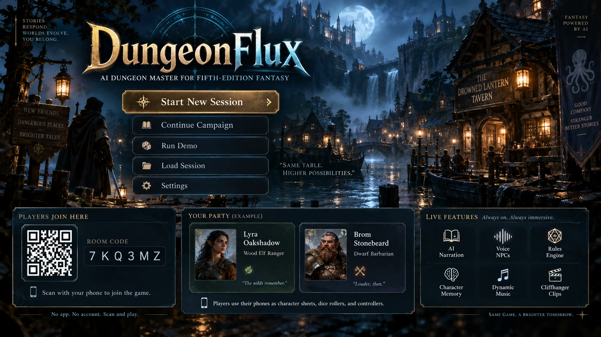
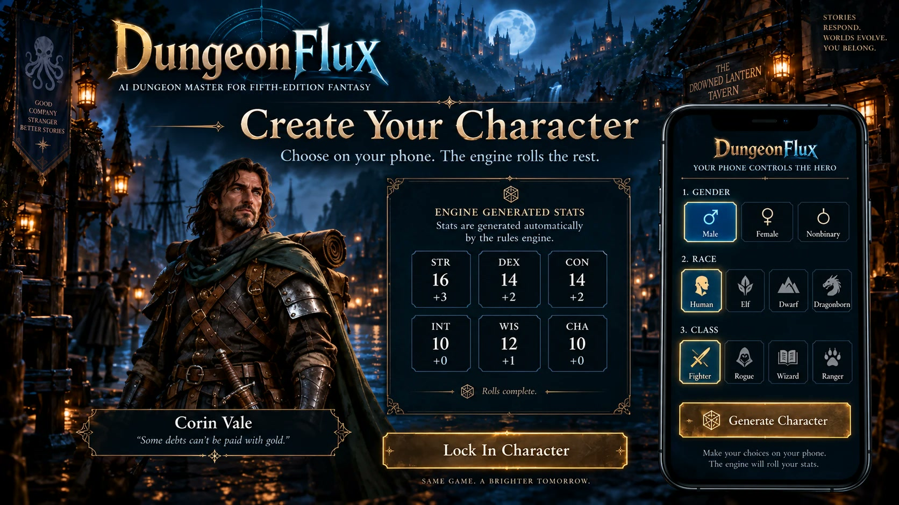
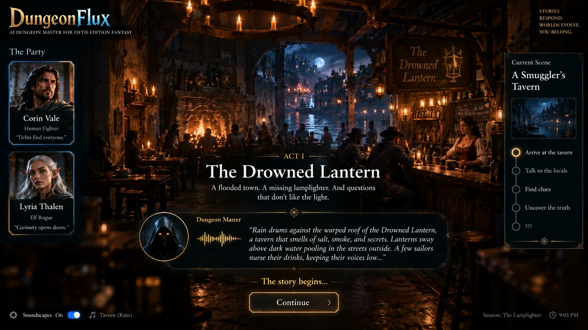
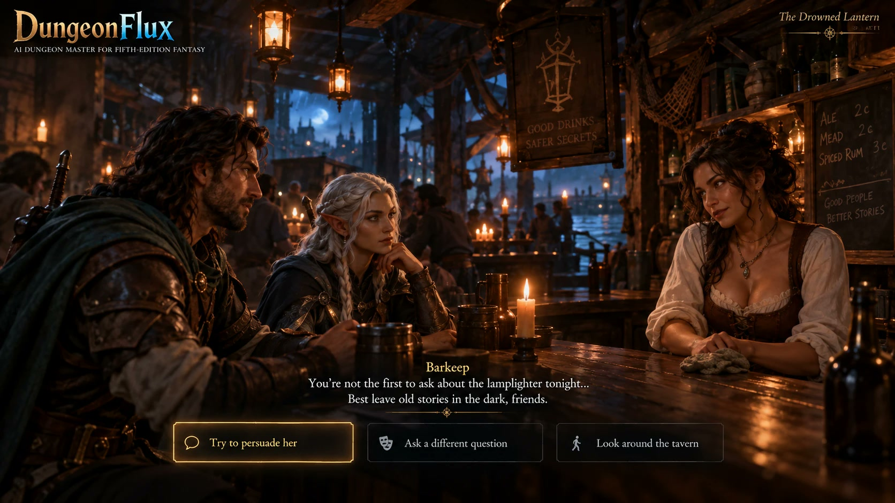
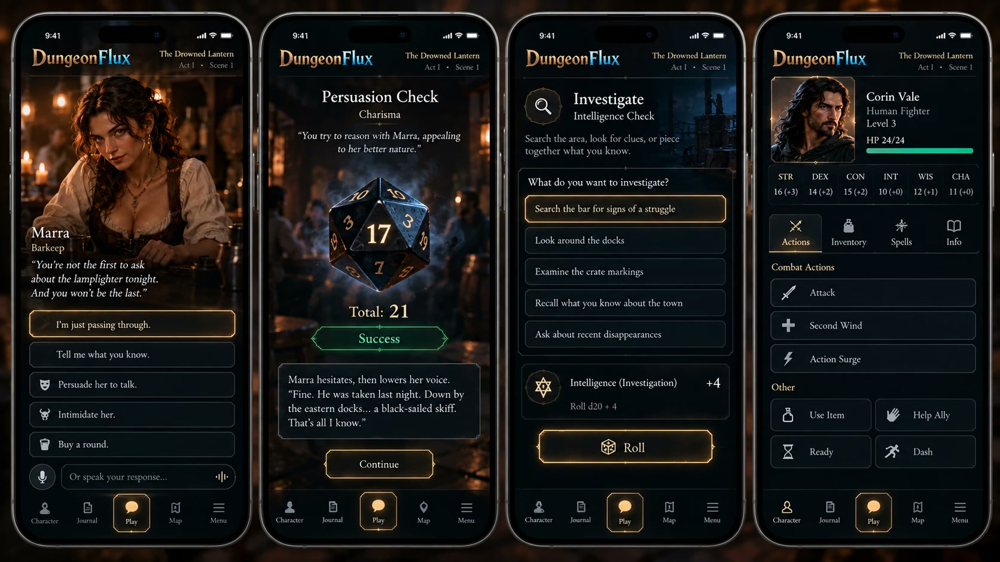
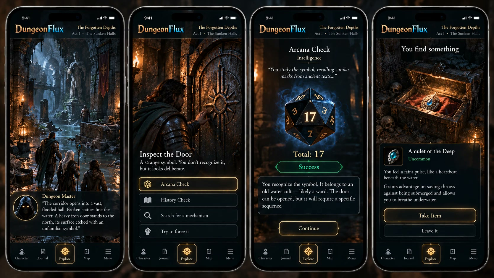
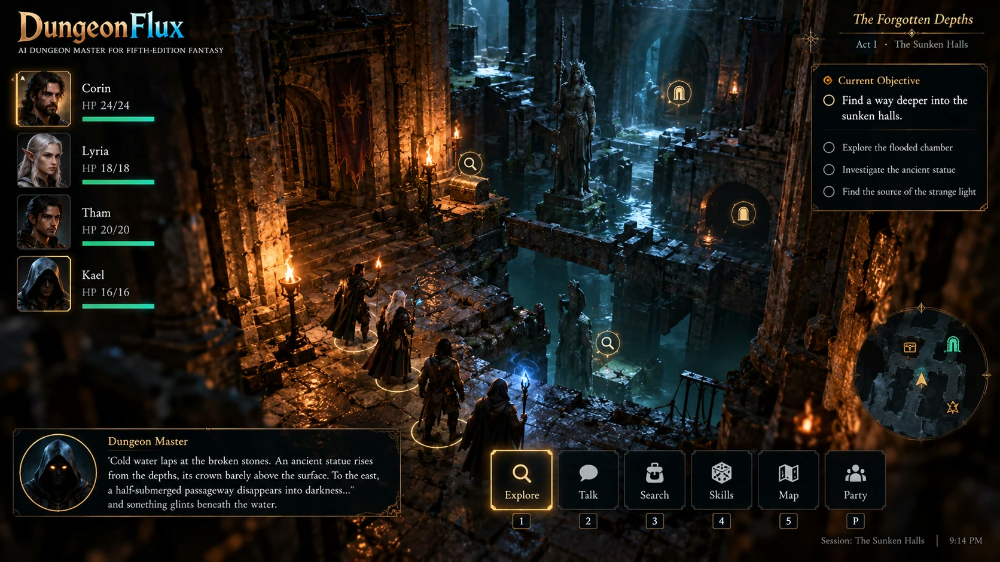

# DungeonFlux

**An AI dungeon master for a table of friends. Built for ShellHacks 2026.**

  <a href="https://monstercameron.github.io/DungeonFlux/"><strong>&rarr; See the project site: the three-minute demo, how it's built, and the concept art</strong></a> 
  <a href="https://monstercameron.github.io/DungeonFlux/">monstercameron.github.io/DungeonFlux</a> &middot; <a href="https://monstercameron.github.io/DungeonFlux/devlog.html">Devlog</a> &middot; <a href="plan.md">Plan</a>

DungeonFlux is an AI dungeon master for tabletop role-playing under fifth-edition fantasy rules. A group of friends sits in one room. A laptop, or the TV it is connected to, is the dungeon master's screen. Each player's phone is their character sheet and controller. The AI runs the game: it writes the story, narrates it aloud, and plays everyone the party meets.

Images throughout this document are concept art for the look and feel; the game's screens will differ in detail. Select the image to open the project site.

## The idea

The project is betting that an AI can run a real table for real friends, provided the work is divided correctly. The AI is in charge of the story and the voices. A rules engine is in charge of the facts: every die roll, every check, and every outcome. The AI narrates results that the engine has already decided.

Most attempts at an AI game master give one model both jobs, and the same problems follow: it forgets the state of the world, it lets players do anything, and it invents numbers. Separating the two roles is meant to remove all three.

## How a session feels

The TV shows a code. Each player scans it with their phone and is at the table, with no account and no app to install.

Each player picks a species and a gender on the phone and taps once. The engine rolls the rest: a class, ability scores, and skills, always a legal character. The dungeon master gives the character a name and a backstory hook, and a portrait painted in the campaign's art style appears on the TV beside the other players' characters.

The dungeon master opens the scene in its own voice, with the players' characters standing in the scene art.

When a player wants to talk to someone, they speak. The barkeep answers out loud in a voice of her own, with her own manner and her own reasons for being careful. When the player pushes her, the phone offers a persuasion check with the odds shown, the die rolls on the TV, and the result decides what she says next.

The phone only shows the moves that are legal at that moment. Nobody at the table has to stop and ask the dungeon master what they are allowed to do.

Music, ambient sound, and effects run underneath. Short video clips mark the major moments, and those clips feature the players' own characters.

## Why it holds together

**The engine decides.** The rules engine rolls every die and records every result. The AI receives the outcome and narrates it, and the narration cannot change a result the engine has set.

**Characters only know what they would know.** Each character the AI plays is given only its own knowledge. A secret is withheld from that character entirely until a player earns it, so the character has no way to reveal it early.

**The story has a destination.** The dungeon master knows where the plot is heading and steers the table toward it using material the players supplied: their own backstories and the consequences of their earlier choices. If a player wanders off, someone from their past may arrive with a reason to come back. The intent is for the steering to read as the world responding to the players. Players choose how they reach the ending.

**Nothing waits on media.** Art, music, and video are prepared ahead of the moment that needs them, as soon as their ingredients exist. When a clip is due, it is already made. If it is late, a prepared fallback plays and the game continues.

## The demo

DungeonFlux is being built in 24 hours and shown in a three-minute live demo with two players.

1. Both players join by scanning the code on the TV.
2. Each picks a species and a gender, and the engine rolls a legal character. Two named characters and two portraits appear on screen.
3. The dungeon master opens the scene: a smugglers' tavern in a flooded river town, on the night the town's lamplighter disappeared.
4. The first player talks to the barkeep, who deflects, and then tries to persuade her. The engine rolls the die in full view. On a success she reveals where the lamplighter was taken, a secret she was not given until the roll succeeded.
5. The second player tries to leave. A stranger arrives with a letter addressed to that player's character, from someone in their own backstory, and draws them back into the night's events. The screen shows the dungeon master's steering decision as it happens.
6. The stranger was followed. A drowned creature breaks through the door, and the scene becomes a short fight on a three-dimensional battlefield with a movement grid. Each player taps to attack from the phone, the dice roll on the TV, and the heroes move and strike on the grid.
7. The session ends on a cliffhanger clip showing both players' characters, generated during the demo.

If the roll fails, the story reroutes: the stranger carries the secret instead, and the demo still reaches its ending. The fight always ends in time: the creature falls, or the tower bell calls it away.

## What comes after

The demo is one scene. The plan beyond it is the full game:

- **Full campaigns** with multiple acts, written by the dungeon master around the characters the players create, with a cast and locations that stay consistent as the story grows.
- **Full combat**, extending the demo's fight with initiative, spells, reactions, and conditions, all driven from the phone, which still shows only the options that are legal on that turn.
- **Memory across sessions**, so the characters the party has met remember what was said and promised, and each session can open with a recap of the last one.

## See it

The project site walks through the three-minute demo beat by beat, shows how the system is built, and keeps a devlog of how the project is being planned and built with a team of AI agents.

  <a href="https://monstercameron.github.io/DungeonFlux/"><strong>&rarr; Open the DungeonFlux site</strong></a> 
  <a href="https://monstercameron.github.io/DungeonFlux/gallery.html">Gallery</a> &middot; <a href="https://monstercameron.github.io/DungeonFlux/devlog.html">Read the devlog</a> &middot; <a href="plan.md">Read the full plan</a>

---

Rules material: this work includes material from the System Reference Document 5.2.1 ("SRD 5.2.1") by Wizards of the Coast LLC, available at https://www.dndbeyond.com/srd. The SRD 5.2.1 is licensed under the Creative Commons Attribution 4.0 International License, available at https://creativecommons.org/licenses/by/4.0/legalcode.
