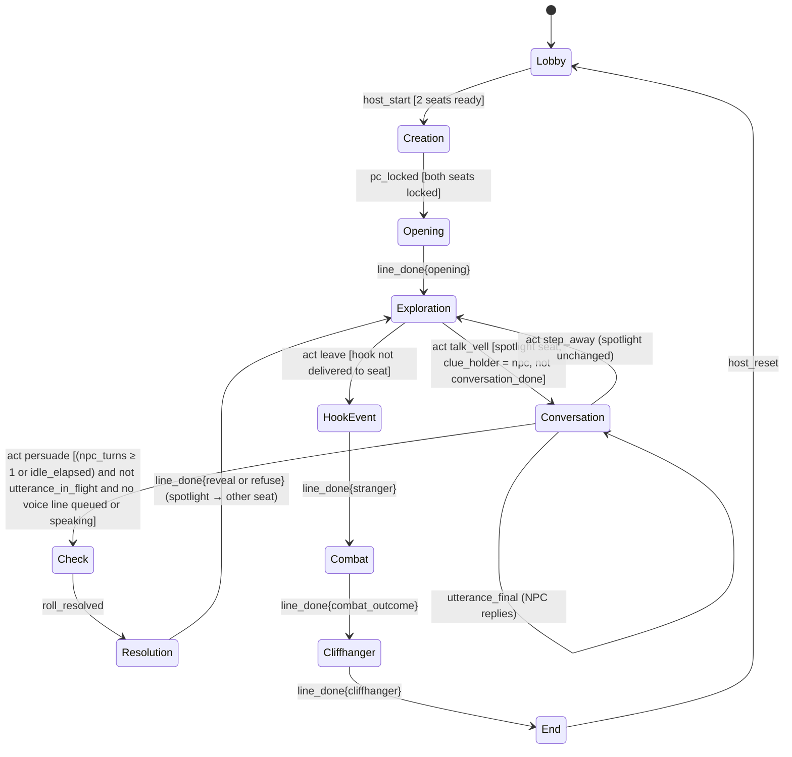
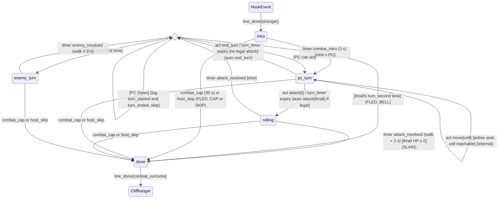
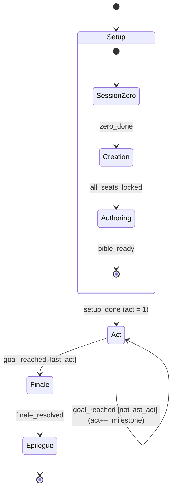
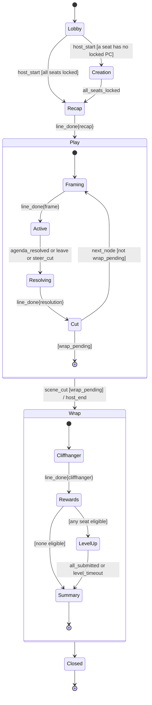
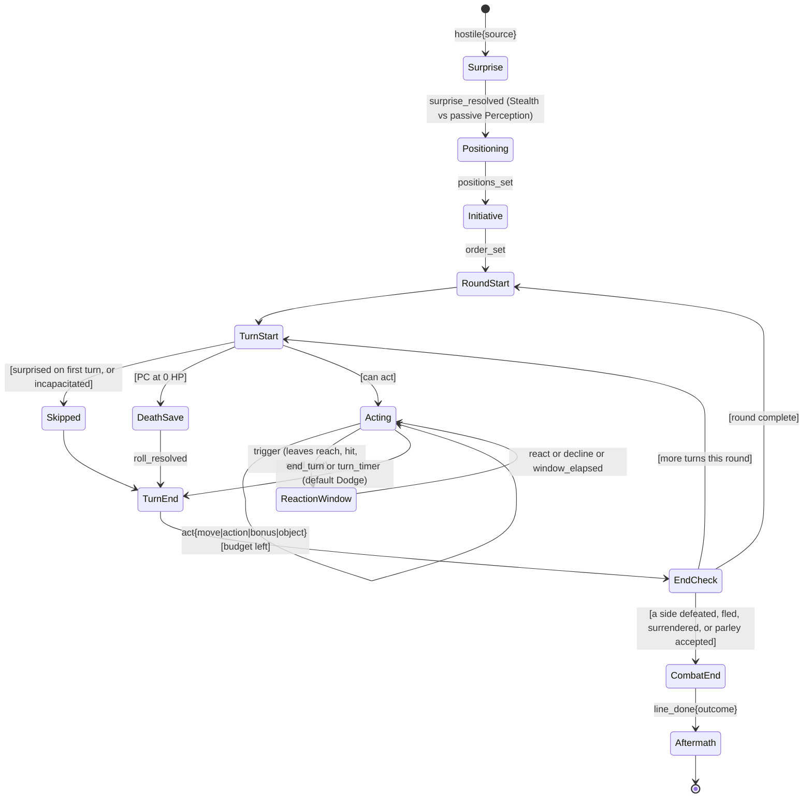

# DungeonFlux — Plan

Status: planning, demo spec under adversarial review (started 2026-09-26)

**How to read this document**
- **Section 0 is the binding spec for the demo.** It is self-contained: an implementer needs nothing outside it.
- **Sections 1–7 are the post-demo vision and are non-binding for the demo.** Where they disagree with section 0, section 0 wins.
- **Appendix A** is the review and gap history. Every item points to the section 0 subsection that resolves it.

---

## 0. Demo spec (binding)

A 3-minute live demo, built in 24 hours by one developer using Claude Code.

**Spec index by lane.** Every lane also reads §0.18.1, §0.18.2, §0.18.7, and §0.18.8, and the §0.22 rows for the libraries and APIs it uses. The same lists are the "Binding sections" column of the lane table (§0.18.9) and item 4 of the `AGENTS.md` outline (§0.18.9).
| Lane | Sections to read |
|---|---|
| ORCH | §0.4, §0.5, §0.6, §0.12 walk test, all of §0.18, §0.22 |
| L-OPS | §0.7, §0.9 build-time row, §0.14, §0.15 hour-0 list, §0.16, §0.17, §0.19, §0.21.5, §0.21.10, §0.22 (tools, vendor APIs, accounts) |
| L-SPIKE | §0.6 `Talk` and `Listen`, §0.9 microphone capture and TTS playback, §0.11, §0.15 STT and TTS rows |
| L-ENG | §0.5, §0.6 schemas, §0.8 "When" column, §0.10 sequence index, §0.12 walk test, §0.18.4, §0.20, §0.21.2 (R-D7) |
| L-COMBAT | §0.5 phase machine, scopes, turn timers, and Skip; §0.18.4 scope tree and catalogue; §0.20; §0.21.1–§0.21.3; §0.21.6 |
| L-RT | §0.5 runtime rules, voice line timing, turn timers, and Pause; §0.18.4 scope tree and catalogue; §0.18.5 |
| L-STORE | §0.4 storage, §0.6 event log line, §0.10, §0.18.5 storage |
| L-API | §0.5 legal moves and host commands, §0.6, §0.11 rooms and joining, §0.18.4 `View` (with its timer rule) and `ports.Engine`, §0.18.5 gRPC mount, §0.21.6 |
| L-VIN | §0.5 push-to-talk, §0.6 `Talk` and `Say`, §0.9 microphone capture and voice pipeline, §0.10, §0.16 |
| L-VOUT | §0.5 runtime rule 5 and voice line timing, §0.6 `Listen`, §0.9 TTS and playback, §0.10, §0.15 TTS row, §0.16 |
| L-LLM | §0.8, §0.10, §0.15 (including the LLM client layer), §0.16, §0.18.3 model chains, LLM port implementation, and role table, §0.22 LLM rows |
| L-CONTENT | §0.7, §0.8, §0.17 prompts, §0.19 style tokens, §0.20 templates, §0.21.1, §0.21.2 (the thrall), §0.21.4 (the nav layer) |
| L-MEDIA | §0.9 images and video, §0.15 video and image rows, §0.17, §0.19 sidecar metadata, §0.21.5 |
| L-WEB-SHELL | §0.4 stack, §0.6, §0.9 microphone capture and TTS and playback (the DM-audio slice, `web/shell/audio`), §0.11 |
| L-WEB-PHONE | §0.5 legal moves (including the Creation pickers), push-to-talk, and turn timers; §0.20 build model; §0.6 `PhoneView`; §0.9 typed input; §0.21.3 phone moves; §0.21.6 `PhoneView.combat` |
| L-WEB-DM | §0.5 turn timers (the TV bar); §0.6 `DMView`; §0.9 TTS and playback; §0.17 browser fallbacks; §0.19 mixer rules; §0.21.4 FLAT fallback; §0.21.6 `DMView` combat fields |
| L-WEB-HOST | §0.5 host commands, §0.6 `HostView`, §0.13 |
| L-WEB-SPLAT | §0.4 (the JavaScript exception); §0.17 splat camera presets; §0.21.3; §0.21.4; §0.21.5; §0.21.6 `Token` and `battlefield` |

### 0.1 Goal and assumed decisions
The demo shows an AI dungeon master running a table from a laptop and two phones. The engine decides every outcome; the AI writes and voices the content; generated art, voice, and video feature the players' own characters.

These are the developer's decisions. Each has a default that the rest of section 0 assumes, and what changes if the answer differs.

| # | Decision | Default assumed | If different |
|---|---|---|---|
| D1 | Audience and judging | Hackathon judges scoring novelty and live-ness | Investors or a showcase: weight polish over live risk, and lead with the recorded backup if anything is shaky |
| D2 | Rules on prior work | GoWebComponents, GoGRPCBridge, and SchemaFlux are allowed as the developer's existing public open-source libraries, pinned by tag (§0.22). Everything under "build time" in §0.9 is generated inside the 24 hours (L-OPS background jobs, hours 0–11), not before the clock | If the libraries are banned, the stack decision fails; fall back to plain Go `syscall/js` plus a WebSocket and rescope. If build-time assets are banned, the live-generation budget in §0.9 grows and the video beat becomes the animated still |
| D3 | Players | Two rehearsed teammates, not audience volunteers | Volunteers: add content filtering on transcripts (§0.13) and expect the script to wander; the machine tolerates it (§0.5) |
| D4 | Vendors | OpenAI `gpt-6-luna` for live LLM calls and character fill, Gemini 3.8 Flash for the non-urgent pre-renders, Claude Haiku 4.5 as the fallback for spoken lines; ElevenLabs for TTS, STT (Scribe, batch), sound effects, and music; one image API with transparent-background output; image-to-video per D12; World Labs Marble for the battlefield splat at build time (§0.21.5). Exact models and endpoints: §0.15 | Any substitute must keep: for LLMs, streamed text, enum-constrained JSON output, first-token p90 ≤ 1.1 s for spoken roles, and a cacheable shared prefix; batch STT accepting WebM/Opus and MP4/AAC; streaming TTS with 3+ distinct voices; image output with alpha; image-to-video from a first frame |
| D5 | Demo laptop | The X2 | Nothing changes: every model is cloud in the demo |
| D6 | Domain for HTTPS | A subdomain of the developer's own domain (§0.11) | Without a domain: mkcert with the CA installed on both phones (fragile on iOS) |
| D7 | Combat in the demo | **Yes** (decided 2026-09-26): a short combat beat on a Gaussian-splat battlefield with a movement grid and video billboards of the heroes and the enemy. The script, machine, rules subset, and rendering are in §0.21 | — |
| D8 | Splat rendering | **Decided:** the PlayCanvas engine on a canvas the DM page owns, outside the GWC root (§0.21.4). The SuperSplat viewer is rejected: no documented control API, no way to add scene objects or read camera matrices, and a DOM overlay cannot be occluded. This is an explicit exception to the Go-first rule, limited to `web/splat` (§0.4) | If the hour-5 splat spike fails, the FLAT renderer (pure GWC, §0.21.4) is used and no JavaScript ships |
| D9 | Model hosting | Cloud by default, with hooks for local models: every port can take a local adapter (an OpenAI-compatible local LLM server such as llama.cpp on the X2, whisper.cpp for STT, a local TTS) through the same role table | Local models are never on the demo's critical path unless the hour-0 test shows they win |
| D10 | Latency priority | Lowest latency is preferred, but not at any cost: a slower option that is more reliable or better sounding may win | Deadlines in §0.16 stay; experiments such as Qwen on Cerebras are adopted only by their rule |
| D11 | Character creation | **Simple, random within constraints that preserve the combat odds** (the §0.20 build model): each player picks a species and a gender on the phone and taps Roll my hero. The engine's seeded dice draw the class (R-D7, §0.21.2, so every pair includes a paladin or a rogue), then assign ability scores and skills at random under fixed constraints: the ability that drives the class's main weapon attack keeps its template value, Charisma is always 14, Persuasion is always proficient (+4), and HP and AC follow the rolled Con and Dex. Species and gender are cosmetic: they drive the portrait, the name, and the narration; species traits are displayed, not executed | — |
| D12 | Seedance provider | **Segmind Seedance 2.0 Mini** (cheapest verified: $0.0176/s at 480p, $0.0378/s at 720p; first and last frame; 4 s minimum), fallback **EvoLink Seedance 2.0 Mini** (same parameters; its rate is a 60%-off promotion, so the list price is the worst case), then fal Seedance 2.0 Fast (§0.15). The live clip and the combat billboard loops are always 480p | If Mini's quality or latency fails the hour-2 gate (from the L-OPS samples), fal Fast becomes primary at 480p; its 720p list price is $1.21 per 5 s, and its 480p price is read at hour 2 |
| D13 | Audio extras | **Yes:** music, ambience, and sound effects (§0.19) | — |
| D14 | LLM client library | **SchemaFlux** (decided 2026-09-26: "use SchemaFlux for the agents"). Module `github.com/monstercameron/schemaflux`, pinned `v1.2.0` (or `v1.3.0` if it is tagged before the clock, §0.15). It is the client for every OpenAI-dialect LLM link: `gpt-6-luna` over the Responses API (strict-schema JSON and streamed text), Qwen on Cerebras and a local llama.cpp server over chat completions. It is used at its provider layer only, behind `ports.LLM` in one adapter, `internal/adapters/llm/schemaflux` (§0.18.3). Gemini stays on `google.golang.org/genai` and Haiku on `anthropic-sdk-go`: SchemaFlux has no Gemini provider, and its Anthropic path neither streams nor enforces a schema | If SchemaFlux fails the hour-0 Luna checks (§0.15 items 10–11), an `openai-go/v3` adapter replaces `llm/schemaflux` behind the same `ports.LLM` and role table; no caller changes |

### 0.2 The script, with a timing budget
Speech rate for budgeting: 2.5 words per second. Caps: opening ≤ 40 words, NPC lines ≤ 25 words, stranger line ≤ 30 words, combat outcome ≤ 20 words, cliffhanger ≤ 40 words. Presenter lines are spoken only in silences or over music, never over DM or NPC audio.

| Time | Beat | Budget (seconds, planned / slot) | Presenter line |
|---|---|---|---|
| 0:00–0:10 | **Lobby.** The phones are already on `/p` and joined (§0.11). The TV shows the title, the QR code, and both seats. Each player taps "Ready"; the host starts from the host device. | 6 / 10 | "Each player joined by scanning this code. No accounts, no app." |
| 0:10–0:40 | **Creation, both seats in parallel.** Each player taps a species, a gender, and "Roll my hero". The engine rolls the class (R-D7, §0.21.2), then abilities and skills within the §0.20 build model (attack bonus fixed, Cha 14, Persuasion +4); `character_flavor` names each hero; full-body portrait previews resolve on the TV. A seat locks when its portrait is Ready or 22 s after its Roll (`seat_deadline`); `creation_timeout` is 30 s. Each lock submits that seat's combat billboard loops. | Taps ≈ 5, portrait ≤ 22 → locked by ≈ 0:37 → 26 / 30 | "Pick a species and a gender; the engine rolls a legal hero and paints them." |
| 0:40–1:05 | **Opening.** The pre-made establishing clip (5 s) plays and cross-fades into the layered scene: background, both PC cut-outs, Mother Vell. The DM narrates. | Clip 5 + narration ≈ 16 → 21 / 25 | (silent) |
| 1:05–1:40 | **Conversation (Player 1).** P1 taps "Talk to Mother Vell", speaks, and she answers evasively in her voice. The phone shows **Persuade +4 vs DC 10** (75% to succeed). P1 taps it; the d20 rolls on the TV; she reveals the clue. | Tap 1, speech 4, release to voice ≈ 3, reply ≈ 10, tap and dice 4, reveal ≈ 10 → 32 / 35 | During the dice: "The engine rolls. She doesn't know the secret." |
| 1:40–2:00 | **Hook event (Player 2).** P2 taps "Leave". A stranger arrives (pre-made clip, sound sting); the TV shows "DM steering: personal hook → {P2's hook}". His pre-rendered line, built on P2's hook, ends "…it followed me from the river." | Tap 1, clip 5, line ≈ 12 → 18 / 20 | During the clip: "Watch the DM use their backstory." |
| 2:00–2:40 | **Combat.** Cross-fade to the splat of the same tavern (`COMBAT_EST`, combat sting); the drowned thrall on the grid. Fixed order: seat 1 → thrall → seat 2 → seat 1. Each PC taps Attack; the hero walks the path; the d20 rolls on the TV; the billboards play attack and hit; HP bars move at contact; the thrall slams once. The fight ends when the thrall drops, or at its second turn, when the bell tolls and it flees. One outcome line. | Entry 3, PC 6 (tap ≈ 3, walk ≤ 1, contact and recovery 2), thrall 3, PC 6, PC 5 (no walk), `outcome_delay` 1.5, outcome ≈ 8 → 33 / 40; `combat_cap` 30 s (≈ 23 s used to `done`, §0.21.3) | During `COMBAT_EST`: "Now it's a fight. The engine runs every roll." |
| 2:40–3:00 | **Cliffhanger.** The live clip of both characters if Ready, otherwise the generic clip or the animated still; the pre-rendered narration; the end card. | ≈ 16 / 20 | Over the end card, only if the live clip played: "That clip didn't exist two minutes ago." Otherwise: "Every line you heard was written live." |

Planned total: 6 + 26 + 21 + 32 + 18 + 33 + 16 = 152 s (≈ 2:32) of planned activity inside 3:00 of slots; the 28 s of slack sits inside the beats.

If the Persuade roll fails, Mother Vell refuses and the clue moves to the stranger (the "clue relocation" steering level); the stranger's line then carries the clue. The combat always ends: the thrall drops in ≈ 83% of runs (the R-D7-weighted mean, §0.21.2), the bell ends the rest, and `combat_cap` (30 s) and host Skip are the backstops (§0.21.2). Every path reaches the cliffhanger with the clue delivered, so a failed roll never breaks the demo.

### 0.3 Scope
**In:** one room, one DM screen, two phones, one host device; four level-1 templates; the fixed one-shot in §0.7; one layered scene; one NPC and one stranger; voice conversation with the NPC; one Persuasion check; one steering event; one combat encounter (one enemy, the drowned thrall) on a Gaussian-splat battlefield with a movement grid and video billboards (§0.21); pre-emptive cliffhanger video; theme music, ambience, and sound effects.

**Out:** save/load and memory across sessions, session zero, multi-act campaigns, free-form 5e building; in combat: initiative rolls, reactions, opportunity attacks, spells, death saves, a second enemy, and statuses beyond `bloodied`, `down`, `defeated`, and `fled`; a DM agent loop with tools (the demo uses per-state content prompts, §0.8), live `play_sfx`, a second scene, "inspect" moves, transcript confirmation on the phone, tappable hotspots on the TV (the phone lists moves; the TV only highlights), and any polish not on screen during the three minutes.

### 0.4 Architecture
- **Stack:** Go backend; GoWebComponents v6 frontend compiled to WebAssembly; gRPC over WebSocket through GoGRPCBridge (`pkg/grpctunnel`) for all control and streaming, including microphone audio up and TTS audio down.
- **Static media over plain HTTPS:** images, clips, music, and effects are immutable files served by the same Go server at `/assets/{sha256}.{ext}`. They are fetched, not streamed, so gRPC is not used for them.
- **One process** on the laptop: gRPC services, the engine, model adapters, the asset store, and the static file server.
- **One WASM binary** for all three clients, routed by path: `/dm`, `/p` (phone), `/host`. One build and one cached download.
- **The only JavaScript is `web/splat`** (the D8 exception): one ES module, `web/splat/js/df-splat.mjs` (with `js/status_visuals.mjs`), and the vendored PlayCanvas engine, loaded on `/dm` only. The phone and host routes never load it, and with the FLAT renderer (§0.21.4) no JavaScript runs at all. Archtest enforces the boundary (§0.18.2). Go packages under `web/` may call browser APIs through `syscall/js` (microphone capture, Web Audio, the splat bridge); `web/splat/js/df-splat.mjs` and the vendored engine are the only hand-written or third-party JavaScript besides `wasm_exec.js`.
- **Storage: SQLite** (one file, `artifacts/runtime/<instance>/dungeonflux.db`, WAL mode; `<instance>` is `show` for ORCH runs and the stage and the lane ID for a lane's dev server, so parallel servers never share a database, §0.18.5), through a pure-Go driver (`modernc.org/sqlite`) so no C toolchain is needed on Windows ARM64. All writes go through one writer goroutine in `internal/store/sqlite` (§0.18.5); the room loop orders event-log appends, and asset, cache, and recording rows go straight to the writer. That matches SQLite's single-writer model. Live game state is held in memory and is always rebuildable from the event log.
  | Table | Holds |
  |---|---|
  | `runs` | one row per run, written once at run start: id, start time, run mode, one-shot version, dice `seed`, `features` (the flags copied into `game.Options`), `config_hash` |
  | `events` | the append-only event log: run id, `seq`, time, machine, `epoch`, `scope_key`, from, event, payload, to, `effects[]`, outputs (model text, dice, asset IDs). Host commands, including `TIMER_ADD` and `TIMERS_OFF`, are ordinary rows here |
  | `seats` | seat tokens, player numbers, room code, host token, DM token |
  | `characters` | each run's characters (the `Character` schema) |
  | `assets` | asset metadata: sha256, kind, path on disk, duration, size, the input hash that produced it |
  | `cache` | cache mode: adapter, input hash → response (text, or an asset sha256) |
  | `recordings` | sequence mode: adapter, phase, seat, call index → response and TTS audio asset |

  Asset bytes (images, clips, audio) stay on disk under `artifacts/runtime/<instance>/assets/`, named by sha256; SQLite holds only their metadata. The HTTP route stays `/assets/{sha256}.{ext}`; only the disk location is under `artifacts/`. Build-time media live in `artifacts/runtime/buildtime/` with L-OPS's `manifest.json`, and `media` copies them into the instance's asset store by sha256 at start-up (idempotent). The repo-root `assets/` holds committed concept art only (`assets/concept/`); nothing generated is written there. **Restart-resume is out of the demo.** A server crash mid-show is handled as Reset plus the backup video. Everything is still persisted (the event log, characters, cache, and recordings survive), so a run can be inspected or replayed afterwards. Resuming a live run from the log is post-demo work.
- **Repo layout:** see §0.18.2 (package layout and dependency rule).
- **No DM agent in the demo.** The engine owns every transition. Each state that needs words calls one content prompt (§0.8) that returns plain streamed text. Post-demo, the agent with tools (section 4a) replaces these prompts as an `AgentTurn` work effect (§0.18.6).
- **Backend architecture, coding standards, and the parallel lane plan: §0.18 (binding).**

### 0.5 State machines
One table-driven machine type in Go (states, accepted events, guards, actions). Every transition, every model output, every dice result, and every asset ID is written to the event log, so a log fully describes a run.

**Runtime rules (apply to every machine)**
1. **One event loop per room.** Each room has one goroutine reading one event channel; every event, timer, and callback is serialised through it. Two events can never be handled at the same time (for example both seats' `pc_locked`).
2. **Unaccepted events are logged and dropped.** An event the current state does not accept changes nothing.
3. **Scopes and epochs.** Every timer, model stream, TTS stream, speculative call, and asset slot is started in a **scope**, and carries that scope and its epoch. Scopes form a tree (§0.18.4):
   | Scope | Epoch bumps on | Owns |
   |---|---|---|
   | `run` (root) | Reset only | Every asset slot (portraits, the cliffhanger still and the cliffhanger clip); every runtime pre-render (both stranger-line variants per seat and their TTS, both cliffhanger variants and their TTS, the three combat-outcome variants and their TTS); the combat billboard loop slots. Nudge lines are rendered at build time, so only their playback is scoped (phase) |
   | `check` (one Check machine instance, child of `run`) | Never (its own transitions are internal); the scope is cancelled when the phase machine leaves Resolution, when it leaves Conversation other than to Check, or on Reset | The outcome line (`npc_reveal` or `npc_refuse`) and its TTS, started at `act persuade`; the scope spans Check and Resolution |
   | phase (the phase machine, `session`, child of `run`) | Every non-internal phase transition | Everything else: phase timers, live model and TTS streams, the voice-line queue and playback of every line (including pre-rendered ones), push-to-talk instances, clip playback timers |
   | `combat` (one Combat machine instance, child of the phase scope, §0.21.3) | Every non-internal combat transition | The per-state combat timers: `combat_intro`, `attack_resolved`, `enemy_resolved`, `outcome_delay`, and the combat `turn_timer`. `combat_cap` is phase-scoped, so it spans every combat state and is cancelled when `done` is entered |
   | per-utterance key (under phase) | The utterance's own outcome | The speculative `npc_reply` for that utterance and its TTS |

   **Leaving a phase cancels only phase-scoped work** (context cancel of the phase subtree); `run` and `check` work continue. Effects emitted by a transition's action carry the target state's epoch. Any event carrying an older epoch for its scope is dropped. Skip, timeouts, and host commands therefore never leave orphaned work behind, and pre-emptive work started in one phase survives into the phase that uses it. **A self-transition (`Conversation → Conversation`) is internal:** it does not increment `epoch` and does not re-run entry actions, so the reply it queues is not cancelled.
4. **Completion events carry identity.** `line_done{utterance_id}`, `line_failed{utterance_id}`, `clip_done{asset_id}`. A state accepts only the IDs it started itself.
5. **Client audio is state too.** Whenever the server cancels a voice line (scope exit, Skip, `line_failed`), it sends `AudioCancel{utterance_id}` down `Listen`; on every phase exit it sends one `AudioCancel{utterance_id}` for each phase-scoped line in flight, and on Reset it sends `AudioCancel{all}`. A held line (the outcome line during Check) has sent no frames, so a phase exit does not touch it. The DM client stops every scheduled audio buffer for that ID and discards any late frames carrying it, so a cut line never keeps playing. The server's `Listen` writer also keeps the set of cancelled `utterance_id`s and drops any frame for them, so a frame queued just after a cancel never reaches the client.
6. **Guards read flags, not events.** Timer events set flags (`idle_elapsed`, `clue_found`, and so on); guards test the flags. `pc_locked` is idempotent per seat. `Act` and `TalkStart` are rejected while paused. `utterance_in_flight` is set on `TalkEnd` and cleared when that utterance is dispatched (before its `Act` is evaluated, so a spoken "persuade" is not blocked by itself) or when it fails. The Conversation voice-line machine consumes `line_done` and clears the "queued or speaking" flag; the phase machine does not see Conversation's `line_done`. **A held line is not queued:** a line started with `Hold` (a speculative reply while `interpret` decides, or the outcome line before `roll_resolved`) enters the voice queue only on `ReleaseLine`, so the "no voice line queued or speaking" guard, the "Mother Vell is speaking" greying, and the turn-timer freeze all ignore it.

**Phase machine**

`host_reset` is accepted in every state and returns to Lobby with a new run log. `host_pause` is accepted in every state; `host_resume` returns to the same state.

**Voice line timing** (how `line_done` is produced)
- The DM screen plays voice lines one at a time from a server-owned queue. A line's playback start is the latest of (its first PCM frame being sent), (the previous line's end), and (the `clip_done` it is gated on, if any).
- When a line's final frame is sent, the server knows its length: samples ÷ `sample_rate` (carried in `AudioFrame`). It sets a **pausable** timer for the remaining playback time + 300 ms.
- The DM client sends `Report{PLAYBACK_DONE, utterance_id}` only after the audio buffer holding the final frame has fired `ended`.
- `line_done{utterance_id}` fires at the later of the timer and the Report, capped at the timer + 2 s. The cap is pausable too.
- **Fallback order for a live line** (the one spoken-role chain, §0.10): the primary (`gpt-6-luna`, reasoning `none`) → `claude-haiku-4-5`, started in parallel if the primary has no first token after 1.5 s (the first link to produce a token wins; the other is cancelled) → the recording at the same index when neither link has a first token 3 s after the call starts. If the chain fails, or the server has received no TTS audio 5 s after the first token, or on any TTS error, **`line_failed{utterance_id}`** fires. The canned line is engine policy on `line_failed`: the engine cancels that line's LLM and TTS streams, sends `AudioCancel`, and plays the prompt's **canned line** (pre-rendered at build time, §0.9) under a fresh `utterance_id` that the state registers; its `line_done` completes the state as normal.

**Where events come from** (the typed catalogue, with every effect, is §0.18.4)
| Event | Source |
|---|---|
| `host_start`, `host_reset`, `host_pause`, `host_resume`, `host_skip`, `host_force_d20`, `host_safe_mode`, `host_timer_add`, `host_timers_off`, `host_splat_off` | `HostService.Command` (authenticated by the host token); logged in `events` like any event, so replay reproduces them. `host_splat_off` sets the engine flag `splat_off`: the battlefield projects FLAT from the next snapshot, with no reload |
| `act {move_id}` | `SessionService.Act` from the phone, or the voice pipeline's `MOVE` result (§0.9); rejected unless the move is in that seat's current legal moves. `ready`, `species`, `gender`, and `roll_hero` are `act` moves, as are the combat moves `attack` (with `target_id`), `move` (with `cell`), and `end_turn` (§0.21.3) |
| `talk_start`, `talk_end`, `say`, `stream_closed` | `VoiceService.Talk` and `SessionService.Say` (voice/in); `stream_closed` also from any dropped `Watch` or `Listen` |
| `utterance_final`, `stt_error` | Derived by the engine from the voice pipeline's results (§0.9): `utterance_final` when an utterance is dispatched as `DIALOGUE` (from `interpreted`, or the keyword matcher when `interpret` fails); `stt_error` from `Transcribe`. There is no speech in Creation (D11) |
| `pc_locked` | Server: that seat has a rolled build, a flavour (from `character_flavor` or the seat default), and a portrait slot that is Ready or Fallback |
| `seat_deadline` | Server timer per seat, 22 s after that seat's `roll_hero`: the portrait slot's deadline (falls back if not Ready) |
| `line_done`, `line_failed` | Voice line timing, above |
| `clip_done` | Server timer at clip start + `duration_ms` (pausable), cross-checked by `Report{CLIP_ENDED, asset_id}` with the same later-wins rule |
| `roll_resolved` | Server timer, 3 s after `act persuade` (the dice animation) |
| `creation_timeout` | Server timer, 30 s after `host_start`: hard cap for any seat still unlocked (for example a seat that never tapped Roll my hero) |
| `turn_nudge`, `turn_expired{stage}` | The spotlight seat's turn timer, `turn_timer` (see Turn timers): pausable, frozen while talking or listening. In Conversation it is also the idle timer: stage 1 of `turn_expired` sets `idle_elapsed` |
| `idle_elapsed` | The Conversation idle flag timer, used only when turn timers are off (`TIMERS_OFF` or feature `turn_timers` false): 20 s with the turn timer's start, restart, and freeze rules; sets `idle_elapsed` |
| `asset_ready`, `asset_failed` | Media adapters |
| `combat_intro`, `attack_resolved`, `enemy_resolved`, `outcome_delay` | Combat-scoped server timers: 3 s; walk (path cells × 250 ms) + 2.0 s (1.2 s to contact, then 0.8 s); the same rule for the thrall's turn; 1.5 s at `done` entry (§0.21.3) |
| `turn_expired` in Combat | The combat turn timer: 10 s per PC turn, combat scope, no nudge; the DM acts `attack{thrall}` if it is legal, otherwise `end_turn` |
| `combat_cap` | Server timer, 30 s from Combat entry (pausable, phase scope); not stopped by `TIMERS_OFF` |
| `report{SPLAT_READY}`, `report{SPLAT_FAILED}` | The DM client's splat module (§0.21.4); `SPLAT_READY` sets `splat_ready`, which decides the mode at Combat entry (§0.21.3); `SPLAT_FAILED` switches the battlefield to FLAT |

**Transition actions**
| Transition | Action |
|---|---|
| Lobby → Creation | Start `creation_timeout` (30 s). Draw both seats' classes with the seeded dice per R-D7 (§0.21.2), so the draw does not depend on which seat taps first; each class is revealed at that seat's `roll_hero` |
| Creation, on `act roll_hero` for a seat (after its `species{id}` and `gender{id}` picks) | The engine rolls the build with its seeded dice under the §0.20 build model: the class drawn at Lobby → Creation (R-D7); the ability that drives the class's main weapon attack keeps its template value and Charisma is always 14; the other standard-array values and the background increases go to the remaining abilities at random (Con from the two highest remaining values, the 8 never on Dex); HP and AC follow the rolled Con and Dex; Persuasion is always proficient and the other skills are drawn at random from the class and background lists. Species and gender are cosmetic. It then starts `character_flavor` (name, look, hook) and the portrait in parallel (the full-body portrait prompt uses species, gender, class, and the campaign's global art style, so it does not wait for the LLM); the seat's pickers grey out ("Building your hero…") |
| Creation, on `pc_locked` for a seat | Start that seat's `stranger_lines` (two variants) and their TTS pre-renders, and that seat's billboard loops (`GenerateBillboardLoops`, deadline `combat.done` entry, §0.21.5), all in the `run` scope (they survive Creation's exit). On the second `pc_locked`, also start `combat_outcomes` (`PrerenderSet`, three variants) and their TTS in the `run` scope |
| Creation, on `creation_timeout` | For each unlocked seat: keep a `character_flavor` result if one has returned, otherwise apply the seat's default character (seat 1: paladin default, seat 2: rogue default); use the template fallback portrait if the portrait is not Ready; then emit `pc_locked`. The "both seats locked" guard remains the only exit |
| Creation → Opening | Play the establishing clip; start streaming the opening text; the narration audio starts at the clip's `clip_done`. In the `run` scope: composite the cliffhanger still and start the cliffhanger clip slot (deadline: Cliffhanger entry); generate both cliffhanger variants and their TTS. From here the view carries `DMView.battlefield` with `visible: false`, so the splat loads hidden (§0.21.5) |
| Opening → Exploration | Spotlight → seat 1; start the turn timer |
| Conversation (entry) | Create the `check` instance in Offered; start the turn timer (or, with turn timers off, the `idle_elapsed` flag timer); `idle_elapsed = false` |
| Conversation, on `utterance_final` | `npc_turns++`; restart the turn timer; the NPC reply for that utterance (already speculatively streaming, §0.9) is released into the voice queue (`ReleaseLine`); if no reply stream exists for the utterance, `npc_reply` starts now |
| Conversation → Check (`act persuade`) | The engine rolls (§0.20); the `check` instance goes to Rolling; start the 3 s `roll_resolved` timer (phase scope). **The outcome line starts generating now, in the `check` scope, held:** success → `npc_reveal`, failure → `npc_refuse`. The argument passed to either prompt is the `clean_text` of the utterance that led to the check (the spoken persuade itself, or the last `DIALOGUE` if Persuade was tapped), or "(presses her)" if there was none. Its audio is gated on `roll_resolved` |
| Check → Resolution | `conversation_done = true`. Success: `clue_found = true`. Failure: `clue_holder = stranger` (no callout yet). `ReleaseLine` for the outcome line (if it has failed, the canned reveal or refusal plays, as for any `line_failed`) |
| Conversation → Exploration (`step_away`) | Cancel the `check` scope; spotlight unchanged |
| Resolution → Exploration | Cancel the `check` scope; spotlight → the other seat; start the turn timer |
| Exploration → HookEvent | `hook_delivered[seat] = true`. If `clue_found` is false, set `clue_holder = stranger` (covers both a failed roll and Player 1 leaving first). Play the stranger clip; show the callout "DM steering: personal hook → {hook}", plus "clue relocated" when `clue_holder = stranger`; the stranger-line variant for (seat, `clue_holder`) starts at the clip's `clip_done`. On that line's `line_done`, `clue_found = true` |
| HookEvent → Combat | Create the `combat` instance in `intro` and run its entry actions (§0.21.3): tokens at their spawn cells, the battlefield visible (SPLAT only if `SPLAT_READY` has been received and neither `SPLAT_FAILED` nor `host_splat_off` has, otherwise FLAT; §0.21.3), camera `COMBAT_EST`, `STING_COMBAT_START` then `COMBAT_SKIRMISH_LOOP`, `combat_intro` (3 s, combat scope). Start `combat_cap` (30 s, pausable, phase scope) |
| Combat → Cliffhanger | A Down PC goes to 1 HP; hide the battlefield and cross-fade to the cliffhanger. The cliffhanger clip slot (`run` scope, started at Creation → Opening) reaches its deadline. Play the live cliffhanger clip if its slot is Ready, otherwise the generic cliffhanger clip, otherwise the animated composite still; play the cliffhanger variant for how the clue was found (from Mother Vell or from the stranger). The end card follows `line_done`; the clip is not waited on |

**Spotlight rule:** seat 1 has the spotlight when Exploration is first entered. It passes only on Resolution → Exploration (a completed conversation). Creation has no spotlight; in Combat the active seat follows the fixed turn order (R-D1), not the spotlight.

**Deviation paths (all reach End):**
- **Failed roll:** `conversation_done` greys Talk ("She won't say more"), so there is no second attempt. P2 taps Leave; the stranger's line carries the clue.
- **P1 taps Leave first:** HookEvent for P1 with the "clue not found" variant (the stranger carries the clue) → Combat → Cliffhanger → End. The Persuasion beat is skipped, but the machine does not stall.
- **A player never taps Persuade:** after 20 s idle, Persuade enables regardless of `npc_turns`; the host can Skip.
- **A player steps away:** returns to Exploration with the same spotlight; the Conversation turn timer is cancelled with the phase epoch and the `check` scope is cancelled; Talk is still available.
- **A live line fails:** the canned line plays and the state completes.
- **Combat stalls or a PC drops:** the combat turn timer attacks for an idle seat, a Down seat is skipped (R-D4), the bell ends the fight at the thrall's second turn, and `combat_cap` (30 s) and Skip are the backstops (§0.21.3).

**Legal moves per state** (move IDs in brackets)
| State | Spotlight seat | Other seat |
|---|---|---|
| Lobby | Ready [`ready`] | same |
| Creation | Pick a species [`species{id}`] and a gender [`gender{id}`], each one `MoveView` with `options[{id, label}]` (species: `human`, `elf`, `dwarf`, `halfling`, `orc`, `tiefling`, `dragonborn`, `gnome`, `goliath`, the nine SRD 5.2.1 species; gender: `female`, `male`, `nonbinary`); the id travels in `ActRequest.arg`, and a new pick replaces the old one until Roll. Then Roll my hero [`roll_hero`] (once, enabled when both are picked) | same (parallel) |
| Opening | none | none |
| Exploration | Talk to Mother Vell [`talk_vell`] (greyed "She's told you what she knows" or "She won't say more" once `conversation_done`); Leave [`leave`] | Greyed: "Waiting for {name}" |
| Conversation | Hold to speak [`ptt`]; Type a message [`say`]; Persuade +4 vs DC 10 [`persuade`] (greyed "Talk to her first" until one NPC turn or idle); Step away [`step_away`]. Push-to-talk and Persuade are greyed "Mother Vell is speaking" while any voice line is queued or speaking | Greyed: "Waiting for {name}" |
| Combat `pc_turn` | Active seat: Attack the drowned thrall [`attack`] with the preview "+5 to hit · AC 8 · 90% · 1d8+3" (greyed "No path to the thrall"); Move [`move`] (flag `combat_move_ui`; a mini grid of reachable cells; greyed "No movement left"); End turn [`end_turn`]. A Down seat is skipped and sees "You're down, the others fight on" | Greyed: "Waiting for {name}", with the preview visible |
| Combat `intro`, `rolling`, `enemy_turn`, `done` | none; status text "Brace yourself" / "Rolling…" / "The thrall moves" / "…" | same |
| Check, Resolution, HookEvent, Cliffhanger, End | none | none |

**Host commands per state**
| State | Skip does |
|---|---|
| Lobby | Same as Start (empty or not-ready seats get default characters) |
| Creation | Fires `creation_timeout` now |
| Opening, Resolution, HookEvent, Cliffhanger | Stops the current clip and line and fires `line_done` for the state's own line now (the scope exit cancels everything else; `run` work such as the cliffhanger clip continues). In HookEvent this leads to Combat |
| Exploration | Acts for the spotlight seat: `talk_vell` if available, otherwise `leave` |
| Conversation | Acts `persuade`, bypassing its guard (the queued line is cut) |
| Check | Fires `roll_resolved` now; the pending dice timer is cancelled with the epoch |
| Combat (`intro`, `pc_turn`, `rolling`, `enemy_turn`) | Ends the fight as FLED (reason SKIP): the thrall flees, then the outcome line plays |
| Combat (`done`) | Fires `line_done{combat_outcome}` now (cancelling `outcome_delay` if it is still running) |
| End | Same as Reset |

Pause freezes every epoch timer (including line timers and their caps and the timers of lines still being generated), suspends the DM screen's audio context, and pauses clips, billboard videos, and the splat module (§0.21.4); Resume restarts them where they stopped. On `host_pause`, any seat in Recording is sent `TalkStop` and goes to Failed (a Pause-induced Failed does not count toward the two-STT-failures rule in §0.9); a voice dispatch that arrives during Pause is held and evaluated on Resume. Skip and Reset while paused **auto-resume first**, then act, so a new state never starts frozen. `host_force_d20{n}` does not resume; it only sets the next roll. `host_safe_mode{on}` switches every adapter to sequence replay (§0.10).

**Turn timers (DM-controlled pacing, feature flag `turn_timers`).** The DM runs one visible turn timer, `turn_timer`, for the seat that holds the spotlight, to keep the pace slightly higher. It is a pausable engine timer in the phase scope (in Combat, the combat scope), shown as a countdown ring on that player's phone and as a thin bar under their portrait on the TV. In Conversation it is also the idle timer; there is no separate Conversation idle timer.
| State | Length | At 12 s (`turn_nudge`) | On expiry (`turn_expired`) |
|---|---|---|---|
| Exploration (spotlight seat) | 20 s | The DM speaks the nudge line "The rain won't wait." and the phone pulses | The DM acts for the seat, as host Skip does in Exploration (`talk_vell` if available, otherwise `leave`) |
| Conversation (spotlight seat) | 20 s without an accepted utterance | Mother Vell speaks the nudge line "Well? Speak or drink." | Stage 1: sets `idle_elapsed`; Persuade enables and is highlighted; the timer re-arms for 15 s. Stage 2: the DM acts `persuade` for the seat. This act bypasses the `npc_turns` part of the guard but not the rest (no utterance in flight, no line queued or speaking); since the countdown is frozen whenever either holds, both are clear when stage 2 fires |
| Combat (active seat in `pc_turn`) | 10 s per PC turn | No nudge line; the ring and the bar pulse amber at 6 s | The DM acts `attack{thrall}` for the seat if it is legal, otherwise `end_turn` (§0.21.3) |
| Creation | No per-seat turn timer; `creation_timeout` covers it | — | — |
| Check, Resolution, HookEvent, Cliffhanger, Opening, Lobby, End | None | — | — |

Rules:
- **Start and restart:** the timer starts when the seat gains the spotlight or the state is entered, and restarts on each accepted utterance (`utterance_final`) or accepted move. `UNCLEAR` and failed utterances do not restart it.
- **Freeze:** the countdown freezes (`FreezeTimer`) on `TalkStart`, while `utterance_in_flight` is set, while any voice line is queued or speaking (held lines do not count, rule 6), and during Pause; it thaws (`ThawTimer`) when none of these holds. Players are never timed while talking, waiting for their transcript, or listening. The nudge line is itself a voice line, so the countdown freezes while it plays.
- **Nudges never interrupt speech:** a nudge due while any seat is Recording or Transcribing is skipped, not deferred. A nudge never causes a `TalkStop`.
- **Nudge lines are name-free**, so they are rendered at build time with the canned lines (§0.9) and played through the voice queue like any line.
- **Host commands:** `TIMER_ADD{seconds}` adds time to the running timer; `TIMERS_OFF` stops turn timers for the rest of the run, including the combat turn timer but not `combat_cap`. Both are logged as ordinary events in `events`; neither edits `runs`.
- **With turn timers off** (`TIMERS_OFF`, or feature `turn_timers` false), a separate 20 s `idle_elapsed` flag timer still runs in Conversation, with the same start, restart, and freeze rules, no nudge, and no auto-act, so Persuade still enables after 20 s idle.
- **Ownership:** timer rules in the engine, L-ENG (hours 8–11), and the combat turn timer, L-COMBAT; the phone ring, L-WEB-PHONE; the TV bar, L-WEB-DM; the nudge-line renders, L-OPS.

Post-demo, the same mechanism implements §3c's spotlight slice (90–180 s) and the 45 s combat turn timer with Dodge on expiry.

**Nested machines**
| Machine | States and events |
|---|---|
| Push-to-talk (per phone, owned by the server; the phone renders its state) | Idle → Recording (`TalkStart`; rejected while PTT is disabled or the game is paused) → Transcribing (`TalkEnd`, or after 12 s of recording, when the server sends `TalkStop` so the phone stops its recorder and sends its final chunk and `TalkEnd`; the server waits up to 500 ms for them, then transcribes what arrived, or goes to Failed if the first chunk is missing) → Idle on **every** outcome: `utterance_final`, a `MOVE` dispatch, `UNCLEAR`, a dropped event, or an error. Recording or Transcribing → Failed on `stt_error` (including an empty transcript) or `stream_closed` (partial audio discarded) → Idle, and the phone shows "Didn't catch that. Try again, or type it" with the text box opened (§0.9 typed input). The button uses pointer capture, `touch-callout: none`, and `user-select: none` |
| Voice line (DM screen queue) | Held (`StartLine` with `Hold`; not in the queue) → Queued (`ReleaseLine`, or `StartLine` without `Hold`) → Speaking (playback start) → Done (`line_done`); or Failed (`line_failed`) → Canned → Done; a held line can also be Dropped (`DropLine`) |
| Check | Offered (created on entering Conversation) → Rolling (`act persuade`) → Resolved (`roll_resolved`). Its transitions are internal (no epoch bump); its scope is a child of `run` and ends when the phase machine leaves Resolution, or leaves Conversation other than to Check (rule 3) |
| Combat | `intro` → `pc_turn` → `rolling` → `enemy_turn` → `done` (§0.21.3); created on HookEvent → Combat as a child of the phase machine; its scope is `combat/<n>`, whose epoch bumps on every non-internal combat transition |
| Asset slot (each generated asset) | Pending → Ready (`asset_ready`) or Failed (`asset_failed`) → Fallback. **Deadline:** each slot has a deadline event (the portrait's is `seat_deadline`, with `creation_timeout` as the backstop; clips and lines use the entry of the state that needs them). A slot still Pending at its deadline goes to Fallback, and the late result is discarded |
| Seat | Connected → Dropped (stream closed) → Connected (`Join` with the seat token from `localStorage`); the phase machine does not wait for a dropped seat, since Skip and timeouts cover it |

**Run mode** (`live`, `record`, `replay`) is configuration chosen in Lobby, not a machine.

**How the demo machine grows into the full game (§3c).** The demo is one instance of the full hierarchy: one act, one scene, one combat encounter. The transition table above is unchanged; in code, state IDs are path names and the machine type has a parent pointer, so later levels are added without rewrites. **One path form everywhere:** each segment is `machine.state`, and segments are nested with `/`, always written in full from `session`.
| Plan name | State ID in code |
|---|---|
| Lobby | `session.lobby` |
| Creation | `session.creation` |
| Opening | `session.play/scene.framing` |
| Exploration | `session.play/scene.active` (mode `exploration`) |
| Conversation | `session.play/scene.active` (mode `social`), with `session.play/scene.active/check.offered` |
| Check | `session.play/scene.active/check.rolling` |
| Resolution | `session.play/scene.active/check.resolved` |
| HookEvent | `session.play/scene.active` (mode `intervention`), entered with a logged `steer{rung: personal_hook}` (an intervention beat, not a separate state in §3c) |
| Combat | `session.play/scene.active/combat.{intro, pc_turn, rolling, enemy_turn, done}` |
| Cliffhanger | `session.wrap/wrap.cliffhanger` |
| End | `session.closed` |

The event log's `machine` field takes `run`, `session`, `scene`, `check`, `combat`, `spotlight`, or a nested machine's name. Entering HookEvent logs `steer{rung: personal_hook, relocated}`, which the callout reads from; each spotlight pass logs `spotlight{from, to, reason}`. Epochs already live on machine instances and scopes already form a tree (rule 3), so growing into §3c adds child machines without changing the cancellation rule: leaving a child cancels only the child's subtree.

### 0.6 Contracts
**gRPC services** (all over GoGRPCBridge at `wss://{host}/grpc`)
| Service.Method | Kind | Request → Response |
|---|---|---|
| `SessionService.Join` | unary | `JoinRequest{room_code, kind: DM\|PHONE\|HOST, seat_token?, host_token?, dm_token?}` (`kind=DM` is rejected without the DM token; `kind=HOST` without the host token) → `JoinResponse{seat_id, seat_token, player_number}` |
| `SessionService.Watch` | server stream | `WatchRequest{seat_token}` → `stream ScreenState` |
| `SessionService.Act` | unary | `ActRequest{seat_token, move_id, arg?, target_id?, cell?{c, r}}` → `ActResponse{accepted, reason}`. `arg` carries the choice for `species` and `gender`; `target_id` the target of `attack`; `cell` the destination of `move`. Move IDs: `ready`, `species`, `gender`, `roll_hero`, `talk_vell`, `persuade`, `step_away`, `leave`, `attack`, `move`, `end_turn` (`ptt` is carried by `Talk`, `say` by `Say`) |
| `SessionService.Say` | unary | `SayRequest{seat_token, text}` (≤ 280 characters) → `SayResponse{accepted, reason, utterance_id}`. Typed input: enters the voice pipeline at stage 4 with the text as the transcript (§0.9). Rejected under the same conditions as `TalkStart` (PTT disabled, paused, another utterance in flight), and while that seat's push-to-talk is Recording |
| `SessionService.Report` | unary | `ReportRequest{seat_token, kind: PLAYBACK_DONE\|CLIP_ENDED\|SPLAT_READY\|SPLAT_FAILED, id}` → `ReportResponse{}` (DM client only; see `line_done` and §0.21.4) |
| `VoiceService.Talk` | bidi stream | up: `TalkStart{seat_token, mime_type}`, `AudioChunk{seq, data}` every 100 ms, `TalkEnd{}` → down: `ChunkAck{seq}`, `Transcript{text, final}`, `TalkStop{reason}` (12 s cap or PTT disabled), `TalkError{message}` |
| `AudioService.Listen` | server stream | `ListenRequest{seat_token}` (DM only) → `stream AudioMessage`, one of `AudioFrame{utterance_id, speaker, seq, sample_rate, pcm_s16le, final}` or `AudioCancel{utterance_id \| all}` |
| `HostService.Command` | unary | `HostCommand{host_token, command: START\|PAUSE\|RESUME\|FORCE_D20{n}\|SAFE_MODE{on}\|SKIP\|RESET\|TIMER_ADD{seconds}\|TIMERS_OFF\|SPLAT_OFF}` → `HostAck{ok, reason}` |

**Rooms and seats:** the server creates one fixed room at start-up, with its code, the host token, and the DM token printed in the server log. The DM screen opens `/dm?t={dm_token}` (the kiosk launch command carries it) and stores the token in `localStorage`. The DM screen's `Join(kind=DM)` attaches to that room and never replaces it, so reloading the DM tab reattaches without breaking any seat. Phones join with the room code (from the QR URL) and receive a seat token, stored in `localStorage` so a new tab or reload rejoins the same seat. The host device joins with the host token. `Watch` streams double as heartbeats: the server sends a snapshot at least every 5 s, and a client that sees nothing for 10 s reconnects.

**ScreenState** is a full snapshot sent on every change (never a diff), throttled to 10 per second while narration text streams, projected per client:
- Common: `version`, `phase`, `spotlight_seat`, `paused`.
- `DMView`: `background_url`, `layers[{id, url, x, y, scale, highlight}]`, `clip{url, offset_ms, playing, then: STILL}` (offset from the pausable clip timer, so a reloaded DM tab seeks to the right point, including after a pause), `narration{speaker, text_so_far}`, `subtitle{player_number, text}`, `dice{state: OFFERED|ROLLING|RESOLVED, d20, modifier, dc, outcome (only when RESOLVED)}` (for attacks also `kind: ATTACK`, `vs_label`, `crit`, and `damage`, §0.21.6), `turn_timer{seat, remaining_ms, total_ms, frozen}`, `callout{text}`, `build_cards[{player_number, name, class, portrait_url}]`, `shot{id, fallback}` (the §0.17 shot ID and whether its browser fallback is playing), `music{track_id, url, loop_start_ms, loop_end_ms, bpm, level, duck, cue}` (the §0.19 track, its loop points, its level and duck level, and `cue` for a one-shot or stinger start), `ambience_url`, `sfx[{id, url}]`; `battlefield` from Opening entry (with `visible: false` until Combat; the second spoiler-rule exception, below); in Combat, `tokens[]`, `highlights[]`, `turn_order[]`, `round`, `combat_banner`, and `contact_at`; in every state, `preload[]` (§0.21.6). Timer fields and `clip.offset_ms` are extrapolated by `api` between snapshots (§0.18.4).
- `PhoneView`: `character{name, class, persuasion_modifier, portrait_url, hook_text}`, `moves[{move_id, label, enabled, reason, options[{id, label}]}]` (`options` only for the Creation pickers `species` and `gender`), `ptt{enabled, state: IDLE\|RECORDING\|TRANSCRIBING\|FAILED}`, `turn_timer{remaining_ms, total_ms, frozen}`, `status_text`; in Combat, `combat{…}` and the move preview fields (`moves[].preview`, `target_id`, `cell`, §0.21.6).
- `HostView`: the DM view plus `event_log_tail[]` (built by `api` from the call records, §0.18.7), `asset_slots[{name, state}]`, `run_mode`, `next_d20`, `combat_cap_remaining_ms`.

**Spoiler rule:** asset URLs appear in a view only after the state that shows them is entered. There are two stated exceptions, both for hidden loading on the DM client: `DMView.preload[]`, which carries the next reachable state's asset URLs so the DM client can decode them hidden, and `DMView.battlefield`, sent with `visible: false` from Opening entry so the splat loads during Opening and Exploration (§0.21.5, §0.21.6). Both are fetched but not shown until their state is entered.

**Schemas**
- `Template{id, class, species, background, abilities[6], prof_bonus, save_profs[], skill_profs{skill: none|prof|expertise}, hp_max, ac, speed, equipment[], features[], fallback_portrait_url, default_name, default_look, default_hook}`; the four SRD 5.2.1 templates (paladin, rogue, bard, cleric) and their stat blocks are in §0.20. A template is the class baseline; the rolled build (§0.20 build model) replaces its abilities, saves, skills, HP, and AC. The engine computes the Persuasion modifier (+4 for every build); it is never stored. At DC 10 the check succeeds 75% of the time.
- `CheckOffer`, `RollRecord`, `CheckOutcome`: §0.20.
- `Character{seat_id, template_id, build{abilities[6], save_profs[], skill_profs, hp_max, ac}, name, species (cosmetic), gender (cosmetic), look (≤ 40 words; display only, shown on the build card), hook{text, stranger_line_found, stranger_line_not_found}, portrait_url, voice_id}`. The portrait is one full-body image with a transparent background: the combat billboards use it whole, and the build card, the scene cut-out, and the cliffhanger composite crop it to three-quarter body (faces ≥ 8% of frame height after the crop, §0.21.5).
- `Asset{sha256, url, kind: IMAGE|CLIP|AUDIO, duration_ms?, width?, height?}`.
- `OneShot{premise, location{background_url, establishing_clip{url, duration_ms}, ambience_url}, npc{id, name, voice_id, persona, public_facts[], gated_clue{skill, dc, text}, portrait_url}, stranger{id, name, voice_id, portrait_url, arrival_clip{url, duration_ms}}, cliffhanger_brief, theme_url, encounter{enemy: Creature, battlefield_id, trigger: after_stranger_line, loops{idle, attack, hit, fall}}}`. The drowned thrall's stat block is in §0.21.2; the battlefield's nav layer in §0.21.4.
- Combat: `AttackOutcome` and the `Act` fields (§0.21.6); `Token` and `Battlefield` (the splat module's `Init`, `Scene`, and `Token` messages and `DMView.battlefield`, §0.21.4 and §0.21.6).
- Event log line: `{seq, t_ms, machine, epoch, scope_key, from, event, payload, to, effects[], outputs{model_text?, dice?, asset_ids?}}`.

### 0.7 The one-shot (default content, fixed at build time)
- **Premise:** *The Drowned Lantern*, a smugglers' tavern in a flooded river town, on the night the town's lamplighter vanished.
- **NPC:** Mother Vell, the one-eyed barkeep. Gravelly, amused, protective of her regulars. Public facts: the lamplighter drank here; she closed early last night; she doesn't like questions from strangers. She is evasive until persuaded.
- **Gated clue (Persuasion DC 10):** the lamplighter was dragged toward the old bell tower, and the bell rang at midnight though nobody climbs it anymore.
- **Stranger:** a hooded courier dripping river water, carrying a sealed letter. His line is built from the hooked PC's backstory ("A letter, for {name}. From {hook}.") and, in the relocated-clue variant, adds the bell tower. Every variant ends on the pursuit ("…it followed me from the river."), which starts the combat.
- **Enemy:** a drowned thrall, a river corpse bound to the tower bell, that followed the courier. It bursts through the door after his line (§0.21.1). If it is still standing at the start of its second turn, the bell tolls once and it lurches out toward the tower, which leads into the cliffhanger. Stat block: §0.21.2.
- **Battlefield:** the tavern's main floor from a high three-quarter view (about 35°), tables pushed to the walls, the door on the left, no people. The still is the input of the World Labs splat and the background of the FLAT fallback (§0.21.4, §0.21.5).
- **Art style (locked for every image and clip):** painterly dark-fantasy illustration, lamplight and river fog, non-photorealistic. Non-photoreal matters: the video model rejects inputs that look like real faces.
- **Mood references:** the seven images in `assets/concept/` (§3i) are art-direction references only (palette, typography, framing, panel styling, mood). Nothing in the game's flow, features, or rules derives from them.
- **Cliffhanger brief:** the tower bell tolls midnight, every lantern in the tavern goes out, and whoever rang it knows the PCs' names.
- **Canned lines** (name-free, rendered to TTS at build time by L-OPS, §0.9; played on `line_failed` or `prerender_failed`, and the nudges on `turn_nudge`; word caps from §0.2):

  | Line | Voice | Text | Words |
  |---|---|---|---|
  | `opening` | DM | "Rain hammers the Drowned Lantern. The lamplighter vanished last night, and the river is rising. Two travellers shake off the wet at the bar, where Mother Vell watches with her one good eye." | 33 / 40 |
  | `npc_reply` (evasive) | Mother Vell | "Lots of folk drink here, love. I don't keep a ledger of faces, and I don't answer questions for free." | 20 / 25 |
  | `npc_reveal` | Mother Vell | "Fine. They dragged him toward the old bell tower. And at midnight that bell rang, though nobody's climbed it in years." | 21 / 25 |
  | `npc_refuse` | Mother Vell | "Nice try. I've buried better talkers than you. Drink up or move along; I've nothing more to say." | 18 / 25 |
  | `stranger_lines` clue found | Courier | "A letter, for one of you. The seal's river-soaked, and I didn't read it. Whatever was in that water, it followed me from the river." | 25 / 30 |
  | `stranger_lines` clue relocated | Courier | "A letter, for one of you. They say the lamplighter was dragged to the old bell tower. Something wet and dead guarded it, and it followed me from the river." | 30 / 30 |
  | `cliffhanger` found via Mother Vell | DM | "Midnight. The tower bell Mother Vell warned of tolls, and every lantern in the tavern gutters out. In the dark it rings again, slow and patient. Whoever pulls that rope already knows your names." | 34 / 40 |
  | `cliffhanger` found via the stranger | DM | "Midnight. The courier's letter falls open as the tower bell tolls, and every lantern in the tavern gutters out. Inside, in wet ink, are your names. The bell rings again." | 30 / 40 |
  | `combat_outcomes` `slain_by_seat1` | DM | "The opening blow found it, and the last one too. The thrall collapses into a pool of river water." | 19 / 20 |
  | `combat_outcomes` `slain_by_seat2` | DM | "A second blow finishes what the first began. The thrall sags, and the river takes back its own." | 18 / 20 |
  | `combat_outcomes` `fled` | DM | "Far off, the tower bell tolls once. The thrall turns mid-swing and lurches into the rain, toward the tower." | 19 / 20 |
  | Nudge, Exploration | DM | "The rain won't wait." | 4 |
  | Nudge, Conversation | Mother Vell | "Well? Speak or drink." | 4 |

### 0.8 Content prompts
Every prompt whose output is spoken returns plain text, streamed, with a word cap, so text streams straight into TTS. Prompts that are not spoken live return JSON and are not streamed: `character_flavor`, `interpret`, and the two-variant pre-render prompts `stranger_lines` and `cliffhanger` (`{found_via_npc, found_via_stranger}`), and the three-variant `combat_outcomes` (`{slain_by_seat1, slain_by_seat2, fled}`), whose variants are then rendered to TTS separately.

| Prompt | When | Inputs | Output | Model |
|---|---|---|---|---|
| `character_flavor` | `act roll_hero` | species, gender, the rolled class and background, the hook list | JSON `{name, look, hook, pronouns}` (not streamed). Invalid JSON or an error → the seat default flavour for that class | `gpt-6-luna`, reasoning `low` |
| `interpret` | each utterance (`talk_end` or `say`) outside Creation | raw transcript, glossary, phase, the seat's legal moves, the NPC's last line | JSON `{clean_text, kind, move_id?}` with `move_id` limited to the legal moves (not streamed) | `gpt-6-luna`, reasoning `none` |
| `stranger_lines` | each `pc_locked` (`run` scope) | hook, stranger, clue | two lines ≤ 30 words: clue found / not found; both end on the pursuit ("…it followed me from the river.") | `gemini-3.8-flash`, thinking `LOW` |
| `opening` | Creation → Opening | one-shot, both characters | ≤ 40 words | `gpt-6-luna`, reasoning `none` |
| `npc_reply` | each `utterance_final` | NPC persona and public facts (never the clue), conversation so far | ≤ 25 words, in character, evasive | `gpt-6-luna`, reasoning `none` |
| `npc_reveal` / `npc_refuse` | `act persuade` (the engine already knows the roll; generated in the `check` scope, audio held until `roll_resolved`) | persona, the player's last utterance, and the clue text (reveal only) | ≤ 25 words | `gpt-6-luna`, reasoning `none` |
| `cliffhanger` | Creation → Opening (`run` scope) | brief, both characters, two clue states | two variants ≤ 40 words | `gemini-3.8-flash`, thinking `LOW` |
| `combat_outcomes` | the second `pc_locked` (`run` scope) | both characters, the thrall, the three outcomes (who dealt the last blow, or the bell) | three variants ≤ 20 words: `slain_by_seat1`, `slain_by_seat2`, `fled` | `gemini-3.8-flash`, thinking `LOW` |

The clue text is added to the NPC's prompt only after the engine resolves the check as a success. The NPC cannot leak what it was never given. The shared cached prefix (§0.16) therefore contains the one-shot **without** `gated_clue`; the clue text goes after the cache breakpoint and only into `npc_reveal`, `stranger_lines`, and `cliffhanger`.

### 0.9 Media pipeline
**When each asset is made**
| Moment | Assets |
|---|---|
| Build time (L-OPS background jobs, started in hour 0, running through hour 11) | Location background (the tavern interior still, with the window and the bell tower visible, §0.17); NPC and stranger portraits with cut-outs; establishing clip (`EST_WIDE_PUSH`: tavern interior, end frame = the layered scene's exact crop); stranger arrival clip (`ARRIVAL_DOOR_STATIC`: the courier's cut-out composited into the doorway still); the tall tower still for `CLIFF_GENERIC_TOWER`; four fallback template portraits and cut-outs; sound-effect library (dice, success, failure, door, ambience loop, stranger sting, cliffhanger hit, and the combat effects of §0.21.5); the 12 music tracks of §0.19; a generic cliffhanger clip (first fallback when the live clip is late, ahead of the animated still); the two name-free turn-timer nudge lines ("The rain won't wait." in the DM's voice, "Well? Speak or drink." in Mother Vell's); and **canned lines** with TTS for every spoken prompt (opening, an evasive reply, a reveal, a refusal, two stranger lines, two cliffhangers, three combat outcomes; the texts are in §0.7), used on `line_failed` or `prerender_failed`; and the combat assets of §0.21.5 (the battlefield still; the World Labs Marble splat, converted to SOG, with its nav layer; the thrall still, cut-out, and four billboard loops; the chroma latency samples). **Tools**, all under `scripts/buildtime/`: curl for every vendor call (including World Labs Marble); `splat-transform` for SPZ → SOG; ffmpeg for loudness normalisation (`loudnorm`), Opus encoding, crops, and zero-crossing loop cuts; a beat tracker for BPM and downbeats: the `aubio` 0.4.9 CLI (`aubio tempo`, `aubio beat`) from the `aubio-tools` package in the WSL2 `Ubuntu-24.04` distro, since aubio has no Windows ARM64 build and librosa needs a Python environment with numba, which has no Windows ARM64 wheels (§0.22); and a small Go compositor (`image/draw`) for cut-out composites and crops. Not the Go adapters, which do not exist yet in hour 0. The developer picks takes at the block checkpoints (hours 2, 5, 8, 11); an unpicked asset uses take 1 |
| At each seat's `roll_hero` in Creation | `character_flavor` and the portrait, in parallel (the portrait prompt uses species, gender, class, and the global art style) |
| At each `pc_locked` | Both stranger-line variants for that seat and their TTS audio; that seat's billboard loops (`GenerateBillboardLoops`: seat 1 idle, attack, hit; seat 2 idle, attack; 4 s, 480p, 9:16; deadline `combat.done` entry; §0.21.5) |
| At the second `pc_locked` | Opening narration (live, phase scope); in the `run` scope: cliffhanger still (both cut-outs composited over the background in Go, no model); cliffhanger clip (image-to-video from that still at 480p, ≈ 120 s window); both cliffhanger narration variants and their TTS; the three `combat_outcomes` variants and their TTS |
| Live | STT per utterance; `npc_reply` text and streamed TTS; at `act persuade`, `npc_reveal` / `npc_refuse` text and TTS (`check` scope, held until `roll_resolved`) |

**Images:** each portrait is a single full-body image with a transparent background, used whole for the combat billboards and cropped to three-quarter body for the build card, the scene cut-out, and the cliffhanger composite. On a refusal or timeout, the template's fallback portrait is used. Partial previews stream to the TV while the portrait resolves. Hour-2 gate (decided from the L-OPS curl samples): if the measured p90 for one transparent portrait exceeds 20 s (it must fit the 22 s `seat_deadline`), drop to a smaller size; if it still exceeds 20 s, pre-generate one portrait per template and use the live portrait only when it beats the deadline.

**Video (pre-emptive):** clips start the moment all their inputs are locked, never block the game (asset-slot deadline), stay server-side until their state is entered, and are cached by input hash. The cliffhanger still is composited from cut-outs rather than generated, so character consistency is guaranteed and the inputs lock at the second lock-in. **The live cliffhanger clip is always submitted and plays only if it is Ready at Cliffhanger entry;** the expected path is the pre-rendered generic cliffhanger clip (§0.16). The live clip is always 480p, upscaled in the browser (§0.17); build-time clips are 720p, except the thrall's billboard loops, which are 480p like every billboard. The PC billboard loops follow the live clip's rule: always submitted, used only when Ready, with the portrait tween as the expected path (§0.21.5). The hour-2 gate, from the L-OPS samples, decides only whether the per-run spend is worth submitting it (feature flag `live_video`).

**Microphone capture (phone):**
- `getUserMedia` is called once, on the Join tap, and the stream stays open. Push-to-talk starts and stops a `MediaRecorder` (100 ms timeslice) on that open stream, driven from Go through `syscall/js`.
- The `dataavailable` callback only queues the blob; reading bytes and sending on `Talk` happen in a goroutine (a blocking send inside a JS callback deadlocks against its own WebSocket reply).
- Formats: WebM/Opus on Android, MP4/AAC on iOS. The server concatenates chunks in order and sends the file to batch STT on `TalkEnd`. The first chunk carries the container header (the WebM header or the MP4 init segment); it must never be dropped, or the file will not decode. Realtime STT is out of the demo (it needs PCM).
- An `AudioWorklet` is possible without shipping a JS file (a Blob URL built in Go), but PCM capture is not needed for batch STT.
- iOS asks for the microphone again after a reload unless Safari's microphone setting for the site is "Allow"; set that on both phones before the show, and have the reconnect path re-request the stream.

**Voice pipeline: from speech to game state**

**Typed input is the fallback for speech-to-text.** Every place a player can speak, they can also type: the phone shows a "Type instead" control next to the push-to-talk button, and after any STT failure the text box opens automatically with the cursor in it. Typed text becomes an utterance exactly like a transcript, so the game never depends on STT working. If STT fails twice in a row for a seat, that seat's phone defaults to the text box until the player taps the microphone again. A Failed caused by Pause (§0.5) does not count as an STT failure.

Phone mic → `VoiceService.Talk` (gRPC) → server voice pipeline → STT → interpret (cleanup and parse, one LLM call) → dispatch as an engine event → the state machine mutates state. Voice never changes state directly; it produces the same events a tap produces.

| Stage | What happens | Budget |
|---|---|---|
| 0. Typed input (alternative) | `SessionService.Say` carries typed text; it skips capture and STT and enters at stage 4 as the transcript, with the same `utterance_id`, speculation, dispatch, and fallback rules. The subtitle on the TV shows the typed text | instant |
| 1. Capture | `MediaRecorder` chunks (100 ms) on the already-open mic stream, sent up `Talk` while the button is held | while talking |
| 2. Assemble | The server's voice pipeline (`internal/voice`) collects the chunks for the utterance; on `TalkEnd` it has the complete file | ≈ 0.1 s |
| 3. Transcribe | Batch STT with a keyterm list built from world state: Mother Vell, the Drowned Lantern, the bell tower, both PC names | 1–2 s |
| 4. Interpret | **Keyword check first:** a local matcher looks for keywords of the seat's legal moves only. In Conversation: "persuade" and "convince" for `persuade`; "step away", "later", and "never mind" for `step_away`. "Leave" is never mapped to `step_away` in Conversation (`leave` is an Exploration move and is not legal there). With no keyword, the utterance is dispatched as `DIALOGUE` immediately and `interpret` runs only to supply `clean_text` for the subtitle (the raw transcript is shown until it arrives). With a keyword, one LLM call with structured output decides. Inputs: the raw transcript, the glossary, the current phase, **that seat's legal moves** (IDs and labels), and the NPC's last line. Output: `{clean_text, kind: DIALOGUE\|MOVE\|UNCLEAR, move_id?}`; `move_id` is an enum limited to the legal moves passed in | 0 s without a keyword; ≈ 1.3 s p50 / ≈ 2 s p90 with one (§0.16) |
| 5. Dispatch | `MOVE` → the same `Act` path as a tap, including the legality guard. `DIALOGUE` → `utterance_final{clean_text}` → `npc_reply`. `UNCLEAR` → the phone shows "Didn't catch that" with the transcript. A `MOVE` rejected by the Act guard is re-dispatched as `DIALOGUE` (reusing the speculative reply). If `interpret` errors or misses its deadline, the keyword matcher's result is used if it found a move, otherwise `DIALOGUE` with the raw transcript. Interpret and dispatch carry the `utterance_id`; a result for an utterance whose push-to-talk already went Failed is dropped | instant |
| 6. Mutate | Only the phase machine's transition actions change state, as for any other event | instant |

Per phase:
- **Creation:** no speech; players tap a species, a gender, and Roll my hero (D11).
- **Conversation:** most utterances are `DIALOGUE`. Saying "I try to persuade her" is parsed as `MOVE persuade`, which is how a player can act without touching the screen.
- **Exploration:** no push-to-talk in the demo; moves are tapped.
- **Combat:** no speech; moves are tapped, and the only words are the pre-rendered outcome line (§0.21.3).

Latency: `npc_reply` starts speculatively on the raw transcript as soon as STT returns, but only while the state is Conversation. Most utterances contain no move keyword, so they skip `interpret` on the critical path entirely. When a keyword is present, the reply keeps streaming while `interpret` decides; no audio from a speculative reply plays before dispatch resolves. The speculative reply is cancelled when a `MOVE` is accepted by `Act`, on `UNCLEAR`, when the utterance's push-to-talk goes Failed, or when its dispatch is dropped as stale; a `MOVE` rejected by the guard is re-dispatched as `DIALOGUE` and reuses the running reply. Record mode never records cancelled calls.

The TV shows `clean_text` as a subtitle under the speaking player's portrait, so the audience can follow the conversation.

**TTS and playback (DM screen):**
- The server streams ElevenLabs PCM (24 kHz, 16-bit) to the DM screen over `AudioService.Listen`. The WASM client schedules each frame as an `AudioBuffer` back to back. Live lines use `stream-input` with `auto_mode=true`, so first audio does not wait for the default 120-character buffer (if `auto_mode` misbehaves, `chunk_length_schedule: [50, 90, 120]` instead).
- Mixer: three `GainNode` groups (voice, music, effects). Music, ambience, and effects follow the §0.19 mixer rules: decoded `AudioBufferSourceNode`s from `/assets` (loops with `loop = true`), ducking timing, and stinger rules.
- Pre-rendered lines (stranger lines, cliffhanger variants, combat-outcome variants, canned lines, nudge lines) are generated over ElevenLabs HTTP `/stream` with `output_format=pcm_24000`, stored as audio assets, and played through the same `Listen` voice queue under a registered `utterance_id`, so they obey the same timing, cancel, and `line_done` rules as live lines. The client schedules the first buffer of each line 150 ms ahead (a jitter lead) and each later buffer back to back.
- Fallback if gRPC PCM playback is choppy in the L-SPIKE test (gated at hour 2, §0.18.9): `GET /tts/{utterance_id}` as chunked `audio/mpeg` into an `<audio>` element on the same mixer.
- Audio unlock: the DM browser is launched in kiosk mode with `--autoplay-policy=no-user-gesture-required`, so audio plays without a click, including after a reload. As a backstop, a DM tab whose audio context is suspended while the game is not paused shows a full-screen "Click to resume audio" overlay; the presenter clicks it.
- Clips are always muted (`generate_audio: false` at generation, and muted `<video>` elements), so clip audio never plays under narration.

### 0.10 Caching, record, and replay
- **Cache mode** (deterministic calls, keyed by input hash): portraits, fixed-content TTS, clips, the fixed prompts. Rehearsals reuse them.
- **Sequence mode** (stage fallback): recorded responses are indexed by (adapter, phase, seat, call index within that phase), and include the TTS audio bytes. When the host turns on Safe Mode, the next call is answered from the recording at the same index. Because the index restarts in every phase, Safe Mode can be switched on mid-run and still line up, including on the deviation paths that were rehearsed. It exists because live voice input never matches a hash; rehearsed players say the same lines, so the recorded replies fit.
- **Automatic per-call fallback, with a deadline per role (from §0.16).** Every adapter chain is `[primary, fallback links, recording]`; the canned line, the canned pair, the seat default, and the `DIALOGUE` default are engine policy on the failure event, never a chain link.
  - Spoken roles (`opening`, `npc_reply`, `npc_reveal`, `npc_refuse`): `gpt-6-luna` → `claude-haiku-4-5`, hedged (started in parallel) at 1.5 s without a first token → the recording, if no first token by 3 s. Chain failure → `line_failed` → the canned line.
  - `interpret`: `gpt-6-luna` with a 2.0 s link timeout inside the 2.5 s deadline → the keyword matcher → `interpret_failed` → `DIALOGUE`.
  - `character_flavor`: `gpt-6-luna` at `low` → `gpt-6-luna` at `none`, 10 s deadline → `flavor_failed` → the seat default.
  - STT: Scribe with a 3 s link timeout → `gpt-transcribe` with a 3 s link timeout, 5 s deadline in total → `stt_error`, and the phone opens the text box so the player can type the line instead (typed input, `SessionService.Say`).
  - Pre-renders (`stranger_lines`, `cliffhanger`, `combat_outcomes`): `gemini-3.8-flash` → `gpt-6-luna` at `low`, 20 s deadline → `prerender_failed` → the canned pair (the canned trio for `combat_outcomes`).
  - Images and clips: their asset-slot deadline only.

  On a miss or an error of every live link, the chain answers from the recording at the same index when one exists. The host's Safe Mode switch forces the recording for every call. Cancelled speculative calls do not advance the sequence index.
- **Names in recordings:** recorded replies name the rehearsal characters. Creation has no speech (D11), so names come from `character_flavor`, which is cached by input (species, gender, class, background); rehearsed taps that roll the same classes reproduce the recorded names. If Safe Mode is switched on during Creation, the recorded characters are used as well.
- **Combat makes no live LLM calls.** Every roll and move is the engine's; the only words are the outcome line, a `run`-scoped pre-render (the cache, then the recording, then the canned trio on `prerender_failed`), so Safe Mode needs nothing extra in Combat.
- **Replay:** the `events` table replays a run with fake adapters. The phase-machine walk test (§0.12) is a replay.

### 0.11 Network and devices
- **Upstream internet:** a phone on 5G tethered to the laptop by USB. The laptop shares it over Windows Mobile Hotspot, so the venue Wi-Fi is not used. Check in hour 0 that the tether driver works on Windows ARM64 (iPhone USB tethering needs Apple's driver; Android USB tethering uses the built-in RNDIS driver).
- **Router or hotspot, decided in hour 0:** the A record has a one-day TTL, so the LAN topology cannot change on the day. Test in hour 0 whether Windows Mobile Hotspot keeps running with the tether unplugged; if it does not, the travel router is used from hour 0 onward, with a DHCP reservation giving the laptop the address in the A record.
- **HTTPS without phone setup:** `dm.{developer-domain}` has an A record pointing at `192.168.137.1` (the Windows hotspot address) with a TTL of at least one day, and a Let's Encrypt certificate issued via DNS-01 with the lego v5 CLI and its `digitalocean` DNS provider (the developer's domain is served by DigitalOcean's nameservers, checked 2026-09-26; §0.22). Phones open `https://dm.{domain}` with no certificate installation. Test that the phones' DNS returns the private address (some resolvers block private answers).
- **Surviving internet loss on the LAN:** add `dm.{domain}` to the laptop's `hosts` file so the hotspot's DNS proxy can answer it offline (verify in hour 0 that it does), and rely on the long TTL on the phones. The tether-unplugged test and the router-or-hotspot decision are in the bullet above.
- **Hotspot settings:** fixed band; "turn off when no devices are connected" disabled.
- **Laptop:** sleep disabled (`powercfg`), notifications off (Focus), Screen Wake Lock on the DM tab, on mains power.
- **Phones and joining:** the phones are already on `/p` and joined before the show; the QR code on the TV is shown for the audience rather than scanned live. (A live scan on iOS opens a new tab, so it would start a fresh page; the seat token in `localStorage` would still rejoin the same seat, but it costs a WASM start on stage.) Safari microphone permission set to Allow for the site; mobile data off on the two player phones so a hotspot without internet does not push them onto cellular; the tether phone is a fourth device, not the host phone; Android Private DNS and iCloud Private Relay turned off on the stage phones (either can bypass the local DNS answer); auto-lock off; the WASM served precompressed (brotli) with long-lived cache headers.
- **Host device:** a third phone at `/host`, not mirrored to the TV, with Pause, Force next d20, Safe Mode, Skip beat, and Reset.

### 0.12 Build schedule (24 hours)
The hour-by-hour schedule is the lane plan in §0.18.9 (the only schedule; it includes the combat lanes L-COMBAT and L-WEB-SPLAT of §0.21). This section keeps the cut order and the walk test. **Hard line: the full script, including combat (on the splat or FLAT), runs with voice by hour 14.**

If hour 14 arrives without the full script, cut in this order (each is a feature flag, §0.18.3): the phone's movement grid (`combat_move_ui`; Attack still approaches on its own, R-D3), then sequence mode and Safe Mode (`sequence_mode`; canned lines and the cache still cover failures), then turn timers (`turn_timers`; the `idle_elapsed` flag timer stays, and `combat_cap` still ends the fight), then the live PC billboard loops (`live_pc_loops`; portrait tweens), then live video (`live_video`; use the generic clip), then the splat (`splat`; the FLAT renderer, §0.21.4), then music (`music`; keep effects). Voice and the combat mechanics with a HUD are never cut. The phone mirror is cut outright, not flagged: the TV turn strip, the attack preview, and the dice replace it (§0.21.6).

**Walk-test staging:** hours 1–5 need only paths 7 and 8 plus a stubbed path 1. Every phase state exists from hour 5, but Check, Resolution, HookEvent, Cliffhanger, and Combat are stubs: each exits on its own completion event or on Skip and starts no work effects (Combat ends on `line_done{combat_outcome}`). Hour 8 adds the real Check, Resolution, HookEvent, and Cliffhanger transitions (L-ENG), so paths 1–3 run in full, plus paths 6 and 9; and the pure combat-machine paths 26–34 and 37 (L-COMBAT, in a `sim` harness that stubs `combat_cap` and the outcome line, since the phase wiring lands at 11–14). Hour 11 adds the voice and line paths, path 5, and the turn-timer path 24 (turn timers land at 8–11). Hour 14 adds the rest: path 25, the wired combat paths 35, 36, and 38, and a re-run of 26–34 and 37 against the real `combat_cap` and outcome line.

**Working with Claude Code:** parallel lanes with disjoint file ownership, run by an orchestrator that owns the shared contracts and commits per lane (§0.18.8–§0.18.9). The project `AGENTS.md` follows the outline in §0.18.9, and `CLAUDE.md` is a one-line pointer to it. Each lane ends with `scripts/gate.ps1 -Lane <name>`; the orchestrator runs the full gate and the walk test, a real-phone check at hours 2, 8, and 14, and commits.

**The walk test** drives the phase machine with fake adapters and scripted events, and must pass for these paths:
1. Happy path (roll succeeds).
2. Failed roll (clue relocated; Talk greyed after).
3. Player 1 taps Leave first.
4. A phone drops during Recording, and during Conversation.
5. A seat never taps Roll in Creation (the seat default applies at `creation_timeout`), and STT fails in Conversation (stage 1 of the turn timer's `turn_expired` sets `idle_elapsed` and enables Persuade).
6. `character_flavor` returns invalid JSON (the seat default flavour is used; the rolled build is kept).
7. Host Skip pressed once in every state, from Lobby to End.
8. Pause and Resume in the middle of a line (the line's `line_done` must not fire during the pause).
9. Skip in HookEvent, then assert that Combat does not end on a stale `line_done{stranger}` and that Cliffhanger does not end until its own line finishes (no stale `line_done`).
10. Persuade tapped while Mother Vell's reply is still speaking (must be rejected).
11. A live line fails (`line_failed` → canned line → state completes).
12. The DM tab reloads mid-Conversation (reattaches to the same room; seats keep working).
13. Two consecutive NPC turns: both replies play live audio (no self-transition cancellation).
14. Skip while a line is queued: `AudioCancel` is sent and no cut audio plays afterwards.
15. `interpret` returns `UNCLEAR`, fails, or times out (push-to-talk returns to Idle; a failure uses the keyword matcher's result, then `DIALOGUE`).
16. A voice `MOVE` rejected by a guard (for example Persuade before any NPC turn) is re-dispatched as `DIALOGUE`, and Mother Vell's reply still plays.
17. A spoken "I try to persuade her" after one NPC turn is accepted (the utterance does not block itself). Assert that the speculative reply for that utterance, held while `interpret` decides, does not count as a queued line for the guard, and that it is dropped (`DropLine`) when the `MOVE` is accepted.
18. Skip while paused: the game auto-resumes, then skips; the new state's timers run.
19. A phone drops during Transcribing: the speculative reply is cancelled and nothing is recorded.
20. A spoken move dispatched during Pause is held and evaluated on Resume.
21. A second DM tab opens: the latest DM `Listen` stream wins and the older one is closed.
22. STT fails in Conversation; the player types the line with `Say`; Mother Vell replies as for speech, and a typed "I try to persuade her" is accepted as `MOVE persuade`.
23. Two STT failures in a row switch the seat's phone to the text box by default.
24. Turn timer: the spotlight seat does nothing in Exploration; the nudge line starts at 12 s of countdown, the countdown freezes while it plays, and the DM acts when the countdown reaches 20 s, which is 20 s plus the nudge line's length after the timer started. In Conversation the countdown also freezes on `TalkStart`, while an utterance is in flight, while Mother Vell speaks, and during Pause; a nudge due while a seat is Recording is skipped and no `TalkStop` is sent. After `TIMERS_OFF`, no nudge or auto-act happens, and the `idle_elapsed` flag timer still enables Persuade after 20 s idle.
25. Pre-emptive work survives phase exits: the cliffhanger clip slot started at Creation → Opening is still Ready at Cliffhanger entry (its result arrives during Exploration and is not dropped), both seats' stranger-line pre-renders started at `pc_locked` are still available in HookEvent, and the outcome line started at `act persuade` plays in Resolution after the Check → Resolution transition.
26. Combat happy path (§0.21): seat 1 hits, the thrall hits seat 1, seat 2 kills (SLAIN); the `slain_by_seat2` line plays and Cliffhanger follows its `line_done`.
27. The thrall survives to T4: the bell tolls at the start of its second turn → FLED (BELL); the `fled` line plays.
28. A forced 20 on T1 is a critical hit (every damage die twice, R-09); with a scripted seed whose damage kills, the combat ends SLAIN before the thrall acts.
29. A forced critical slam drops seat 1: Down, its T4 is skipped (`turn_ended{SKIPPED_DOWN}`), the bell → FLED, and seat 1 enters Cliffhanger at 1 HP.
30. No taps in Combat: each combat turn timer attacks for its seat (or ends the turn when no attack is legal), and the combat ends by `combat_cap` (30 s) at the latest.
31. Skip in every combat state: FLED (SKIP) from `intro`, `pc_turn`, `rolling`, and `enemy_turn`; `line_done{combat_outcome}` from `done`; no stale `attack_resolved` or `enemy_resolved` fires afterwards.
32. Pause during `rolling` and during `enemy_turn`: every combat timer, including `combat_cap`, stays frozen while paused and resumes where it stopped.
33. A `move` to a blocked cell is rejected; an `attack` from range approaches along the shortest legal path, then attacks (R-D3).
34. An `attack` from the seat that is not active is rejected with a reason.
35. `Report{SPLAT_FAILED}`: the battlefield switches to FLAT and the combat machine's states and timers are unchanged.
36. The PC loops are not Ready at Combat entry: portrait tweens play; a loop that becomes Ready later is swapped in at that token's next idle.
37. `host_force_d20` affects exactly the next attack d20 and no later one.
38. P1 taps Leave first: HookEvent (P1) → Combat → Cliffhanger → End.

Each path must end in End, no state may be entered more than 3 times, and no path may take more than 5 minutes of simulated time.

### 0.13 Stage runbook
**Before the show:** charge everything; tether and hotspot up; phones pre-loaded and joined once; DM browser launched with the kiosk autoplay flag and no resume overlay showing; ElevenLabs quota and the OpenAI, Gemini, Segmind, EvoLink, fal, World Labs, and (if adopted) Cerebras spend caps checked (§0.22); the splat loaded on this TV in the last rehearsal (every run loads it hidden from Opening entry, §0.21.5); backup video on the desktop; Focus on.

**Failure matrix**
| Failure | Response |
|---|---|
| A model call is slow or fails | Automatic: the recorded reply or the canned line (§0.10). The host can force Safe Mode for everything |
| The roll fails | Nothing: the clue-relocation path runs. Or the host forces the next d20 before the tap |
| A phone drops | It rejoins with its seat token; the state stream resends the full snapshot. The game does not wait: timeouts and Skip keep it moving |
| STT fails | The phone opens the text box; the player types the line (or tries speaking again); after 20 s idle Persuade enables anyway; in Creation the seat default applies at `creation_timeout` |
| A portrait is refused or late | Template fallback at the deadline |
| The clip is not ready | The generic cliffhanger clip, then the animated composite still |
| The fight should end on seat 2's attack | Force a 20 before seat 2 taps: a critical hit, which kills in most runs; the bell and Skip cover the rest |
| Seat 1 is about to drop | Force a 1 before the thrall's turn (its slam misses) |
| Any combat hitch | Skip: the thrall flees (FLED, SKIP), then the outcome line plays (§0.5) |
| The splat is black or stuttering | Automatic: the 100k variant on `LOW_FPS`, then FLAT on `SPLAT_FAILED`. Otherwise the host sends `SPLAT_OFF` (`host_splat_off`, an engine flag, logged and replayable), which switches the projection to FLAT from the next snapshot (no reload) |
| The billboard loops are late | Nothing: the portrait tweens are the expected path (§0.21.5) |
| Internet is lost | STT fails, so players type; typed input still needs the LLM and TTS, so the host switches on Safe Mode (recorded replies include their TTS audio) if sequence mode was built; if it was cut, play the backup video. The LAN keeps working per §0.11 |
| The server process crashes | Reset and play the backup video (restart-resume is post-demo, §0.4) |
| The DM tab reloads | It reattaches to the same room; kiosk autoplay policy keeps audio working, or the presenter clicks the resume overlay |
| Anything else | Host presses Skip (defined per state in §0.5), or switches to the backup video |

**Content safety:** with rehearsed players (D3), rely on the vendors' own filters and the template fallbacks. With volunteers, run transcripts through a moderation check before `character_flavor` and `npc_reply`.

### 0.14 Cost
Prices verified on vendor pricing pages on 2026-09-26; the full model is in §3d. ESTIMATE marks a derived price.

**Per 3-minute run** (the live clip and the billboard loops are always 480p, §0.9)
| Item | Per run |
|---|---|
| Cliffhanger clip, Segmind Seedance 2.0 Mini, 5 s at 480p ($0.0176/s) | $0.09 |
| PC billboard loops, Segmind Seedance 2.0 Mini, 5 loops × 4 s = 20 s at 480p (§0.21.5) | $0.35 |
| TTS, ≈ 2,800 characters of Flash v2.5 at $0.05 per 1k (including the three combat-outcome variants) | $0.14 |
| 2 portraits, gpt-image-2.5-flare low quality plus 2 partial previews each (158 output tokens per image at $30/MTok, +100 tokens per partial) | $0.023 |
| LLM, ≈ 13 calls on `gpt-6-luna` and `gemini-3.8-flash` | ≈ $0.01 |
| STT, ≈ 30 s of Scribe v2 with keyterms ($0.27/hour) | $0.002 |
| **Total** | **≈ $0.62** (≈ $0.27 with `live_pc_loops` off) |

The PC billboard loops are the largest item and, with the live cliffhanger clip, the least likely assets to arrive in time (§0.16); both fall back (the portrait tween, the generic clip). If Mini fails the hour-2 gate and fal Fast is used, both cost fal's 480p rate (read at hour 2; its 720p rate is $1.21 per 5 s).

**Build time: ≈ $20.90.** Clips ≈ $12.50 (three production clips at 720p with two attempts each, plus six latency-test clips; priced at fal Fast rates as the worst case); high-quality stills ≈ $0.70; music, the 8 non-combat tracks of §0.19 with 3 takes each ≈ $3; sound effects ≈ $0.20; canned and nudge lines ≈ $0.10. Combat (§0.21.5) ≈ $4.40: two World Labs Marble worlds ≈ $2.52; the battlefield and thrall stills ≈ $0.08; the thrall's four billboard loops (4 × 4 s × 2 attempts at 480p on Segmind Mini) ≈ $0.56; the chroma latency samples (3 × 4 s at 480p) ≈ $0.21; the four combat tracks with 3 takes ≈ $0.95; combat sound effects ≈ $0.10.

**Total for 30 development and rehearsal runs plus build time: ≈ $40** (30 × $0.62 + $20.90), before subscriptions (ElevenLabs Creator $22/month; OpenAI images need Tier 2, $50 paid; Segmind credit reserved for video concurrency; World Labs API credit; fal credits only if fal becomes primary). Set a hard spend cap in each vendor dashboard before hour 1.

### 0.15 Model and API reference
Researched 2026-09-26 from vendor documentation fetched that day; third-party figures are labelled. Several model names post-date common knowledge, so verify each with one live call in hour 0. Source URLs are in the research notes (Appendix A.4).

**LLM vendor (decided 2026-09-26, for cost and latency):** OpenAI `gpt-6-luna` for every live call and for `character_flavor`; Google `gemini-3.8-flash` for the pre-renders that are not time-critical; Claude Haiku 4.5 kept as the fallback for spoken lines. Facts from the research (vendor pages and Artificial Analysis, fetched 2026-09-26):
| Model | Status | Latency (AA) | Price per MTok (in / cached / out) | Notes |
|---|---|---|---|---|
| `gpt-6-luna` | Released 2026-09-22; Responses API | TTFT 0.89 s, 123 tok/s at reasoning `none`; 2.23 s TTFT at `low` | $0.10 / $0.01 / $0.50 (cache write $0.125) | Reasoning defaults to `medium`: always send `none` for live calls. Automatic caching from 1,024 tokens (30 min TTL), so the ≈ 2k shared prefix caches. Strict JSON schema with enforced enums (all fields required, `additionalProperties: false`, nullable `move_id`); a refusal comes back in a `refusal` field. Tier 1: 500 RPM. Go: SchemaFlux `OpenAIProvider` (`Complete` for JSON, `CompleteStream` for text), with the reasoning effort set per link (LLM client layer, below) |
| `gemini-3.8-flash` | GA 2026-09-02 | Not measured at `LOW` (16–19 s TTFT at `high`) | $0.75 / $0.075 / $3.75 (promotional to 2026-12-31, then $1.50 / $7.50) | Thinking cannot be turned off (`LOW` is the minimum; `MINIMAL` errors). Caching needs ≥ 4,096 tokens (6,144 implicit), so small prompts are uncached. Safety filters default to OFF (CSAM and SPII filters always on). Gemini API Tier 1 caps spend at $10 per 10 minutes. Go: `google.golang.org/genai` with an AI Studio API key (`ThinkingConfig{ThinkingLevel: LOW}`, `ResponseJsonSchema`), not SchemaFlux (below) |
| `gemini-3.5-flash-lite` | GA 2026-07-21 | Not measured at `minimal` | $0.30 / $0.03 / $2.50 | Second fallback for spoken lines if its measured p90 first token is under 1.5 s |
| `claude-haiku-4-5` | Retirement not before 2026-10-15 | TTFT 0.63–0.65 s | $1 / — / $5 | Faster first token than Luna; the hedged fallback for every spoken role (§0.10) |

Per-run LLM cost: ≈ $0.01–0.02 (Luna plus Gemini) versus ≈ $0.02–0.03 for the previous Claude setup. LLM cost stops mattering; latency and prose quality decide. Every LLM adapter sits behind one interface (`ports.LLM`: `StreamText` and `JSON`, §0.18.3) with a per-role chain `[primary, hedged fallback, recording]`; the canned line is engine policy on `line_failed` (§0.10), so swapping vendors changes only the chain.

**LLM client layer: SchemaFlux (D14, decided 2026-09-26).** Read from the `v1.2.0` source in the local module cache and checked against GitHub: `v1.2.0` (commit `7245bd0`, 2026-08-16) is the newest tag and the head of `main`. The module path is lower-case, `github.com/monstercameron/schemaflux`, although the repository is `monstercameron/SchemaFlux`; the upper-case path resolves only to an old `v1.0.1` and must not be used. MIT licence, `go 1.25.0`.
| Capability | What `v1.2.0` does | Use in DungeonFlux |
|---|---|---|
| Typed builders (`Generating[T]`, `Extracting[T]`, and 60 more) | Wrap the caller's prompt in the library's own system prompt, add 53–117 tokens of prompt reinforcement, run one repair call on a schema miss, retry transient errors, and resolve the provider through a process-global default | **Not used.** They would move the shared cached prefix (§0.8, §0.16), add unplanned calls inside a link timeout, and share global state across adapter instances |
| Provider layer (`schemaflux.Provider`, `CompletionRequest`, `NewOpenAIProvider`, `NewCerebrasProvider`, `NewOpenAICompatibleProvider`) | One HTTP request per call, no retries, no logging. `CompletionRequest` carries `SystemPrompt`, `UserPrompt`, `MaxTokens`, `ResponseFormat: "json"`, `JSONSchema` (sent as `json_schema` with `strict: true`), `SchemaName`, and `PromptCacheKey` (sent as `prompt_cache_key`) | **Used**, for every OpenAI-dialect link |
| Streaming | `OpenAIProvider.CompleteStream(ctx, req) iter.Seq2[StreamChunk, error]`: Responses SSE, one `Delta` per `response.output_text.delta`, a terminal `Done` chunk with usage, and an error (never a short success) when the stream breaks (`ErrStreamIncomplete`). The chat-completions path has no streaming | Spoken roles on Luna stream through it. Streamed Qwen or local lines need chat-path streaming (`v1.3.0`, below) |
| Reasoning effort | Chosen from the model name: a `reasoning` block is sent only for `gpt-5*` models (and never for `gpt-5.6`). No per-request field. For `gpt-6-luna` no block is sent, so the server default `medium` applies; the chat path never sends `reasoning_effort` | **Gap.** Closed per link by the adapter (below) |
| Structured output | Responses: strict `json_schema`. Chat path: strict `json_schema` with `format`, `pattern`, `min*`/`max*`, `default`, and `examples` stripped (Cerebras rejects them) | `interpret` (nullable `move_id` as `anyOf [enum, null]`), `character_flavor`, and the pre-render sets |
| Tool calling | `CompletionRequest.Tools`, `ToolChoice`, and `Messages` (multi-turn with tool results by `call_id`) on the Responses path; a tool call naming an undeclared tool fails with `ErrUnrequestedTool`. The `Tool`, `ToolCall`, and `Message` types are in an internal package with no root alias, so code outside the module cannot build them | Not in the demo. The post-demo DM agent (§0.18.6, §4a) needs the root aliases (`v1.3.0`) |
| `WebSearch` | `CompletionRequest.WebSearch` declares OpenAI's built-in `web_search` tool (`Generating[T](…).WebSearch()` on the builder); ignored by the Anthropic, chat, and local paths | Not used |
| Wire compatibility | Every unset option leaves the request body byte-identical to the body sent before the option existed (tools, `web_search`, `store: false` by default) | Recorded fixtures stay valid across patch upgrades |
| Providers | `openai` (Responses), `anthropic` (native Messages, no streaming, no schema, `anthropic-version: 2023-06-01`, not live-verified), `cerebras`, `openrouter`, `deepseek`, `qwen`, `zai` (chat path, not live-verified), `local` (a **mock**: `SCHEMAFLUX_PROVIDER=local` returns schema-shaped filler or `Mock response for: …`), and `RegisterProviderFactory` for any OpenAI-compatible base URL. No Gemini provider | Luna, Cerebras, and a local llama.cpp server (D9) through it; Haiku and Gemini through their own SDKs |
| Transport | `ProviderConfig.HTTPClient` is used as given (SC-007), so the `internal/httpx` keep-alive client with `httptrace` timings is passed in; `ProviderConfig.Timeout` is ignored when a client is supplied | Deadlines come only from the context set by `modelchain` |
| Errors | Typed `*schemaflux.APIError` (status, `Retryable()`), `*RateLimitError` with the server's `Retry-After`, `ErrNoMessageOutput`, `ErrStreamIncomplete`, and context errors. A Responses refusal carries no message text, so it surfaces as `ErrNoMessageOutput` | Mapped to `ports.CallError` kinds (§0.18.3); a refusal is `bad_output` until `v1.3.0` adds a typed refusal |
| Testing | `schemafluxtest` (a scripted fake provider, a recorder, and cassette replay) installs itself through `t.Setenv` and a package global, so its tests cannot run with `t.Parallel` | Not used: adapter tests point the provider's `BaseURL` at an `httptest.Server` with fixtures in `testdata/` (§0.18.8 rule 12); the rest of the code uses `internal/fakes` |
| Pricing and budgets | Its price table does not know `gpt-6-luna` (it reports `Priced: false`) | Not used; `internal/budget` stays the ledger |

**What stays outside SchemaFlux.** Hedging and racing, first-token deadlines, link timeouts, deadlines, record, replay, cache, budget, and trace remain `modelchain` decorators wrapped around each adapter instance (§0.18.3); SchemaFlux's own `mw` package (cache, retry, circuit breaker, fallback) is not used. First-token timing is measured by `modelchain` on the first `Recv` of the `TextStream`.

**Reasoning effort per link.** The link name carries the effort (`openai:gpt-6-luna/none`). With `v1.3.0` the adapter sets `CompletionRequest.ReasoningEffort`. On `v1.2.0` the adapter's `http.RoundTripper` (wrapping the `httpx` transport, passed as `ProviderConfig.HTTPClient`) adds `"reasoning": {"effort": "<effort>"}` to Responses bodies and `"reasoning_effort": "<effort>"` to chat bodies before sending; an adapter test asserts the wire body against a fixture, and hour-0 item 10 confirms Luna reports zero reasoning tokens at `none`.

**SchemaFlux `v1.3.0` (the developer's library, tagged before the clock or not at all, D2).** Four additive changes, each leaving unset requests byte-identical: (1) `CompletionRequest.ReasoningEffort`, sent as `reasoning.effort` on the Responses path and `reasoning_effort` on the chat path; (2) `CompleteStream` on `OpenAICompatibleProvider` (chat SSE), for streamed Qwen and local lines; (3) root aliases for `Tool`, `ToolCall`, `Message`, `StreamChunk`, `StreamingProvider`, `ErrStreamIncomplete`, and `ErrNoMessageOutput`; (4) a typed refusal error on the Responses path. If `v1.3.0` is not tagged before hour 0, the demo pins `v1.2.0` with the effort transport above, and the Qwen experiment tests only the `interpret` race (streamed Qwen lines are dropped).

**Why not Gemini through SchemaFlux.** Gemini's OpenAI-compatible endpoint (`https://generativelanguage.googleapis.com/v1beta/openai/`) maps `reasoning_effort: "low"` to thinking level `minimal` for Gemini 3 Flash, which `gemini-3.8-flash` rejects (above), and its documentation does not list `json_schema` response formats. The native `genai` client sets `ThinkingLevel: LOW` and `ResponseJsonSchema` directly, so `llm/gemini` stays a thin `genai` adapter.

**Latency experiment: Qwen 3.8 27B on Cerebras (researched 2026-09-26; run after the hour-14 gate, like Jev).** The developer accepts a higher cost for lower latency on the spoken lines and `interpret`. Model ID `qwen-3.8-27b`, public Shared Inference, marked Production since 2026-09-03 (it replaced `gemma-4-31b` the same day; the shared tier has no SLA and no migration window). Dense 27B, 128k context and 40k output on paid tiers. Endpoint `https://api.cerebras.ai/v1`, OpenAI-compatible Chat Completions only; Go uses SchemaFlux's chat dialect (`NewCerebrasProvider`, base URL built in) in the same `llm/schemaflux` adapter as Luna. JSON works on `v1.2.0`; streamed spoken lines need chat-path streaming from SchemaFlux `v1.3.0` (above), so without it only the `interpret` race is tested.

| Fact | Value | Effect |
|---|---|---|
| Reasoning | Defaults to `high` | Every call sends `reasoning_effort: "none"`; never `enable_thinking`; hour 0 checks that `reasoning` is empty |
| Speed | ≈ 1,850 tok/s (V); 890–1,100 tok/s and 0.64 s TTFT (A); not tracked by Artificial Analysis | A 30-word line completes almost at first token; TTFT p90 must be measured |
| Structured output | `json_schema` with `strict: true`, enums, non-root `anyOf`; no `oneOf`/`allOf`; 5,000-character schema limit; `tools` and `response_format` cannot be combined | `interpret` schema: nullable `move_id` as `anyOf [enum, null]` |
| Price | $0.99 in / $1.49 out per MTok; automatic caching (128-token blocks, 5 min TTL) with **no discount** | ≈ $0.016 per run against ≈ $0.002 on Luna (≈ $0.45 over 30 runs) |
| Rate limits | Free: 5 RPM, 1M tokens/day. Developer (after the first credit purchase): 300 RPM, 150K uncached TPM, 750K total TPM | Buy credits before hour 14 |
| Quality | Artificial Analysis Intelligence Index 20 in non-reasoning mode (34 at `xhigh`); IFBench 79.5 (V); no creative-writing benchmark | Prose quality decided by the blind test |
| Sampling (Qwen card) | Non-thinking: temperature 0.7, top_p 0.8, presence_penalty up to 1.5 (may cause language mixing) | Start with presence_penalty 0.5 |
| Moderation | No documented output moderation layer on Cerebras; refusals come only from the model | Included in the hour-0 violent-fantasy check |

**Chains if adopted:** spoken lines Qwen/Cerebras → Luna `none` (hedged at 1.0 s without a first token) → Haiku 4.5 (hedged at 1.5 s) → recording; the canned line stays engine policy on `line_failed`. `interpret`: Qwen and Luna raced, first schema-valid answer wins, 2.0 s timeout → keyword matcher → `DIALOGUE`. `character_flavor` and the pre-renders are unchanged. The nearest alternative on Cerebras, `gpt-oss-120b` ($0.35 / $0.75; reasoning cannot be turned off; Artificial Analysis TTFT 0.47 s), is an `interpret` racer only if Qwen fails its JSON test.

**Adoption rule** (after the hour-14 gate, when the full script runs; 20 warm and 5 cold runs per model over the tether; 10 fixed spoken-line prompts and 30 labelled `interpret` transcripts collected in rehearsal). Spoken lines: TTFT p90 ≤ 1.0 s and at least 0.3 s better than Luna, word-cap compliance ≥ 95%, zero reasoning leakage, and a blind prose rating within 0.3 of Luna (or ≥ 45% pairwise wins or ties). `interpret`: 100% schema-valid, `move_id` accuracy ≥ Luna, total p90 ≤ 1.0 s. Missing any condition keeps it out of that role's chain; adoption is a config edit to the §0.18.3 role table.

**Video provider (decided 2026-09-26, D12).** Researched from each provider's pricing page on 2026-09-26 (± = secondary source only):
| Provider / model | 5 s at 480p | 5 s at 720p | First + last frame | Notes |
|---|---|---|---|---|
| **Segmind Seedance 2.0 Mini** | **$0.088** | **$0.189** | Yes (`first_frame_url`, `last_frame_url`; `return_last_frame` for chaining) | `POST https://api.segmind.com/v1/seedance-2.0-mini`, API key; async submit → `request_id` → poll (results kept 1 h, so download at once); 406 = insufficient reserved credit for concurrency, 429 = rate limit; no published concurrency cap; durations 4–15 s |
| EvoLink Seedance 2.0 Mini | $0.095 (promo) | $0.200 (promo) | Yes | Fallback; confirm the list price |
| Kie.ai Seedance 2.0 | $0.170 ± | unclear | Yes ± | Not verified on the provider's own page |
| fal Seedance 2.0 Mini | $0.361 | $0.774 | Not confirmed | |
| Replicate / BytePlus ModelArk Seedance 2.5 | ≈ $0.514 ± | ≈ $1.156 ± | ModelArk yes | BytePlus rate card did not render |
| fal Seedance 2.0 Fast (previous default) | — | $1.21 | Yes | Third in the chain |
Seedance on every host blocks real-looking faces; stylized portraits pass. Median end-to-end time for this model class is ≈ 2 minutes across providers (A), so pre-generation stays necessary. The combat billboard loops (§0.21.5) use the same chain at 4 s (Segmind's minimum), 480p, and 9:16, ≈ $0.07 per loop. Concurrency is per provider: Segmind publishes no cap (a 406 means insufficient reserved credit), so hour 0 tests 3–5 concurrent jobs; EvoLink's limit is read in hour 0; fal allows 2 until credits are bought (§0.16). Hour-0 checks: dashboard rates match; one real 480p and one 720p job with a first and last frame (time and quality compared with fal Fast); `return_last_frame`; 3–5 concurrent jobs for the concurrency limit; a face-filter test; Segmind's commercial-use terms read in full; an EvoLink account and the same test as the warm fallback.

**Battlefield splats: World Labs Marble** (researched 2026-09-26; sources S12–S15 in Appendix A.11)
| Fact | Value | Effect on the plan |
|---|---|---|
| Endpoint | `POST /marble/v1/worlds:generate`, model `marble-1.1`, image input | Build time only (L-OPS), 2 attempts from the battlefield still |
| Time | ≈ 5 min per world (V); Draft ≈ 20 s (third party) | Started in hour 0; never on the stage path |
| Output | SPZ splats at 100k, 500k, and full resolution, plus `semantics_metadata` | PlayCanvas loads .ply and .sog, not .spz: convert with `splat-transform` to SOG at 500k and 100k (§0.21.4) |
| Registration | `metric_scale_factor` and `ground_plane_offset` per world | Applied in the nav layer's transform, so the grid sits on the floor at y = 0 in metres |
| Price | ≈ $1.26 per world from an image (§3d) | ≈ $2.52 for two attempts (§0.14) |

**Per-role choices**
| Role | Primary | Fallback |
|---|---|---|
| `character_flavor` | `gpt-6-luna`, reasoning `low`, strict JSON schema | `gpt-6-luna` at `none`, then the recording; the seat default is engine policy on `flavor_failed` |
| `stranger_lines`, `cliffhanger` (pre-renders) | `gemini-3.8-flash`, thinking `LOW`, JSON schema | `gpt-6-luna` at `low`, then the recording; the canned pair is engine policy on `prerender_failed` |
| `npc_reply`, `npc_reveal`/`npc_refuse`, `opening` | `gpt-6-luna`, reasoning `none`, streaming (TTFT ≈ 0.89 s, AA) | `claude-haiku-4-5` (TTFT ≈ 0.63 s), hedged at 1.5 s without a first token, then the recording; the canned line is engine policy on `line_failed` |
| `interpret` | `gpt-6-luna`, reasoning `none`, strict schema, 2.0 s link timeout | Local keyword matcher, then `DIALOGUE` (engine policy). Jev, if adopted, is a link before Luna (below) |
| Portraits | OpenAI `gpt-image-2.5-flare`, `/v1/images/generations`, 1024x1536, `quality: low`, `background: transparent`, `output_format: png`, `moderation: low`, `partial_images: 2` | `gpt-image-2.5-sunburst`, then the template fallback portrait |
| Cliffhanger clip (and build-time clips) | Segmind `seedance-2.0-mini` (D12), then EvoLink Seedance 2.0 Mini, then fal `bytedance/seedance-2.0/fast/image-to-video`: the flattened composite still as first frame, 5 s, 480p for the live clip and 720p for build-time clips, `generate_audio: false`; submitted to the provider's queue and polled every 2 s (a webhook cannot reach a laptop behind a tether); the request ID is stored in `assets` | fal `fal-ai/kling-video/v3/turbo/standard/image-to-video`, then the animated composite still |
| Combat billboard loops | The same video chain: the full-body cut-out composited on flat #00B140 (480 × 854, feet at 90% of the height) as the first frame, 4 s, 480p, 9:16, no audio; the idle loop pinned (last frame = first frame) | The portrait tween (§0.21.4) |
| Battlefield splat | World Labs Marble `marble-1.1` at build time (above) | The FLAT renderer (§0.21.4) |
| STT | ElevenLabs `POST /v1/speech-to-text`, `model_id=scribe_v2`, raw WebM or MP4 upload, `keyterms` from the glossary; 3 s link timeout | OpenAI `gpt-transcribe` with a prompt, 3 s link timeout, 5 s total; local whisper.cpp (16 kHz WAV via ffmpeg) only as a D9 hook, not in the demo chain |
| TTS | ElevenLabs `eleven_flash_v2_5` over `wss://api.elevenlabs.io/v1/text-to-speech/{voice_id}/stream-input?output_format=pcm_24000&auto_mode=true` for live lines (or `chunk_length_schedule: [50, 90, 120]` if `auto_mode` misbehaves, so first audio does not wait for 120 characters); HTTP `/stream` for pre-rendered lines | OpenAI `gpt-4o-mini-tts`, `response_format: pcm` (24 kHz 16-bit) |
| Sound effects | ElevenLabs `POST /v1/sound-generation`, `eleven_text_to_sound_v2`, `loop: true` for ambience, 0.5–30 s | Stock files |
| Music | ElevenLabs `POST /v1/music`, `model_id: music_v2_5` (set explicitly; the API default is the older `music_v1`), `force_instrumental: true`, generated at build time | Any royalty-free track |

**Facts that shape the design**
| Vendor | Fact | Effect on the plan |
|---|---|---|
| OpenAI images | Flare takes about 15–21 s per image in third-party benchmarks, with outliers past 2 minutes | Portrait budget raised: `seat_deadline` 22 s after the seat's `roll_hero`, `creation_timeout` 30 s hard cap; `partial_images` previews shown on the TV while the portrait resolves (fills the wait) |
| OpenAI images | Tier 1 allows 5 images per minute (Tier 2: 20, needs $50 paid) | Get to Tier 2 before hour 0; rehearsals generate 2 portraits per run plus retries |
| OpenAI images | Transparent background supported on both 2.5 models | The single-image portrait-and-cut-out design holds |
| Seedance | Marketing figures say 30–60 s for Fast; the timing research (§0.16) found no reliable source under a minute, with estimates of 60–120 s p50 and ≈ 180 s p90 at 480p | The live cliffhanger clip is a bonus; the pre-rendered generic clip is the expected path. Likewise the PC billboard loops: the portrait tween is the expected path unless Mini's hour-0 latency beats it |
| Seedance | Rejects reference images with detectable real human faces; photorealistic AI portraits can trip it | Lock a painterly, non-photoreal art style for all portraits |
| Seedance | Alpha handling in the first frame is unverified | Always send the flattened composite (background plus cut-outs), never a transparent PNG |
| Seedance | BytePlus ModelArk docs could not be read; model IDs came from secondary sources | Use the D12 chain (Segmind, EvoLink, fal); ModelArk only after a verified live call |
| ElevenLabs STT | Scribe v2 batch accepts WebM and MP4/M4A (min 100 ms) with up to 1,000 `keyterms` | Matches §0.9 capture as-is; no transcoding needed |
| ElevenLabs STT | Scribe realtime needs base64 PCM | Confirms realtime STT stays out of the demo |
| ElevenLabs TTS | `pcm_24000` exists; `eleven_v3` is not available on `stream-input` | Flash v2.5 for everything live; v3 only for pre-rendered lines if its voices are better |
| ElevenLabs TTS | `stream-input` closes after `inactivity_timeout` (default 20 s, max 180 s) | Open one socket per line, or set 180 s and keep it alive |
| ElevenLabs | Concurrency by plan (models page): Creator 10 Flash TTS, 20 STT, 15 realtime STT, 2 music; the pricing page lists lower "Speech Engine" figures (Creator 6), so verify in hour 0 | At the second lock-in about 8 TTS jobs run at once (opening stream, 2 stranger variants, 2 cliffhanger variants, 3 combat-outcome variants): Creator's 10 covers it; queue the pre-renders behind the opening if the verified limit is 6 |
| ElevenLabs music | Plan access to the Music API is contradictory in the docs | Verify in hour 0; the fallback is a stock track |
| Claude | `claude-haiku-4-5` retirement not before 2026-10-15 | Fallback only; after that date the spoken-line fallback becomes `gemini-3.5-flash-lite` |
| OpenAI | `gpt-6-luna` reasoning defaults to `medium` | Every live call sends reasoning `none`; `character_flavor` sends `low` |
| Local STT | whisper.cpp runs on Windows ARM64 (NEON); faster-whisper has no ARM64 wheel | whisper.cpp is the only local fallback |

**Optional: Jev (TypeSafe AI) for the classification half of `interpret`.** Researched 2026-09-26 (docs.typesafe.ai, typesafe.ai, Cloudflare Workers AI model page). Jev (`jev-1.13.0`) is a "System One" decision model: it answers typed questions (`choice`, `score`, `noul`) about a given state with calibrated probabilities, and **cannot generate text**. Endpoint `POST https://api.typesafe.ai/v1/systemone`, bearer auth, no official Go SDK (plain `net/http`). Vendor-claimed latency 70–500 ms (no independent measurement found); $0.042 per million input tokens. Early access, and **new signups were paused on 2026-09-22**.
- **Fit:** only `interpret`'s `kind` and `move_id`, as two `choice` questions whose options are built from the seat's legal moves on each request (an invented move is impossible, and the confidence score maps to `UNCLEAR`). It cannot produce `clean_text`, so subtitles would show the raw transcript. It does not fit `character_flavor` or any spoken line.
- **Use only if an account already exists:** pinned to `jev-1.13.0`, a link before Luna with a 1.0 s link timeout; on error, 429/529, or timeout, fall through to Luna `interpret` within the remaining 2.5 s budget. Test after the hour-14 gate: 30 calls over the tether for p50/p90, and about 30 rehearsal transcripts through both Jev and Luna to compare accuracy. No key by hour 14 → drop it.

**SDKs** (pinned versions in §0.22): LLM text and JSON on OpenAI-dialect links through SchemaFlux (above); Gemini through `google.golang.org/genai`; Haiku streaming through `github.com/anthropics/anthropic-sdk-go` (`Messages.NewStreaming`); OpenAI images, transcription, and the TTS fallback through `github.com/openai/openai-go/v3`; ElevenLabs has no official Go SDK, so it is plain `net/http` plus `github.com/gorilla/websocket` for `stream-input` (already in the module graph through GoGRPCBridge; no community SDK); Segmind, EvoLink, fal, World Labs, and TypeSafe are plain REST.

**Hour-0 verification list** (L-OPS curl samples started in hour 0; the portrait and clip gates in §0.9 are decided from them at hour 2, §0.18.9)
1. Portrait p50 and p90 at `quality: low`, transparent, and whether `partial_images` previews are usable.
2. The org's OpenAI tier, and whether image models need organisation verification.
3. Seedance 2.0 Mini on Segmind (and fal Fast for comparison): time for 5 s at 480p, and whether a painterly composite passes the face filter.
4. ElevenLabs: Music API access on the plan, `music_v2_5` availability, `pcm_24000` on the plan, and real TTS concurrency.
5. First-audio time for TTS over WebSocket (with `auto_mode=true`) versus HTTP on the demo network.
6. Scribe v2 round trip for 3–5 s clips (the real-phone round trip is L-SPIKE's hour-2 gate).
7. Moderation: a violent fantasy prompt through image, video, and sound effects.
8. First-token timing only, over the tether: `gpt-6-luna` at `none`, `claude-haiku-4-5`, and `gemini-3.8-flash` at `LOW`. Qwen and Jev are tested after the hour-14 gate.
9. Combat (§0.21.10): World Labs API access, real time, and `semantics_metadata`; `splat-transform` SPZ → SOG; Seedance Mini on flat green at 4 s, 480p, 9:16 (key quality, face filter, image input, and price on Segmind); Chrome on the X2: WebGL2 fps with 500k and 100k Gaussians plus 3 videos.
10. SchemaFlux on Luna: one `Complete` with a strict schema and one `CompleteStream` through the `llm/schemaflux` adapter at `none` and at `low`; the response's `reasoning.effort` matches the link and `reasoning_tokens` is 0 at `none` (on `v1.2.0` this proves the effort transport); `prompt_cache_key` gives `cached_tokens` > 0 on the second warm call.
11. The pinned dependency set (§0.22 `go.mod` sketch) resolves and builds natively and for `js/wasm` on the X2; `go tool buf --version` and `go tool staticcheck -version` run; `wasm_exec.js` is copied from the toolchain that built the WASM.
12. Every key in the §0.22 environment list is set, and every account in the §0.22 quota list has its paid tier, credit, and spend cap.
13. Tools: Go 1.26.8 on Windows and in WSL2 `Ubuntu-24.04`; `aubio` in WSL2; Node ≥ 22 and `@playcanvas/splat-transform`; ffmpeg; the lego v5 Windows ARM64 binary; `codex exec --help` shows `-m`, `-s`/`--sandbox`, `-C`/`--cd`, `-o`/`--output-last-message`, and `-` for stdin (all present in `codex-cli` 0.150.1).

### 0.16 Engine timing inputs
Researched 2026-09-26. Labels: V vendor, IB independent benchmark, A anecdotal, E estimate. The LLM rows use the §0.15 choices (`gpt-6-luna`, `gemini-3.8-flash`). Every figure marked E or A is re-measured by the L-OPS samples (hours 0–2) or on first real use through the adapters' `httptrace` records, and the deadlines adjusted.

| Call | p50 | p90 | Worst | Confidence | Engine deadline | Fallback | Start |
|---|---|---|---|---|---|---|---|
| `character_flavor` (`gpt-6-luna` `low`, ≈ 150-token JSON) | ≈ 3.5 s (E: 2.23 s TTFT + 150 tok at 126 tok/s) | ≈ 6 s (E) | Unknown + first-use schema | Medium–low | 10 s | `gpt-6-luna` `none`, then the recording; the seat default on `flavor_failed` | On the seat's `roll_hero`; schema warmed before the show |
| `interpret` (`gpt-6-luna` `none`, ≈ 50-token JSON) | ≈ 1.3 s (E: 0.89 s TTFT + 50 tok) | ≈ 2 s (E) | Unknown | Medium–low | 2.5 s (2.0 s link timeout) | Local keyword matcher for the seat's legal moves (§0.9 stage 4), then `DIALOGUE` | On the transcript |
| `npc_reply` (`gpt-6-luna` `none`, 25 words streamed) | first token 0.89 s, done ≈ 1.2 s | ≈ 1.5 s / ≈ 2 s (E) | Unknown | Medium (AA: TTFT 0.89 s, 123 tok/s) | First token 3 s | Haiku 4.5 hedged at 1.5 s, then the recording; the canned line on `line_failed` | Speculatively on the raw transcript |
| `opening` (`gpt-6-luna` `none`, 40 words) | ≈ 1.4 s | ≈ 2.4 s (E) | Unknown | Medium | First token 3 s | Haiku 4.5 hedged at 1.5 s, then the recording; the canned opening on `line_failed` | At Creation → Opening; the text streams during the 5 s establishing clip |
| `npc_reply` (experiment: Qwen 3.8 27B on Cerebras, `none`, 30 words) | first token ≈ 0.5 s (E; A 0.64 s), done ≈ 0.55 s | ≈ 1.0–1.2 s (E) | Unknown; no SLA on the shared tier | Low | First token 3 s; hedge to Luna at 1.0 s | Luna, then Haiku 4.5 hedged at 1.5 s, then the recording; the canned line on `line_failed` | Speculatively on the raw transcript |
| `interpret` (experiment: Qwen 3.8 27B on Cerebras, ≈ 50-token strict JSON) | ≈ 0.6 s (E) | ≈ 1.0 s (E) | Unknown + first-use schema | Low | 2.0 s link timeout, raced with Luna (`HedgeAfter: 0`) | Keyword matcher, then `DIALOGUE` | On the transcript |
| `stranger_lines`, `cliffhanger`, `combat_outcomes` (`gemini-3.8-flash` `LOW`, two- or three-variant JSON ≈ 300 tokens) | Unknown at `LOW` (5–20 s, E) | Unknown | Unknown | Low | 20 s (pre-render, not on stage path) | `gpt-6-luna` `low`, then the recording; the canned pair or trio on `prerender_failed` | At `pc_locked` / second lock-in, ≥ 60 s before use |
| Portrait (gpt-image-2.5-flare, low, 1024x1536, transparent) | 8–12 s (E) | 20–25 s (E) | ≈ 140 s (IB outlier at high quality) | Low | `seat_deadline` 22 s | Template portrait | On the seat's `roll_hero` |
| Cliffhanger clip (Seedance 2.0 Mini on Segmind, 5 s, 480p; timing assumed as for Fast until the hour-2 samples) | 60–120 s (E) | ≈ 180 s (E) | > 5 min | Low | Cliffhanger entry (≈ 120 s after the second lock) | Generic pre-rendered cliffhanger clip, then the animated still | At the second lock-in |
| PC billboard loop (Segmind Mini, 4 s, 480p, 9:16; ≈ 6 clips at once at the second lock) | 60–120 s (E) | ≈ 180 s (E) | > 5 min | Low | `combat.done` entry (first needed ≈ 85–95 s after the lock; swapped in at the next idle once Ready) | Portrait tween | At each `pc_locked` |
| World Labs Marble world (`marble-1.1`, from an image) | ≈ 5 min (V) | Unknown | Unknown | Medium | Build time only | FLAT renderer | Hour 0 |
| Splat load and decode (500k SOG ≈ 5–10 MB over the LAN) | Unknown (E: a few seconds) | Unknown | Unknown | Low | Combat entry (preloaded hidden from Opening entry) | The 100k variant, then FLAT | Opening entry |
| STT (Scribe v2 batch, 4 s clip) | 0.8–1.5 s (E) | ≈ 2.5 s (E) | Unknown | Low | 3 s per link, 5 s total | `gpt-transcribe` with a compressed upload | On `TalkEnd` |
| TTS first audio, Flash v2.5 over WebSocket | 0.18–0.27 s (IB p50 183 ms) | ≈ 0.3 s (IB p95 226 ms) | +0.2 s cold | Medium–high | 5 s after first LLM token (`line_failed`) | Canned line | Socket opened before the line |
| TTS first audio, Flash v2.5 over HTTP stream | 0.25–0.35 s | ≈ 0.4 s | Unknown | Medium | Pre-render deadline | Canned line | Keep-alive client |
| Sound effects (2 s / 10 s) | < 2 s (V) / 3–4 s (E) | ≈ 4 / 6 s (E) | Unknown | Low | Build time only | Stock files | Build time |
| Music (30–60 s) | ≤ 30 s (A) | ≈ 60 s (E) | Unknown | Low | Build time only | Stock track | Build time |

Network allowance over the 5G tether (E): +30–80 ms per round trip on a warm connection; +150–250 ms more on a cold one (TCP + TLS 1.3).

**Design changes from the timing research**
- **The live cliffhanger clip is a bonus, not the plan.** No source shows Seedance 2.0 Fast reliably under a minute, and the window is ≈ 120 s. The pre-rendered generic cliffhanger clip is the expected path; the live clip plays only when it beats the deadline, and the presenter's "didn't exist two minutes ago" line is conditional on that (§0.2).
- **Prompt caching.** `gpt-6-luna` caches automatically from 1,024 tokens, so the ≈ 2k shared prefix caches if it comes first in every prompt. The prefix holds the rules summary, the one-shot **without `gated_clue`**, both characters, and the style guide; the clue text comes after the cache breakpoint (§0.8). Gemini (≥ 4,096 tokens) and the Haiku fallback (≥ 4,096) treat these prompts as uncached; they are not padded, since the latency gain is small and the per-run cost is under $0.10. Warm-up: one small call per vendor and per JSON schema at start-up (Luna and Gemini have no `max_tokens: 0` pre-warm; a 16-token call does the job).
- **Reasoning must be set.** `gpt-6-luna` defaults to `medium` reasoning: live calls send `none`, `character_flavor` sends `low`. Gemini 3.8 Flash cannot turn thinking off; `LOW` is the minimum and `MINIMAL` returns an error.
- **Warm every JSON schema before the show.** The first use of a schema compiles a grammar (cached 24 h).
- **Pre-rendered lines use HTTP streaming TTS; live LLM-fed lines use the WebSocket.** For text known up front, the WebSocket's buffering can make it slower (V).
- **`interpret` gets a local fallback.** A keyword matcher for the legal moves runs when `interpret` misses its deadline, before defaulting to `DIALOGUE`.
- **Warm connections.** One HTTP/2 client per vendor, opened at start-up; the ElevenLabs socket kept alive within its 20 s idle timeout.
- **`gpt-4o-mini-tts` is a weak TTS fallback** (IB p95 time to first audio 4.4 s); the canned line comes first.

**Concurrency limits that queue parallel calls**
| Vendor | Limit | Effect |
|---|---|---|
| Segmind | No published concurrency cap; 406 = insufficient reserved credit, 429 = rate limit | Test 3–5 concurrent jobs in hour 0. At the second lock-in ≈ 6 clips run at once (5 PC loops and the cliffhanger clip), so video concurrency ≥ 6 is needed, or the loops queue behind the clip |
| EvoLink | Read in hour 0 | The warm fallback; same test |
| fal | 2 concurrent requests by default, up to 40 self-serve with credit purchases | Buy credits only if fal becomes primary at the hour-2 gate |
| OpenAI images | Tier 1: 5 images/min; Tier 2: 20 | Tier 2 before rehearsals |
| ElevenLabs | Creator: Flash 10, STT 20, realtime STT 15, Music 2 concurrent | Creator covers the ≈ 8 parallel TTS jobs at the second lock-in |
| OpenAI text | Tier 1: 500 RPM / 500k TPM | Ample for the demo |
| Cerebras | Free 5 RPM and 1M tokens/day; Developer 300 RPM, 150K uncached TPM | Developer tier needed for racing and warm-up |
| Gemini API | Tier 1: $10 per rolling 10 minutes, $250 per month spend caps | Ample for pre-renders; watch during rehearsal bursts |

**Measurement protocol:** the hour-0 L-OPS samples time each call with `curl -w %{time_starttransfer}`; from their first real use the Go adapters use `httptrace.ClientTrace` over the real tether (§0.18.7), logging DNS, connect, TLS, first byte, first token or audio, done, usage, request ID, status, and retries. 20 warm and 5 cold runs per cheap call; 5–8 runs for images, clips, and music. Check `cache_read_input_tokens` > 0, first-use versus warm schema latency, fal queue timestamps and `queue_position`, and each account's tier from the response headers.

### 0.17 Camera and shot library (demo)
Researched 2026-09-26 (vendor schemas and prompt guides for Seedance 2.0 and 2.5, Kling v3, and Veo 3.1 on fal; Google's Veo guide; Kling's camera guides; independent comparisons). Labels: V vendor, IB independent test, A anecdotal, E estimate. The post-demo library is §3e; sources are in Appendix A.6.

**How the video models take camera direction**
| | Seedance 2.0 Fast (fal) | Kling v3 Turbo Standard (fal) | Veo 3.1 Fast (fal) |
|---|---|---|---|
| Camera control | Prompt text only; `end_image_url` supported; no seed, no negative prompt (V) | Prompt text only on this endpoint (`camera_control` exists only on older Kling models); end frame unverified (V) | Prompt text only; `negative_prompt` and `seed` supported; 4, 6, or 8 s (V) |
| Reliable terms | Push-in, pull-out, pan, tracking, orbit, aerial, fixed; speed words beat lens numbers (A); strongest at dolly, crane, orbit (IB) | Push in, pull back, pan, tilt, track, orbit, static; slow push-in is the easiest (V) | Dolly, tracking, crane, aerial, slow pan, POV, over-the-shoulder, low and high angle (V) |
| Prompt order | Action → environment → camera → lighting → style → constraints, 60–100 words; describe motion only (A) | Tie the camera to the subject: "the camera pushes in slowly on X as…" (V) | Camera first (V); otherwise the move is often dropped (A) |
| Known failures | Unwanted cuts unless the prompt says "one continuous shot, no cuts"; several moves at once cause jitter; identity drift (A) | Face warping mid-turn, jitter, jumps (V, A) | Drops the move under conflicting or overloaded prompts (A) |

**Principles**
1. One camera move per clip, with a speed word. Subject motion stays small (breathing, cloth, fog, flame, light).
2. The composition is built into the still; the model only moves the camera. Angle, shot size, and headroom come from the first frame.
3. Reveal moves (pull-out, tilt, crane) are pinned: first and last frames are two crops of one still (`end_image_url`).
4. Handheld shake, whip pans, and crash zooms are never requested from a video model; shake is a browser effect.
5. PC close-ups are never generated as video. PCs appear in video only as composited cut-outs at medium or wider framing.
6. Every shot has a browser fallback built from the same layered still and crops, so a failed clip reads as the same shot.

**Fixed output settings**
| Setting | Value |
|---|---|
| Aspect | 16:9 for every clip and still, except the 9:16 billboard loops (§0.21.5) |
| Resolution | Build-time clips 720p; the live cliffhanger clip always 480p (§0.9, §0.14, §0.16), upscaled in the browser; billboard loops (the PCs' live, the thrall's at build time) always 480p |
| Duration | 5 s default; billboard loops 4 s (Seedance minimum 4 s; Veo 4 or 6 s) |
| Audio | `generate_audio: false`; muted `<video>` |
| Stills | gpt-image-2.5-flare 1536x1024, cropped in Go to 16:9; key content kept out of the top and bottom 8% |

**Prompt assembly** (one function per model)
- Seedance and Kling: `{ACTION}. {ENV_BEAT}. {CAMERA}. {LIGHTING}. {STYLE}. {CONSTRAINTS}.`
- Veo: `{CAMERA}. {ACTION}. {ENV_BEAT}. {LIGHTING}. {STYLE}.` plus `negative_prompt`.

| Slot | Fixed text or rule |
|---|---|
| STYLE | `Painterly dark-fantasy illustration, visible brushstrokes, lamplight and river fog, muted amber and teal palette, deep soft shadows, non-photorealistic` |
| LIGHTING | One key, one rim, one atmosphere: `warm lantern key light from {left/right}`, `cool blue moonlight rim light`, `drifting volumetric fog`, `flickering candlelight` |
| CONSTRAINTS (Seedance, Kling) | `One continuous shot, no cuts, no transitions. Preserve the composition, colors, faces and costumes of the first frame. Avoid jitter, warping, extra limbs, flicker and text` |
| `negative_prompt` (Veo) | `photorealism, live-action footage, camera shake, scene cut, transition, text, subtitles, watermark, distorted faces, extra limbs, morphing` |
| Speed words | `very slow`, `slow`, `gentle`, `steady`; "fast" is banned |
| Banned words | `realistic`, `photorealistic`, `photo`, `cinematic film still`, `4K`, `handheld`, `whip`, `zoom` (use "push") |

**Lens and speed map** (the browser fallbacks and the splat camera presets use the same numbers; E)
| Word | Value |
|---|---|
| wide-angle / medium / close-up / tight | 24 / 35 / 50 / 85 mm equivalent (horizontal FOV ≈ 74° / 54° / 40° / 24°) |
| very slow push / slow push or pull | +5–8% / ±10–15% scale over the clip |
| gentle arc / slow crane or tilt | 15–25° / 25–35% of frame height over the clip |
| Easing | `cubic-bezier(0.45, 0, 0.55, 1)` everywhere |

**Still composition rules** (template: `{SHOT_SIZE} {ANGLE} view of {location}, {composition}, {subject placement}, empty space {where}, {LIGHTING}, {STYLE}. Wide 16:9 composition, horizon at {upper/lower} third, no text.`)
- Push-in: the end framing sits inside the central 80%; faces 25–35% from the top.
- Pinned reveals: one still holds both crops; scale ratio ≤ 1.5x; ≥ 60% overlap.
- Composites with PCs: three-quarter-body crops of the full-body cut-outs, with the bottom edge on the frame bottom, PC 1 on the left third, PC 2 on the right third, faces ≥ 8% of frame height, a shared fog overlay and color grade over the cut-outs to hide edges.
- Identity: PCs in video always come from their approved cut-outs; glances under 30°, no full head turns, no walking toward the camera.

**Demo shots**
| ID | Beat | Source | Framing and move | Subject motion | First frame (and end frame) | Browser fallback |
|---|---|---|---|---|---|---|
| `EST_WIDE_PUSH` | Opening establishing clip | Video, build time, 720p | Wide, eye level; slow push-in ending exactly on the layered scene's framing | Fog, swaying lanterns, river water at the windows, patrons shifting | First: widest 16:9 crop of the tavern interior. End (`end_image_url`): the exact 1280x720 crop the layered scene uses, so the cross-fade has no jump | Background scale 1.00 → 1.20 toward the scene crop; fog layer drifts 3%; lantern flicker |
| `NPC_MCU_STATIC` | Mother Vell speaks | Browser only | Medium close-up; very slow push | Lantern flicker, fog drift | Her cut-out over the background | (is the fallback) |
| `CHECK_TENSION` | Dice rolling | Browser only | Push on the roller's cut-out plus a vignette | None | The layered scene | — |
| `HERO_LOW_PUSH` | Check success | Browser only | Push plus a slight upward drift; warm bloom | None | The layered scene | — |
| `CHECK_FAIL_PULL` | Check failure | Browser only | Slow pull-out; 20% desaturation | None | The layered scene | — |
| `ARRIVAL_DOOR_STATIC` | Stranger arrives | Video, build time, 720p | Wide, eye level, static camera | The courier steps forward out of the rain into lamplight, water dripping from his cloak | Doorway still with the courier's cut-out darkened in the doorway, so his identity is in frame from frame 0 | Courier cut-out scales 0.92 → 1.00, moves 4% toward camera, brightens 40% → 100% |
| `CLIFF_TWO_PUSH` | Cliffhanger, live | Video, 480p, from the composite | Medium two-shot; slow push-in | Lanterns go out back to front; both glance toward the window; the tower bell swings | The composite: PC 1 left third, PC 2 right third, window with the bell tower upper centre | Layers push (background 1.06, PCs 1.10, fog 1.15); a radial darkening steps down in 4 lantern steps |
| `CLIFF_GENERIC_TOWER` | Cliffhanger, pre-made fallback | Video, build time, 720p, pinned | Tilt up from the flooded street to the swinging bell | Window lights go out; fog rolls | First: bottom 16:9 crop of a tall tower still. End: the top crop | translateY from the bottom crop to the top crop over 5 s |
| `BB_LOOP_{idle,attack,hit,fall}` | Combat billboards (§0.21.4) | Video, 480p, 9:16, 4 s; the PCs' at each `pc_locked` (PC 1 idle, attack, hit; PC 2 idle, attack), the thrall's at build time (all four) | Full body, eye level, static camera | idle: breathing and a weight shift, pinned (end frame = first frame); attack: one weapon swing toward screen right; hit: a recoil; fall: a collapse (thrall only) | The full-body cut-out composited on flat #00B140, 480 × 854, feet at 90% of the height | Portrait tween (the FLAT tweens of §0.21.4) |

**Demo prompts (Seedance form; `{STYLE}` and `{CONSTRAINTS}` from the slot table)**
- `EST_WIDE_PUSH`: "Fog drifts across a crowded smugglers' tavern at night; lanterns sway gently and river water laps at the windows. The camera pushes in slowly and steadily toward the bar. Warm lantern key light from the left, cool blue moonlight rim through the windows, drifting volumetric fog. {STYLE}. {CONSTRAINTS}."
- `ARRIVAL_DOOR_STATIC`: "A hooded courier, dripping river water, steps slowly forward out of the rain through the open tavern door into the lamplight, clutching a sealed letter. Rain falls behind him. Static camera, locked-off wide shot of the doorway. Warm lantern light on his face, cold blue rain light behind. {STYLE}. {CONSTRAINTS}."
- Tavern background still (build time; the layered scene's background, the establishing clip's frames, and the background of the `CLIFF_TWO_PUSH` composite): "Wide eye-level view of a crowded smugglers' tavern interior at night, the bar on the left, tables and patrons in the middle ground, a tall window at upper centre with the old bell tower clearly visible outside through rain and fog, empty floor space in the lower left and right thirds for two standing figures, {LIGHTING}, {STYLE}. Wide 16:9 composition, horizon at the upper third, no text." The window with the bell tower must stay visible in the scene crop, since the cliffhanger composite and clip need it.
- `CLIFF_TWO_PUSH`: "{PC1_LOOK} and {PC2_LOOK} stand in a tavern at midnight and glance slightly toward the window as the tower bell swings. The lanterns go out one by one from back to front until only moonlight remains. The camera pushes in slowly toward both of them. Cool blue moonlight rim light, fading warm lantern glow. {STYLE}. {CONSTRAINTS}."
- `BB_LOOP_*`: "{LOOK} stands on a flat pure green background and {ACTION}. Static camera, locked-off full-body shot. Flat pure green background, no floor, no shadow. {STYLE}. {CONSTRAINTS}." `{ACTION}` per clip: idle "breathes slowly and shifts weight", attack "swings a {weapon} once toward the right", hit "recoils from a blow", fall "collapses to the ground".

`{PC1_LOOK}` and `{PC2_LOOK}` are short look descriptors built from each character's `look` (for example "a broad-shouldered paladin in dented plate"); prompts never contain character names, which the video model cannot use and which would leak into on-screen text. Kling keeps the same text with the camera sentence tied to the subject; Veo moves the camera sentence first and puts the negatives in `negative_prompt`. Fallback order for every shot: primary model → one fallback model with the same still and prompt → the browser move for that shot ID.

**Splat camera presets (demo, §0.21.4).** The post-demo set is §3e; the demo compresses its timings.
| Preset | Demo value |
|---|---|
| `COMBAT_EST` | 20° arc over 3 s at 3× eye height, settling into `TACTICAL` |
| `TACTICAL` | Pitch 35–40° (not §3e's 55–60°: a world made from one still degrades far from the source view), 35 mm, idle drift ≤ 1°/s, orbit within ±15° of the billboards' facing |
| `TURN_FOCUS` | +10% dolly toward the active token over 1.2 s |
| `IMPACT` | 8 px shake for 200 ms, a CSS translate on the canvas |
| `KO` | Rise 15% and pull back 10% over 2 s |
| `VICTORY` | 20° arc over 5 s |

**Hour-0 checks:** whether Seedance honours `end_image_url` with a painterly composite; Seedance on flat green for the billboard loops (§0.21.10); whether Kling Turbo accepts an end frame; the fal endpoint for Veo 3.1 Fast first-and-last-frame.

### 0.18 Backend architecture and multi-agent coding standards (binding)
This section is the repo layout, the process, and the only build schedule (§0.18.9); its consequences for the rest of section 0 are written in place there. Checked against: Go 1.26 release notes, the openai-go/v3 README, the modernc.org/sqlite DSN parser (v1.57, and again in the pinned v1.59.0: `_pragma=`, `_txlock`), google.golang.org/genai v1.71.0 (`ThinkingLevelLow`, `ResponseJsonSchema`, `Models.GenerateContentStream`), anthropic-sdk-go v1.75.0 (`MessageService.NewStreaming` exists; its event handling is confirmed by the LLM lane's first call), SchemaFlux v1.2.0 source (§0.15 LLM client layer), and GoGRPCBridge v1.1.2 `pkg/grpctunnel` (local module cache; `WithAllowedOrigins(...string)` is variadic). A scratch module with the §0.22 require block and tool directives resolved and built natively and for `js/wasm` on 2026-09-26 (§0.22). The Go race detector does not support windows/arm64, so the race gate runs in WSL2 (§0.18.8 rule 16).

#### 0.18.1 Principles
1. **Ports and adapters.** Game logic depends on interfaces in `internal/ports`; vendors are adapters behind them. A vendor change is one adapter package and one config line; no caller changes.
2. **A pure, deterministic engine.** `internal/game` maps (state, one event) to (new state, effects). No I/O, no wall clock, no unseeded randomness, no goroutines, no logging. Dice are counter-based and derived with SHA-256 from the run seed (§0.20); only the counter lives in the state, and the seed is stored in `runs`. The seed is generated from `crypto/rand` in `runtime` (at run start and on Reset) and passed in through `domain.Run`; the engine never reads randomness itself.
3. **Effects are data.** The engine returns effects (start a timer, cancel a scope, speak a line, generate an image); the runtime's effect runner executes them; results come back as events through the room inbox.
4. **The event log is the source of truth.** Every inbound event and emitted effect is appended to `events`; replaying the logged events through the engine must reproduce the logged effects exactly.
5. **Policy in the engine, mechanism at the edges.** Deadlines, canned lines, seat defaults, and clue gating are engine decisions made on failure events. Adapters and decorators only report success or a typed error.
6. **Constructor injection, no globals.** No side-effecting `init()`, no package-level mutable state; `slog.Default()`, `http.DefaultClient`, and `time.Now` appear only in `cmd/`, `internal/clock`, and `internal/wire`.
7. **One composition root.** `internal/wire` builds the object graph from `config.Config`; `cmd/server/main.go` calls it.
8. **The engine is consumed through a port.** `internal/runtime` and `internal/api` hold a `ports.Engine` and read `domain.View`; they never import `internal/game`. `wire` binds `game.Bound` to the port, and lane tests use `fakes.Engine`.

#### 0.18.2 Package layout and dependency rule
A package may import only what its row allows (plus the standard library and listed third-party modules). `internal/archtest` enforces this with `go list -deps -json ./...` and an AST scan, in every gate.

| Layer | Package | Responsibility | May import | Owner |
|---|---|---|---|---|
| 0 | `gen/dungeonflux/v1` | buf-generated protobuf and gRPC code | protobuf, grpc | ORCH (generated) |
| 0 | `internal/vocab` | Closed vocabularies as typed string constants: `StateID`, `MachineID`, `EventKind`, `EffectKind`, `MoveID`, `StatusID`, `Role`, `SlotName`, `VendorName`, `RunMode` | stdlib | ORCH |
| 0 | `internal/clock` | `Clock` interface, `Real`, `Fake` | stdlib | ORCH |
| 1 | `internal/domain` | IDs; entities (`Character`, `Template`, `OneShot`, `Asset`, `Seat`, `Run`); sealed `Event` and `Effect` unions (the §0.18.4 catalogue); `Envelope`, `Scope`, `StepOut`, `LogRecord`, `AudioFrame`; `View`, the read-only projection of game state (§0.18.4) | vocab, `time` (the `Duration` type only) | ORCH |
| 1 | `internal/core/fsm` | Generic table-driven machine: path state IDs, parent pointer, per-instance epochs, internal self-transitions, entry and exit hooks | stdlib, vocab, domain | L-ENG (hours 1–3) |
| 2 | `internal/ports` | Cross-lane interfaces (§0.18.3), `Engine` (§0.18.4), and the typed `CallError` | domain, vocab | ORCH |
| 2 | `internal/content` | One-shot data, prompt templates and `Render(role, input)`, JSON schemas, glossary and keyterms, canned-line manifest, shot and music prompt libraries, the thrall stat block and the battlefield nav layer (`battlefield_tavern.json`, §0.21.4) | domain, vocab | L-CONTENT |
| 3 | `internal/game` (+ `game/rules` with `rules/dice`, `rules/content`, `rules/rulings`; `game/phase`, `game/nested`, `game/steer`) | Phase and nested machines, templates and rules, legal moves, spotlight, clue ledger, steering, host commands, turn timers, sequence-index counters; `game.Bound` implements `ports.Engine` | fsm, domain, vocab | L-ENG (except `game/combat`) |
| 3 | `internal/game/combat` | The Combat child machine (§0.21.3), the §0.21.2 rules subset and rulings R-D1–R-D6, attack resolution (`AttackOutcome`), statuses (`status.go`), grid pathing on the nav layer; its walk-path scripts run through `sim` | fsm, domain, vocab, `game/rules` | L-COMBAT |
| 3 | `internal/sim` | Deterministic simulator (virtual time, scripted effect results) for the walk test and replay | game, fsm, domain, vocab | L-ENG |
| 3 | `internal/adapters/{llm/schemaflux, llm/gemini, llm/anthropic, llm/keyword, image/openai, video/segmind, video/evolink, video/fal, stt/whispercpp, tts/elevenlabs, tts/openai, stt/elevenlabs, stt/openai, sound/elevenlabs}` | One call surface each; vendor errors mapped to `ports.CallError`. `llm/schemaflux` serves every OpenAI-dialect LLM link (OpenAI Responses, Cerebras, a local llama.cpp server), so there is no separate `llm/openai` or `llm/local` | ports, domain, vocab, `internal/httpx`, and the one client library its §0.22 row names | per lane |
| 3 | `internal/httpx` | Shared keep-alive HTTP/2 client per vendor; `httptrace` timings → `ports.CallStats` | ports, stdlib | ORCH |
| 4 | `internal/modelchain` | Decorators over ports: hedge, fallback, first-token deadline, deadline, record, replay, cache, budget, trace | ports, domain, vocab, clock, budget | L-LLM |
| 4 | `internal/budget` | Cost ledger: reserve, then settle (§3d); monitor-only in the demo | ports, domain, clock | L-LLM |
| 4 | `internal/llmexec` | Executors for JSON effects: content render → role LLM → validate → result event | ports, content, domain, vocab | L-LLM |
| 4 | `internal/voice/in` | Chunk assembler per utterance; `Transcribe` executor; typed `Say` entry | ports, content, domain, vocab, clock | L-VIN |
| 4 | `internal/voice/out` | Line executor: LLM text → hold or release → TTS → `ports.AudioOut`; speculative replies; pre-render TTS stored as assets through `ports.AssetWriter`; AudioCancel | ports, content, domain, vocab, clock | L-VOUT |
| 4 | `internal/media` | Asset files by sha256 (implements `ports.AssetWriter`); image, clip, still-compositing (`image/draw`, including the chroma composite for billboard first frames), billboard-loop (`GenerateBillboardLoops`), and sound executors; video polling | ports, domain, vocab, clock | L-MEDIA |
| 4 | `internal/store/sqlite` | Schema and migrations; single-writer goroutine; implements the store ports | ports, domain, vocab, `modernc.org/sqlite` | L-STORE |
| 5 | `internal/runtime` | Room event loop, effect runner, scope tree and contexts, pausable and freezable timers, inbox, run seed from `crypto/rand` | domain, ports (`Engine`), clock, vocab | L-RT |
| 5 | `internal/replay` | Rebuild state from a log; determinism check | game, sim, ports, domain | L-STORE (consumes `game` through its exported `Step` only) |
| 5 | `internal/api` (+ `api/project`, `api/hub`) | gRPC services, per-client `ScreenState` projection, Watch hub (latest-only, 10/s, 5 s heartbeat), Listen hub (implements `ports.AudioOut`) | gen, runtime, domain (`View`), ports (`Engine`), vocab, clock (timer extrapolation) | L-API |
| 6 | `internal/config`, `internal/wire`, `cmd/server` | Typed config and loader; composition root; `main` | as named | ORCH |
| — | `internal/archtest`, `internal/fakes` | Dependency and purity rules; scriptable fakes for every port, including `fakes.Engine` (scripted `View`s and `StepOut`s) | anything / ports, domain | ORCH |
| — | `web/{shell,phone,dm,host}` | The GWC WASM app; `web/shell/audio` is the `Listen` client and PCM scheduler (the DM-audio slice, L-WEB-SHELL) | gen, vocab; `web/dm` also imports `web/shell/audio` and the `web/splat` Go wrapper | L-WEB-* |
| — | `web/splat` | The splat bridge (§0.21.4): a Go wrapper that marshals the typed `Init`, `Scene`, and `Pause` messages (its `js.FuncOf` callback only pushes to a Go channel); `js/df-splat.mjs`, `js/status_visuals.mjs`, and the vendored engine `vendor/playcanvas.mjs` | gen, vocab, `syscall/js`, the vendored PlayCanvas engine | L-WEB-SPLAT |
| — | `scripts/buildtime/`, `scripts/spike/`, `scripts/gate.ps1` | Build-time asset jobs and tools (§0.9); the throwaway hour 0–2 spike; the lane gate | — | L-OPS / L-SPIKE / ORCH |
| — | `config/` | Run configs (for example `config/fake.json`) | — | ORCH |
| — | `artifacts/` | All generated output, gitignored except `.gitkeep`: builds, WASM, test and coverage output, logs, screenshots, spike output, the runtime stores `artifacts/runtime/<instance>/` (`dungeonflux.db` and `assets/`), and `artifacts/runtime/buildtime/` (AGENTS.md §4) | — | Any lane, inside its own subfolder; L-OPS owns `artifacts/runtime/buildtime/` |
| — | `AGENTS.md`, `CLAUDE.md`, `.gitignore`, `.gitattributes` | Agent rules (`CLAUDE.md` is a one-line pointer to `AGENTS.md`) and repo config | — | ORCH |

Purity rules checked by archtest: `game`, `fsm`, `domain`, `content`, and `sim` may not import `net`, `os`, `database/sql`, `log/slog`, `math/rand`, `math/rand/v2`, `crypto/rand`, or `sync`; may use package `time` only for the `time.Duration` type (the AST scan rejects every other `time.` selector, including `time.Now`, `time.Sleep`, and `time.After`); and may not use the `go` statement. The run seed is generated in `runtime` and passed in (§0.18.1). Adapters never import another adapter, `runtime`, `store`, `game`, or `modelchain`. Only `internal/adapters/llm/schemaflux` imports SchemaFlux, and nothing calls `schemaflux.Init`, `InitWithEnv`, `SetDefaultClient`, or a fluent builder (they read `SCHEMAFLUX_*` and `OPENAI_API_KEY` from the environment and use a process-global provider). `game/combat` follows the same purity rules as `game`. JavaScript files (`.js`, `.mjs`) and the vendored PlayCanvas engine may exist only under `web/splat` (D8), and `syscall/js` may be imported only by `web/splat` and by the existing media code in `web/shell` and `web/dm` (microphone capture and the Web Audio scheduler, §0.9).

#### 0.18.3 Port interfaces
One small interface per file under `internal/ports`, owned by the orchestrator; in-lane interfaces are defined at the point of use.

```go
package ports

// CallMeta identifies a model call for recording, replay, cache, budget, and logs.
type CallMeta struct {
	Run         domain.RunID
	Role        vocab.Role
	Phase       vocab.StateID
	Seat        domain.SeatID // 0 when not seat-specific
	Index       int           // sequence index; engine-assigned, advanced only on commit
	UtteranceID domain.UtteranceID
	Speculative bool
	ForceReplay bool // Safe Mode
}

type Message struct {
	Role vocab.MsgRole // system|user|assistant
	Text string
}

// TextRequest carries no model name: each adapter instance is bound to one model and effort.
type TextRequest struct {
	Meta      CallMeta
	Messages  []Message
	MaxTokens int
}

type Schema struct {
	Name string
	JSON json.RawMessage // strict: all fields required, additionalProperties false
}

// TextStream is pull-based; Recv returns io.EOF after the last delta.
type TextStream interface {
	Recv() (string, error)
	Close() error
}

type LLM interface {
	StreamText(ctx context.Context, req TextRequest) (TextStream, error)
	JSON(ctx context.Context, req TextRequest, schema Schema) (json.RawMessage, error)
}

type ImageRequest struct {
	Meta        CallMeta
	Prompt      string
	Size        string // "1024x1536"
	Transparent bool
	Partials    int
}
type ImageEvent struct {
	PNG     []byte
	Partial bool
	Index   int
}
type ImageStream interface {
	Recv() (ImageEvent, error) // final image has Partial=false, then io.EOF
	Close() error
}
type ImageGen interface {
	Generate(ctx context.Context, req ImageRequest) (ImageStream, error)
}

type VideoRequest struct {
	Meta       CallMeta
	FirstFrame []byte // flattened PNG, never alpha (§0.15)
	LastFrame  []byte // optional, for pinned shots (§0.17)
	Prompt     string
	Seconds    int
	Resolution string // "480p" | "720p"
}
type VideoJob struct{ Vendor, ID string }
type VideoStatus struct {
	State    vocab.JobState // queued|running|done|failed
	QueuePos int
	URL      string
}
type VideoGen interface {
	Submit(ctx context.Context, req VideoRequest) (VideoJob, error)
	Poll(ctx context.Context, job VideoJob) (VideoStatus, error)
}

type TTSRequest struct {
	Meta       CallMeta
	VoiceID    string
	SampleRate int // 24000
}
type PCMChunk struct {
	SampleRate int
	S16LE      []byte // mono
}
type PCMStream interface {
	Recv() (PCMChunk, error) // io.EOF at end
	Close() error
}

// TTS consumes text as it streams, so LLM output feeds it directly; StaticText(s) wraps known text.
type TTS interface {
	Stream(ctx context.Context, req TTSRequest, text TextStream) (PCMStream, error)
}

type STTRequest struct {
	Meta     CallMeta
	Audio    []byte // WebM/Opus or MP4/AAC, header chunk included
	MIME     string
	Keyterms []string
}
type Transcript struct{ Text string }
type STT interface {
	Transcribe(ctx context.Context, req STTRequest) (Transcript, error)
}

type SoundRequest struct {
	Meta    CallMeta
	Kind    vocab.SoundKind // music|sfx
	Prompt  string
	Seconds float64
	Loop    bool
}
type Sound struct {
	Bytes      []byte
	MIME       string
	DurationMS int
}
type SoundGen interface {
	Generate(ctx context.Context, req SoundRequest) (Sound, error)
}

// Edges used by the runtime and executors.
type Inbox interface {
	Post(env domain.Envelope) bool // false once the room is closed; never blocks the caller
}
type AudioOut interface { // implemented by api/hub (Listen)
	Frame(f domain.AudioFrame)
	Cancel(u domain.UtteranceID) // zero value means all (Reset only)
}

// AssetWriter stores generated bytes as an immutable asset file (named by sha256) plus its row.
// Implemented by internal/media; voice/out uses it for pre-rendered TTS (stranger, cliffhanger lines).
type AssetWriter interface {
	Write(ctx context.Context, kind vocab.AssetKind, mime string, data []byte, meta AssetMeta) (domain.Asset, error)
}
type AssetMeta struct {
	InputHash  string // the request hash that produced it, for the cache
	DurationMS int    // audio and clips
}

// Storage. Every write goes to the single writer goroutine.
type EventLog interface {
	Append(ctx context.Context, recs []domain.LogRecord) error
	Read(ctx context.Context, run domain.RunID) iter.Seq2[domain.LogRecord, error]
}
type Runs interface {
	Start(ctx context.Context, r domain.Run) error
}
type Assets interface {
	Put(ctx context.Context, a domain.Asset) error
	Get(ctx context.Context, sha string) (domain.Asset, bool, error)
}
type Cache interface {
	Get(ctx context.Context, adapter, inputHash string) ([]byte, bool, error)
	Put(ctx context.Context, adapter, inputHash string, v []byte) error
}
type RecKey struct {
	Adapter string
	Phase   vocab.StateID
	Seat    domain.SeatID
	Index   int
}
type Recordings interface {
	Get(ctx context.Context, k RecKey) (domain.Recording, bool, error)
	Put(ctx context.Context, k RecKey, r domain.Recording) error
}

// CallError is the only error type adapters return for vendor failures.
type CallError struct {
	Vendor    vocab.VendorName
	Kind      vocab.ErrKind // timeout|rate_limited|refused|unavailable|bad_output|canceled|auth
	Retryable bool
	RequestID string
	Err       error
}

func (e *CallError) Error() string { return string(e.Vendor) + ": " + string(e.Kind) + ": " + e.Err.Error() }
func (e *CallError) Unwrap() error { return e.Err }
```

`clock.Clock` is `Now() time.Time`, `Since(t time.Time) time.Duration`, `NewTimer(d) Timer`, and `AfterFunc(d, f) Timer`; `clock.Fake` adds `Advance(d)`.

**How the LLM port is implemented.** Four adapter packages implement `ports.LLM`; `wire` builds one instance per link name in the role table, from the `llm_providers` block of the config.
| Link prefix | Adapter | Client | `StreamText` | `JSON` |
|---|---|---|---|---|
| `openai:` | `llm/schemaflux`, dialect `responses` | `schemaflux.NewOpenAIProvider` | `CompleteStream`; each `Delta` is one `Recv` | `Complete` with `ResponseFormat: "json"`, `JSONSchema` (the `ports.Schema` bytes decoded to `map[string]any`), `SchemaName`, and `PromptCacheKey` (sha256 of the shared prefix and the schema name) |
| `cerebras:`, `local:` | `llm/schemaflux`, dialect `chat` | `schemaflux.NewCerebrasProvider`; `NewOpenAICompatibleProvider` with the local base URL (D9) | `CompleteStream` from SchemaFlux `v1.3.0`; on `v1.2.0` the link is JSON-only and `StreamText` returns `CallError{Kind: unavailable}` | `Complete` as above (unsupported schema keywords stripped by SchemaFlux) |
| `gemini:` | `llm/gemini` | `google.golang.org/genai`, `ThinkingLevel: LOW` | `Models.GenerateContentStream` (not used by any role in the demo) | `Models.GenerateContent` with `ResponseMIMEType: application/json` and `ResponseJsonSchema` |
| `anthropic:` | `llm/anthropic` | `anthropic-sdk-go`, retries 0 | `Messages.NewStreaming`, text deltas only | Not used (no JSON role has a Haiku link) |
| `keyword` | `llm/keyword` | none (local matcher) | — | The §0.9 stage-4 matcher |

The `llm/schemaflux` adapter holds one `schemaflux.Provider` per instance, built with `ProviderConfig{APIKey, BaseURL, HTTPClient}` (the key read by `wire` from the link's `key_env`; the local server takes the placeholder key `local`, since SchemaFlux rejects an empty key), sets the model and the effort from the link name (the effort transport on `v1.2.0`, `ReasoningEffort` on `v1.3.0`, §0.15), and maps errors: `context.DeadlineExceeded` → `timeout`, `context.Canceled` → `canceled`, `*RateLimitError` or status 429 → `rate_limited`, 401 and 403 → `auth`, other `*APIError` → `unavailable` (`Retryable` copied), `ErrNoMessageOutput`, `ErrStreamIncomplete`, or a schema-invalid answer → `bad_output`. `CallError.RequestID` comes from the response's `x-request-id` header, read by the `httpx` transport. The adapter never retries.

**Model chains are decorators composed in `wire`.** Callers only hold a `ports.LLM` looked up by role.

```go
package modelchain

type Link struct {
	Name       string        // "openai:gpt-6-luna/none"
	LLM        ports.LLM
	HedgeAfter time.Duration // when to start the next link; see below
}

// HedgeAfter on a link decides when the next link starts:
//   > 0        start the next link in parallel if this one has no first token (or, for JSON, no answer) by then;
//   0          race: start the next link at once, in parallel; the first valid answer wins and the rest are cancelled;
//   Sequential start the next link only after this one fails or times out.
const Sequential time.Duration = -1

func Chain(links []Link, clk clock.Clock, opts ...Option) ports.LLM

func WithFirstToken(d time.Duration) Option                // no first token from any live link by d → replay link, else *CallError{Kind: timeout}
func WithLinkTimeout(d time.Duration) Option               // per-link timeout; a timed-out link counts as failed
func WithDeadline(d time.Duration) Option                  // whole-call deadline
func WithRecord(r ports.Recordings, adapter string) Option // record mode: store full text by RecKey
func WithReplay(r ports.Recordings, adapter string) Option // last link; always first when Meta.ForceReplay
func WithCache(c ports.Cache, adapter string) Option       // deterministic roles only; key = sha256(canonical request)
func WithBudget(l *budget.Ledger, price budget.Price) Option
func WithTrace(log *slog.Logger) Option                    // one "call" record per call
```

The same decorator pattern (`Middleware[P] func(P) P`) wraps `TTS`, `STT`, `ImageGen`, and `VideoGen`. A chain errors only when every link has failed; the executor then posts `line_failed`, `flavor_failed`, `prerender_failed`, `interpret_failed`, or `stt_error`, and the engine applies the canned line, seat default, canned pair or trio, `DIALOGUE`, or the text box. The recording is the chain's last link, never the canned line.

**Role table in config** (a vendor swap is a config edit; the Qwen-on-Cerebras experiment and Jev, §0.15, are added here as links if adopted after the hour-14 gate; `hedge_after` is a duration, `0` for a race, or `sequential`):

```json
{
  "roles": {
    "npc_reply":        {"links": ["openai:gpt-6-luna/none", "anthropic:claude-haiku-4-5"], "hedge_after": "1.5s", "first_token": "3s", "replay": true},
    "opening":          {"links": ["openai:gpt-6-luna/none", "anthropic:claude-haiku-4-5"], "hedge_after": "1.5s", "first_token": "3s", "replay": true},
    "npc_reveal":       {"links": ["openai:gpt-6-luna/none", "anthropic:claude-haiku-4-5"], "hedge_after": "1.5s", "first_token": "3s", "replay": true},
    "npc_refuse":       {"links": ["openai:gpt-6-luna/none", "anthropic:claude-haiku-4-5"], "hedge_after": "1.5s", "first_token": "3s", "replay": true},
    "character_flavor": {"links": ["openai:gpt-6-luna/low", "openai:gpt-6-luna/none"], "hedge_after": "sequential", "deadline": "10s", "replay": true},
    "interpret":        {"links": ["openai:gpt-6-luna/none", "keyword"], "hedge_after": "sequential", "link_timeout": "2.0s", "deadline": "2.5s", "replay": true},
    "stranger_lines":   {"links": ["gemini:gemini-3.8-flash/LOW", "openai:gpt-6-luna/low"], "hedge_after": "sequential", "deadline": "20s", "cache": true, "replay": true},
    "cliffhanger":      {"links": ["gemini:gemini-3.8-flash/LOW", "openai:gpt-6-luna/low"], "hedge_after": "sequential", "deadline": "20s", "cache": true, "replay": true},
    "combat_outcomes":  {"links": ["gemini:gemini-3.8-flash/LOW", "openai:gpt-6-luna/low"], "hedge_after": "sequential", "deadline": "20s", "cache": true, "replay": true}
  },
  "llm_providers": {
    "openai":    {"adapter": "schemaflux", "dialect": "responses", "key_env": "DF_OPENAI_API_KEY"},
    "cerebras":  {"adapter": "schemaflux", "dialect": "chat", "base_url": "https://api.cerebras.ai/v1", "key_env": "DF_CEREBRAS_API_KEY"},
    "local":     {"adapter": "schemaflux", "dialect": "chat", "base_url": "http://127.0.0.1:8080/v1", "key_env": ""},
    "gemini":    {"adapter": "genai", "key_env": "DF_GEMINI_API_KEY"},
    "anthropic": {"adapter": "anthropic", "key_env": "DF_ANTHROPIC_API_KEY"}
  },
  "tts":   {"live": "elevenlabs:eleven_flash_v2_5/ws?auto_mode=true", "prerender": "elevenlabs:eleven_flash_v2_5/http", "fallback": "openai:gpt-4o-mini-tts"},
  "stt":   {"links": ["elevenlabs:scribe_v2", "openai:gpt-transcribe"], "hedge_after": "sequential", "link_timeout": "3s", "deadline": "5s"},
  "image": {"links": ["openai:gpt-image-2.5-flare", "openai:gpt-image-2.5-sunburst"]},
  "video": {"links": ["segmind:seedance-2.0-mini", "evolink:seedance-2.0-mini", "fal:bytedance/seedance-2.0/fast/image-to-video", "fal:fal-ai/kling-video/v3/turbo/standard/image-to-video"], "poll": "2s", "resolution": "480p"},
  "server": {"allowed_origins": ["https://dm.{domain}", "https://dm.{domain}:8443"], "data_dir": "artifacts/runtime/show"},
  "features": {"live_video": true, "live_pc_loops": true, "splat": true, "combat_move_ui": true, "music": true, "sequence_mode": true, "turn_timers": true, "jev": false, "budget_enforce": false},
  "run_mode": "live"
}
```

API keys come only from the environment (`DF_OPENAI_API_KEY`, `DF_GEMINI_API_KEY`, `DF_ANTHROPIC_API_KEY`, `DF_ELEVENLABS_API_KEY`, `DF_SEGMIND_API_KEY`, `DF_EVOLINK_API_KEY`, `DF_FAL_KEY`, and, when their features are used, `DF_CEREBRAS_API_KEY`, `DF_TYPESAFE_API_KEY`, and the build-time-only `DF_WORLDLABS_API_KEY`; §0.22) and are never logged. No `SCHEMAFLUX_*` or `OPENAI_API_KEY` variable is read. Feature flags are copied into `game.Options` at run start and logged in `runs`, so replay sees the same flags.

#### 0.18.4 Engine, machines, and epochs
```go
package domain

type Scope struct {
	Machine vocab.MachineID // scope instance: "run", "session", "check/1", "combat/1", "ptt/2", "slot/portrait/1"
	Epoch   uint32
	Key     string // utterance or asset ID for per-utterance work; "" = the whole scope
}

type Envelope struct {
	Seq   uint64        // assigned by the room loop
	At    time.Duration // since run start: clock.Since(room.start), stamped by the room loop
	Scope Scope         // zero for external events; set on every timer and result event
	Event Event
	Reply chan<- Ack    // unary RPCs (Act, Say, Host); buffered 1; nil otherwise
}

type Event interface{ Kind() vocab.EventKind; sealedEvent() }
type Effect interface{ Kind() vocab.EffectKind; sealedEffect() }

// StepOut is what one engine step returns (fsm.Out is an alias of it).
type StepOut struct {
	Effects []Effect  // in execution order
	Notes   []LogNote // steer, spotlight, derived{event}, dropped{reason}
	Ack     *Ack
}
```

**Scope tree** (the rule is §0.5 runtime rule 3). The runner keeps one context per scope instance; `CancelScope` cancels that instance's subtree only, never its siblings or its parent.
| Scope instance | Parent | Epoch bumps on | Owns |
|---|---|---|---|
| `run` | — | Reset only (a new run and a new seed) | Asset slots (`slot/<name>/<seat>`: portraits, the cliffhanger still, the cliffhanger clip); `CharacterFlavor`; runtime pre-renders (`PrerenderSet` for stranger lines, cliffhanger variants, and combat-outcome variants, and their TTS); billboard loop slots (`slot/bb_<clip>/<seat>`, from `GenerateBillboardLoops`) |
| `check/<n>` | `run` | Never; destroyed by `CancelScope` on Resolution → Exploration, on Conversation → Exploration, or with `run` | The outcome line (`StartLine` for `npc_reveal` or `npc_refuse`, held) and its TTS |
| `session` (the phase machine) | `run` | Every non-internal phase transition | Phase timers (`creation_timeout`, `seat_deadline/<seat>`, `turn_timer`, `idle_elapsed`, `roll_resolved`, `combat_cap`, line and clip timers); live lines and their TTS; the voice-line queue and every playback (including pre-rendered, canned, and nudge lines); `ptt/<seat>` instances; `Transcribe` and `Interpret` |
| `combat/<n>` (the Combat machine, §0.21.3) | `session` | Every non-internal combat transition; destroyed with `session` when the phase machine leaves Combat, or with `run` | The per-state combat timers: `combat_intro`, `attack_resolved`, `enemy_resolved`, `outcome_delay`, and the combat `turn_timer` |
| Key under `session` | `session` | — (cancelled by `CancelKey` or with `session`) | Per-utterance work: the speculative `npc_reply` and its TTS |

Transition actions run after the epoch bump, so their effects carry the target state's epoch. The engine drops any timer or result event whose scope's epoch is older than that scope's current epoch, or whose scope instance no longer exists.

**Event and effect catalogue.** `domain/events.go` and `domain/effects.go` transcribe this table in hour 0–1, before any lane starts; `vocab` holds the kind constants. Timer events are all `domain.TimerFired{Name, Stage}` with the name shown. Derived events are raised inside the engine within the same `Step` (never through the inbox) and are logged as `derived` notes.
| Name | Class | `domain` type | Source (events) or executor (effects) | Scope |
|---|---|---|---|---|
| `host_start`, `host_reset`, `host_pause`, `host_resume`, `host_skip`, `host_force_d20`, `host_safe_mode`, `host_timer_add`, `host_timers_off`, `host_splat_off` (sets the engine flag `splat_off`; logged and replayable) | External | `HostCmd{Cmd vocab.HostCmd, N int, On bool, Seconds int}` | api `HostService.Command` (host token checked in api) | — |
| `join` | External | `Join{Seat, Kind}` | api `SessionService.Join` (seat, host, or DM token checked in api) | — |
| `act` (moves `ready`, `species`, `gender`, `roll_hero`, `talk_vell`, `persuade`, `step_away`, `leave`, `attack`, `move`, `end_turn`) | External | `Act{Seat, Move vocab.MoveID, Arg string, Target EntityID, Cell Cell}` | api `SessionService.Act`; also derived from a `MOVE` dispatch | — |
| `say` | External | `Say{Seat, UtteranceID, Text}` | api `SessionService.Say` | — |
| `talk_start` | External | `TalkStart{Seat, UtteranceID, MIME}` | voice/in on the `Talk` stream | — |
| `talk_end` | External | `TalkEnd{Seat, UtteranceID}` | voice/in (also after its own 500 ms wait following `TalkStop`) | — |
| `stream_closed` | External | `StreamClosed{Seat, Stream vocab.StreamKind}` | api (`Watch`, `Listen`) and voice/in (`Talk`) | — |
| `report` | External | `Report{Kind vocab.ReportKind, ID string}` | api `SessionService.Report` (DM only: `PLAYBACK_DONE`, `CLIP_ENDED`, `SPLAT_READY`, `SPLAT_FAILED`) | — |
| `creation_timeout` | Timer | `TimerFired{"creation_timeout"}` | `StartTimer` at Lobby → Creation, 30 s | session |
| `seat_deadline` | Timer | `TimerFired{"seat_deadline/<seat>"}` | `StartTimer` at that seat's `roll_hero`, 22 s | session |
| `turn_nudge` | Timer | `TimerFired{"turn_timer/nudge"}` | the turn timer at 12 s of countdown | session |
| `turn_expired` | Timer | `TimerFired{"turn_timer/expired", Stage}` | the turn timer at 20 s (stage 1) and, in Conversation, 15 s later (stage 2) | session |
| `idle_elapsed` | Timer | `TimerFired{"idle_elapsed"}` | the flag timer used when turn timers are off, 20 s | session |
| `roll_resolved` | Timer | `TimerFired{"roll_resolved"}` | `StartTimer` at `act persuade`, 3 s | session |
| `combat_intro` | Timer | `TimerFired{"combat_intro"}` | `StartTimer` at `combat.intro` entry, 3 s | combat |
| `attack_resolved` | Timer | `TimerFired{"attack_resolved"}` | `StartTimer` at an accepted `attack` (or the combat turn timer's auto-attack), walk (path cells × 250 ms) + 2.0 s: 1.2 s from the end of the walk to contact, then 0.8 s | combat |
| `enemy_resolved` | Timer | `TimerFired{"enemy_resolved"}` | `StartTimer` at `combat.enemy_turn` entry, walk + 2.0 s (as `attack_resolved`) | combat |
| `turn_expired` (Combat) | Timer | `TimerFired{"turn_timer/expired"}` | The combat turn timer at 10 s of a PC turn; no nudge; the engine acts `attack{thrall}` if it is legal, otherwise `end_turn` | combat |
| `combat_cap` | Timer | `TimerFired{"combat_cap"}` | `StartTimer` at HookEvent → Combat, 30 s, pausable; not stopped by `TIMERS_OFF`; cancelled on entering `combat.done` | session (spans every combat state) |
| `outcome_delay` | Timer | `TimerFired{"outcome_delay"}` | `StartTimer` at `combat.done` entry, 1.5 s; on it the `combat_outcome` variant starts through the voice queue | combat |
| Line and clip timers | Timer | `TimerFired{"line/<utterance_id>"}`, `TimerFired{"line_cap/<utterance_id>"}`, `TimerFired{"clip/<asset_id>"}` | Voice line timing and clip timing (§0.5) | session |
| `transcribed` | Result | `Transcribed{UtteranceID, Text}` | `Transcribe` | session |
| `stt_error` | Result | `STTError{UtteranceID, Kind}` | `Transcribe` (including an empty transcript) | session |
| `interpreted` | Result | `Interpreted{UtteranceID, CleanText, Kind, Move}` | `Interpret` | session |
| `interpret_failed` | Result | `InterpretFailed{UtteranceID}` | `Interpret` | session |
| `flavor_done`, `flavor_failed` | Result | `FlavorDone{Seat, Flavor}`, `FlavorFailed{Seat}` | `CharacterFlavor` | run |
| `line_first_audio` | Result | `LineFirstAudio{UtteranceID}` | `StartLine`, `PlayCanned` | the line's scope |
| `line_audio_final` | Result | `LineAudioFinal{UtteranceID, Samples, SampleRate}` | `StartLine`, `PlayCanned` | the line's scope |
| `line_failed` | Result | `LineFailed{UtteranceID, Kind}` | `StartLine` (chain failure, no audio 5 s after the first token, TTS error) | the line's scope |
| `narration_delta` | Result | `NarrationDelta{UtteranceID, Text}` | `StartLine` (text for the TV) | the line's scope |
| `asset_partial`, `asset_ready`, `asset_failed` | Result | `AssetPartial{Slot, Asset}`, `AssetReady{Slot, Asset}`, `AssetFailed{Slot, Kind}` | `GenerateImage`, `ComposeStill`, `GenerateClip`, `GenerateBillboardLoops` | run (slot) |
| `prerender_done`, `prerender_failed` | Result | `PrerenderDone{Set, Assets}`, `PrerenderFailed{Set}` | `PrerenderSet` | run |
| `utterance_final` | Derived | `UtteranceFinal{Seat, UtteranceID, CleanText}` | Raised by the engine when an utterance is dispatched as `DIALOGUE` (from `interpreted`, or from the keyword matcher or raw transcript after `interpret_failed`) | session |
| `line_done` | Derived | `LineDone{UtteranceID}` | Raised by the voice-line machine at the later of its `line/<id>` timer and `report{PLAYBACK_DONE}`, capped by `line_cap/<id>` | the line's scope |
| `clip_done` | Derived | `ClipDone{AssetID}` | Raised from `clip/<id>` and `report{CLIP_ENDED}` by the same rule | session |
| `pc_locked` | Derived | `PCLocked{Seat}` | Raised by the Creation rules when the seat has a build, a flavour, and a Ready or Fallback portrait slot (or at `creation_timeout`) | session |
| `combat_started`, `turn_started{token}`, `moved{token, path}`, `attack_made{AttackOutcome}`, `damage_applied{target, amount, hp_after}`, `status_applied{token, status}`, `status_removed`, `turn_ended{token, reason: ACTED\|END_TURN\|TIMEOUT\|SKIPPED_DOWN}`, `combat_ended{outcome: SLAIN\|FLED, by_seat, reason: HP_ZERO\|BELL\|CAP\|SKIP}` | Fact | `domain.LogNote` kinds | Raised by the combat machine within its `Step` and logged, never routed (like `check_offered` and `roll_made`, §0.20) | combat |
| `StartTimer`, `CancelTimer` | Control effect | `StartTimer{Name, After, Pausable, Scope}`, `CancelTimer{Name}` | Runner (`runtime/timers`) | as stamped |
| `FreezeTimer`, `ThawTimer` | Control effect | `FreezeTimer{Name}`, `ThawTimer{Name}` | Runner: stops and resumes one timer's countdown (the turn timer and the `idle_elapsed` timer) | — |
| `PauseAll`, `ResumeAll` | Control effect | `PauseAll{}`, `ResumeAll{}` | Runner: every pausable timer; the view's `paused` flag makes the DM client suspend audio and clips | — |
| `CancelScope`, `CancelKey` | Control effect | `CancelScope{Scope}`, `CancelKey{Scope, Key}` | Runner | — |
| `NewRun` | Control effect | `NewRun{}` | Runner, on `host_reset`: cancels `run`, draws a new seed, calls `Runs.Start`, rebuilds the engine through the `newGame` factory (§0.18.5) | — |
| `TalkStop` | Control effect | `TalkStop{Seat, Reason}` | voice/in sends `TalkStop` down that seat's `Talk` stream (12 s cap, Pause, PTT disabled) | — |
| `SendAudioCancel` | Control effect | `SendAudioCancel{UtteranceID}` (zero value = all, Reset only) | `ports.AudioOut.Cancel` (the Listen hub) | — |
| `Transcribe` | Work effect | `Transcribe{Seat, UtteranceID, Keyterms}` | voice/in (STT chain) | session |
| `Interpret` | Work effect | `Interpret{Seat, UtteranceID, Transcript, Moves, NPCLastLine}` | llmexec (`interpret` chain) | session |
| `CharacterFlavor` | Work effect | `CharacterFlavor{Seat, Species, Gender, Class, Background}` | llmexec (`character_flavor` chain) | run |
| `StartLine` | Work effect | `StartLine{UtteranceID, Role, Voice, Input, Hold, GateOnClip}` | voice/out (role chain → TTS → `AudioOut`) | session, a key under it, or check |
| `ReleaseLine`, `DropLine` | Work effect | `ReleaseLine{UtteranceID}`, `DropLine{UtteranceID}` | voice/out (signals the running line) | the line's scope |
| `PlayCanned` | Work effect | `PlayCanned{UtteranceID, AssetID}` | voice/out (a stored audio asset through the queue: canned, nudge, and pre-rendered lines) | session |
| `PrerenderSet` | Work effect | `PrerenderSet{Set, Role, Variants, Input, Voices}` (generalises the earlier `PrerenderPair`: two variants for `stranger_lines` and `cliffhanger`, three for `combat_outcomes`) | llmexec (the JSON set), then voice/out (HTTP TTS per variant, stored through `ports.AssetWriter`) | run |
| `GenerateImage` | Work effect | `GenerateImage{Slot, Prompt, Size, Transparent, Partials}` | media | run (slot) |
| `ComposeStill` | Work effect | `ComposeStill{Slot, Background, Layers}` | media (`image/draw`) | run (slot) |
| `GenerateClip` | Work effect | `GenerateClip{Slot, Shot, FirstFrame, LastFrame, Resolution}` | media (video chain and poller) | run (slot) |
| `GenerateBillboardLoops` | Work effect | `GenerateBillboardLoops{Seat, Clips}` | media: composites the full-body cut-out on #00B140, then one `GenerateClip` per loop, each its own asset slot (§0.21.5) | run (slots) |

**The projection and the engine port.** L-RT and L-API see the engine only through these two contracts; neither imports `internal/game`.
```go
package domain

// View is a read-only copy of what the clients may see, built by game.Bound after each Step.
// api/project turns it into DMView, PhoneView, and HostView (§0.6); it is safe to retain.
type View struct {
	Version   uint64
	At        time.Duration // env.At of the Step that built it; the reference time for every timer below
	Path      vocab.StateID // "session.play/scene.active"
	Paused    bool
	Spotlight SeatID
	RunMode   vocab.RunMode
	NextD20   int // 0 = not forced
	Seats     []SeatView
	Scene     SceneView
	Dice      *DiceView // nil outside Check, Resolution, and Combat
	Combat    *CombatView // nil outside Combat: battlefield, tokens, highlights, turn order, round, banner, contact_at, cap remaining as a TimerView (§0.21.6)
	Preload   []string    // the next reachable state's asset URLs, decoded hidden (§0.21.5)
	Callout   string
	Music     MusicView
	Slots     []SlotView // host view
}

type SeatView struct {
	Seat         SeatID
	PlayerNumber int
	Connected    bool
	Character    *Character // nil until pc_locked
	Build        *BuildCard // the build card while Creation runs
	Moves        []MoveView // move_id, label, enabled, reason (from LegalMoves)
	PTT          vocab.PTTState
	TurnTimer    *TimerView // spotlight seat only
	TextBoxFirst bool       // two STT failures in a row
	Combat       *SeatCombatView // hp, statuses, my_turn, move_left_cells, mini grid (§0.21.6)
	StatusText   string
}

type SceneView struct {
	BackgroundURL string
	Layers        []LayerView // id, url, x, y, scale, highlight
	Clip          *ClipView   // url, offset_ms (at At), playing, then
	Shot          ShotView    // id, fallback
	Narration     NarrationView
	Subtitle      *SubtitleView
	AmbienceURL   string
	SFX           []SFXView
}

type TimerView struct {
	DeadlineAt           time.Duration // since run start; meaningful only when not Frozen and not Paused
	RemainingMS, TotalMS int           // RemainingMS at View.At
	Frozen               bool
}

type MusicView struct {
	TrackID                string
	URL                    string
	LoopStartMS, LoopEndMS int
	BPM                    int
	Level, Duck            float64
	Cue                    uint64 // increments on each one-shot or stinger start
}

// DiceView, ShotView, SlotView, and the other small views mirror the §0.6 fields one to one.
```

**Timers in the view.** Every timer in `View` (the turn timer, the combat cap, and `CombatView.ContactAt`) is `{DeadlineAt, RemainingMS, Frozen}` (plus `TotalMS` for the ring and the bar), computed by the engine at `env.At` from its own `StartTimer`, `FreezeTimer`, `ThawTimer`, `PauseAll`, and `ResumeAll` bookkeeping, so the engine stays pure; `api` extrapolates between snapshots with its clock (remaining = `RemainingMS` minus the time since it received the view, unless `Frozen` or `Paused`), and does the same for the clip's `offset_ms` (while `playing`) and `HostView.combat_cap_remaining_ms`.

```go
package ports

// Engine is one room's game: the pure engine bound to that room's state.
// game.Bound implements it (bound in wire); fakes.Engine returns scripted views and outputs.
type Engine interface {
	Step(env domain.Envelope) domain.StepOut // pure and deterministic; never blocks
	LegalMoves(seat domain.SeatID) []domain.Move
	View() domain.View // a fresh copy after each Step
}
```

```go
package fsm

type StateID = vocab.StateID // full path: "session.play/scene.active/check.rolling"

type Transition[C any] struct {
	From     StateID
	On       vocab.EventKind
	Guard    func(c *C, env domain.Envelope) (ok bool, reason string)
	To       StateID
	Internal bool // self-transition: no epoch bump, no exit/entry
	Do       func(c *C, env domain.Envelope, out *Out)
}

type Def[C any] struct {
	Machine     vocab.MachineID
	Initial     StateID
	Transitions []Transition[C] // first matching From+On+Guard wins; order is significant
	Enter, Exit map[StateID]func(c *C, env domain.Envelope, out *Out)
}

type Instance[C any] struct {
	Def     *Def[C]
	ID      vocab.MachineID // instance path
	Parent  *Instance[C]
	Current StateID
	Epoch   uint32
}

// Fire applies one event. On a non-internal transition it appends CancelScope{ID, oldEpoch}
// (which cancels this instance's subtree only), runs Exit, bumps Epoch, then runs Do and Enter,
// so their effects carry the new epoch. An envelope whose Scope names this machine with an
// older epoch is dropped with reason "stale_epoch".
func (m *Instance[C]) Fire(c *C, env domain.Envelope, out *Out) (fired bool, reason string)

type Out = domain.StepOut
```

```go
package game

type Engine struct { // immutable after New
	opts      Options
	oneShot   domain.OneShot
	templates []domain.Template
}

func New(opts Options, os domain.OneShot, t []domain.Template) *Engine

// NewState starts a run; run.Seed comes from crypto/rand in runtime, never from the engine.
func NewState(run domain.Run) *State

// Step is pure and deterministic. It mutates s in place (the room owns s exclusively),
// returns effects in execution order, and never blocks.
func (e *Engine) Step(s *State, env domain.Envelope) domain.StepOut

// LegalMoves is pure; the view and interpret both use it.
func (e *Engine) LegalMoves(s *State, seat domain.SeatID) []domain.Move

// Bound binds an engine to one room's state and implements ports.Engine.
type Bound struct {
	eng   *Engine
	state *State
}

func Bind(e *Engine, s *State) *Bound
func (b *Bound) Step(env domain.Envelope) domain.StepOut
func (b *Bound) LegalMoves(seat domain.SeatID) []domain.Move
func (b *Bound) View() domain.View // projects State; the spoiler rule (§0.6) is applied here
```

- **Event routing within a step:** an envelope is offered to the deepest active machine instance first, then bubbles to its parents. Host events go to the root, which handles `PauseAll`, `ResumeAll`, and auto-resume. Push-to-talk per seat, the voice-line queue, the check, the combat, and asset slots are nested instances in `State`; clients see them only through `domain.View`.
- **Sequence index:** `State.CallIndex[(role, phase, seat)]` is copied into `CallMeta.Index` when a call starts and advanced only when the call is committed, so a cancelled speculative call reuses its index (§0.10).

#### 0.18.5 Room runtime
```go
package runtime

type Room struct {
	eng     ports.Engine                  // game.Bound in wire; fakes.Engine in L-RT's tests
	newGame func(domain.Run) ports.Engine // from wire: game.Bind(eng, game.NewState(run)); at start and on NewRun
	inbox   chan domain.Envelope          // buffered 256
	clk     clock.Clock
	start   time.Time                     // run start, from clk.Now(); reset on NewRun
	runner  *Runner
	log     ports.EventLog
	pub     func(domain.View)             // api projector + Watch hub; called in-loop
	logger  *slog.Logger
}

func (r *Room) Run(ctx context.Context) error {
	for {
		select {
		case <-ctx.Done():
			return ctx.Err()
		case env := <-r.inbox:
			env.Seq, env.At = r.nextSeq(), r.clk.Since(r.start)
			from := r.eng.View().Path
			out := r.eng.Step(env)
			view := r.eng.View()
			if err := r.log.Append(ctx, record(env, from, view.Path, out)); err != nil {
				r.logger.Error("log append", "err", err, "seq", env.Seq) // the show continues; the log is best-effort
			}
			if env.Reply != nil && out.Ack != nil {
				env.Reply <- *out.Ack
			}
			r.runner.Run(out.Effects) // control effects sync; work effects in goroutines under scope contexts
			r.pub(view)
		}
	}
}

// Executor runs one work effect. It posts exactly one terminal result event for the effect,
// stamped with scope, unless ctx is cancelled (then it posts nothing).
type Executor[E domain.Effect] func(ctx context.Context, eff E, scope domain.Scope, in ports.Inbox)

func Handle[E domain.Effect](r *Runner, fn Executor[E]) // registered only in wire; a duplicate registration panics at startup
```

- **Scope contexts:** the runner keeps one context per scope instance in the §0.18.4 tree (`run` at the root; `session`, `check/<n>`, and slots as its children; a child context per `Key`). `CancelScope` cancels that instance's subtree only; `CancelKey` cancels one utterance or asset. On Reset the runner cancels `run` and creates a new root with a new seed from `crypto/rand`.
- **Seed and Reset:** `runtime` generates the 32-byte run seed from `crypto/rand` and passes it in `domain.Run` to `newGame` and to `ports.Runs.Start`. The engine answers `host_reset` with a `NewRun` control effect; the runner cancels `run`, draws a new seed, starts a new `runs` row, replaces `eng` through `newGame`, and resets `start`.
- **Timers:** `runtime/timers` is a pausable timer set on `clock.Clock`; `PauseAll` records each pausable timer's remaining time and `ResumeAll` re-arms them; `FreezeTimer` and `ThawTimer` do the same for one named timer; a fired timer posts `timer_fired{Name}` with its scope.
- **Audio bypasses the loop:** `voice/out` writes frames straight to `ports.AudioOut`; the Listen hub drops frames of cancelled utterances. Only `line_first_audio`, `line_audio_final`, and `line_failed` go through the inbox.
- **Storage:** the data dir comes from config (`server.data_dir`, default `artifacts/runtime/show`) and holds `dungeonflux.db` and `assets/`; `cmd/server` takes `-config`, `-port`, and `-data-dir`, so each lane's dev server runs on its own port (§0.18.8 rule 23) and its own instance (`-data-dir artifacts/runtime/<LANE>`). `store/sqlite` opens one write handle (`SetMaxOpenConns(1)`; DSN `file:<data_dir>/dungeonflux.db?_pragma=busy_timeout(5000)&_pragma=journal_mode(WAL)&_pragma=synchronous(NORMAL)&_pragma=foreign_keys(1)&_txlock=immediate`; modernc v1.57 and the pinned v1.59.0 parse `_txlock` and apply `busy_timeout` first. If the pinned version rejects `_txlock`, the writer drops it and opens each transaction with `BEGIN IMMEDIATE` on its dedicated `*sql.Conn`) fed by one writer goroutine, plus a read pool. The room loop orders event-log appends; asset, cache, and recording rows go straight to the writer.
- **gRPC mount:** `mux.Handle("/grpc", grpctunnel.Wrap(gs, grpctunnel.WithAllowedOrigins(cfg.Server.AllowedOrigins...), grpctunnel.WithNativeGRPCTransport()))`, where the origins include the port: `https://dm.{domain}` (the show, on 443) and `https://dm.{domain}:8443` (ORCH development); beside `/assets/` (immutable file server), `/tts/` (fallback), and the brotli WASM. Tokens travel in request messages, so native transport's lack of header forwarding does not matter. pprof only on loopback.
- **Determinism and replay:** `internal/sim` runs `Engine.Step` against a virtual-time queue and answers each work effect from a script (success after N ms, error, or nothing), with no goroutines or clock. Every walk-test path (§0.12) is a `sim` script asserting End, at most 3 entries per state, and at most 5 minutes of simulated time. `replay.Check(log)` feeds logged envelopes back through `Step` and diffs the effects; it runs against rehearsal logs. Room-level tests use `testing/synctest` or `clock.Fake`; neither sleeps.

#### 0.18.6 Growth to §3c
- New levels (campaign, act, combat, rest) are new `fsm.Def`s under `game/modes/<mode>`, instantiated as children of `scene`; existing tables are extended, not rewritten. The demo's combat machine (`game/combat`) moves to `game/modes/combat` when the second mode arrives.
- Epochs are per instance and scope contexts form a tree, so leaving a child cancels only the child's work.
- New events and effects are appended to `domain` by the orchestrator as new `vocab` constants; existing ones are never renamed.
- The post-demo DM agent (§4a) becomes a work effect, `AgentTurn`, whose tool calls come back as ordinary events that the engine validates. Its client is SchemaFlux's Responses tool calling (`Tools`, `ToolChoice`, `Messages` with tool results, `ErrUnrequestedTool`), which needs the root type aliases of `v1.3.0` (§0.15); a Claude-backed agent needs tool calling on SchemaFlux's Anthropic path first, which does not exist in `v1.2.0`.
- The budget ledger switches from monitor to enforce with `features.budget_enforce`; a refused reservation is a typed error and the engine picks the cheaper fallback (§3d).

#### 0.18.7 Errors, context, logging
- **Errors:** wrap as `fmt.Errorf("fill %s: %w", seat, err)`; adapters return `*ports.CallError`; decorators branch with `errors.AsType[*ports.CallError](err)`.
- **Panics:** none outside `main` and startup registration; the runner recovers executor panics, logs the stack, and posts the effect's failure event.
- **Context:** first parameter of every function that does I/O or blocks; only `main` and tests create root contexts (tests use `t.Context()`); the engine never sees a context.
- **Logging:** `log/slog` with `slog.NewMultiHandler(jsonFile, textConsole)` built in `main`; loggers passed in and narrowed with `With`. Fields: `run`, `room`, `seq`, `machine`, `epoch`, `state`, `event`, `utterance_id`, `asset_id`, `role`, `vendor`, `model`, `link`, `ttft_ms`, `dur_ms`, `err_kind`, `request_id`. Info for transitions and calls, Warn for fallbacks, Error for failed invariants. Never log keys, raw audio, or full prompts (a prompt hash is allowed).
- **Observability:** every adapter call writes one `call` record with `httptrace` timings (DNS, connect, TLS, first byte, first token, done); `api` owns `HostView.event_log_tail` and builds it by reading these call records (newest first), and the §0.16 measurement protocol uses this path.

#### 0.18.8 Coding rules for agents
**Structure**
1. One concept per file; files ≤ 400 lines and functions ≤ 60 lines; `snake_case.go` names matching the main type or function.
2. Every package has `doc.go` stating its responsibility and allowed imports (from §0.18.2). Every exported identifier has a doc comment starting with its name. Comments explain why, not what.
3. MixedCaps; acronyms upper case (`ID`, `URL`, `TTS`); no stutter (`fsm.Def`, not `fsm.FSMDef`); constructors `New` or `NewX`; one- or two-letter receivers.
4. Accept interfaces, return concrete types. In-lane interfaces are defined by the consumer; cross-lane interfaces live only in `ports`.
5. Modern idioms allowed: `new(expr)`, `errors.AsType`, `iter.Seq2`, `for range n`, `sync.WaitGroup.Go`, `min`/`max`. Run `go fix` on your packages before handing in.

**Behaviour**

6. No globals, no side-effecting `init`, no `time.Now`, `time.Sleep`, `http.DefaultClient`, or `slog.Default` outside `cmd`, `clock`, and `wire`.
7. No panics (§0.18.7). Every error handled or returned with `%w`; `_ =` only on `Close` in a defer, with a comment.
8. No goroutine without an owner; it stops when its context is cancelled.
9. Adapters make no retries beyond the SDK's single retry, set to 0 for live roles; fallback belongs to `modelchain`. SchemaFlux's provider layer sends one request per call and is used only at that layer (its retrying, repairing builders are not used, §0.15).
10. No new third-party dependency without the orchestrator (ask under "Contract requests").

**Tests**

11. Table-driven with `t.Run(tc.name, ...)`; names like `TestStep_Conversation_rejectsPersuadeWhileSpeaking`.
12. Fakes from `internal/fakes` or hand-written in `_test.go`; no mocking frameworks, no `time.Sleep`, no real network (adapter tests use `httptest.Server` with fixtures in `testdata/`).
13. Paid or live calls only behind `//go:build live` and `DF_LIVE=1`, and never in any gate.
14. Test artifacts go to `t.ArtifactDir()` or `t.TempDir()`; `go test -artifacts` runs with `-outputdir artifacts/test/<LANE>/` and cover profiles go to `artifacts/coverage/<LANE>/`; nothing else is written in the tree.

**Generated code**

15. Only `buf` writes `gen/`, via `go tool buf generate`; buf, protoc-gen-go, protoc-gen-go-grpc, and staticcheck are pinned as `tool` directives in `go.mod` (versions in §0.22; buf v1.73.0 raises the `go` line to 1.26.7). Never hand-edit `gen/`.

**Gates** (`scripts/gate.ps1 -Lane <name>`)

16. `gofmt -l` (empty) → `go vet` → `go tool staticcheck` → `go test -count=1 <lane packages>/...` → `go test ./internal/archtest` (active once archtest lands in the ORCH track, hours 1–3). The orchestrator also runs `go build ./...`, the WASM build (`$env:GOOS='js'; $env:GOARCH='wasm'; go build ./web/...`, then the variables are removed), the full `go test ./...`, and the walk test. The race gate (`go test -race ./internal/runtime/... ./internal/api/... ./internal/voice/...`) runs in WSL2, because the Go race detector does not support windows/arm64. It runs as `wsl -d Ubuntu-24.04 -- bash -lc "…"`: the machine's default WSL distro is NixOS, and Go must be installed in the Ubuntu distro in hour 0 (it has none today, §0.22). Run every other gate from PowerShell, not Git Bash.

**Ownership**

17. Edit only your lane's files (§0.18.9). The orchestrator owns shared contracts: `go.mod`/`go.sum`, `proto/`, `gen/`, `vocab`, `domain`, `ports`, `clock`, `config`, `wire`, `cmd`, `fakes`, `archtest`, `httpx`, `config/`, `AGENTS.md`, `CLAUDE.md`, `.gitignore`, `.gitattributes`, `scripts/gate.ps1`. (`internal/core/fsm` belongs to L-ENG.)
18. To change a contract, list it under "Contract requests" in your final report with the exact Go signature or proto diff and the reason. Until it lands, block that item and continue, or use an unexported lane-local stand-in named in the report. Never add a symbol to a shared package.
19. Prefer adding a new caller or function over changing an existing shared callee's signature.

**Lane isolation**

20. Your lane's packages must compile after every edit; never leave a package broken between edits, since other lanes build against the tree.
21. Lane gates run against `internal/fakes`, never against a sibling lane's in-progress packages. L-API and L-RT consume the engine only through `ports.Engine` and `domain.View` (`fakes.Engine` in their tests); a missing fake is a contract request, not a reason to import a sibling package.

**Forbidden**

22. Killing processes you did not start (no `taskkill /IM`, no `Stop-Process -Name`; stop only PIDs you launched); `git commit`, `git push`, `git stash`, `git worktree`, `git checkout -- .`, `git reset --hard`, `git clean`, or any branch operation; probe or scratch files in the repo; `fmt.Println` or leftover debug logs; edits to another lane's files; network calls in unit tests; paid API calls; hand-editing generated code; disabling a gate or skipping a test to pass.

**Local servers**

23. Each lane uses only its own port: ORCH 8443, L-API 18101, L-VIN 18102, L-VOUT 18103, L-WEB-* 18110–18113, L-WEB-SPLAT 18114, L-SPIKE 18120. Stop your server before handing in.

**Hand-in**

24. The final report lists: files changed, the gate output tail, walk-test paths now covered, contract requests, and known gaps. The orchestrator commits per lane with explicit paths (`git add <paths>`; `git commit -m "<lane>: <what>"`).

#### 0.18.9 Lane plan
This is the only build schedule (§0.12 points here), including the combat lanes L-COMBAT and L-WEB-SPLAT (§0.21). Lanes run in parallel within a block and own disjoint paths. **At most seven lane agents run at once, counting L-OPS and L-SPIKE**; the orchestrator (ORCH) is the main session and is not counted. The orchestrator verifies and commits, in merge order, at the end of each block.

| Lane | Owns | Consumes | Binding sections (the Spec index at the top of §0) |
|---|---|---|---|
| ORCH | The files in rule 17; `internal/wire/e2e_test.go` | — | §0.4, §0.5, §0.6, §0.12 walk test, all of §0.18 |
| L-OPS | `scripts/buildtime/**` (including the Marble, `splat-transform`, and nav-authoring scripts), `artifacts/runtime/buildtime/**` (the build-time media and `manifest.json`) | §0.9 build-time list, §0.17 shots, §0.19 tracks, vendor consoles | §0.7, §0.9 build-time row, §0.14, §0.15 hour-0 list, §0.16, §0.17, §0.19, §0.21.5, §0.21.10 |
| L-SPIKE | `scripts/spike/**` (a throwaway module with its own proto; never imported) | GoGRPCBridge `pkg/grpctunnel`, vendor STT and TTS HTTP | §0.6 `Talk` and `Listen`, §0.9 microphone capture and TTS playback, §0.11, §0.15 STT and TTS rows |
| L-ENG | `internal/core/fsm/**`, `internal/game/**` except `internal/game/combat/**`, `internal/sim/**` | domain, vocab | §0.5, §0.6 schemas, §0.8 "When" column, §0.10 sequence index, §0.12 walk test, §0.18.4, §0.20, §0.21.2 (R-D7) |
| L-COMBAT | `internal/game/combat/**` (carved out of L-ENG; same purity rules) | fsm, domain, vocab, `game/rules` (dice, rulings) | §0.5 phase machine, scopes, turn timers, and Skip; §0.18.4 scope tree and catalogue; §0.20; §0.21.1–§0.21.3; §0.21.6 |
| L-RT | `internal/runtime/**` | domain, ports (`Engine`, `Inbox`, `AudioOut`, `EventLog`, `Runs`), clock, `fakes` | §0.5 runtime rules, voice line timing, turn timers, and Pause; §0.18.4 scope tree and catalogue; §0.18.5 |
| L-STORE | `internal/store/**`, `internal/replay/**` | ports, domain; `game.Step` for replay only | §0.4 storage, §0.6 event log line, §0.10, §0.18.5 storage |
| L-API | `internal/api/**` | gen, runtime, ports (`Engine`), `domain.View`, `fakes` | §0.5 legal moves and host commands, §0.6, §0.11 rooms and joining, §0.18.4 `View` (with its timer rule) and `ports.Engine`, §0.18.5 gRPC mount, §0.21.6 |
| L-VIN | `internal/voice/in/**`, `internal/adapters/stt/**` | ports, content glossary | §0.5 push-to-talk, §0.6 `Talk` and `Say`, §0.9 microphone capture and voice pipeline, §0.10, §0.16 |
| L-VOUT | `internal/voice/out/**`, `internal/adapters/tts/**` | ports (`AudioOut`, `AssetWriter`) | §0.5 runtime rule 5 and voice line timing, §0.6 `Listen`, §0.9 TTS and playback, §0.10, §0.15 TTS row, §0.16 |
| L-LLM | `internal/modelchain/**`, `internal/budget/**`, `internal/llmexec/**`, `internal/adapters/llm/**` | ports, content | §0.8, §0.10, §0.15, §0.16, §0.18.3 model chains and role table |
| L-CONTENT | `internal/content/**` | domain, §0.7, §0.8, §0.17 | §0.7, §0.8, §0.17 prompts, §0.19 style tokens, §0.20 templates, §0.21.1, §0.21.2 (the thrall), §0.21.4 (the nav layer) |
| L-MEDIA | `internal/media/**`, `internal/adapters/{image,video,sound}/**` | ports (`Assets`; implements `AssetWriter`) | §0.9 images and video, §0.15 video and image rows, §0.17, §0.19 sidecar metadata, §0.21.5 |
| L-WEB-SHELL / PHONE / DM / HOST | `web/shell/**`, `web/phone/**`, `web/dm/**`, `web/host/**` | gen, vocab | Shell: §0.4 stack, §0.6, §0.9 microphone capture and TTS and playback (the DM-audio slice, `web/shell/audio`), §0.11. Phone: §0.5 legal moves (including the Creation pickers), push-to-talk, and turn timers; §0.20 build model; §0.6 `PhoneView`; §0.9 typed input; §0.21.3 phone moves; §0.21.6 `PhoneView.combat`. DM: §0.5 turn timers; §0.6 `DMView`; §0.9 TTS and playback; §0.17 browser fallbacks; §0.19 mixer rules; §0.21.4 FLAT fallback; §0.21.6 `DMView` combat fields. Host: §0.5 host commands, §0.6 `HostView`, §0.13 |
| L-WEB-SPLAT | `web/splat/**` (the Go wrapper, `js/df-splat.mjs`, `js/status_visuals.mjs`, `vendor/`) and port 18114 | gen, vocab, the vendored PlayCanvas engine; the SOG files and thrall loops from L-OPS; `battlefield_tavern.json` from L-CONTENT | §0.4 (the JavaScript exception); §0.17 splat camera presets; §0.21.3; §0.21.4; §0.21.5; §0.21.6 `Token` and `battlefield` |

| Hours | ORCH | Lane agents (≤ 7 at once) and the gate that ends the block |
|---|---|---|
| 0–1 | Contracts only: `go.mod` (the §0.22 require block, `toolchain go1.26.8`, and the tool directives), proto and `gen`, vocab, domain (transcribing the §0.18.4 catalogue and `View`), ports (including `Engine` and `AssetWriter`), clock, `gate.ps1`, `AGENTS.md` and the one-line `CLAUDE.md`, `config/fake.json`, `.gitignore` (with `artifacts/`) and `.gitattributes`; the combat contracts (move IDs `attack`, `move`, `end_turn`; `vocab.StatusID`; the `ActRequest` fields and `Report` kinds; `AttackOutcome`, `Token`, `Battlefield`, `OneShot.encounter`; the combat rows of the catalogue) | L-OPS: build-time asset jobs and the hour-0 latency samples running with curl (plus §0.11 network setup by the developer), including the combat jobs: the battlefield still → World Labs Marble ×2 → `splat-transform` to SOG, the thrall still and billboard loops, the four combat tracks and combat effects, and the chroma latency samples (§0.21.5, §0.21.10); the name-free canned and nudge lines. L-SPIKE: starts (below). 2 agents |
| 1–5 | ORCH track, hours 1–3: fakes first (including `fakes.Engine`, by hour 2), then archtest, httpx, config, wire and `cmd` skeletons, `doc.go` stubs. Hours 3–5: integrate. Checkpoints at hours 2 and 5 | L-OPS (to hour 5; see below). L-SPIKE (to hour 2): a throwaway proto under `scripts/spike/` on grpctunnel proving real-phone `MediaRecorder` → `Talk` → batch STT and PCM → `Listen` playback on both phones; **hour-2 gate: a spoken phrase from each phone comes back as the right transcript and PCM plays on the DM tab**, so the iOS container-header risk surfaces at hour 2. At the same checkpoint the developer decides the portrait gate and the clip gate from the L-OPS curl samples (§0.9) and crops the splat floaters in SuperSplat (part of the L-OPS checkpoint, §0.21.4). L-ENG: fsm with tests (hours 1–3), then the phase table with every state (Check, Resolution, HookEvent, Cliffhanger, and Combat as stubs), epochs and scopes, Skip, Pause, sim; walk paths 7, 8, and a stubbed path 1. L-RT: room, runner, scope tree, pausable timers (against `fakes.Engine`). L-WEB-SHELL + PHONE (one agent): router, gRPC client, join, and the DM-audio slice `web/shell/audio` (the `Listen` client and the PCM scheduler with the 150 ms jitter lead and `AudioCancel` handling, porting the spike's playback path; §0.9); the PTT recorder and the text box move to L-WEB-PHONE at 8–11. L-WEB-SPLAT: the `df-splat.mjs` module, the Go bridge, chroma-keyed billboards, the grid, camera presets, and the `?debug` pick mode, against the L-OPS Marble output, with a provisional grid (8 × 6 cells of 1.524 m on the Marble ground plane from `metric_scale_factor` and `ground_plane_offset`, every cell walkable); `battlefield_tavern.json` replaces it at 5–8. L-VOUT (hours 2–5): ElevenLabs WS adapter + PCM to Listen, porting the spike's playback path. L-API (hours 2–5): Join/Watch/Act/Say/Report/Host, projection from `domain.View` (including the build cards and partial previews), Watch and Listen hubs. Agents at once: 6 in hour 1–2, 7 in hours 2–5. L-STORE moves to hours 11–14 (until then `wire` uses the in-memory event log, runs, and asset rows from `internal/fakes`) and L-VIN to hours 8–11, since Creation has no speech (D11). **Gate:** two phones join; the walk subset (paths 7, 8, and the stubbed path 1) passes; the production `Listen` path (L-VOUT to `web/shell/audio` on the DM tab) reproduces the hour-2 spike's playback. **Splat spike at hour 5:** the Marble tavern, 3 video billboards, and the grid on the TV at a 5th-percentile fps ≥ 30, with a billboard occluded by a table; on failure the demo uses FLAT only (`splat` off) and L-WEB-SPLAT stops |
| 5–8 | Wire Creation executors | L-ENG: Creation taps and the §0.20 build model, the R-D7 class draw, defaults, `creation_timeout`; the real Check (with the `check` scope), Resolution, HookEvent, and Cliffhanger transitions; paths 1–3, 6, 9. L-COMBAT: the §0.21.2 rules and the combat machine, with a `sim` harness that stubs `combat_cap` and the outcome line; combat paths 26–34 and 37 (re-run unstubbed at hour 14). L-LLM: the `llm/schemaflux` adapter (Responses dialect: strict-schema JSON with `prompt_cache_key`, the effort transport on `v1.2.0`, error mapping; §0.18.3), chain, `character_flavor` executor. L-CONTENT: `character_flavor` prompt and schema, templates and the build-model data, glossary; the `npc_reply`, `interpret`, and `opening` prompts and schemas (tuned at 11–14); the thrall and `battlefield_tavern.json` (the nav layer, authored with the L-OPS script and the L-WEB-SPLAT pick mode; it replaces the provisional grid). L-MEDIA: image adapter, asset files, `AssetWriter`, slot executor, partials, the chroma composite. L-WEB-DM: layers and build cards; the FLAT renderer. L-WEB-PHONE: the Creation pickers (species and gender `options`, Roll my hero, the build card). 7 agents. **Gate:** both characters appear from taps (D11); paths 1–3 pass in full; the combat `sim` paths pass |
| 8–11 | Wire line executors | L-LLM: streaming through SchemaFlux `CompleteStream`, the `llm/anthropic` streaming adapter, hedge and race semantics, first-token and link timeouts, keyword link. L-VOUT: line queue, hold/release/drop, AudioCancel, `line_audio_final`. L-ENG: Conversation and dispatch; turn timers (`turn_timer`, freeze and thaw, nudges, the `idle_elapsed` flag timer, `TIMER_ADD`, `TIMERS_OFF`); paths 5, 24, and the voice and typed-input paths. L-VIN: assembler and Scribe adapter (porting the spike's capture path), interpret path, `Say`. L-WEB-DM: the mixer and ducking on the `web/shell/audio` scheduler; the combat HUD (turn strip, HP bars, attack dice, banner, contact timing). L-WEB-PHONE: the Conversation moves (the PTT recorder, the text box, Persuade, Step away), Attack with its preview, and End turn. L-API: the combat projection (§0.21.6), the `Act` fields `target_id` and `cell`, and the `View` timer extrapolation (§0.18.4). 7 agents. **Gate:** end-to-end spoken exchange; combat runs on the DM in FLAT mode from phone taps (the machine started directly in a fake-config run; phase wiring lands at 11–14) |
| 11–14 | Full `e2e_test` | L-ENG: steering, host commands (including `host_splat_off`); the HookEvent → Combat → Cliffhanger rows; all non-combat walk paths. L-COMBAT: phase wiring with L-ENG (`combat_cap`, `outcome_delay`, Skip and Pause in combat), the combat turn timer; combat paths 35, 36, 38, and 26–34 and 37 re-run without the `sim` stubs. L-LLM: the `llm/gemini` adapter (`genai`, `ThinkingLevel: LOW`), `PrerenderSet`; after this block's gate, the `cerebras:` chat-dialect link for the Qwen experiment. L-CONTENT: stranger, cliffhanger, reveal, refuse, `combat_outcomes`, canned manifest (pointing at the L-OPS canned assets); 1 h of tuning. L-VOUT: pre-render TTS to `AssetWriter`, canned and nudge playback. L-WEB-DM: dice, callouts, the turn-timer bar. L-STORE: schema, writer, event log, runs (replacing the in-memory fakes in `wire`). 7 agents. The hour-14 script runs on FLAT; the splat joins at 14–17. The Qwen and Jev experiments (§0.15) start after this block's gate, on rehearsal transcripts. **Hard line: the full script, including combat (on the splat or FLAT), runs with voice by hour 14** |
| 14–17 | Safe Mode wiring | L-MEDIA: compositor, video adapters and poller, slot deadlines, shot library, `GenerateBillboardLoops`. L-STORE: cache, recordings, `replay.Check`. L-LLM: record, replay, and cache decorators on every port. L-WEB-HOST: host buttons. L-WEB-PHONE: the turn-timer ring; the mini grid if `combat_move_ui`. L-WEB-SPLAT: DM integration, the battlefield from Opening entry, the SPLAT/FLAT mode rule (§0.21.3), the `LOW_FPS` swap, the `SPLAT_FAILED` report. 6 agents. **Gate:** the clip and the billboard loops play or fall back; Safe Mode replays a rehearsal |
| 17–20 | Observability pass | L-WEB-DM: sound and visuals. L-MEDIA: sound effects and music wiring. L-WEB-SPLAT: status visuals, camera polish. **Gate:** a rehearsal-quality run |
| 20–23 | Fixes only, one lane at a time on request | Rehearsals; record the backup video. **Done when:** five clean runs in a row, backup video saved |
| 23–24 | Sleep or buffer | — |

**L-OPS after hour 5.** The L-OPS agent hands in at hour 5, with every job submitted and the name-free canned and nudge lines rendered (text from §0.5 and §0.7). The remaining jobs (music takes, clip retries, downloads, post-processing) run unattended in the `scripts/buildtime` runner it started, which is a process, not an agent, and finish by hour 11 (§0.9). The developer picks takes at the checkpoints (hours 5, 8, 11) from its manifest (`artifacts/runtime/buildtime/manifest.json`). Because `artifacts/` is gitignored and build-time media cannot be regenerated identically, the developer zips `artifacts/runtime/buildtime/` to cloud storage outside git at every checkpoint (hours 2, 5, 8, 11). If a job needs a script change, the orchestrator relaunches L-OPS for one block in place of the lowest-priority lane of that block, so the limit of seven holds.

Merge order within a block: contracts, fsm, store, runtime, adapters, modelchain/llmexec, content, media, voice, game, combat, api, wire, web (splat before dm). Per lane, the orchestrator runs the lane gate then the full gate; a failing lane is sent back, not fixed by the orchestrator. The §0.12 cut order is feature flags: `combat_move_ui`, then `sequence_mode`, then `turn_timers`, then `live_pc_loops`, then `live_video`, then `splat` (FLAT), then `music`.

**`AGENTS.md` and `CLAUDE.md`.** `CLAUDE.md` is one line, "Read AGENTS.md first", so every agent reads the same rules. `AGENTS.md` (ORCH) follows this outline: (1) read first: §0.5, §0.6, §0.8, §0.18, §0.21 are binding and section 0 overrides sections 1–7; (2) what the repo is, with the §0.18.2 table; (3) architecture in brief (pure `Step` behind `ports.Engine`, effects out and result events in, one room loop, the scope tree and epochs, ports and adapters, role chains from config); (4) the lane table above, so each lane finds its owned paths and its binding sections; (5) shared contracts, the §0.18.4 catalogue, and how to write a contract request; (6) the 24 coding rules verbatim; (7) the gate command and "green or not done"; (8) testing: fakes, `sim`, synctest, the `live` tag, never paid tests, the race gate in WSL2; (9) local runs: the port table, `-config config/fake.json`, `-port`, `-data-dir artifacts/runtime/<LANE>`, "stop what you started", and every generated file under `artifacts/`; (10) forbidden actions verbatim; (11) the hand-in format; (12) vendor notes (Luna reasoning `none`, set per link because SchemaFlux sends no effort for `gpt-6` models; SchemaFlux at its provider layer only; Gemini `LOW` minimum, flattened first frames, `music_v2_5` set explicitly, `auto_mode=true` on `stream-input`, never drop the header chunk).

#### 0.18.10 Changes to the rest of section 0
All changes this section required were applied in place across section 0 in rounds 8 and 9; none are pending.

### 0.19 Music library (demo)
Researched 2026-09-26 (ElevenLabs Music API reference and guides, pricing, terms; adaptive game-music and speech-intelligibility references). Labels: V vendor, I independent, A anecdotal, E estimate. The post-demo library and adaptive design are §3f; sources in Appendix A.7.

**Vendor facts that shape the library**
- **Model:** `music_v2_5` (released 2026-09-11), always set explicitly; the API default is `music_v1`.
- **Two request modes, not combinable.** Prompt mode: `prompt`, `music_length_ms` (3,000–600,000), `force_instrumental`. Composition-plan mode: `composition_plan.chunks` (≤ 30 chunks, each 3,000–120,000 ms, ≤ 50 positive and ≤ 50 negative styles, `context_adherence`), `seed`, and `conditioning_ref` + `condition_strength` (motif carried from a stored song). **`force_instrumental` exists only in prompt mode; `seed` and conditioning only in plan mode.**
- **The library uses plan mode** (for seeds and theme conditioning). Instrumental output is enforced by chunk text (`[Section]\n{instrumental}`, no lyric lines), by negative styles, and by a build-time Scribe check that rejects any take containing words.
- **Endpoints:** `POST /v1/music/detailed?output_format=mp3_44100_192` with `store_for_inpainting: true` returns the audio and a `song_id` used for conditioning (verify the raw field name). `/v1/music/plan` is free. `/v1/music/stem-separation` splits a track into stems.
- **No loop flag** on the music endpoint; loops are cut at build time. The model holds a stated BPM and key (V); durations run slightly long (A) and clean endings are unreliable (A).
- **Prompts never name** artists, songwriters, songs, albums, or games (`bad_prompt`).
- **Price and limits:** $0.15/min; 2 concurrent music jobs on Creator; `mp3_44100_192` needs Creator. Background score inside a product is within the music terms; the audio may not be redistributed as music.

**Soundtrack identity**
- **Core ensemble:** hurdy-gurdy drone, cello and double bass, harp, low whistle, celesta, frame drum, and a tuned bell in D (the bell tower is a plot object).
- **Tempo family:** 60 / 80 / 120 / 160 BPM, 4/4 (bars of 4.0 / 3.0 / 2.0 / 1.5 s). Loops are 96 s, a whole number of bars at every tempo. **Keys:** D dorian (home), D minor, D phrygian (threat), D major (victory), F major or lydian (warmth).
- **Motif:** "a slow four-note lantern call on low whistle", carried by conditioning on `THEME_MAIN` (0–24 s), not by text.
- **Style tokens** inserted into the first chunk of every track:
  - `STYLE_CORE`: "dark fantasy chamber folk underscore", "hurdy-gurdy drone, cello and double bass, harp, low whistle, celesta, frame drum", "D dorian tonal center", "warm intimate close-mic'd acoustic recording", "medium stone-hall reverb", "strict steady tempo, 4/4", "instrumental only"
  - `UNDER_VOICE`: "sparse underscore for spoken dialogue", "soft dynamics, pianissimo to mezzo-piano", "sustained low and high register parts, empty mid-range", "no lead melody in the voice range", "slow harmonic rhythm"
  - `NEG_CORE`: "vocals", "lyrics", "choir singing words", "spoken word", "electronic drums", "synthesizer bass", "EDM", "pop production", "rock drum kit", "electric guitar", "trailer braams", "sub drops", "hybrid trailer orchestra"
  - `NEG_LOOP`: "intro", "outro", "ending", "fade out", "final chord", "silence", "tempo change", "rubato"
  - `NEG_BED`: "loud", "busy", "fast melody", "solo lead", "big drums", "cymbal crashes"
- **Seeds:** `crc32(id + library_version)` per track, the one seed formula for every seeded track.

**Build step for every asset:** generate 3 takes → reject takes where Scribe finds words → check BPM and first downbeat with a beat tracker (reject if off by more than 1%) → for loops, generate 96 s of body plus a 12 s "return" chunk, cut at downbeat + 96 s on a zero crossing, and equal-power crossfade the overhang onto the head over 1 bar → loudness-normalise (loops and beds −20 LUFS, stingers and theme −16) → encode Opus 128 kbps → write a sidecar `{id, bpm, bar_ms, downbeat_ms, loop_start_ms, loop_end_ms, key, lufs, seed, plan_sha256, model, take, song_id}` → the developer picks one take. The chosen audio is stored and never regenerated.

**Mixer rules** (§0.9 points here)
- Music loops play as decoded `AudioBufferSourceNode`s with `loop = true`, not through `<audio>` elements (MP3 padding breaks gapless looping).
- Ducking starts 150 ms before the first TTS sample (τ 0.08 s) and releases 600 ms after `line_done` (τ 0.35 s); beds duck to 0.3, the combat loop to 0.2. Optional −4 dB peaking cut at 2.5 kHz on the music bus while voice plays (speech intelligibility is carried mostly by 1–4 kHz, I).
- Stingers never start during a voice line; they wait for `line_done` or the gap before the next line.
- Loop-to-loop changes crossfade over 1 bar at the outgoing track's next bar line.
- Dice rolls and check results use the §0.9 sound-effect library, not music (the music minimum is 3 s).

**Demo tracks: 12** (11 seeded plus `END_CARD_THEME`; generation order: `THEME_MAIN` first, the developer picks a take within 5 minutes or take 1 is used; all others are conditioned on the chosen theme's first 24 s)
| ID | Moment | Type, length | BPM, key | Level | Fallback |
|---|---|---|---|---|---|
| `THEME_MAIN` | Pre-show and Lobby (0:00–0:10) | Loop 96 s | 80, D dorian | 0.6 fixed (the presenter speaks live) | Royalty-free fantasy track |
| `CREATION_BED_LOOP` | Creation (0:10–0:40) | Loop 96 s | 80, D dorian | 0.35 fixed | `THEME_MAIN` at 0.3 |
| `OPENING_SWELL` | Establishing clip (0:40–0:45) | One-shot 12 s, crossfades into the tavern loop at 6 s | 80, D dorian | Full, then ducks with narration | Tavern loop at full |
| `TAVERN_WARM_LOOP` | Opening narration, Mother Vell, hook (0:45–2:00) | Loop 96 s, with the tavern ambience loop | 80, D dorian / F | Ducked to 0.3 under voice | `THEME_MAIN` at 0.25 |
| `STING_STRANGER` | Stranger clip start | Stinger 6 s | Free, D phrygian | Full; tavern drops to 0.15 | SFX stranger sting |
| `STING_COMBAT_START` | Combat entry (2:00), over `COMBAT_EST` | Stinger 4 s | 160, D minor | Full; the tavern loop fades out under it | SFX door burst |
| `COMBAT_SKIRMISH_LOOP` | Combat (2:00–2:40) | Loop 96 s + 12 s return (§3f's `COMBAT_STANDARD_LOOP` without stems) | 160, D minor | 0.5; ducked to 0.2 under the outcome line | `THEME_MAIN` at 0.3 |
| `STING_VICTORY` | Thrall slain (`combat.done`, SLAIN) | Stinger 6 s | Free, D major | Full | SFX success |
| `STING_BELL_TOLL` | Thrall flees (`combat.done`, FLED) | Stinger 4 s | Free, D | Full | SFX cliffhanger hit |
| `CLIFF_TENSION_BED` | Cliffhanger narration (2:40–2:58) | One-shot 24 s, fades over 300 ms at `line_done` | 60, D phrygian | 0.3 | Silence plus ambience |
| `STING_CLIFF_HIT` | `line_done{cliffhanger}` | Stinger 6 s | Free, D | Full | SFX cliffhanger hit |
| `END_CARD_THEME` | End card | One-shot 24 s: a 12 s audio-reference chunk of the theme plus a generated 12 s ending | 80, D dorian | 0.7 | `THEME_MAIN` fading over 4 s |

**Request shape** (the 11 seeded tracks; `END_CARD_THEME`, the twelfth, is sent without a seed because it contains an audio-reference chunk):
```http
POST https://api.elevenlabs.io/v1/music/detailed?output_format=mp3_44100_192
xi-api-key: …   Content-Type: application/json
{"model_id":"music_v2_5","seed":<crc32(id + library_version)>,"store_for_inpainting":true,"composition_plan":{…}}
```
`{THEME_REF}` = `"conditioning_ref":{"song_id":"<THEME_MAIN song_id>","range":{"start_ms":0,"end_ms":24000}},"condition_strength":"medium"` (strength `high` for stingers and the end card).

`THEME_MAIN` plan (chunks 36 / 36 / 24 / 12 s):
```json
{"chunks":[
 {"text":"[Main Theme A]\n{instrumental}\n{low whistle states a slow four-note lantern call over the drone}","duration_ms":36000,
  "positive_styles":["{STYLE_CORE}","80 BPM","main theme of a rain-soaked smugglers' river town at night","lamplight, fog, quiet mischief and danger","harp arpeggios and celesta glints like swinging lanterns","a single deep bell in D on the first bar of every eight bars","starts immediately with the full ensemble"],
  "negative_styles":["{NEG_CORE}","{NEG_LOOP}"],"context_adherence":"high"},
 {"text":"[Main Theme B]\n{instrumental}\n{cello answers the whistle, frame drum joins softly}","duration_ms":36000,
  "positive_styles":["{STYLE_CORE}","80 BPM","warmer development of the same theme","F major colour"],"negative_styles":["{NEG_CORE}","{NEG_LOOP}"],"context_adherence":"high"},
 {"text":"[Main Theme A return]\n{instrumental}","duration_ms":24000,
  "positive_styles":["{STYLE_CORE}","80 BPM","restate the opening phrase"],"negative_styles":["{NEG_CORE}","{NEG_LOOP}"],"context_adherence":"high"},
 {"text":"[Return to top]\n{instrumental}\n{continue exactly as the first bars, no cadence}","duration_ms":12000,
  "positive_styles":["{STYLE_CORE}","80 BPM","same texture as the opening"],"negative_styles":["{NEG_CORE}","{NEG_LOOP}"],"context_adherence":"high"}]}
```
Prompt-mode fallback (`force_instrumental: true`, `music_length_ms: 108000`): "Dark fantasy chamber folk main theme, 80 BPM, D dorian, instrumental only. Hurdy-gurdy drone, cello and double bass, harp arpeggios, celesta, low whistle carrying a slow four-note lantern call, soft frame drum, a deep bell in D every eight bars. Rain-soaked smugglers' river town at night: lamplight, fog, quiet mischief. Warm close-mic'd acoustic recording, stone-hall reverb, steady tempo, no intro, no ending, no fade."

Other demo tracks use the same 4-chunk layout for loops (with `{THEME_REF}` in the first chunk) or one chunk for one-shots; their first-chunk styles:
| ID | First-chunk positive styles (after `STYLE_CORE`) | Negatives |
|---|---|---|
| `CREATION_BED_LOOP` | `UNDER_VOICE`, "80 BPM", "anticipation before an adventure begins", "harp and celesta ostinato over a quiet drone", "no percussion", "the four-note call only faintly in high celesta" | `NEG_CORE`, `NEG_LOOP`, `NEG_BED` |
| `OPENING_SWELL` (12 s; strength high) | "80 BPM", "a camera drifting through river fog to a lit tavern door", "mezzo-forte swell then settling", "bell in D on the downbeat"; text: rise from the drone, the whistle plays the lantern call once, settle on a held D chord | `NEG_CORE`, "abrupt cut" |
| `TAVERN_WARM_LOOP` | `UNDER_VOICE`, "80 BPM", "cozy smugglers' tavern on a rainy night", "plucked harp and muted hand drum in a relaxed folk groove", "low whistle only in short phrases between long rests", "warm, amused, a little shady", "hearth-side room tone" | `NEG_CORE`, `NEG_LOOP`, `NEG_BED`, "jig", "fiddle solo" |
| `STING_STRANGER` (6 s) | "D phrygian", "ominous arrival of a hooded stranger dripping river water", "tremolo strings", "bowed metal shimmer", "single deep bell in D", "ends on an unresolved held note"; text: sudden low string swell and a bell toll at 1 s | `NEG_CORE`, "melody", "groove", "resolution" |
| `CLIFF_TENSION_BED` (24 s) | `UNDER_VOICE`, "60 BPM", "D phrygian", "midnight, every lantern about to go out", "low cello pedal and bowed metal", "faint distant bell"; text: very slow build, heartbeat frame drum, no climax | `NEG_CORE`, `NEG_BED`, "climax", "resolution" |
| `STING_CLIFF_HIT` (6 s) | "a tower bell tolls midnight and every lantern goes out", "fortissimo single hit", "long reverb tail"; text: one massive bell strike in D with low strings and big frame drum, long ringing decay | `NEG_CORE`, "melody", "groove", "second hit" |
| `COMBAT_SKIRMISH_LOOP` | "160 BPM", "D minor", "driving fantasy skirmish in a flooded tavern", "large frame drums", "cello and bass ostinato", "hurdy-gurdy drone with bite", "whistle plays the lantern call in bold fragments" | `NEG_CORE`, `NEG_LOOP` |
| `STING_COMBAT_START` (4 s) | "D minor", "a door bursts open and a drowned corpse lunges in", "sudden low string and frame drum hit", "hurdy-gurdy snarl"; text: one hit on the downbeat, then a held low note | `NEG_CORE`, "melody", "resolution" |
| `STING_VICTORY` (6 s) | "D major", "a hard-won victory in a tavern brawl", "rising whistle phrase", "bright harp", "a final bell in D"; text: a short rising figure landing on a held D major chord | `NEG_CORE`, "fade out" |
| `STING_BELL_TOLL` (4 s) | "one deep bell toll in D, long decay", "a distant tower bell over rain"; text: a single bell strike and its decay | `NEG_CORE`, "melody", "second hit" |
| `END_CARD_THEME` | Chunk 1: audio reference to `THEME_MAIN` 0–12 s. Chunk 2 (12 s): "80 BPM", "to be continued", "clean final chord with ringing bell"; text: the whistle finishes the lantern call and the ensemble lands on a held D chord with a final bell | `NEG_CORE`, "fade out" |

**Demo cost and time:** the 8 non-combat tracks ≈ 6.6 minutes per set, 3 takes ≈ 20 minutes ≈ **$3**; the 4 combat tracks ≈ 2.1 minutes per set, 3 takes ≈ **$0.95** (inside Creator's included minutes, shared with TTS; §0.14 uses these figures). 36 jobs at 2 concurrent ≈ 9–18 minutes (E) plus 2–5 minutes of post-processing, in the L-OPS background jobs (hours 0–11, §0.9); the developer picks takes at the block checkpoints. If the Music API is unavailable on the plan, every row uses its fallback, and music stays last in the §0.12 cut order.

**Hour-0 checks:** Music API access on the plan; `seed` accepted in plan mode and whether the same seed repeats; the `song_id` field in `/detailed`; `conditioning_ref` behaviour; `mp3_44100_192` on the plan; real job time for a 108 s plan.

### 0.20 Gameplay rules (demo, binding)
Researched 2026-09-26 from the SRD 5.1 and SRD 5.2.1 PDFs (read directly), the Open5e and 5e-bits data repositories, and CC-BY 4.0. The post-demo rules engine is §3g; sources are in Appendix A.8.

**Ruleset.** The demo uses **SRD 5.2.1** (CC-BY-4.0). The mechanics the demo engine executes are one ability check and the §0.21.2 combat subset; every other feature below is shown on the build card but not executed. The end card and an `/about` route carry the SRD 5.2.1 attribution verbatim: "This work includes material from the System Reference Document 5.2.1 ("SRD 5.2.1") by Wizards of the Coast LLC, available at https://www.dndbeyond.com/srd. The SRD 5.2.1 is licensed under the Creative Commons Attribution 4.0 International License, available at https://creativecommons.org/licenses/by/4.0/legalcode." `/about` also carries the modified-material notice for the drowned thrall (§0.21.2): "The drowned thrall is adapted from the Zombie in the SRD 5.2.1; its hit points are fixed at 12 and Undead Fortitude is removed." "Dungeons & Dragons" and "D&D" are trademarks and are not used; "compatible with fifth edition" is allowed.

**Templates (the baseline).** All four: level 1, Proficiency Bonus +2, the standard array 15, 14, 13, 12, 10, 8 plus the background increases (+2, +1), and the class's starting equipment option A. The table below is each class's baseline build; rows marked † are rolled per character by the build model that follows it, and the rest are fixed. Every build has Charisma 14 (+2) and Persuasion proficiency (+2): **Persuasion +4**. No build starts with Heroic Inspiration. The Rogue's Expertise never goes on Persuasion (it would make +6). **Species traits (display only):** the baseline was researched as Human (Resourceful, Skillful, Versatile); the demo shows the chosen species' SRD 5.2.1 traits on the build card and executes none of them. Every build moves 30 ft (6 cells) whatever its species (the Goliath's 35 ft is shown, not used). The second origin feat in the table is part of the template, not a species trait, so the rogue keeps Tough (+2 HP) and the others Alert (display only).

| | Paladin | Rogue | Bard | Cleric |
|---|---|---|---|---|
| Background (increases) | Soldier (Str +2, Con +1) | Criminal (Dex +2, Con +1) | Acolyte (Cha +2, Wis +1) | Acolyte (Wis +2, Int +1) |
| Str Dex Con Int Wis Cha † (attack ability and Cha fixed) | 17 10 14 8 12 14 | 8 17 14 10 12 14 | 8 15 14 10 14 14 | 10 12 13 9 17 14 |
| Saves (proficient) † (from the rolled abilities) | Wis +3, Cha +4 | Dex +5, Int +2 | Dex +4, Cha +4 | Wis +5, Cha +4 |
| Skills † (bg skills and Persuasion fixed) | Athletics, Intimidation (bg); Persuasion, Insight (class); Perception (Skillful) | Sleight of Hand, Stealth (bg, both Expertise); Persuasion, Deception, Investigation, Acrobatics (class); Perception (Skillful) | Persuasion, Performance, Deception (class); Insight, Religion (bg); Perception (Skillful) | Insight, Religion (bg); Persuasion, Medicine (class); Perception (Skillful) |
| Origin feats | Savage Attacker (bg), Alert (template) | Alert (bg), Tough (template) | Magic Initiate (Cleric) (bg), Alert (template) | Magic Initiate (Cleric) (bg), Alert (template) |
| HP / AC † | 12 / 18 (Chain Mail, Shield) | 12 / 14 (Leather + Dex) | 10 / 13 (Leather + Dex) | 9 / 16 (Chain Shirt + Dex, Shield) |
| Main weapon | Longsword +5, 1d8+3 slashing | Shortsword +5, 1d6+3 piercing; Sneak Attack 1d6 | Dagger +4, 1d4+2 piercing | Mace +2, 1d6 bludgeoning |
| Level-1 features (display only) | Lay On Hands (5), Spellcasting (2 slots), Weapon Mastery | Expertise, Sneak Attack, Thieves' Cant, Weapon Mastery | Bardic Inspiration (d6, 2 uses), Spellcasting | Spellcasting, Divine Order (Thaumaturge) |
| **Persuasion** | **+4** | **+4** | **+4** | **+4** |

**Build model** (D11: random within constraints that preserve the combat odds). At `roll_hero` the engine's seeded dice (Dice, below) build the character in this order:
1. Class: the one drawn at Lobby → Creation (R-D7, §0.21.2).
2. Fixed abilities: the ability that drives the main weapon attack keeps its template value (paladin Str 17 = 15 + 2; rogue Dex 17 = 15 + 2; bard Dex 15; cleric Str 10, so the mace stays +2), and Charisma is always 14 (the bard's is 12 + the Acolyte +2).
3. The other four standard-array values go to the other four abilities at random, with two guards that keep the combat odds: Con is drawn from the two highest remaining values, and the lowest remaining value (8) never goes to Dex. The background increase not yet used goes at random to one of the background's other listed abilities that is not fixed (Soldier: +1 on Dex or Con; Criminal: +1 on Con or Int; Acolyte: for the bard +1 on Int or Wis, for the cleric +2 and +1 on Int and Wis in random order).
4. HP = the class's hit-die maximum + the rolled Con modifier (+2 for the rogue's Tough); AC from the class's armour and the rolled Dex (only the cleric's changes: Chain Shirt 13 + Dex modifier up to +2 + Shield 2). Saves follow the rolled abilities.
5. Skills: the background's two skills (fixed by SRD 5.2.1); Persuasion as one class pick, always; the class's other picks drawn at random from its list without duplicates; the rogue's two Expertise picks drawn from its proficient skills other than Persuasion. Perception (Skillful) is shown only for a Human.
6. Species and gender (the seat's `species{id}` and `gender{id}` picks) are cosmetic: they go to `character_flavor`, the portrait prompt, and the narration, and the build card shows the species traits.

| Class | Fixed | Rolled | HP | AC | Thrall hits seat 1 | Seat 1 drops (§0.21.2) |
|---|---|---|---|---|---|---|
| Paladin | Str 17, Cha 14 | Con 12–14; Dex, Int, Wis from the rest | 11–12 (baseline 12) | 18 | 30% | 1.6–2.2% |
| Rogue | Dex 17, Cha 14 | Con 12–14; Str, Int, Wis from the rest | 11–12 (baseline 12) | 14 | 50% | 1.6–2.2% |
| Bard | Dex 15, Cha 14 | Con 13–14; Str, Int, Wis from the rest | 9–10 (baseline 10) | 13 | 55% | 2.8–9.6% |
| Cleric | Str 10, Cha 14 | Con 13 or 15; Dex 12, 13, or 15; Int, Wis from the rest | 9–10 (baseline 9) | 16–17 (baseline 16) | 35–40% | 2.8–7.7% |

Seat defaults (§0.5): seat 1 paladin, seat 2 rogue, each with its baseline build. Classes are drawn per R-D7 (§0.21.2). SRD 5.1 fallback, if the developer keeps 5.1: all four as Human (+1 to every ability) with base Cha 13 → 14, background Acolyte or none, Persuasion from the class list.

**Check resolution**
- Modifier = Cha modifier + Proficiency Bonus (if proficient) + circumstantial bonuses (none in the demo) = +4. The engine computes it from the build; it is never stored.
- Total = kept d20 + modifier; success if total ≥ DC.
- **Natural 1 and 20 are not automatic on ability checks** (SRD 5.2.1 "D20 Tests"). The engine records `natural` for the narration's tone only. At +4 vs DC 10 the outcome is the same either way.
- Advantage: none in the demo (Mother Vell is Indifferent). The engine supports `adv: -1|0|+1` (two dice, keep higher or lower; they cancel and do not stack).
- Odds: exact over the 20 faces; +4 vs DC 10 succeeds on 6–20 = **75%**.
- DC ladder: 5 very easy, 10 easy, 15 medium, 20 hard, 25 very hard, 30 nearly impossible. The demo DC is fixed by content (`gated_clue.dc = 10`). SRD 5.2.1's default Influence DC is max(15, the NPC's Int); DC 10 is a content override, which SRD 5.2.1 allows ("The GM chooses the check").

**Demo rulings.** R-D1–R-D7 (§0.21.2) are data in `internal/game/rules/rulings` beside §3g's R-01–R-16 (the demo also uses R-08 for diagonals and R-09 for critical dice); combat facts cite the IDs they used.

**Dice (seeded, pure)**
- Seed: 32 bytes from `crypto/rand`, generated by `runtime` at run start (and on Reset) and passed to the engine in `domain.Run`; stored in `runs.seed`. The engine never imports `crypto/rand`.
- The n-th draw: `u = LE64(SHA-256(seed ‖ LE64(n) ‖ LE32(k))[0:8])` for k = 0, 1, …; the first u below `floor(2^64 / sides) × sides` is accepted (no modulo bias); face = `u % sides + 1`. Each die advances the counter `n` by one.
- Why: standard library only, output fixed across Go versions, any draw can be jumped to, and no RNG object lives in the engine state.
- `host_force_d20{n}`: accepted in every state and while paused; `n` outside 1..20 is rejected with a reason; sets `forced_next_d20` (overwriting any earlier value); the next d20 uses `n` (with advantage, `n` is the kept face and the other die is drawn normally); the counter still advances, so later rolls match an unforced run; logged with `source: FORCED`; shown in `HostView.next_d20`; survives Pause; cleared by Reset.
- **Stage seed:** development runs use a fresh `crypto/rand` seed; the show uses the rehearsed seed, passed with `--seed <hex>` (the host view shows which), so the class draw (R-D7), dice, and sequence-mode recordings match rehearsal. `host_force_d20` still overrides individual rolls.
- Replay re-derives every roll from `runs.seed` and the logged counters and compares with the logged `RollRecord`; a mismatch fails the walk test.

**What the Check machine emits**
| Transition | Engine event (logged) | Effects |
|---|---|---|
| Entering Conversation | `check_offered{check_id, seat, skill: persuasion, ability: cha, modifier: 4, breakdown: [{cha, +2}, {prof, +2}], dc: 10, dc_tier: easy, dc_source: content, adv: 0, p_success: 0.75}` | Phone move "Persuade +4 vs DC 10", greyed per the §0.5 guards |
| Offered → Rolling (`act persuade`) | `roll_made{RollRecord}` then `check_resolved{CheckOutcome}`, both at this moment | `dice{state: ROLLING, d20, modifier, dc}` (the animation lands on `d20`); start the 3 s `roll_resolved` timer; start `npc_reveal` or `npc_refuse` in the `check` scope, held, with its audio released on `roll_resolved` |
| Rolling → Resolved (`roll_resolved` or Skip) | `check_narrated{check_id}` | `dice{state: RESOLVED, outcome}`; the phase machine sets `clue_found` or `clue_holder = stranger` from `CheckOutcome.success` |

```go
type RollRecord struct {
	RollID  string // "{run}-{counter}"
	Counter uint64 // first draw index used
	Die     int    // 20
	Faces   []int  // raw faces, 1 or 2
	Kept    int
	Adv     int8   // -1, 0, +1
	Source  string // "RNG" | "FORCED"
}

type CheckOutcome struct {
	CheckID   string
	Roll      RollRecord
	Modifier  int
	Breakdown []Term // {Label, Value}
	Total, DC int
	Success   bool
	Margin    int // Total - DC
	Natural   int // 1, 20, or 0
}
```


### 0.21 Combat in the demo (binding)
Decided 2026-09-26 (D7, D8, and D11 as amended by R-D7) and researched the same day; sources S1–S20 are in Appendix A.11. The lanes, blocks, and cut order are merged into §0.18.9 and §0.12, and the stage responses into §0.13.

#### 0.21.1 Story and shape
- The courier was followed. His line (§0.8 `stranger_lines`) ends on "…it followed me from the river." At that line's `line_done`, a **drowned thrall** breaks through the door (`encounter{id: thrall_pursuit}`).
- The thrall is bound to the tower bell. If it is still standing at the start of its second turn, the bell tolls once and it lurches out toward the tower. This is content policy (SRD 5.2.1 has no end-of-combat rule; §3g R-15), and it sets up the cliffhanger.
- At most 4 turns, 33 s planned in a 40 s slot; a 30 s `combat_cap` timer guarantees the end.

#### 0.21.2 Rules subset (SRD 5.2.1 plus demo rulings)
**Executed:** fixed turn order; grid movement along a path (8-connected, diagonals cost 1 per R-08, blocked cells from the nav layer); one weapon attack per PC turn (d20 + modifier vs AC); a natural 20 is a critical hit (every damage die twice, R-09); a natural 1 misses; Sneak Attack; the thrall's slam; HP, Bloodied, Unconscious, Defeated, Fled; `host_force_d20` applies to the next d20 of any kind, including attack rolls.
**Shown, not executed:** Savage Attacker, weapon mastery, Bardic Inspiration, spells, Lay On Hands, reactions and opportunity attacks, death saves, Undead Fortitude (removed).

| Ruling | Text |
|---|---|
| R-D1 Turn order | Fixed: seat 1 → thrall → seat 2 → seat 1 → (thrall). No initiative roll; the TV labels it "Turn order". The rhythm is the same every run, the monster's attack lands mid-fight, ≈ 4 s are saved, and sequence indices line up |
| R-D2 The bell | At the start of the thrall's second turn, combat ends FLED (reason BELL) |
| R-D3 Attack includes approach | `attack{target}` moves the attacker along the shortest legal path to an adjacent cell (up to 30 ft = 6 cells), then attacks; the attack ends the turn; an optional `move{cell}` may come first |
| R-D4 PC at 0 HP | Unconscious and Prone, shown as one "Down" status; its turns are skipped; no death saves; stabilised at 1 HP when combat ends |
| R-D5 Sneak Attack | +1d6 when the other PC is adjacent to the target and not Unconscious (the shortsword is Finesse); none for a seat-1 rogue on turn 1 |
| R-D6 Thrall tactics | Slam the adjacent PC (ties → the lowest seat); otherwise move toward the nearest PC (20 ft = 4 cells) and slam if adjacent |
| R-D7 Class draw (amends D11) | Seat 1 draws from all four classes; seat 2 draws without replacement, and from {paladin, rogue} if seat 1 drew bard or cleric. Seeded and deterministic; both classes are drawn at Lobby → Creation (§0.5) |

R-D1–R-D7 are stored with §3g's rulings in `internal/game/rules/rulings` (§0.20).

**Drowned thrall** (a homebrew variant of the SRD 5.2.1 Zombie, noted in `/about`, §0.20). Source Zombie: CR 1/4, AC 8, HP 15, Speed 20 ft, Str 13 Dex 6 Con 16 Int 3 Wis 6 Cha 5, Slam +3 for 5 (1d8+1) Bludgeoning (checked against the SRD 5.2.1 PDF text, p. 343), Undead Fortitude. Demo changes: **HP 12, fixed**; **Undead Fortitude removed**; the Bloodied tint at ≤ 6 HP.

**Odds vs AC 8:** paladin longsword +5 (90%) 1d8+3; rogue shortsword +5 (90%) 1d6+3, plus 1d6 Sneak Attack; bard dagger +4 (85%) 1d4+2; cleric mace +2 (75%) 1d6.
**Thrall slam** (at the §0.20 baseline builds): vs the paladin's AC 18, 30% (seat 1 drops 1.6% of the time); the rogue's AC 14, 50% (1.6%); the bard's AC 13, 55% (2.8%); the cleric's AC 16, 40% (7.7%). With the fixed spawn cells, the thrall always attacks seat 1, and it acts at most once (T2), so only seat 1's AC and HP matter.

**Rolled builds.** The build model (§0.20) fixes every attack bonus and damage expression, so the PC attack odds above and the T1 column below do not change with the roll. The thrall's hit chance and seat 1's drop odds vary slightly with seat 1's rolled AC and HP: paladin 30%, 1.6–2.2%; rogue 50%, 1.6–2.2%; bard 55%, 2.8–9.6%; cleric 35–40%, 2.8–7.7%. A drop moves a run from T4 to the bell (and, with a rogue in seat 2, removes Sneak Attack on T3), so a row's T3, T4, and bell columns shift by at most the change in drop odds (≤ 6.8 points, bard-first rows). R-D4 and host force-d20 bound the effect as before.

When the fight ends (exact over the dice at the baseline builds; T1 seat 1, T2 thrall, T3 seat 2, T4 seat 1, then the bell):
| Seat 1 / seat 2 | Ends T1 | Ends T3 | Ends T4 | Bell (flees) |
|---|---|---|---|---|
| paladin / rogue | 2.8% | 78.8% | 14.3% | 4.1% |
| paladin / bard | 2.8% | 43.4% | 42.1% | 11.7% |
| paladin / cleric | 2.8% | 30.6% | 50.1% | 16.5% |
| rogue / paladin | 1.4% | 64.7% | 29.3% | 4.6% |
| rogue / bard | 1.4% | 34.2% | 55.6% | 8.8% |
| rogue / cleric | 1.4% | 21.5% | 65.3% | 11.9% |
| bard / paladin | 0 | 46.2% | 31.7% | 22.1% |
| bard / rogue | 0 | 71.2% | 15.3% | 13.5% |
| cleric / paladin | 0.1% | 33.3% | 25.7% | 40.8% |
| cleric / rogue | 0.1% | 58.8% | 17.5% | 23.6% |
| Mean, weighted by R-D7 (paladin- or rogue-first pairs 1/12 each, bard- or cleric-first pairs 1/8 each) | 1.1% | 49.0% | 32.7% | 17.3% |

Without R-D7, a bard and cleric pair flees in 58–70% of runs. HP 12 was chosen over HP 10, which gives a 25% chance that a seat-1 paladin ends the fight alone. The thrall acts in ≈ 98.9% of runs. Every outcome ends by T4; wall time to `done` is ≤ 30 s (`combat_cap`), then the 1.5 s `outcome_delay` and the outcome line. To end the fight on seat 2's attack, the host forces a 20 before seat 2's tap (a critical hit, which kills in most runs; the bell and Skip cover the rest); to protect seat 1, the host forces a 1 before the thrall's turn.

#### 0.21.3 Combat machine (child of `scene.active`)
State IDs: `session.play/scene.active/combat.{intro, pc_turn, rolling, enemy_turn, done}`. The Combat phase of §0.5 creates one `combat/<n>` instance, a child of the phase machine's `session` scope (§0.18.4). Its epoch bumps on every non-internal combat transition, so its per-state timers (`combat_intro`, `attack_resolved`, `enemy_resolved`, `outcome_delay`, and the combat `turn_timer`) never outlive their state. `combat_cap` is started by the phase transition HookEvent → Combat in the `session` scope, so it spans every combat state; entering `done` cancels it. The outcome-line pre-renders are `run`-scoped (started at the second `pc_locked`).

(`next` is a choice pseudo-state, not logged as a state.)

**Battlefield mode.** The engine decides the mode at Combat entry: SPLAT only if `report{SPLAT_READY}` has been received in this run and neither `SPLAT_FAILED` nor `host_splat_off` has, otherwise FLAT. The mode holds for the fight, except that `SPLAT_FAILED` or `host_splat_off` switches it to FLAT at any time. A DM tab reloaded mid-combat renders FLAT from the snapshot until its splat module sends `ready` (after `init` and the current `scene`), then switches back to SPLAT; the engine's mode does not change, and the repeated `SPLAT_READY` is idempotent.

| Transition | Actions |
|---|---|
| HookEvent → intro | Place the tokens at their spawn cells; `battlefield.visible` in the mode above; camera `COMBAT_EST` (3 s); music `STING_COMBAT_START`, then `COMBAT_SKIRMISH_LOOP`; start `combat_intro` (3 s, combat scope); `combat_cap` (30 s, pausable, phase scope) is started by the phase transition; log `combat_started` |
| → pc_turn | Camera `TURN_FOCUS{token}`; the combat `turn_timer` (10 s); compute the reachable cells and the attack preview; log `turn_started` |
| pc_turn, on `attack{t}` | Validate (active seat, action unused, target alive, path exists); `moved{path}`; roll the d20 (the forced d20 if set) and the damage; log `attack_made{AttackOutcome}`, `damage_applied`, `status_applied`; the walk (path cells × 250 ms), then the first 2 s of the attack loop, with contact at 1.2 s; at contact the target plays the first 2 s of its hit loop (or fall), `IMPACT` fires on a hit, and the banner and HP bars update (the view carries `contact_at`, §0.21.6); start `attack_resolved` (walk + 1.2 s + 0.8 s) |
| enemy_turn entry | R-D6 tactic (a walk only if no PC is adjacent); roll the slam; apply damage with the same contact timing as an attack; Down at 0 HP; the `KO` preset if a PC drops; start `enemy_resolved` (walk + 1.2 s + 0.8 s) |
| → done | The epoch bump cancels the per-state timers; `CancelTimer{combat_cap}`. SLAIN: thrall `fall`, `STING_VICTORY`, camera `VICTORY`. FLED: `STING_BELL_TOLL`; the thrall slides to the door and fades. Start `outcome_delay` (1.5 s, combat scope); on it the pre-rendered `combat_outcome` variant (`slain_by_seat1`, `slain_by_seat2`, or `fled`) plays through the voice queue. Log `combat_ended` |
| done → Cliffhanger | A Down PC goes to 1 HP; hide the battlefield; cross-fade to the cliffhanger clip or still (§0.5 Combat → Cliffhanger) |

**Loop trim and timing.** The 4 s attack and hit loops play only their first 2 s (the swing's contact frame is at ≈ 1.2 s), then the token returns to idle; fall and flee hold their last frame; the portrait tweens (§0.21.4) use the same contact time. With taps at ≈ 3 s, walks of ≤ 4 cells, and the thrall adjacent to seat 1 after T1, the fight reaches `done` at ≈ 23 s (entry 3 + 6 + 3 + 6 + 5), so `combat_cap` stays at 30 s: it ends the fight only when taps average more than ≈ 5 s, where the 10 s turn timer already sets the pace.

**Phone moves.** In `intro`, `rolling`, `enemy_turn`, and `done` there are none; the status text reads "Brace yourself", "Rolling…", "The thrall moves", or "…". In `pc_turn`, the active seat sees **Attack the drowned thrall** [`attack{thrall}`] with the preview "+5 to hit · AC 8 · 90% · 1d8+3" (greyed "No path to the thrall"); **Move** [`move{cell}`] behind the flag `combat_move_ui` (a mini grid of reachable cells; greyed "No movement left"); and **End turn** [`end_turn`]. The other seat sees a greyed "Waiting for {name}" with the preview visible. A Down seat is skipped and sees "You're down, the others fight on".

**Timers, Pause, Skip.** The combat `turn_timer` runs 10 s per PC turn, pulses amber at 6 s (no voice line), and on expiry the DM acts `attack{thrall}` if it is legal, otherwise `end_turn`. It is frozen while a voice line is queued or speaking and during Pause. `TIMERS_OFF` disables turn timers but not `combat_cap`. Pause freezes every combat timer, including the cap, and the DM client sends `pause` to the splat module. Host Skip in any combat state before `done` ends the fight as FLED (SKIP); in `done`, Skip fires `line_done{combat_outcome}`; in HookEvent, Skip leads to Combat. A phone that drops on its turn is covered by the turn timer.

**Walk-test paths** 26–38 are listed in §0.12.

#### 0.21.4 Battlefield rendering
Decision: **the PlayCanvas engine on a canvas the DM page owns** (not the SuperSplat viewer).
| | SuperSplat viewer in an iframe + overlay | PlayCanvas engine, one scene (chosen) |
|---|---|---|
| Control API | `createViewer` exposes frameScene, resetCamera, selectAnnotation, setMoveInput, and state events; no documented postMessage protocol; no adding meshes or setting the camera pose [S1–S3] | The full engine API: GSplatComponent, cameras, layers, materials [S4] |
| Grid and billboards | The overlay needs camera matrices (not exposed) and always draws on top | Same scene, correct depth |
| Risk | Fails the §3b depth requirement | One ≈ 500-line JS module against a pinned engine |

**Depth.** Splats render sorted and alpha-blended in the transparent pass, testing but not writing depth (`depthWrite=false` is required [S7, S20]). Billboards are opaque alpha-tested quads that write depth (a ShaderMaterial keys #00B140 with spill suppression, alpha test 0.5) in the World opaque pass before the splats, so occlusion is correct both ways. The grid is a transparent line mesh at y = 0.02 m, drawn after the splats (depth test on, write off), on walkable cells only. Because splats write no depth, splat geometry never occludes the grid (only billboards do); this is acceptable because walkable cells avoid furniture. Billboards rotate about Y only and flip their UVs when the target is on the screen's left (every loop swings toward screen right, §0.17). Video textures: one muted, looping, `playsInline` HTMLVideoElement per clip, uploaded each frame [S9].

**Device.** WebGL2 by default (WebGPU is supported [S5], but its GPU-sort path has a static-camera flicker bug [S8]); unified rendering [S6]; the engine pinned at `playcanvas` 2.22.4 (npm, 2026-09-23; the research used 2.18.1 [S4]), whose `build/playcanvas.min.mjs` ES module (≈ 2.5 MB) is vendored as `web/splat/vendor/playcanvas.mjs` (an orchestrator-approved dependency, §0.18.8 rule 10; §0.22).

**Mounting.** `<canvas id="df-splat">` sits in the static DM shell **outside the GWC root**, so a GWC re-render cannot wipe it; full-screen at z 0; the GWC HUD at z 1 with `pointer-events: none` except the host overlays; shown by a 600 ms opacity cross-fade. The module loads only on `/dm`.

**JS surface.** One ES module, `web/splat/js/df-splat.mjs`, defines `window.dfSplat = {send(json), onEvent(fn)}`. The Go wrapper package `web/splat` marshals typed structs; its `js.FuncOf` callback only pushes to a Go channel. Messages carry `v: 1`.
```go
// Go → JS
type Init struct { // type:"init"
	CanvasID  string               `json:"canvas_id"`
	SceneURL  string               `json:"scene_url"` // 500k SOG
	LiteURL   string               `json:"lite_url"`  // 100k SOG, used on LOW_FPS
	Transform Transform            `json:"transform"` // scale, offset_y, rot_y_deg, translate[3]: floor at y=0, metres
	Grid      Grid                 `json:"grid"`      // origin[2], cell_m 1.524, cols, rows, walkable[] (cell indices)
	Cameras   map[string]CameraDef `json:"cameras"`   // COMBAT_EST, TACTICAL, TURN_FOCUS, IMPACT, KO, VICTORY
	Device    string               `json:"device"`    // "webgl2" | "webgpu"
}
type Scene struct { // type:"scene"; full snapshot, idempotent, applied if Seq > last
	Seq        uint64  `json:"seq"`
	Visible    bool    `json:"visible"`
	Tokens     []Token `json:"tokens"`
	Highlights []HL    `json:"highlights"` // {kind: MOVE|PATH|TARGET, cells[]}
	Camera     CamCmd  `json:"camera"`     // {preset, focus_token_id, seq}
}
type Token struct {
	ID, Kind, Name string
	Cell           [2]int
	Path           [][2]int          // animated at 250 ms/cell when AnimSeq advances
	FlipU          bool              // mirror the UVs: the target is on the screen's left
	HeightM        float64           // 1.8
	Clips          map[string]string // idle, attack, hit, fall; empty = portrait tween
	Portrait       string
	Anim           string   // idle|attack|hit|fall|flee
	AnimSeq        uint64   // a new value plays Anim once, then idle (fall and flee hold)
	Statuses       []string // bloodied|down|defeated|fled (status-visual hook, §3h)
}
type Pause struct{ On bool } // type:"pause"; type:"dispose" has no fields
// JS → Go: {type:"ready", fps, gaussians, device}; {type:"error", code: WEBGL_UNAVAILABLE|LOAD_FAILED|CONTEXT_LOST|LOW_FPS, detail};
//          {type:"stats", fps_p5} every 2 s; {type:"pick", cell} only with ?debug
```
The module keeps no game state and makes no decisions; a reloaded DM tab sends `init` and then the current `scene`. `LOW_FPS` means a 5th-percentile fps under 30 for 3 s; the module swaps to `lite_url` once, and if that also fails, Go reports `Report{SPLAT_FAILED}` and the DM renders FLAT.

**Grid registration.** World Labs returns `metric_scale_factor` and `ground_plane_offset` [S14]. The SPZ is converted to SOG with `splat-transform` [S11] (PlayCanvas loads .ply and .sog, not .spz [S4]); floaters are cropped in SuperSplat by the developer at the hour-2 checkpoint (part of the L-OPS checkpoint). The nav layer `internal/content/battlefield_tavern.json` holds the transform; an 8 × 6 grid of 1.524 m cells; the walkable cells; spawn cells for seat 1, seat 2, and the thrall; the door; the camera definitions; and `flat{image_url, floor_quad_px[4]}`. It is authored at build time (≈ 20 min) with the `?debug` pick mode.

**Camera presets:** the demo values are in §0.17 (TACTICAL pitch **35–40°**, not §3e's 55–60°, because a world made from one still degrades far from the source view).

**Performance** (X2 → TV at 1920 × 1080, pixel ratio 1): 5th-percentile fps ≥ 45 as the target and ≥ 30 as the floor; ≤ 500k Gaussians (100k fallback); ≤ 3 playing 480p video textures; the splat loaded hidden from Opening entry (`DMView.battlefield` with `visible: false`, §0.21.5; the SOG is ≈ 5–10 MB over the LAN).

**FLAT fallback** (L-WEB-DM, pure GWC and Go): used on `SPLAT_FAILED`, when `features.splat=false` at run start, or on the host command `SPLAT_OFF` (`host_splat_off`: an engine flag, logged and replayable; takes effect in the next snapshot, no reload). The battlefield still is the background; the grid is an SVG homography of `floor_quad_px`; tokens are transparent portrait cut-outs scaled by row with CSS tweens (idle breathing 1.00 ↔ 1.015 over 3 s; attack lunge 30 px and 4° over 250 ms; hit recoil and a red flash; fall rotates 80° and desaturates; flee slides and fades); camera presets become CSS scale and translate.

#### 0.21.5 Assets and pre-generation
Video prices are Segmind Seedance 2.0 Mini (D12): $0.0176/s at 480p.
| Asset | When | How | Time |
|---|---|---|---|
| Battlefield still | Build, hour 0 | gpt-image high: "high three-quarter view, about 35°, of the tavern's main floor; open planked floor in the centre; tables pushed to the walls; door on the left; no people" + STYLE ($0.04) | < 1 min |
| Battlefield splat | Build, hours 0–1 | World Labs `POST /marble/v1/worlds:generate`, `marble-1.1`, image input, 2 attempts; SPZ at 500k and 100k → `splat-transform` → SOG; floater crop (the developer, in SuperSplat, at the hour-2 checkpoint); nav layer (≈ $1.26 × 2 ≈ $2.52, §0.15) | ≈ 5 min each (Draft ≈ 20 s, third party) |
| Thrall still and cut-out | Build | gpt-image full body, transparent ($0.04) | < 1 min |
| Thrall loops `BB_LOOP_{idle, attack, hit, fall}` | Build | Segmind Seedance 2.0 Mini, 480p, 4 s, 9:16, first frame = the cut-out on #00B140; idle pinned (end frame = first frame); 2 attempts (16 s × 2 × $0.0176 ≈ $0.56) | 60–180 s each, in parallel |
| Chroma latency samples | Hour 0 | 3 × 4 s at 480p on Segmind Mini (≈ $0.21) | — |
| PC loops (PC 1 idle, attack, hit; PC 2 idle, attack) | At each `pc_locked` | Go composites the full-body portrait onto #00B140, 480 × 854, feet at 90% of the height; Segmind Seedance 2.0 Mini, 4 s, 480p, no audio; slot deadline = `combat.done` entry (20 s × $0.0176 ≈ $0.35 per run) | Needed ≈ 85–95 s after the lock; p50 60–120 s, p90 ≈ 180 s → ≈ 50% ready. The portrait tween is the expected path unless Mini's hour-0 latency beats it |
| Combat outcome lines | At the second `pc_locked` | `combat_outcomes` pre-render (`gemini-3.8-flash`, `LOW`): `{slain_by_seat1, slain_by_seat2, fled}`, ≤ 20 words each, then TTS (< $0.02) | Ready ≥ 60 s before use |
| Music | Build | `COMBAT_SKIRMISH_LOOP` (§3f's `COMBAT_STANDARD_LOOP` without stems: 160 BPM, D minor, 96 s + a 12 s return), `STING_COMBAT_START` 4 s, `STING_VICTORY` 6 s, `STING_BELL_TOLL` 4 s ("one deep bell toll in D, long decay"): ≈ 2.1 min × 3 takes ≈ $0.95 | Within the 2 concurrent music jobs |
| Sound effects | Build | Sword slash, blade hit, mace thud, dagger stab, miss whoosh, slam impact, thrall groan, splash collapse, wet footsteps, door burst (≈ $0.10) | < 1 min |

**Portraits** (§0.9) are **full body** on a transparent background; the cliffhanger composite and the layered scene crop them to three-quarter body, with faces ≥ 8% of the frame height after the crop.
**Concurrency.** At the second lock ≈ 6 clips run at once (5 PC loops, 3 of them possibly still running from the first lock, plus the cliffhanger clip). Per provider: Segmind publishes no concurrency cap (a 406 means insufficient reserved credit), so hour 0 tests 3–5 concurrent jobs; EvoLink's limit is read in hour 0; fal allows 2 until credits are bought, so fal needs credits only if it becomes primary. ElevenLabs: 8 TTS jobs start at the second lock; the pre-renders queue behind the opening if the verified limit is 6.
**Preload.** Two stated exceptions to the spoiler rule (§0.6). `DMView.preload[]` carries the next reachable state's image, clip, and audio URLs, decoded hidden. The battlefield is not in `preload[]`: `DMView.battlefield` itself is sent from Opening entry with `visible: false`, and the DM client sends the splat module `init` from it at once, so the SOG loads and decodes during Opening and Exploration and `SPLAT_READY` normally arrives long before Combat entry (§0.21.3). Both are fetched but not shown until their state is entered.
**Flag `live_pc_loops`** stays on for every run: at Segmind Mini's rate the five loops cost ≈ $0.35 per run (§0.14). It is off only when cutting (§0.12).

#### 0.21.6 Contracts
```proto
message ActRequest { string seat_token = 1; string move_id = 2; string arg = 3; string target_id = 4; Cell cell = 5; }
message Cell { int32 c = 1; int32 r = 2; }
// ReportRequest.kind += SPLAT_READY | SPLAT_FAILED
```
Move IDs add `attack` (`target_id`), `move` (`cell`), and `end_turn`.

`DMView` adds `battlefield{mode: SPLAT|FLAT, visible, scene_url, lite_url, transform, cameras, grid, flat{image_url, floor_quad_px[4]}, camera{preset, focus_token_id, seq}}` (the nav layer's fields, so the splat module's `Init` and the FLAT renderer are built from the view alone; sent from Opening entry with `visible: false`, a stated exception to the spoiler rule, §0.6 and §0.21.5), `tokens[]` (the `Token` fields plus `hp`, `hp_max`, `active`), `highlights[]`, `turn_order[{token_id, name, portrait_url, hp, hp_max, active, done}]`, and `round`; `dice` gains `kind: CHECK|ATTACK`, `vs_label` ("AC 8"), `crit`, and `damage{dice, faces[], bonus, total, type}`; `combat_banner{text}` ("HIT · 7 slashing", "CRITICAL", "MISS"); `contact_at` (the run time of the current attack's or slam's contact: DM and phone clients keep the previous HP and show no banner until then, extrapolated like timers, §0.18.4); `preload[]`. `PhoneView` adds `combat{token_id, hp, hp_max, statuses[], my_turn, move_left_cells, mini_grid{cols, rows, walkable[], reachable[], me, thrall}}`; `moves[]` gains `preview{modifier, vs, p_success, damage}`, `target_id`, and `cell`. `HostView` adds `combat_cap_remaining_ms` (extrapolated by `api`, §0.18.4). The TV turn strip, the attack preview, and the dice replace the phone mirror, which is removed.

Engine facts (log notes): `combat_started`, `turn_started{token}`, `moved{token, path}`, `attack_made{AttackOutcome}`, `damage_applied{target, amount, hp_after}`, `status_applied{token, status}`, `status_removed`, `turn_ended{token, reason: ACTED|END_TURN|TIMEOUT|SKIPPED_DOWN}`, `combat_ended{outcome: SLAIN|FLED, by_seat, reason: HP_ZERO|BELL|CAP|SKIP}`. Timers: `combat_intro`, `attack_resolved`, `enemy_resolved`, `outcome_delay`, `combat_cap`, and the combat `turn_timer`. Host command: `host_splat_off`. Work effects: `GenerateBillboardLoops{Seat, Clips}` (L-MEDIA: the composite, then one `GenerateClip` per loop, each an asset slot) and `PrerenderSet{Role: combat_outcomes, Variants}`, which generalises and replaces `PrerenderPair`. All are in the §0.18.4 catalogue.
```go
type AttackOutcome struct {
	AttackID                 string
	Attacker, Target         domain.EntityID
	Roll                     RollRecord
	Modifier                 int
	Breakdown                []Term
	AC                       int
	Hit, Crit                bool
	Natural                  int
	Damage                   []DamageRoll // {Dice "1d8", Faces []int, Bonus int, Type string, Source "weapon"|"sneak_attack"}
	Total, HPBefore, HPAfter int
}
```
**Status hook.** Statuses are `vocab.StatusID` values, with their rules in `internal/game/combat/status.go`; the visuals are a registry in `web/splat/js/status_visuals.mjs` and the FLAT CSS map. The demo ships only `bloodied`, `down`, `defeated`, and `fled` (§3h). `OneShot` adds `encounter{enemy: Creature, battlefield_id, trigger: after_stranger_line, loops{…}}`.

#### 0.21.7 Lanes, schedule, and cuts
Merged into §0.18.9 (the lanes L-COMBAT and L-WEB-SPLAT, the §0.18.2 package rows, and the block table) and §0.12 (the single cut order). **L-COMBAT** owns `internal/game/combat/**` (carved out of L-ENG, with the same purity rules); **L-WEB-SPLAT** owns `web/splat/**` and port 18114. L-OPS adds the Marble, conversion, and nav-authoring scripts; L-CONTENT adds `battlefield_tavern.json`, the thrall, and `combat_outcomes`. The phone mirror is cut outright, and prompt tuning drops from 2 h to 1 h. **Hard line: the full script, including combat (on the splat or FLAT), runs with voice by hour 14.**

#### 0.21.8 Risks
| Risk | Mitigation |
|---|---|
| The splat runs below 30 fps on the X2 in Chrome | The 100k variant, pixel ratio 1, WebGL2; the hour-5 gate; FLAT |
| A world made from one still breaks at the tactical angle | A dedicated 35° still; TACTICAL at 35–40°; orbit within ±15°; floaters cropped |
| Chroma spill or shadows | "flat pure green, no floor, no shadow" in the prompt; key tolerance and spill suppression; alpha test; the portrait fallback |
| PC loops are late (≈ 50%) | Per-clip swap at the next idle; the portrait tween rehearsed |
| A GWC re-render wipes the canvas | The canvas sits outside the GWC root |
| The fight stalls or overruns | 10 s turn timers with auto-attack; the bell; the 30 s cap; Skip |
| A PC drops | R-D4; the host forces a 1 on the thrall's roll |
| A weak class pair | R-D7 |
| Mechanics bugs | Exact-distribution tests of the §0.21.2 table (Monte Carlo within ±0.5 points); golden replays |
| Marble scale or offset is wrong | Apply the two fields; a pick-mode check of the 4 floor corners |
| WebGPU flicker | WebGL2 by default |
| Cost creep | Vendor spend caps; the `live_pc_loops` flag |

#### 0.21.9 Stage runbook additions
Merged into the §0.13 failure matrix. In short: to end the fight on seat 2's attack, force a 20 before seat 2 taps; to protect seat 1, force a 1 before the thrall's turn; for any combat hitch, Skip (FLED, then the outcome line); if the splat is black or stuttering, FLAT is automatic, and otherwise the host sends `SPLAT_OFF` (`host_splat_off`), which switches to FLAT from the next snapshot with no reload.

#### 0.21.10 Hour-0 checks
World Labs Marble API access, real generation time, and `semantics_metadata`; `splat-transform` SPZ → SOG; Seedance on flat green (key quality, face filter); Segmind Mini's image input and 480p price; the 9:16 aspect; Chrome on the X2: WebGL2 fps with 500k and 100k Gaussians plus 3 videos. These are item 9 of the §0.15 hour-0 list.

### 0.22 Dependencies and external APIs (binding)
The single list of every library, tool, API, and data source the build uses. Where another section names a version, module path, or SDK, this section wins. Verified 2026-09-26 from the Go module proxy (`go list -m -versions`, `go list -m -json`), GitHub releases and tags (`gh api`), the npm registry, vendor documentation, and the local tools. A scratch module holding the Go set below (with the tool directives) resolved and built for `windows/arm64` and `js/wasm` with Go 1.26.7. Anything not pinned here needs an orchestrator contract request (§0.18.8 rule 10).

**Go toolchain and modules**
| Name | Purpose | Module / package | Pinned | Licence | Lanes | Gotcha |
|---|---|---|---|---|---|---|
| Go | Toolchain | `go.mod`: `go 1.26.7`, `toolchain go1.26.8` | 1.26.8 (latest 1.26 patch; the X2 has 1.26.3 and auto-downloads). Go 1.27.1 exists and is not used: §0.18 was checked against 1.26 | BSD-3-Clause | all | buf v1.73.0 requires `go 1.26.7`. The WSL2 `Ubuntu-24.04` distro has no Go: install 1.26.8 linux/arm64 there for the race gate |
| gRPC | Services | `google.golang.org/grpc` | v1.84.0 | Apache-2.0 | ORCH (gen), L-API, L-SPIKE | Must stay ≥ v1.83.0, SchemaFlux's floor |
| Protobuf | Messages | `google.golang.org/protobuf` | v1.36.12 | BSD-3-Clause | ORCH, L-API, web | — |
| buf | Code generation | `tool github.com/bufbuild/buf/cmd/buf` | v1.73.0 | Apache-2.0 | ORCH | Its dependencies join the main module graph (≈ 120 indirect lines); accepted |
| protoc-gen-go | Plugin | `tool google.golang.org/protobuf/cmd/protoc-gen-go` | v1.36.12 | BSD-3-Clause | ORCH | — |
| protoc-gen-go-grpc | Plugin | `tool google.golang.org/grpc/cmd/protoc-gen-go-grpc` | v1.6.2 | Apache-2.0 | ORCH | — |
| staticcheck | Gate | `tool honnef.co/go/tools/cmd/staticcheck` | v0.8.1 (2026.2.1) | MIT | ORCH (`gate.ps1`) | — |
| GoGRPCBridge | gRPC over WebSocket | `github.com/monstercameron/GoGRPCBridge`: `pkg/grpctunnel` (server), `pkg/wasm/dialer` (client) | v1.1.2 (latest tag; 2026-08-16) | MIT | L-API, L-SPIKE, L-WEB-SHELL | Pulls `github.com/gorilla/websocket` v1.5.3 |
| GoWebComponents | WASM UI | `github.com/monstercameron/GoWebComponents/v6` (import subpackages such as `html`, `html/shorthand`, `css`, `state`, `router`; the root is not a package) | v6.0.0 (2026-09-08). The local checkout is one commit past it (`v6.0.0-1-g1e61695c`, desktop APIs only); the tag is pinned | MIT | L-WEB-* | Its `go.mod` requires `agenthub v0.0.0` behind a local `replace` that consumers do not inherit: builds and `go mod tidy` pass, but `go list -m all` fails (`malformed module path "agenthub"`) and `go mod verify` fails. Gates never run either command; a GWC `v6.0.1` without that requirement, tagged before the clock, removes the trap |
| SchemaFlux | LLM client (D14) | `github.com/monstercameron/schemaflux` (lower case) | v1.2.0, or v1.3.0 if tagged before the clock (§0.15) | MIT | L-LLM (`llm/schemaflux` only) | Provider layer only; no Gemini provider; no effort for `gpt-6`; chat path does not stream in v1.2.0; pulls `sashabaranov/go-openai` v1.20.4 and OpenTelemetry v1.44 (indirect) |
| SQLite | Storage | `modernc.org/sqlite` | v1.59.0 | BSD-3-Clause | L-STORE | Pure Go; `_txlock` and `_pragma` still parsed; ≈ 1–2 s extra link time |
| OpenAI Go SDK | Images, transcription, TTS fallback | `github.com/openai/openai-go/v3` | v3.66.0 | Apache-2.0 | L-MEDIA, L-VIN, L-VOUT | `option.WithMaxRetries(0)` for live calls; `partial_images` is `ImageGenerateParams.PartialImages`. Not used for text |
| Gemini Go SDK | Pre-renders | `google.golang.org/genai` | v1.71.0 | Apache-2.0 | L-LLM (`llm/gemini`) | `ThinkingLevelLow` is the minimum for `gemini-3.8-flash`; `ResponseJsonSchema` for the schema |
| Anthropic Go SDK | Haiku streaming fallback | `github.com/anthropics/anthropic-sdk-go` | v1.75.0 | MIT | L-LLM (`llm/anthropic`) | `option.WithMaxRetries(0)`; `Messages.NewStreaming` |
| WebSocket client | ElevenLabs `stream-input` | `github.com/gorilla/websocket` | v1.5.3 | BSD-2-Clause | L-VOUT (`tts/elevenlabs`) | Already in the graph through GoGRPCBridge and GWC, so `coder/websocket` is not added. One writer goroutine per connection |
| ElevenLabs client | TTS, STT, sound, music | stdlib `net/http` (no official Go SDK) | — | — | L-VOUT, L-VIN, L-MEDIA | No community SDK |
| QR code | Lobby join code | `rsc.io/qr` (`qr.Encode(url, qr.M)`, `Code.PNG()`) | v0.2.0 | BSD-3-Clause | ORCH (server start-up writes the PNG as an asset beside the printed room code) | Tagged and dependency-free; `skip2/go-qrcode` has no tag (last change 2020) |
| Image scaling | Crops and composites | stdlib `image/draw` and `image/png`; `golang.org/x/image/draw` (`CatmullRom`) for scaling | x/image v0.46.0 | BSD-3-Clause | L-MEDIA, L-OPS (Go compositor) | — |
| Stdlib | Tests and hashing | `testing/synctest`, `crypto/sha256`, `crypto/rand`, `log/slog`, `net/http/httptrace`, `iter` | Go 1.26 | BSD-3-Clause | all | `golang.org/x/sync` is not added: `sync.WaitGroup.Go` covers fan-out |

**Browser, build, and developer tools**
| Name | Purpose | Where | Pinned | Licence | Lanes | Gotcha |
|---|---|---|---|---|---|---|
| PlayCanvas engine | Splat renderer (D8) | npm `playcanvas`, file `build/playcanvas.min.mjs`, vendored as `web/splat/vendor/playcanvas.mjs` | 2.22.4 | MIT | L-WEB-SPLAT | Loads `.sog` and `.ply`, not `.spz` |
| splat-transform | SPZ → SOG, 500k and 100k | npm `@playcanvas/splat-transform` (CLI `splat-transform`) | 3.6.6 | MIT | L-OPS | Needs Node ≥ 22 (the X2 has 26.2) |
| SuperSplat | Floater crop by hand | superspl.at editor (web) | web app, release v3.4.2 | MIT | developer (hour-2 checkpoint) | — |
| `wasm_exec.js` | WASM loader | `$(go env GOROOT)/lib/wasm/wasm_exec.js` | the building toolchain | BSD-3-Clause | ORCH (build) | Copy from the same toolchain that built the WASM (with auto toolchain switching, `go env GOROOT` names the switched one); never committed |
| ffmpeg | Loudness, Opus, crops, loop cuts, WAV for whisper.cpp | Gyan full build (winget) | 9.0.1 | GPL-3.0 build | L-OPS | x64 binary running under emulation on the X2 |
| aubio | BPM and downbeats | `aubio-tools` in WSL2 `Ubuntu-24.04` (`aubio tempo`, `aubio beat`) | 0.4.9 | GPL-3.0 (tool only, not linked) | L-OPS | No Windows ARM64 build; librosa rejected (Python and numba on ARM64) |
| lego | Let's Encrypt DNS-01 certificate for `dm.{domain}` | `go-acme/lego` Windows ARM64 release zip (CLI) | v5.5.2 | MIT | developer (hour 0) | v5 changed the CLI: read `lego --help` and the v5 migration guide; DNS provider `digitalocean`, token in `DO_AUTH_TOKEN` (lego's own variable, set only in that shell). certbot is not used (no DigitalOcean plugin on Windows ARM64 without Python) |
| Codex CLI | Worker lanes | `codex exec -m gpt-6-luna -s workspace-write -C <repo> -o <hand-in> -` | codex-cli 0.150.1 | Apache-2.0 | ORCH | Flags confirmed locally: `-m`/`--model`, `-s`/`--sandbox` (`read-only`, `workspace-write`, `danger-full-access`), `-C`/`--cd`, `-o`/`--output-last-message`, prompt `-` reads stdin |
| GitHub CLI | Releases, tags, PR checks | `gh` | 2.93.0 | MIT | ORCH | — |
| WSL2 | Race gate, aubio | distro `Ubuntu-24.04` (aarch64) | — | — | ORCH, L-OPS | The default distro is NixOS: always pass `-d Ubuntu-24.04` |
| llama.cpp server | Local LLM hook (D9), not in the demo chain | `llama-server` OpenAI-compatible, `http://127.0.0.1:8080/v1` | build of the day | MIT | L-LLM (config only) | SchemaFlux needs a non-empty key: `local` |
| whisper.cpp | Local STT hook (D9) | `whisper-cli` | build of the day | MIT | L-VIN | 16 kHz WAV via ffmpeg |

**Vendor HTTP APIs**
| Vendor | Used for | Endpoint | Client | Auth (env var) | Lanes | Before hour 0 | Gotcha |
|---|---|---|---|---|---|---|---|
| OpenAI | `gpt-6-luna` text and JSON; `gpt-image-2.5-flare`/`-sunburst`; `gpt-transcribe`; `gpt-4o-mini-tts` | `https://api.openai.com/v1/responses`, `/v1/images/generations`, `/v1/audio/transcriptions`, `/v1/audio/speech` | SchemaFlux (text); openai-go/v3 (the rest) | Bearer (`DF_OPENAI_API_KEY`) | L-LLM, L-MEDIA, L-VIN, L-VOUT, L-OPS | Tier 2 ($50 paid) for 20 images/min; organisation verification for image models; spend cap | Effort defaults to `medium`: send it per link (§0.15) |
| Google Gemini API | `gemini-3.8-flash` pre-renders | `generativelanguage.googleapis.com` (native, through `genai`) | genai | API key (`DF_GEMINI_API_KEY`) | L-LLM | Billing on (Tier 1: $10 per 10 minutes, $250 per month caps) | `MINIMAL` errors; the OpenAI-compatible endpoint maps `low` to minimal (§0.15) |
| Anthropic | `claude-haiku-4-5` spoken fallback | `https://api.anthropic.com/v1/messages` (streaming) | anthropic-sdk-go | `x-api-key` (`DF_ANTHROPIC_API_KEY`) | L-LLM | Credit and spend cap | Retirement not before 2026-10-15 |
| Cerebras | `qwen-3.8-27b` experiment (after hour 14) | `https://api.cerebras.ai/v1/chat/completions` | SchemaFlux chat dialect | Bearer (`DF_CEREBRAS_API_KEY`) | L-LLM | Buy credits for the Developer tier (free tier: 5 RPM) before hour 14 | `reasoning_effort: "none"` on every call; `tools` and `response_format` cannot be combined |
| ElevenLabs | TTS (`stream-input` WS and HTTP `/stream`), Scribe v2 STT, sound generation, music (`/v1/music/detailed`, `/v1/music/plan`, `/v1/music/stem-separation`) | `wss://api.elevenlabs.io/v1/text-to-speech/{voice_id}/stream-input`, `https://api.elevenlabs.io/v1/text-to-speech/{voice_id}/stream`, `/v1/speech-to-text`, `/v1/sound-generation`, `/v1/music/detailed` | `net/http`, gorilla/websocket | `xi-api-key` (`DF_ELEVENLABS_API_KEY`) | L-VOUT, L-VIN, L-MEDIA, L-OPS | Creator plan ($22/month): 10 Flash TTS and 2 music jobs concurrent, `mp3_44100_192`, Music API access (verify, §0.15 item 4) | `model_id: music_v2_5` set explicitly; socket idle timeout 20 s |
| Segmind | Seedance 2.0 Mini (primary video) | `POST https://api.segmind.com/v1/seedance-2.0-mini`, then poll by `request_id` | `net/http` | `x-api-key` (`DF_SEGMIND_API_KEY`) | L-MEDIA, L-OPS | Credit reserved for ≥ 6 concurrent jobs (406 = insufficient reserved credit) | Results kept 1 h: download at once |
| EvoLink | Seedance 2.0 Mini (fallback) | EvoLink Seedance 2.0 Mini endpoint (read in hour 0) | `net/http` | Bearer (`DF_EVOLINK_API_KEY`; scheme confirmed in hour 0) | L-MEDIA, L-OPS | Account and credit | Promotional price; concurrency read in hour 0 |
| fal | Seedance 2.0 Fast, Kling v3 Turbo (third and fourth links) | `https://queue.fal.run/{model_id}`, polled | `net/http` | `Authorization: Key …` (`DF_FAL_KEY`) | L-MEDIA, L-OPS | Credits only if fal becomes primary at hour 2 (2 concurrent by default) | No webhook (the laptop is not reachable) |
| World Labs | Marble battlefield splat (build time) | `POST https://api.worldlabs.ai/marble/v1/worlds:generate`, poll `GET /marble/v1/operations/{operation_id}` | curl (L-OPS script) | `WLT-Api-Key` (`DF_WORLDLABS_API_KEY`) | L-OPS | API credit (≈ $2.52 for two worlds) | ≈ 5 min per world; SPZ output |
| TypeSafe (Jev) | Optional `interpret` classifier | `POST https://api.typesafe.ai/v1/systemone` | `net/http` | Bearer (`DF_TYPESAFE_API_KEY`) | L-LLM | Only if an account already exists (signups paused 2026-09-22) | Cannot produce `clean_text` |
| Let's Encrypt | Certificate | ACME v2 via lego, DNS-01 | lego | ACME account email | developer | Issue in hour 0 (90-day certificate) | Rate limits: issue once, reuse |
| DigitalOcean DNS | A record and the DNS-01 TXT record | DigitalOcean API through lego's `digitalocean` provider; the A record in the control panel | lego | `DO_AUTH_TOKEN` (a scoped token, deleted after issuance) | developer | Token with DNS write scope | The A record points at `192.168.137.1` with a TTL ≥ 1 day (§0.11) |

**Data**
| Source | Use | Pin | Licence | Where |
|---|---|---|---|---|
| SRD 5.2.1 PDF | Rules text and attribution (§0.20) | `SRD_CC_v5.2.1.pdf` from media.dndbeyond.com, sha256 recorded in `SOURCE` | CC-BY-4.0 | `third_party/srd/` |
| Open5e `open5e-api` | Primary SRD 2024 import (§3g) | `data/v2/wizards-of-the-coast/srd-2024/*.json`, branch `staging`, commit `0acbf263c74caf8ad080af7a16d86d3700a1ac8f` (2026-09-22) | Content CC-BY-4.0; code "Modified MIT" | `third_party/srd/srd521/` |
| 5e-bits `5e-srd-api` | Cross-check (§3g) | `packages/5e-database/src/2024/en`, release `5e-srd-api-v7.0.0`, commit `b2835eb6b33b5063dba835bb1cdb68668d4ce126` (2026-09-24) | MIT code; SRD content CC-BY-4.0 | `third_party/srd/srd521/` |

**Environment variables.** Server (read by `wire`): `DF_OPENAI_API_KEY`, `DF_GEMINI_API_KEY`, `DF_ANTHROPIC_API_KEY`, `DF_ELEVENLABS_API_KEY`, `DF_SEGMIND_API_KEY`, `DF_EVOLINK_API_KEY`, `DF_FAL_KEY`; when the experiment or feature is on, `DF_CEREBRAS_API_KEY` and `DF_TYPESAFE_API_KEY`. Build time (L-OPS scripts): the same vendor keys plus `DF_WORLDLABS_API_KEY`. Tests: `DF_LIVE=1` only for `//go:build live`. Outside the app: `DO_AUTH_TOKEN` for lego. Not read anywhere: `SCHEMAFLUX_*`, `OPENAI_API_KEY`, `ANTHROPIC_API_KEY`, `GEMINI_API_KEY`. `AGENTS.md` rule 21 lists the first seven and gains the three new `DF_*` names.

**Accounts, tiers, and quotas to settle before hour 0**
| Account | Needed | Why |
|---|---|---|
| OpenAI | Tier 2 ($50 paid), image-model organisation verification, spend cap | 20 images/min; Tier 1 allows 5 |
| ElevenLabs | Creator ($22/month) | Concurrency, `mp3_44100_192`, Music API |
| Gemini API | Billing enabled (Tier 1) and a cap | The free tier's limits do not cover rehearsal bursts |
| Anthropic | Credit and a cap | Hedged fallback |
| Segmind | Credit reserved for ≥ 6 concurrent video jobs | 406 otherwise |
| EvoLink | Account and credit | Warm fallback |
| World Labs | API credit | Two worlds in hour 0 |
| fal | Nothing until the hour-2 gate; credits only if it becomes primary | 2 concurrent by default |
| Cerebras | Credits before hour 14, only for the experiment | Free tier is 5 RPM |
| TypeSafe | Only an existing account | Signups paused |
| DigitalOcean | A DNS-scoped API token | DNS-01 |

**`go.mod` sketch** (ORCH writes the real file in hour 0–1; `go mod tidy` adds the indirect block):
```
module github.com/monstercameron/DungeonFlux

go 1.26.7

toolchain go1.26.8

require (
	github.com/anthropics/anthropic-sdk-go v1.75.0
	github.com/gorilla/websocket v1.5.3
	github.com/monstercameron/GoGRPCBridge v1.1.2
	github.com/monstercameron/GoWebComponents/v6 v6.0.0
	github.com/monstercameron/schemaflux v1.2.0 // v1.3.0 if tagged before the clock (§0.15)
	github.com/openai/openai-go/v3 v3.66.0
	golang.org/x/image v0.46.0
	google.golang.org/genai v1.71.0
	google.golang.org/grpc v1.84.0
	google.golang.org/protobuf v1.36.12
	modernc.org/sqlite v1.59.0
	rsc.io/qr v0.2.0
)

tool (
	github.com/bufbuild/buf/cmd/buf
	google.golang.org/grpc/cmd/protoc-gen-go-grpc
	google.golang.org/protobuf/cmd/protoc-gen-go
	honnef.co/go/tools/cmd/staticcheck
)
```
The tool versions are pinned by `go get -tool <path>@<version>` (buf v1.73.0, protoc-gen-go-grpc v1.6.2, protoc-gen-go v1.36.12, staticcheck v0.8.1). `scripts/spike/` is its own throwaway module and pins the same GoGRPCBridge, grpc, and protobuf versions.

**Not verified today:** the EvoLink endpoint path and auth scheme (read in hour 0); SchemaFlux's providers other than OpenAI against live endpoints (SchemaFlux's own README says only OpenAI is live-verified; Cerebras is checked by the experiment's first call); the `gpt-6-luna` response to an injected `reasoning` block (hour-0 item 10); lego v5's exact flag names (read from `lego --help` in hour 0).

---

> **Sections 1–7 below are NON-BINDING FOR THE DEMO.** They are the post-demo vision. Where they conflict with section 0, section 0 wins.

## 1. Pitch

An AI-run tabletop RPG in the style of D&D. A language model acts as the dungeon master: it narrates, voices NPCs, and adjudicates player actions. A deterministic rules engine keeps the game honest. It handles dice, stats, inventory, HP, and conditions, so the model describes outcomes but never invents them.

## 2. Core principle: the model narrates, the engine decides

Most AI DM projects fail in the same way: the model forgets state, lets players do anything, or makes up numbers. The split below prevents that.

| Layer | Owns | Implementation |
|---|---|---|
| Rules engine | Dice, checks, combat math, HP, inventory, spell slots, conditions | Deterministic code with tests |
| World state | Characters, locations, NPCs, quests, flags, and the event log | Database (SQLite) |
| DM model | Intent parsing, narration, NPC dialogue, pacing, improvisation | LLM through tool calls |
| Memory | Summaries, retrieval of past events, and NPC relationship history | Summaries plus vector search |

The turn loop:
1. The player states an action in free text.
2. The model turns it into a structured intent (JSON schema): action type, target, and the skill check it needs.
3. The engine validates the intent, rolls, and applies the effects.
4. The model narrates using only the engine's result.
5. The state diff and event are written to the log.

## 3. Decisions

| Question | Decision (2026-09-26) |
|---|---|
| Players | Multiplayer table: several humans with the AI as DM |
| Ruleset | SRD 5.2.1 as the base; SRD 5.1 only for contests, working together, group checks, and passive checks; both CC-BY-4.0 and both attributed (§0.20, §3g) |
| Models | See §0.15 (roles, chains, and vendors); local models plug in only through the D9 hooks |
| Interface | Web app: Go backend with a GWC client |
| Topology | One laptop is the DM's screen, shown on its own display or sent to a TV over HDMI. Each player's phone is their character sheet and controller (Jackbox-style) |
| Turn-taking outside combat | Spotlight rotation: the DM hands focus to one player at a time |
| Content | Improvised campaigns, set up through a session-zero interview |
| Extras | All of them: battle map grid, generated art, voice narration, speech input |
| Canvas | The browser is the whole canvas. Scenes render in the browser as interactive, layered pictures, with generated video clips played in the browser for key moments; there is no native app |
| Stack | Frontend: GoWebComponents (v6, Go compiled to WebAssembly). Backend: Go. Interconnect and streaming: gRPC over WebSocket through GoGRPCBridge (`pkg/grpctunnel`), including phone microphone audio streamed to the backend |
| Legal moves | The phone shows each player only the moves that are legal right now, computed by the rules engine, so players never need to ask the DM what they are allowed to do |
| Characters | Every player creates their own character on their phone before play. The finished character (5e build, backstory, appearance, and generated portrait) is sent to the server and used in scene art, video clips, and the DM's plot |
| World authoring | The DM generates the overarching plot, settings, and NPCs |
| Plot structure | A funnel: the DM pushes players toward the plot's destination, in ways that feel fun rather than forced (see "The funnel") |
| NPC conversation | Players talk to NPCs by voice (STT); each NPC answers in character through an LLM and its own TTS voice |

## 3b. Core experience (2026-09-26)

### Character creation on the phone
Order of play: join by room code → create a character → session zero → the DM writes the campaign guide. Characters come before the campaign guide so the DM can build the plot around them.

The flow on the phone:
1. **Concept:** the player types or speaks a pitch ("a disgraced elven knight who drinks too much").
2. **Build:** the AI proposes a legal 5e SRD build (race, class, background, ability scores, skills, equipment, spells), and the engine validates it. The player can adjust any part of it, and the engine re-checks every change.
3. **Backstory:** the AI drafts a short backstory with hooks (a rival, a debt, a lost person, a secret). The player edits it. These hooks feed the DM's personal-hook steering in the funnel.
4. **Appearance:** the player describes the look (or picks from suggestions), and the server generates a portrait in the campaign's art style. The player can regenerate until they like it.
5. **Lock in:** the finished character is sent to the server and becomes a player entity in world state.

What the server keeps for each character, so it appears consistently in generated media:
- The approved portrait, plus a reference sheet generated from it (full body, a few angles). Every scene image and video clip that includes the character is conditioned on these references.
- A fixed appearance description (build, colouring, clothing, distinguishing marks). It is added to every generation prompt that includes the character.
- A voice choice, used if the character's lines are ever voiced (recaps, for example).
- Updates as play goes on: new gear or injuries update the description and trigger a reference refresh.

### Legal moves on the phone
The rules engine exposes `available_actions(character)`, which is recalculated whenever state changes and pushed to that player's phone. The phone builds its action menu from it.

What the list accounts for:
- **Combat budget:** action, bonus action, reaction, and remaining movement, shown as a turn tracker.
- **Weapons and attacks:** only targets in range and in line of sight, with the to-hit bonus and damage shown.
- **Spells:** only spells the character can cast now, given slots left, components, concentration, and range. Each shows its save DC or attack bonus.
- **Class features and items:** with uses remaining (Second Wind, Rage, potions, and so on).
- **Conditions:** restrictions applied automatically (prone, grappled, frightened, incapacitated).
- **Outside combat:** the scene's discovered hotspots (talk to, inspect, take, travel), skills that fit the situation, and rests.

How it works on the phone:
- Illegal options stay visible but greyed out, with the reason shown ("No 1st-level slots left", "Target out of range (60 ft)"). Players learn the rules without asking.
- Tapping an option opens a preview: targets are highlighted on the DM screen's map, and the odds and damage are shown. The player confirms to act.
- Each option has an info button with the SRD rules text.
- Reactions (opportunity attacks, Shield) arrive as prompts with a short timer when they become legal on another creature's turn.
- Players who are not in the spotlight can still browse their options to plan ahead; the confirm button unlocks on their turn.

Why this matters beyond convenience:
- **Speed and cost:** a menu action is already structured, so it skips the intent-parsing model entirely and goes straight to the engine. Only the narration needs an LLM call. Combat turns become much faster.
- **No hidden information leaks:** the list is built from what the character knows. Undiscovered hotspots, unseen enemies, and secret doors do not appear as options.
- **Free-form play stays:** players can still type or speak something creative ("I swing from the chandelier"). The DM agent adjudicates it and maps it onto the closest legal action or an ability check.

### Interactive scenes in the browser
- Each scene is a layered composition, not one flat image: a generated background, NPC portraits or sprites, and interactable objects placed by the engine on top. Because the engine places every layer, it knows exactly where each clickable thing is.
- One flat generated image would not work, because the engine could not reliably find a door or an NPC in it to make it clickable.
- Hotspots: NPCs (talk), exits (travel), objects (inspect, take, use), and clue locations. Tapping on the phone or pointing at the shared screen maps to a tool call like `inspect(object_id)`.
- Scene transitions, light animation (pan and zoom, particles, flicker), and ambient audio all run client-side in the browser.

### The DM as world author
- At campaign start (after session zero), the DM generates a campaign bible: the premise, a final destination (the climax the funnel leads to), 3–5 acts, the main antagonist and their plan, factions, key locations, and a cast of NPCs with tie-ins.
- The bible lives in world state, and the DM agent reads it every turn. It is hidden from players: the table only sees what has been revealed.
- The DM keeps extending the bible during play (new NPCs, side locations), always linked back to existing threads.

### The funnel
The shape: wide at the top, narrow at the bottom. Early acts give players lots of freedom and many ways in; each act narrows the options until everything converges on the climax. Players choose how they get there, not whether they arrive.

Structure the engine tracks:
- **Acts**, each with a goal the players must reach to advance (a revelation, an item, a person, a place).
- **Several paths into each goal**: a clue ledger with at least three routes per goal, so no single missed clue stalls the story.
- **Pressure clocks**: the antagonist's plan advances over time and through player failures, which raises the stakes the longer players wander.

Steering, from softest to hardest. The DM agent picks the softest tool that works and escalates only when players drift:
1. **Lure:** something the characters want (treasure, a lead on a PC's backstory, a rumor) points down the funnel.
2. **Personal hook:** an NPC tied to a PC's backstory appears with a problem that sits on the funnel path.
3. **Clue relocation:** when players go somewhere unplanned, an unfound clue is placed there. The world adapts to where they are rather than blocking them.
4. **Consequence:** ignored threats get worse on-screen (a village burns, an ally is taken), which gives players a reason to re-engage.
5. **The world closes in:** the antagonist comes to them (ambush, messenger, ultimatum). Used only as a last resort, and it should still feel like the story reacting to them.

What keeps it fun rather than a railroad:
- Players' choices change the route and the cost of arrival: allies won or lost, what the antagonist knows about them, the state of the world at the climax.
- The DM rewards off-funnel curiosity with something (lore, an item, an ally) that becomes useful later in the funnel.
- The engine logs every steering action. The debug panel shows how often each level fires, so heavy-handed pushing shows up in testing.

### Voice conversations with NPCs
The loop: the player holds push-to-talk on the phone → STT → the NPC's LLM responds in character → NPC TTS voice plays on the table view (the reply text also shows on screen).

- **Each NPC is a separate role-played persona**, driven by its card: personality, voice, speech style, want, fear, secret, disposition toward each PC, and what it knows.
- **Knowledge boundaries are the critical part.** The NPC prompt contains only what that NPC knows, never the campaign bible. An NPC can't leak plot it shouldn't have, and lying NPCs lie consistently.
- **The DM stays in charge.** The NPC model can request mechanics (a Persuasion, Deception or Intimidation check when the player is trying to push) but cannot resolve them. The engine rolls and the NPC responds to the result. Disposition changes go through an engine tool as well.
- **NPCs serve the funnel:** each NPC card lists the clues it can give and under what condition (friendly disposition, a bribe, a successful check). This is one of the main ways the funnel reaches players.
- **Group conversations:** several players can talk to one NPC. The spotlight decides whose turn it is to speak; others can use a quick "interject" button.
- **Latency:** stream everything — STT finishes on release, the NPC LLM streams its tokens, and TTS starts on the first complete sentence. Target: under 2 seconds from releasing push-to-talk to the NPC's voice starting.
- **Memory:** each NPC keeps a short log of past conversations with each PC, so it remembers what was said and promised.

### Multiplayer implications
- Server-authoritative state. Clients send intents; only the server rolls dice and mutates state.
- Combat uses strict initiative order, which the engine enforces.
- Realtime sync: each client subscribes to a session event stream (WebSocket).
- Seats, rejoin after disconnect, and handing an absent player's character to the AI.

### Two clients, one server
- **DM screen** (the laptop, landscape, on its own display or on a TV over HDMI): the AI DM's presence at the table. Shows scene art, narration text, battle map, initiative tracker, whose spotlight it is, and dice results, and plays the DM and NPC voices through the laptop or TV speakers. The layout must work at both laptop size and TV viewing distance: large type, high contrast, and nothing that depends on hovering. Input is limited to host controls (pause, skip, volume, override).
- **Player sheet** (each player's phone, portrait, touch-first): the character sheet is the home screen. It also has action entry (push-to-talk or text), quick actions (attack, cast, move on the grid), a dice button, and private messages from the DM.
- Join flow: the table shows a room code and QR code; phones scan it, pick a seat, then create or claim a character. No accounts needed for a local game.
- Private information goes only to the phone that owns it: secret perception results, DM whispers, hidden rolls. The shared screen shows only what the whole table should see.
- The phone controller is the one surface in Cam's projects where mobile layout is the primary target.

### Spotlight rotation
- The DM model holds a spotlight queue. The active player's phone unlocks for action input and the others show "waiting", but they can still queue a short reaction or whisper to the DM.
- The engine tracks spotlight time per player, and the DM prompt includes it, so quiet players get pulled in.
- Players can pass the spotlight or hand it to someone else. The host can override.
- In combat, initiative order replaces the spotlight.

### Improvised content
- Session zero runs on the shared screen: the DM asks the table about tone, setting, content limits (lines and veils), and each character's hooks.
- The answers seed a campaign state record: premise, factions, a few planted threads, and a list of content to avoid. The DM prompt carries this record every turn.
- Everything the DM invents gets written to world state immediately (NPC name, location, faction). The model then retrieves it rather than re-inventing it, which is what keeps improvised worlds consistent.

### Extras
- **Battle map:** grid shown on the table view, with movement dragged or tapped on the phone. The engine owns positions, range, and areas of effect. Presentation: see "Combat presentation: Gaussian-splat battlefields" below.

### Combat presentation: Gaussian-splat battlefields (decided 2026-09-26, post-demo)
The demo implements a first version in §0.21, which answers the open problems below for one battlefield: World Labs Marble as the source, chroma key for transparency, and the PlayCanvas engine on a canvas the DM page owns as the renderer. The list stays as the post-demo checklist.

Combat scenes render as **3D Gaussian splats** prepared with SuperSplat (PlayCanvas's open-source splat editor), for photographic image quality on the DM screen. On top of the splat, the engine draws the tactical layer and the animated combatants.

Layers on the DM screen, back to front:
1. **Battlefield splat:** one splat per combat location, cleaned and cropped in SuperSplat, exported in a compressed format, rendered in the browser with a fixed or slowly orbiting camera.
2. **Movement grid:** a 5 ft grid projected onto the splat's ground plane. The engine owns the grid: cell size, walkable cells, difficult terrain, cover, and line of sight come from a navigation layer authored for each battlefield (the splat itself has no reliable collision data). Movement range, reach, and areas of effect are highlighted per the current legal moves.
3. **Combatants:** hero and enemy characters as generated video loops (idle, attack, hit, fall) placed on grid cells as camera-facing billboards, sorted by depth so they stand in front of or behind the scene correctly.

What this needs, and the open problems:
- **Where the splats come from.** Options: capture real locations or models and train splats; or generate a splat from an image or text with a world-generation model. The second fits an AI-generated campaign but needs research on quality, generation time, and export formats. Pre-generation per location fits the existing asset pipeline.
- **Transparent character video.** Image-to-video models output opaque frames. Options: generate on a flat chroma-key background and key it out in the shader; run background matting per frame; or export to a video format with alpha. Chroma key is the cheapest; matting is the most robust.
- **Consistency.** Each character's clips start from its approved portrait (image-to-video from the reference), the same rule as the demo's cliffhanger clip, and share the campaign's art style. A photographic splat next to painterly characters may clash; the art style decision has to cover both.
- **Grid registration.** The grid must sit on the splat's ground plane: each battlefield stores a ground-plane transform and its navigation layer, authored in SuperSplat or a small companion tool.
- **Rendering in the browser.** Splat rendering needs WebGL2 or WebGPU and a splat renderer. The existing one is PlayCanvas (JavaScript), which conflicts with the Go-first, no-JavaScript-shims rule for the GWC frontend. Options: host PlayCanvas's renderer as an isolated canvas component that GWC drives through a small typed boundary; or port a splat renderer to Go/WASM (the developer's Vulkan 3DGS work in the dynamicfighters engine is prior art). This choice needs a decision.
- **Performance.** A laptop driving a TV must hold a steady frame rate with a splat plus several video billboards; splat size (number of Gaussians) is the main lever.
- **Pre-generation.** Combat is predictable from the funnel: when an encounter becomes reachable, the engine starts the battlefield splat (if not cached) and each combatant's clip set, using the same asset-slot deadlines and fallbacks (static portraits on the grid if clips are late).
- **Generated art:** scene illustrations when the location changes and portraits for PCs and important NPCs. Cached in world state so the same NPC always looks the same. Model: a local image model or a cloud API (open).
- **Voice narration:** the DM's voice plus distinct voices per NPC (voice ID stored on the NPC card). Candidate: Supertonic TTS on the X2's NPU; stream audio to the table view.
- **Speech input:** push-to-talk on the phone, sending audio to the server for Whisper transcription (the WhisperToMe work on the X2 applies). The transcript is shown on the phone for confirmation before it becomes an action.

## 3c. Gameplay phases and the engine's state hierarchy (post-demo)

Researched 2026-09-26 from the SRD 5.1 and 5.2 texts, The Alexandrian (three-clue rule, node-based design, scene framing, progress clocks), Sly Flourish (pacing, combat speed), Dungeon World (fronts, GM moves), Blades in the Dark (clocks, downtime), BG3's turn-based mode, Jackbox design principles, and the FIREBALL and CALYPSO papers on LLM game masters. Sources: Appendix A.5. The demo machine in §0.5 is one instance of this hierarchy (one act, one scene, one combat encounter); the mapping is in §0.5.

### Phase catalogue
Durations are real-table figures from Sly Flourish unless marked *(est.)*. The SRD labels name where each phase was researched; the source used in code for each subsystem is the §3g table.

| Phase | Entry → exit | Who acts | Rules engine decides | Real-table time | Phone offers |
|---|---|---|---|---|---|
| Session zero (not SRD; safety-tool practice) | New campaign → all seats answered, limits recorded | Simultaneous, then the DM summarises | Nothing mechanical; lines and veils stored as hard prompt constraints | 30–90 min *(est.)* | Questionnaire, veto list, X-card (kept for the whole campaign) |
| Character creation (SRD 5.2.1) | Seat without a locked PC → PC validated | Simultaneous | Build legality, HP, AC, spells | 30–120 min *(est.)* | Concept, build, hooks, portrait, lock |
| Session start / recap | Session opened → recap line done | DM | Which log events to recap (unresolved clues, running clocks) | 2–5 min *(est.)* | "Previously…", Ready |
| Exploration: site (SRD 5.1 Adventuring; passive checks) | Scene framed → talk, hostility, rest, or exit | Spotlight | Passive Perception vs hidden things, light and vision, time passing, traps | Minutes per room *(est.)* | Hotspots (inspect, take, use), exits, fitting skills, talk, rest if safe, pass, free speech |
| Exploration: travel (SRD 5.1 travel pace) | "Travel to X" → arrival or encounter | Vote, then spotlight for jobs | Pace effects (fast: −5 passive Perception; slow: Stealth possible), forced-march saves, encounter rolls. Navigation and foraging DCs are DMG-only, so the engine uses its own table | 5–15 min *(est.)* | Pace, role, confirm |
| Social interaction (SRD 5.1 has no rules; SRD 5.2 Influence) | Talk move → end, NPC leaves, or hostility | Spotlight speaker; others interject | Attitude (Friendly, Indifferent, Hostile), willing / unwilling / hesitant, check and DC, clue release | ≈ 10 min | Speak, Influence, Insight, Offer, End, Attack (confirm) |
| Check (SRD 5.1 ability checks, contests, working together, group checks, passive checks) | Uncertain move → result narrated | Roller, plus helpers in a short window | DC on the 5-point ladder, modifiers, advantage, contest ties (situation unchanged), group result (half succeed) | < 1 min | Odds preview, Help, Inspiration, Roll |
| Group check / skill challenge (4e skill challenges are not SRD; progress clocks replace them) | Extended obstacle → progress clock or danger clock full | Simultaneous per round | Clock size (4 / 6 / 8), ticks per result | 5–15 min *(est.)* | Approach and skill, roll |
| Combat (SRD 5.1 Combat) | Hostile act, ambush → one side defeated, fled, surrendered, or parleyed | Initiative; reactions out of turn | Surprise, initiative, action economy, attacks, saves, damage, conditions, concentration, death saves | 30–60 min, ≈ 3 rounds | On turn: move, action, bonus action (if granted), object interaction, end turn. Off turn: reaction prompts, browse |
| Short rest (SRD 5.1: ≥ 1 h) | Rest while safe → 1 h or interruption | Simultaneous | Hit Dice, short-rest recharges | 1–3 min *(est.)* | Spend Hit Dice, use features |
| Long rest (SRD 5.1: ≥ 8 h, one per 24 h, needs ≥ 1 HP) | Rest in a safe place → 8 h or interruption | Simultaneous | Full HP, half Hit Dice, slots, 24 h rule, interruption roll, clock ticks | 2–5 min *(est.)* | Watch order, confirm |
| Downtime (SRD 5.1 Between Adventures) | Act transition or time skip → all activities resolved | Simultaneous | Costs, progress, recuperation, research (a clue channel), world advance | 10–20 min *(est.)* | Activity, pay, result |
| Scene transition | Scene resolved or steering → next frame line done | DM | Time elapsed, clock ticks, next node | < 1 min | Nothing, or a "go to" vote |
| Investigation (spread across modes) | Always on → conclusion reached | Spotlight | Clue instances, relocation, permissive clue-finding | Across scenes | Hotspots, "what we know" journal |
| Level-up (SRD 5.1) | XP threshold or act milestone → choices validated | Simultaneous | HP, features, ASI, spells | 10–20 min *(est.)*, asynchronous on the phone | Wizard with only legal choices |
| Session end / cliffhanger | Time budget at a scene boundary, act climax, or host End → summary saved | DM | XP or milestone, between-session clock ticks, summary | 5 min *(est.)* | Cliffhanger, rewards, level-up entry |

**Rules source:** decided. SRD 5.2.1 is the base for the demo templates and for play (§0.20); SRD 5.1 is used only for the subsystems listed in §3g (contests, working together, group checks, passive checks).

### Layers
| Layer | Starts | Ends | Funnel objects |
|---|---|---|---|
| Campaign | Session zero | Finale resolved | Destination, fronts (danger, impending doom, grim portents), campaign clock, steering-rate ledger |
| Act | Previous goal reached | Its goal reached | Act goal; clue ledger (≥ 3 clues per conclusion, ≥ 3 leads out of every scene node); act clocks (4 / 6 / 8 segments); node graph |
| Session | Host opens | Wrap done | Agenda (strong start, planned bangs), time budget, recap, cliffhanger slot, steering budget used |
| Scene | Framing line done | Agenda resolved, players leave, or a cut | Clue instances at this node, hotspots, NPCs present, danger clocks, lures |
| Mode | Mode event | Mode exit | Exploration, Social, Travel, Combat, Rest, Interlude |
| Beat / turn | Move accepted | Result narrated | Drift detectors run after each beat |

### Machines
Every level is a table-driven machine of the §0.5 type with a parent pointer. State IDs are full paths in the §0.5 form (`session.play/scene.active/check.rolling`). Epochs belong to a machine, so leaving a child cancels only the child's work. The event log's `machine` field records the level.

| Machine | States | Key events and guards |
|---|---|---|
| Campaign | Setup{SessionZero, Creation, Authoring} → Act(n) → Finale → Epilogue | `zero_done`, `bible_ready`, `goal_reached [last_act?]`, `finale_resolved`; `session_closed` runs the between-session world tick |
| Session | Lobby → Creation? → Recap → Play → Wrap{Cliffhanger, Rewards, LevelUp, Summary} → Closed; Paused with history | `all_seats_locked`, `wrap_pending` (time budget − 15 min, honoured only at a scene boundary), `host_end` |
| Scene | Framing → Active{mode} → Resolving → Cut | `talk{npc}`, `hostile{source}`, `rest{kind}`, `agenda_resolved`, `steer{rung}`, `leave` |
| Turn discipline (orthogonal to mode) | Spotlight{holder, slice timer}, Initiative{order, index}, Simultaneous{pending seats} | `pass`, `slice_elapsed`, `turn_end`, `all_submitted`; next holder weighted by a per-seat time ledger |
| Check (pushed and popped with history) | Proposed → Offered → HelpWindow → Rolling → Resolved → Narrated | `dc_on_ladder`, `can_help`; variants: single, contest, group, save, attack, passive |
| Combat | Surprise → Positioning → Initiative → Round{TurnStart → Acting ⇄ ReactionWindow → TurnEnd} → EndCheck → CombatEnd → Aftermath | Diagram below |
| Leaves | Push-to-talk, voice line, asset slot, seat | As in §0.5 |

**Campaign and Session**




**Combat**

The reaction window pushes a prompt to the eligible phone with an ≈ 8 s timer and auto-declines. Monster turns are chosen by the engine (a tactics table, or an LLM limited to legal actions) and narrated in one line. SRD 5.1 has no formal end-of-combat rule, so EndCheck is engine policy, including morale and parley outs. Combat renders on the Gaussian-splat battlefield (section 3b).

### Legal move categories
| State | Holder | Others |
|---|---|---|
| Exploration | Go, Inspect / Take / Use, Talk, Skill, Cast (utility, ritual), Rest (if safe), Travel, Pass, Speak | Browse, Interject (queued), Whisper to the DM |
| Social | Speak (PTT), Influence check, Insight, Offer, End conversation, Attack (confirm) | Interject (granted at the NPC's line boundary), Help |
| Travel | Vote pace and destination; role jobs | Vote |
| Combat, own turn | Move, Action (Attack, Cast, Dash, Disengage, Dodge, Help, Hide, Ready, Search, Use Object), Bonus action (if granted), Object interaction, End turn | Reaction prompt only |
| Rest, Interlude, LevelUp, Creation | Each seat submits its own choices | Same |
| Check.Offered | Roll, Inspiration, Cancel (if player-chosen) | Help (if eligible) |

### Steering ladder on the layers
| Rung | Layer | Mechanism | Triggered by |
|---|---|---|---|
| Lure | Scene | Add an on-funnel hotspot or rumor | No goal progress for N beats |
| Personal hook | Scene → new scene | NPC tied to a PC's hook carries a lead | Lure ignored; spotlight PC with an unused hook |
| Clue relocation | Act (ledger) | Move an unfound clue to the current node | Players off-funnel; a conclusion has < 1 found clue |
| Consequence | Act or campaign clock | Tick a clock; show a portent | Stall timer, repeated misses, time budget |
| World closes in | Scene cut → combat or confrontation | Ambush, messenger, ultimatum | Clock full, or rungs 1–4 used up in the act |

Each steering action is logged as `steer{rung, reason, target}`. An ignored soft move licenses a harder one (Dungeon World); when players stall, something happens to them (the Alexandrian's proactive clues).

### Pacing targets (design targets, to be tuned in playtests)
| Unit | Target |
|---|---|
| Session | 90–120 min |
| Scene | 6–15 min; frame line ≤ 50 words |
| Spotlight slice | 2–4 beats or 90–180 s; passed at beat boundaries; next holder weighted by the time ledger |
| NPC conversation | 3–6 exchanges before a check is offered; 20 s idle timer |
| Combat | 3–4 rounds; 45 s turn timer with Dodge on timeout; average monster damage; grouped monster initiative; ≈ 12–20 min per fight |
| Stall detector | 3 beats or 2 min without goal progress → evaluate a steering rung |

### Pre-generation from the reachable set
The engine enumerates the current state's outgoing edges and the scene node's leads, and starts generation by lead time.

| From | Reachable next | Pre-generate | Start |
|---|---|---|---|
| Any Scene.Active | The node's leads (≥ 3); intervention nodes | Stills for the top 2–3 leads; TTS for canned steering lines | On scene entry |
| Exploration or Social with hostile signals (Hostile attitude, danger clock ≥ 75%, attack preview opened, ambush clock) | Combat | Battlefield (splat, grid, nav layer) and combatant clips | When the signal fires |
| Social | Check → reveal or refuse; Combat; Exploration | Both outcome lines; NPC expression variants | On `session.play/scene.active/check.offered` |
| Act with its goal one conclusion away | Act transition | Act-opening video from the campaign bible | At that threshold |
| Session with `wrap_pending` | Cliffhanger | Cliffhanger stills and clips for the likely clue states | At time budget − 15 min |
| Combat, round ≥ 2, boss under 50% HP | CombatEnd | Victory clip | At the threshold |

### Pitfalls and the machine features that prevent them
| Pitfall | Prevention |
|---|---|
| The AI says yes to everything or invents numbers (FIREBALL) | Legal moves per state; engine-owned checks and damage; narration receives only the engine result |
| The model acts for the players' characters (FIREBALL "agency violations") | PC actions come only from `act` events; narration output is checked against the seat list |
| Mode confusion | Automatic mode switch (BG3 pattern); mode shown on both screens; per-mode move sets; phone header shows whose turn it is |
| Railroading | Softest rung first; `steer` log with rate caps per act; three-clue ledger; off-funnel curiosity rewarded |
| Stalled scenes | Stall timers → a soft DM move → escalation if ignored; ≥ 3 leads per node |
| Players talking over each other | Push-to-talk and one server-owned voice queue; only the spotlight seat has open PTT; others use a queued Interject |
| Spotlight hogging | Per-seat time ledger, slice timer, weighted next holder, host override |
| Idle players (Jackbox: keep everyone doing something) | Off-spotlight moves (browse, plan, whisper, vote, help); simultaneous phases for rests, votes, downtime, level-up |
| Combat drag | Turn timer, average damage, grouped monster initiative, one-line monster turns, morale and parley outs |
| Forgetting (the most common AI-DM complaint) | Event log as the source of truth; recaps built from it; per-PC NPC memory; world state retrieved, not re-invented |
| Latency dead air | Pre-generation from the reachable set; canned lines for every voiced state |
| Session ends mid-scene | `wrap_pending` honoured only at scene boundaries; the director steers to a cliffhanger-shaped beat |
| Content crossing limits | Session-zero lines and veils as hard constraints; X-card in every state (pauses and rewinds the last beat) |


## 3d. Generation cost model: per entity and per hour (post-demo)
Prices verified 2026-09-26 on vendor pricing pages (Claude, OpenAI, Google Gemini API and Agent Platform, ElevenLabs, fal, World Labs). ESTIMATE marks a derived price. Calculation scripts: `cost.js`, `ent.js`, `hour.js` from the cost research.

**Unit prices**
| Item | Price |
|---|---|
| `gpt-6-luna` / `gpt-6-sol` | $0.10 / $0.50 and $2 / $10 per MTok in/out; cached $0.01 / $0.20 |
| `gemini-3.1-flash-lite` / `gemini-3.8-flash` | $0.25 / $1.50 and $0.75 / $3.75 per MTok (3.8 Flash: $1.50 / $7.50 from 2027-01-01) |
| `claude-haiku-4-5` / `claude-sonnet-5` | $1 / $5 and $2 / $10 per MTok; cache read 0.1×; Sonnet 5's tokenizer produces ≈ 30% more tokens |
| `gpt-image-2.5-flare` | $30/MTok image output. 1024x1536: low 158 tokens ($0.005), medium 343 ($0.010), high 1,372 ($0.041); +100 tokens per partial image |
| Seedance 2.0 Fast (fal) | $0.2419/s at 720p; ≈ $0.108/s at 480p (ESTIMATE). **Superseded by D12:** Segmind Seedance 2.0 Mini at $0.0176/s (480p) and $0.0378/s (720p) cuts every video figure below by ≈ 6–14×; the per-entity and per-hour tables are to be re-run with it |
| Kling v3 Turbo / Veo 3.1 Lite | $0.112/s / $0.03/s (720p, video only) |
| ElevenLabs | Flash v2.5 $0.05 per 1k characters; Scribe v2 $0.27/hour with keyterms; sound effects $0.12/min; music $0.15/min; voice design ≈ $0.03 each (ESTIMATE) |
| World Labs Marble (Gaussian-splat worlds) | Marble 1.1 from an image $1.26; Plus $1.20–2.40; Draft ≈ $0.12; PLY splat export free |

**Per entity** (expected; Claude LLM figures from the research, 720p with 480p in brackets)
| Entity | Cost | Dominant item |
|---|---|---|
| Player character (fill, portrait, reference sheet, 4 combat loops × 4 s, voice) | $5.18 ($2.49) | Combat loops |
| Named NPC, or promotion of a stub | $0.12 | Portrait |
| Minor NPC stub | $0.001 | One fast call |
| Enemy type (card, portrait, 4 loops) | $4.94 ($2.26) | Combat loops |
| Location (background, 5 s establishing clip, ambience) | $1.68 ($0.84) | Establishing clip |
| Battlefield (Marble world, navigation layer) | $1.96 | Marble world |
| Conversation turn (STT, interpret, reply, TTS) | $0.012 | TTS |
| Narration beat | $0.042 ($0.015 on Luna) | LLM steps |
| Combat round, 4 PCs vs 4 enemies | $0.43 ($0.23) | Reactive clips |
| Session recap / campaign bible | $0.10 / $0.13 | LLM |
| Music and sound-effect library | $2.16 once | Music |

**Per hour, 4 players.** Assumed mix: 40% exploration, 30% social, 30% combat; 40 conversation turns, 40 narration beats, 7 combat rounds, 2 new NPCs, 2 locations, 1.5 enemy types, 1 battlefield, 1 key-moment clip; ≈ 29 minutes of speech.
| Configuration | Low | Expected | High |
|---|---|---|---|
| Claude, 720p, no reuse | $3.21 | $19.85 | $86.65 |
| Claude, 480p | $2.14 | $11.90 | $52.27 |
| Claude, video off | $1.28 | $5.52 | $24.72 |
| Claude, 480p, 50% reuse, video capped at $2/hour | $1.58 | $6.11 | $17.46 |
| `gpt-6-luna`, same | $1.08 | $4.69 | $14.17 |
| Gemini, same | $1.20 | $5.02 | $14.95 |

Video is 72% of the uncapped expected hour ($14.33 of $19.85: enemy loops $7.26, location clips $3.02, reactive clips $2.54, key-moment clip $1.51). The LLM vendor moves the hour by at most $1.49. Per campaign, one-off costs (4 PCs, the bible, the music and effects library) are ≈ $23 at 720p or ≈ $12 at 480p.

**Cost levers, by expected saving per hour**
1. Cap video at $2/hour: −$12.33. Key moments are reserved first; reactive clips spend only what is left.
2. A shared library of enemy loops for common SRD monsters, per art style: ≈ −$7/hour, for ≈ $70 (480p) to $150 (720p) once for 30 types.
3. 480p for combat loops and billboards, 720p only for key moments: −$7.95.
4. Reuse enemies, locations, and battlefields across sessions (50%): −$6.55.
5. Battlefields generated per location, with a Marble Draft preview and the full world only when a fight starts; one retry at most.
6. LLM vendor: `gpt-6-luna` saves $1.49 against Claude; the choice stays driven by latency and prose quality.
7. TTS ($1.34/hour): word caps and cached fixed lines.
8. No `partial_images` outside live character creation.

**Budget rule.** Each session has a budget of $6 per planned hour (hard ceiling $8): video $2/hour, worlds $1.50/hour, images $0.75/hour; LLM, TTS, and STT are monitored, not capped. The budget is a ledger in the event log. Every generation reserves its estimated cost (price table × planned seconds or tokens) before the call and settles on actual usage. A refused reservation falls back: 720p → 480p → cheaper video model → animated still; battlefield → nearest cached battlefield → flat illustrated grid.

## 3e. Camera and shot library (post-demo)
Extends §0.17 (same principles, slots, lens and speed map, and fallback order). Sources: Appendix A.6.

**Moves ranked for 4–10 s image-to-video** (E, from the §0.17 evidence)
| Move | What it says | Reliability (Seedance / Kling / Veo) | Use |
|---|---|---|---|
| Static, subject moves | Observation, dread | High / High / High | Arrivals, spells, NPC idle, billboards |
| Slow push-in | Focus, rising tension | High / High / High | Establishing, heroes, cliffhangers |
| Pull-out reveal (pinned) | Scale, twist | High pinned / Medium / Medium-high pinned | Ambush and boss reveals |
| Lateral truck with parallax | Travel through space | Medium-high / Medium / High | Transitions, exploration |
| Orbit ≤ 30° | Power, a turning point | High / Medium / High | Spells, victory, level-up |
| Crane up or down | Arrival, or loss | Medium-high / Medium / High | Act openings, deaths |
| Tilt-up reveal (pinned) | Awe, menace | Medium, high pinned | Towers, giants |
| Rack focus | A clue | Medium-low; Kling strongest | Clue discoveries |
| Handheld, whip pan, crash zoom | Chaos | Low | Never generated; browser shake only |

**Library**
| ID | Moment | Camera clause (prompt text) | Subject motion | Duration | First-frame requirements | Browser fallback |
|---|---|---|---|---|---|---|
| `EST_CRANE_DOWN` | Act opening, exterior first visit | "The camera cranes down slowly from high above the rooftops to eye level" (pinned) | Smoke, birds, torches | 6 s | Tall still; sky crop to street crop | translateY + scale 1.1 → 1.0 |
| `TRAVEL_AERIAL_DRIFT` | Travel montage | "High aerial wide view; the camera glides slowly forward over {landscape}" | Clouds, river, party as specks | 5–8 s | Horizon upper third; no faces | Scale 1.0 → 1.1, faster cloud layer |
| `REVEAL_PULLOUT` | Ambush, boss, scale | "The camera pulls back slowly from {subject} to reveal {context}" (pinned) | Minimal | 5 s | Crop ratio ≤ 1.5x | Scale 1.5 → 1.0 |
| `REVEAL_TILT_UP` | Monster or tower reveal | "The camera tilts up slowly from {base} to reveal {top}" (pinned) | Breathing, fog | 5 s | Crops overlap ≥ 60% | translateY |
| `HERO_LOW_PUSH` (video) | Big success, act climax | "Low-angle shot; the camera pushes in slowly toward {PC}" | Cloak, hair, glow | 5 s | Horizon low; PC centred, medium | As §0.17 |
| `NPC_MCU_STATIC` (video) | Important NPC idle loop | "Static camera, locked-off medium close-up" | Breathing, blinking, flame | 5 s loop | Face ≥ 20% of frame height; end frame = first frame | Very slow push |
| `OTS_NPC` | Social scenes | "Over-the-shoulder shot from behind {PC}; the camera pushes in very slowly toward {NPC}" | Slight gesture | 5 s | Shoulder blurred on the left 30%; NPC right third | NPC push 1.08; shoulder 1.15 |
| `ORBIT_HERO` | Spell charge, level-up, oath | "The camera arcs slowly around {PC} to the right in a short arc, keeping them centred" | Glow grows | 5 s | ≥ 15% space on the right | Fake arc (opposite per-layer translate) |
| `SPELL_LOCKED` | Spell cast | "Static camera, medium-wide shot" | Spell effect from the hands | 4–5 s | Caster on a third; target side empty | Additive glow + flash |
| `ATTACK_PUSH` | Signature attack or crit | "Medium shot; the camera pushes in slowly as {PC} strikes toward the left of frame" | One strike | 4–5 s | Attacker right third facing left | Push + shake at impact |
| `HIT_STATIC` | Heavy hit taken | "Static camera, medium shot" | Recoil | 4 s | Centred | Shake 8 px / 200 ms + red flash |
| `DOWN_CRANE_UP` | PC at 0 HP or death | "High angle; the camera rises slowly straight up away from {PC} lying on the ground" | Dust, torch flicker | 6 s | Near top-down, PC centred | Scale 1.0 → 0.85 + desaturate |
| `VICTORY_LOW_ORBIT` | Victory | "Low-angle shot; the camera arcs slowly around {PCs}" | Banners, embers | 5 s | Horizon low | Fake arc + light rays |
| `CLUE_RACK_FOCUS` | Clue found | "Static camera. The focus shifts slowly from {object} in the foreground to {character} in the background" | None | 4 s | Object bottom-left, character upper-right | Blur swap 0 ↔ 6 px |
| `DREAD_DUTCH_PUSH` | Omen, horror | "The camera pushes in very slowly" (still tilted 10°) | Shadows, guttering candle | 5 s | Tilt baked into the still; never prompt a roll | rotate(−10°) + slow push |
| `ENTRY_POV_PUSH` | Entering a site | "First-person view; the camera moves slowly forward through {doorway} into {space}" | Torchlight | 5 s | Doorway centred | Scale 1.0 → 1.3 on the vanishing point |
| `TRANSITION_TRUCK` | Scene transition | "The camera trucks slowly to the right past {foreground pillars}, revealing {space}" | Minimal | 5 s | Pillars on the left third | Parallax (1.0 / 1.4 / 2.0) |
| `RECAP_KENBURNS` | Session recap | Browser only, stills from the log | None | 3–4 s each | Existing assets | Alternating push and pull |
| `BB_LOOP_*` (idle, attack, hit, fall) | Combat billboards (§3b) | "Static camera, full-body shot, flat solid green background" | One action per loop | 4–5 s | Full body centred, feet at 90% height, flat #00B140, no floor or shadow; idle loops end on the first frame | Static portrait on the cell |

Avoid in every shot: a second camera move, "fast", "walks toward camera", head turns over 30°, crowds of moving faces, text or signage.

**Splat battlefield camera, matched to the shot language**
| Preset | Matches | Parameters (E) |
|---|---|---|
| `COMBAT_EST` | `EST_WIDE_PUSH`, orbit | 20° arc over 6 s at 3x eye height, then settles into `TACTICAL` |
| `TACTICAL` | Top-down | Pitch 55–60°, 35 mm FOV, idle drift ≤ 2°/s, orbit within ±15° of the billboards' facing so they never look flat |
| `TURN_FOCUS` | Slow push | +10% dolly toward the active combatant over 1.2 s |
| `IMPACT` | `HIT_STATIC` | Shake 8 px, 200 ms |
| `KO` | `DOWN_CRANE_UP` | Rise 15% and pull 10% over 2 s |
| `VICTORY` | `VICTORY_LOW_ORBIT` | Drop to 1.5x eye height, 20° arc over 5 s |

**Engine mapping.** `select_shot(event, scene_tags, outcome)` is a pure function; the §3c reachable-set enumerator calls it for each reachable edge, so shot choice drives pre-generation. The cache key is the hash of shot ID, template version, still sha256, model, duration, and resolution. Browser-only shots cost nothing and are never queued.
| Event or state | Shot |
|---|---|
| `scene.framing`, interior first visit / exterior or act opening | `EST_WIDE_PUSH` / `EST_CRANE_DOWN` |
| Travel | `TRAVEL_AERIAL_DRIFT` |
| `session.recap` | `RECAP_KENBURNS` |
| `talk{npc}` | `NPC_MCU_STATIC` or `OTS_NPC` |
| `check.rolling` / success / failure | `CHECK_TENSION` / `HERO_LOW_PUSH` / `CHECK_FAIL_PULL` |
| `steer{personal_hook}` arrival | `ARRIVAL_DOOR_STATIC` |
| Clue revealed | `CLUE_RACK_FOCUS` |
| `hostile{ambush}` / `hostile{boss}` | `REVEAL_PULLOUT` / `REVEAL_TILT_UP`, then `COMBAT_EST` |
| Combat turn start / hit / crit | `TURN_FOCUS` / `BB_LOOP_attack` + `IMPACT` / `ATTACK_PUSH` |
| Big spell | `SPELL_LOCKED`, or `ORBIT_HERO` for a climax spell |
| PC at 0 HP / victory | `DOWN_CRANE_UP` + `KO` / `VICTORY_LOW_ORBIT` |
| Dread tag or front portent | `DREAD_DUTCH_PUSH` |
| Site entry / scene transition | `ENTRY_POV_PUSH` / `TRANSITION_TRUCK` |
| `wrap.cliffhanger` | `CLIFF_TWO_PUSH`, fallback `CLIFF_GENERIC_TOWER` |

## 3f. Music library and adaptive score (post-demo)
Extends §0.19 (same vendor facts, style tokens, tempo and key family, build step, and mixer rules). Sources: Appendix A.7.

**What the table needs, by phase** (practice: tabletop music sits below dialogue almost all the time and loops wear out after about 4 repeats (A); Skyrim leaves silence between exploration cues (I); The Witcher 3 splits cues into layers and re-orchestrates them per region (I); Divinity: Original Sin 2 gives each player a signature instrument (I).)

**Library** (loops are 96 s plus a 12 s return chunk with `{THEME_REF}` at strength `medium` unless noted; styles are added to `STYLE_CORE` and `NEG_CORE`)
| ID | Phase (§3c) | Type, length | BPM, key | Added positive styles | Added negatives | Duck | Fallback |
|---|---|---|---|---|---|---|---|
| `THEME_MAIN`, `CREATION_BED_LOOP`, `TAVERN_WARM_LOOP`, `CLIFF_TENSION_BED`, `STING_CLIFF_HIT`, `END_CARD_THEME` | As §0.19 | | | | | | |
| `RECAP_BED_LOOP` | Recap | Loop | 60, D minor | UNDER_VOICE; "remembering what came before"; "theme fragments on solo cello and harp" | NEG_LOOP, NEG_BED | 0.3 | CREATION_BED |
| `ACT_OPENING` | New act | One-shot 36 s | 80, D dorian → F | "a new chapter opens over a vast landscape"; "low horns and large frame drums join"; "full statement of the lantern call"; strength high | "fade out" | none | THEME_MAIN |
| `TOWN_DAY_LOOP` | Exploration: town | Loop | 80, F lydian | UNDER_VOICE; "busy market town by daylight"; "hammered dulcimer and harp patterns"; "light frame drum" | NEG_LOOP, NEG_BED | 0.3 | TAVERN |
| `WILDERNESS_TRAVEL_LOOP` | Travel | Loop | 120, D dorian | "open road through wet hills"; "low string ostinato pulse"; "whistle in long phrases" | NEG_LOOP | 0.3 | TOWN_DAY |
| `TRAVEL_MONTAGE` | Travel, time skip | One-shot 48 s | 120, D dorian | "journey montage"; "builds across three sections to a warm arrival" | "fade out" | none | WILDERNESS |
| `DUNGEON_EXPLORE_LOOP` | Exploration: dungeon; plays with 30–90 s ambience-only gaps | Loop | 60, D minor | UNDER_VOICE; "cold stone corridors underground"; "drone, bowed metal, distant low bell"; "long silences between phrases" | NEG_LOOP, NEG_BED, "melody" | 0.3 | Ambience only |
| `RIVER_DEPTHS_LOOP` | Exploration: river, underwater | Loop | 60, D minor | UNDER_VOICE; "drowned streets beneath dark water"; "glassy celesta, tremolo strings, muffled low pads" | NEG_LOOP, NEG_BED | 0.3 | DUNGEON |
| `MYSTERY_INVESTIGATE_LOOP` | Investigation | Loop | 80, D dorian | UNDER_VOICE; "piecing together clues"; "pizzicato strings, celesta and harp harmonics, high register" | NEG_LOOP, NEG_BED | 0.3 | TAVERN |
| `TENSION_STEALTH_LOOP` | Hostile signals, danger clock ≥ 75% | Loop + 2 stems | 120, D phrygian | UNDER_VOICE; "rising danger, sneaking"; "muted low pulse ostinato, soft frame drum heartbeat"; "no melody" | NEG_LOOP, "melody" | 0.3 | DUNGEON |
| `COMBAT_STANDARD_LOOP` | Combat | Loop + 2 stems (percussion / rest) | 160, D minor | "driving fantasy skirmish"; "low horns and large frame drums"; "cello and bass ostinato"; "whistle plays the lantern call in bold fragments" | NEG_LOOP | 0.2 | TENSION |
| `COMBAT_BOSS_LOOP` | Combat, boss flag or boss < 50% HP | Loop + 2 stems | 160, D phrygian | "the bell-ringer's final battle"; "tolling bell on every downbeat of four bars"; "wordless low choir pads"; "horns in fifths" | NEG_LOOP, "choir lyrics" | 0.2 | COMBAT_STANDARD |
| `STING_COMBAT_START` | Combat surprise | Stinger 4 s | 160, D minor | "sudden ambush hit into a drum roll that lands on the downbeat" | "melody" | none | SFX |
| `STING_VICTORY` / `STING_DEFEAT` | CombatEnd | Stinger 6 s | 120 D major / 60 D minor | "triumphant lantern call on whistle and horns, clean final chord" (strength high) / "solo cello falling phrase, bell fades" | "fade out" | none | SFX |
| `REST_CAMP_LOOP` | Rest | Loop | 60, F major | UNDER_VOICE; "campfire under rain-clouds, safe for now"; "solo harp and low whistle, theme in F" | NEG_LOOP, NEG_BED, "drums" | 0.3 | CREATION_BED |
| `EMOTIONAL_CHARACTER_LOOP` | Character beats | Loop | 60, D minor → F | UNDER_VOICE; "intimate personal moment"; "solo cello and harp" | NEG_LOOP, NEG_BED | 0.35 | REST_CAMP |
| `VILLAIN_LEITMOTIF` | Steering rung 5, villain reveal | One-shot 24 s + 96 s loop variant | 60, D phrygian | "the unseen bell-ringer"; "the lantern call inverted on a tolling bell"; "col legno cello" | "heroic", "major key" | 0.3 | TENSION |
| `STING_STEERING` / `STING_PORTENT` / `STING_DISCOVERY` | Steering rungs 2–4 / clock tick / clue found | Stingers 6 / 4 / 3 s | Free | "string swell with a bell toll" / "distant bell and low rumble, an omen" / "celesta and harp rising figure, a secret revealed" | "melody", "resolution" / "melody" / "drums" | none | SFX |

Per-PC signature instrument (post-demo): each player picks an instrument at creation; that PC's short motif sting is generated at `pc_locked`, off the stage path.

**Adaptive rules**
- **Horizontal re-sequencing is the default:** every track has BPM and bar metadata, so changes happen at bar lines (1-bar equal-power crossfade). Urgent changes: stinger first, a 300 ms fade on the outgoing track, the incoming loop on the stinger's downbeat.
- **Vertical layering only for the three stemmed loops** (tension, combat, boss): stems come from stem separation of the chosen take, so they are sample-aligned. Base layer = everything except percussion; the percussion layer is added at round ≥ 2 or on a hostile clock and removed in the aftermath.
- **Repetition:** no loop plays more than 4 times in a row; it alternates with a second take or drops to 30–90 s of ambience (exploration loops).
- **Event mapping:**
| Event | Music action |
|---|---|
| `session.play/scene.framing` | Crossfade to the location loop; full level until the frame line, then duck |
| `session.play/scene.active/check.rolling` | Extra −6 dB for the dice; dice SFX on the effects bus |
| Hostile signal | Decode the combat buffers in the background |
| Combat surprise | `STING_COMBAT_START`, then `COMBAT_STANDARD_LOOP` on its downbeat |
| Round ≥ 2 or boss < 50% HP | Add the percussion stem, or switch to the boss loop at a bar |
| CombatEnd | `STING_VICTORY` or `STING_DEFEAT`, then the rest or location loop at 50% |
| `steer{rung ≥ 2}` | Music to 0.15 over 0.5 s, `STING_STEERING`, then the tension or location loop |
| Clock tick | `STING_PORTENT` |
| `session.wrap/wrap.cliffhanger` | Fade loops over 2 s, `CLIFF_TENSION_BED`; at `line_done`, `STING_CLIFF_HIT`, then `END_CARD_THEME` |
| Pause | Fade out over 1 s |
- **Preloading** follows the §3c reachable set (combat buffers on a hostile signal, the cliffhanger bed at `wrap_pending`); at most 6 decoded buffers (≈ 30 MB each).

**Cost and caching:** the full library is ≈ 25 assets, ≈ 27 minutes per set; 3 takes ≈ 80 minutes ≈ $12, plus ≈ $1.10 of stems; ≈ 72 jobs at 2 concurrent ≈ 30 minutes. Assets are keyed on `sha256(model_id, canonical plan JSON, seed, output_format)` and reused across campaigns; a new campaign regenerates only its theme, villain leitmotif, and 1–2 signature locations (≈ $4.50). A model change is a new library version; stored audio is never regenerated in place.

## 3g. Gameplay rules and the rules engine (post-demo)
Extends §0.20. Sources: Appendix A.8.

### Rules sources and licensing
| Subsystem | Source | Why |
|---|---|---|
| D20 Tests, advantage and disadvantage, proficiency, DC table, Heroic Inspiration, rounding | SRD 5.2.1 | Current text; explicit stacking rules |
| Contests, Working Together, Group Checks, passive checks | SRD 5.1 | Missing from 5.2.1 as general rules |
| Social: attitudes and Influence | SRD 5.2.1, plus homebrew rapport and clue gates | 5.1 has no social rules |
| Species, classes, backgrounds, feats, weapon mastery, spells, magic items | SRD 5.2.1 | One coherent character model |
| Conditions, exhaustion (−2 per level on D20 Tests), concentration, death saves, surprise (disadvantage on Initiative), grid movement | SRD 5.2.1 | Simpler rules; grid rules exist |
| Monsters | SRD 5.2.1 (331 in Open5e srd-2024) | Match 5.2.1 conditions and actions |
| Travel pace, traps, environment | SRD 5.2.1 Gameplay Toolbox | |
| Navigation and foraging DCs, milestones, skill challenges, encounter end, morale, grid cover, AoE on a grid | Homebrew, in the rulings log | Not in either SRD |

Mixing is legal: both SRDs are CC-BY-4.0. The product carries both attribution statements and a notice that the material has been modified ("Rules text has been adapted and modified", as CC-BY 4.0 §3(a)(1)(B) requires). Rules are mixed only per subsystem as tabled; a 5.1 rule is never applied to a 5.2.1 creature. The SRD 5.1 statement: "This work includes material taken from the System Reference Document 5.1 ("SRD 5.1") by Wizards of the Coast LLC and available at https://dnd.wizards.com/resources/systems-reference-document. The SRD 5.1 is licensed under the Creative Commons Attribution 4.0 International License available at https://creativecommons.org/licenses/by/4.0/legalcode."

**Data sources, vendored at build time, no runtime dependency**
| Source | Licence | Use |
|---|---|---|
| SRD 5.2.1 PDF | CC-BY-4.0 | Reference for rulings and tests (page numbers cited in tests) |
| Open5e `open5e-api` `data/v2/wizards-of-the-coast/srd-2024/*.json` (branch `staging`) | Code "Modified MIT" excluding SRD content; content CC-BY-4.0 | Primary import, pinned by commit (creatures, actions, spells, items, weapons, armor, backgrounds, species, features; conditions are hand-authored) |
| `5e-bits/5e-srd-api` `packages/5e-database/src/2024/en` (the old `5e-database` repo was archived on 2026-09-23) | MIT code; SRD content | Cross-check and gap fill (24 collections incl. weapon mastery) |
| Open5e `srd-2014`, 5e-bits `src/2014` | CC-BY-4.0 | Only for the 5.1 subsystems |

### Packages (reconciled with §0.18)
The rules code lives inside L-ENG's tree: `internal/game/rules` (creature model, modifiers, resolution pipeline, legal moves, effects), `internal/game/rules/dice` (counter-based SHA-256 dice, `RollRecord`), `internal/game/rules/content` (typed content structs, embedded normalized JSON, generated ID constants, validation), `internal/game/rules/rulings` (rulings as data). Build-time tooling: `cmd/srdgen`; vendored data: `third_party/srd/{srd51,srd521}/` with `SOURCE` (repo, commit, sha256 manifest) and `NOTICE`. All of it obeys the §0.18.2 purity rules.

The rules code is two pure functions: `rules.Resolve(view, intent, dice) (Result, []Fact)` decides (rolling with the counter in `State`) and `rules.Apply(state, fact) State` applies one fact. `game.Step` calls `Resolve`, then `Apply` for each fact, logs the facts, and emits effects. Replay applies the logged facts; re-running `Resolve` must produce the same facts.

### Data model
```go
type Ability uint8 // Str, Dex, Con, Int, Wis, Cha
type Prof uint8    // None, Half, Proficient, Expertise

type Creature struct {
	ID                   EntityID
	Kind                 Kind // PC, NPC, Monster
	Abilities            [6]int
	PB                   int
	SaveProf             [6]Prof
	Skills               map[SkillID]Prof
	HP, MaxHP, TempHP    int
	ACCalc               ACFormula        // base, dex cap, shield, bonuses → derived
	Speed                map[MoveMode]int // feet
	Size                 Size
	Pos                  Cell             // zero value = off-grid (theatre of mind)
	Conditions           []CondInst       // {Cond, SourceID, Duration, SaveEnds *SaveSpec}
	Exhaustion           int              // 0..6 (5.2.1)
	Resources            map[ResourceID]Pool // {Cur, Max, Recharge: Turn|Short|Long|Dawn}
	Resist, Vuln, Immune DamageSet
	CondImmune           CondSet
	Conc                 *Concentration // {EffectID, SpellID, Since}
	Death                DeathSaves     // {Succ, Fail}
	Turn                 TurnBudget     // {Action, Bonus, Reaction bool; MoveLeftFt int; ObjectFree bool}
	Mods                 []Modifier
	HeroicInsp           bool
}

type Modifier struct {
	ID, SourceKey string // same SourceKey → keep the max
	Applies       Selector // roll kind, ability, skill, attack kind, target tag, damage type
	Kind          ModKind  // Bonus, BonusDice, Adv, Dis, Reroll, MinFace, ACBonus, SpeedDelta
	Value         int
	Dice          Dice
	Duration      Duration
}

type Duration struct {
	Kind  DurKind // Instant, Rounds, UntilStartOfTurn, UntilEndOfTurn, Minutes, Hours, UntilRest, Permanent
	N     int
	Owner EntityID // whose turn boundary ends it
	Conc  bool
}

type MoveDef struct { // data, from content
	ID                         MoveID
	Modes                      ModeSet // exploration, social, combat, travel, rest
	Cost                       Cost    // Action | Bonus | Reaction | MoveFt | Free | Minutes
	Requires                   []Req   // ordered; each returns (ok, reasonCode, params)
	Target                     TargetSpec
	Resolve                    ResolveSpec // None | Check | Contest | Group | Save | Attack
	OnSuccess, OnFailure, Always []EffectSpec
	Trigger                    *TriggerSpec // reactions: LeavesReach, HitBy, SpellCast, TurnStart
	Impl                       ImplLevel    // Full | Partial | None; only Full is offered as a legal move
}

type EffectSpec struct { // closed set
	Kind   EffKind // Damage, Heal, TempHP, ApplyCond, RemoveCond, Spend, Move, SetFlag, RevealClue, ShiftRapport, StartConc, AddMod
	Params json.RawMessage // decoded into a typed struct per Kind at load
}
```

### Resolution pipeline
`Intent → Validate → Reserve → [pre-roll window] → Roll → Modifiers → [post-roll window] → Outcome → [post-outcome window] → Effects → Facts (log) → narration input`
1. **Validate:** the move is in `AvailableActions(state, seat)` and the target satisfies `TargetSpec`.
2. **Reserve:** the action-economy slot and resource are reserved (released on cancel, committed at Outcome).
3. **Windows:** a `Decision{seat, options, deadline}` in `State.Pending`; the engine emits `PromptDecision` and resumes on `decision{…}` or `decision_timeout` (default: decline). A window opens only when someone has a legal option.
4. **Roll:** `dice.D20(adv)` and `dice.Roll(Dice)` advance `State.DiceCounter`; `forced_next_d20` applies only to the next d20.
5. **Modifiers:** same `SourceKey` keeps the highest; different keys add; any number of advantage and disadvantage sources resolve to +1, −1, or 0; exhaustion −2 × level on every D20 Test.
6. **Outcomes:** check (total ≥ DC); contest (higher total wins; a tie keeps the situation, so the initiator fails); group (at least half succeed); Working Together (leader rolls with advantage; a helper must be able to attempt alone); save (total ≥ DC; half or none per effect); attack (natural 20 is a critical hit; natural 1 misses; else total ≥ AC; on a crit every damage die rolls twice and modifiers add once); death save (DC 10; natural 1 = two failures; natural 20 regains 1 HP; three successes stabilise, three failures kill).
7. **Damage order (5.2.1):** adjustments, then Resistance (halve, round down, once), then Vulnerability (double); Immunity → 0; never below 0; temporary HP first; a PC at 0 HP falls Unconscious; remaining damage ≥ MaxHP is massive damage and kills; damage at 0 HP is one death-save failure (two on a crit); monsters die at 0 HP unless flagged.
8. **Concentration:** each damage instance queues a Con save DC max(10, ⌊damage/2⌋), capped at 30; a new concentration effect ends the old; Incapacitated or dying ends it.
9. **Facts:** `RollMade`, `CheckResolved`, `AttackResolved`, `DamageApplied`, `ConditionApplied/Removed`, `ResourceSpent`, `Moved`, `ConcentrationEnded`, `DeathSave`, `ClueRevealed`, `RapportShifted`, each carrying the `RollID`s it depends on. Durations are evaluated on `turn_start` and `turn_end` facts (a skipped turn emits both); outside combat one round is 6 s of game time.

### Legal-move generation
`AvailableActions(s State, seat SeatID) []MoveView` is pure, memoized on `(s.Version, seat)`, recomputed after every applied fact.
1. **Candidates:** the current mode's move set (§3c) intersected with the creature's granted moves.
2. **Requirements:** every `Req` is evaluated; the first failure becomes `{enabled: false, reason_code, params}` (e.g. `NO_SLOT{level: 1}`, `OUT_OF_RANGE{ft: 60}`, `INCAPACITATED`, `NOT_YOUR_TURN{holder}`); greyed moves stay in the list and the phone localizes the reason.
3. **Targets:** range in Chebyshev squares (a diagonal costs 1 in 5.2.1); line of sight by a supercover line across the navigation layer's blocking cells (ruling R-07); only creatures the seat perceives are candidates, so hidden creatures never leak.
4. **Movement:** reachable cells by Dijkstra on the grid (difficult terrain costs 2; diagonals may not cut wall corners); cells whose exit from a hostile reach triggers an opportunity attack are marked `provokes: [ids]`.
5. **Preview:** each enabled move carries `{modifier, dc_or_ac, p_success (exact), damage_avg, damage_range}`, computed without advancing the dice counter.
6. **Cost:** a 40 × 40 grid with 10 creatures and ≈ 30 moves is one Dijkstra run and ≈ 300 line-of-sight lines per recompute, well under 1 ms.

Reactions appear only through decision windows, never in the normal list; off-turn seats get their list with `confirmable: false`.

### The boundary with the LLM
The model proposes; the engine validates and decides; narration sees only engine results.
```go
type IntentProposal struct { // from interpret / the DM agent; strict JSON schema
	UtteranceID string
	Seat        SeatID
	Kind        string     // DIALOGUE | MOVE | CHECK | FREEFORM | UNCLEAR
	MoveID      *MoveID    // enum = the seat's enabled moves
	Skill       *SkillID   // enum = skills allowed by that move
	Targets     []EntityID // enum = valid targets
	Approach    *string    // persuade | deceive | intimidate | perform | coax (Influence only)
	Stance      *string    // willing | hesitant | unwilling (Influence only)
	DCTier      *string    // very_easy..nearly_impossible
	Reason      string     // ≤ 20 words, logged
}

type TacticProposal struct {
	Actor   EntityID
	MoveID  MoveID
	Targets []EntityID
	Dest    *Cell
	Reason  string
}
```
Validation: enum fields must be members of the enums built for that request; the DC must be a ladder tier, a content-pinned DC overrides the proposal, and outside a pin the tier stays between Easy and Hard unless the card allows more; `Stance` is bounded by the NPC card (a secret flagged `never_willing` forces at least `hesitant`); the model never sets modifiers, advantage, dice, HP, or state (advantage comes only from engine state); a failing proposal becomes `DIALOGUE` (voice) or a tool error naming the field (agent); a `TacticProposal` must be in the monster's `AvailableActions`, else the tactics table picks. Every accepted DC tier is logged with its reason, and the debug panel shows the tier distribution per session.

### Social rules
- **Attitude** (SRD 5.2.1) per NPC per PC: Hostile, Indifferent (default), Friendly. Influence checks have advantage against Friendly and disadvantage against Hostile. Default DC max(15, the NPC's Int) unless the card pins a ladder DC.
- **Influence:** the model classifies the stance within the card's bounds: `willing` complies with no roll, `unwilling` neither rolls nor complies, `hesitant` rolls. The approach sets the skill (Persuasion, Deception, Intimidation, Performance, Animal Handling). Homebrew retry rule (replacing the SRD's 24 hours): after a failure, the same approach to the same NPC is blocked for the scene; a different approach may be tried once.
- **Rapport** (homebrew): a per-PC track from −3 to +3 per NPC; reaching ±3 moves the attitude one step and resets the track. +1 for an Influence success, an offer matching the card's `wants` (validated and paid through `Spend`), or a kept promise; −1 for an insult or an act against the card's `fears` or `values` (model-flagged with a reason, capped at −1 per exchange) or a failed Intimidation. Voice conversation moves rapport only through these engine facts.
- **Clue gates:** `ClueGate{clue_id, npc_id, any_of: [attitude_at_least | offer | check{skills, dc} | flag]}`, evaluated after every fact; a passing gate emits `ClueRevealed{clue_id, via}` and only then is the clue text added to the reveal prompt (as §0.8). The clue ledger keeps ≥ 3 instances per conclusion; relocation moves an unfound instance to the current node and logs `steer{rung: clue_relocation}`.
- **Memory:** the per-PC NPC log stores rapport facts and promises, so promises can be checked later.

### Content pipeline
1. `third_party/srd/srd521/` holds the Open5e srd-2024 JSON at a pinned commit, the 5e-bits 2024 JSON, a `SOURCE` file, and a sha256 manifest.
2. `go generate ./internal/game/rules/content` runs `cmd/srdgen`: maps the source schemas to ours (`Creature`, `MoveDef`, `ItemDef`, `SpellDef`, `SpeciesDef`, `ClassDef`), writes normalized JSON and `ids_gen.go`; the output is committed.
3. At run time the normalized JSON is `//go:embed`ded and decoded strictly (`DisallowUnknownFields`) once at start-up (not generated Go literals, which would slow compilation).
4. SRD prose does not execute: each move, spell, and feature needs hand-authored `EffectSpec`s and an `Impl` level; only `Full` entries become legal moves; others show "not yet supported" with their SRD text.
5. A validation test checks that every reference resolves, every dice string parses, every DC is on the ladder or a formula, and every `Full` entry has a golden test.
6. Homebrew in `internal/game/rules/content/homebrew/*.json` uses the same schema with `source: homebrew`; overriding an SRD ID needs an explicit `overrides: <id>`.

### Testing
- Table-driven rule tests, one per rule, each citing its SRD page.
- Property tests: d20 face frequencies pass chi-square at p > 0.001 over 10⁶ draws; exact `p_success` matches Monte Carlo within ±0.5 points for every (modifier, DC, advantage); advantage gives P(≥ t) = 1 − ((t − 1)/20)²; action-economy, HP, temporary HP, resource, and single-condition invariants.
- Determinism: the same seed and events give byte-identical state hashes; `go test -fuzz` on random legal event sequences checks for no panics and intact invariants.
- Golden replays of the walk-test paths (and combat scripts later): facts and `RollRecord`s must match.
- Conformance checklist, one test file per row: D20 Tests; advantage; proficiency and expertise; half proficiency; passive checks; contest; group check; Help; Influence (3 stances × 3 attitudes); initiative and surprise; action economy; attack (crit, natural 1, cover); damage order; temporary HP; 0 HP, massive damage, death saves; the 15 conditions; exhaustion; concentration; opportunity attacks (not on forced movement); grid movement; AoE shapes; rests; spell slots; same-spell stacking.

### Scope ladder
| Stage | Subsystems |
|---|---|
| Demo | One ability check (Persuasion), seeded dice, force d20 |
| M1 core loop | All ability checks; advantage; Help; passive, contest, and group checks; the DC ladder with the LLM proposal boundary; Influence, attitudes, rapport, clue gates; Heroic Inspiration |
| M8 combat MVP | Initiative and surprise; action economy; weapon attacks; damage types with resistance, vulnerability, immunity; crits; temporary HP; death saves; conditions (Prone, Grappled, Restrained, Frightened, Poisoned, Incapacitated, Unconscious, Blinded, Invisible); opportunity attacks as the only reaction; grid movement and line of sight; SRD monsters up to CR 2 with the tactics table; the EndCheck policy |
| Later | Spells (slots, concentration, AoE, saves); the full reaction set; weapon mastery; rests and Hit Dice; exhaustion; travel; downtime; level-up; magic items; remaining conditions |

### Rulings log
Rulings are data in `internal/game/rules/rulings` (ID, question, ruling, RAW reference, date); resolution facts cite the ruling IDs they used, and the debug panel shows them.
| ID | Pitfall | Ruling |
|---|---|---|
| R-01 | Natural 1 or 20 on checks and saves | Not automatic (5.2.1); recorded for narration tone. Attacks and death saves follow their own rules |
| R-02 | Stacking | Advantage and disadvantage are boolean and cancel; same `SourceKey` takes the max; the same spell twice gives the most potent effect; different sources add |
| R-03 | Simultaneous effects | The turn owner orders them; the engine defaults to source-ID order and prompts only when order changes the outcome |
| R-04 | Reaction timing | Named windows: `before_leave_reach`, `after_hit_before_damage`, `on_cast`, `readied_trigger`; 8 s, timing out to decline |
| R-05 | Rounding | Always down, including resistance halving 1 damage to 0 |
| R-06 | AoE on a grid | Origin at a grid intersection; a cell is affected if its centre lies inside the shape; Euclidean for AoE, Chebyshev for movement and range |
| R-07 | Cover and line of sight | From the attacker's best corner, lines to the target cell's four corners: 0 blocked none, 1–2 half cover, 3 three-quarters, 4 total |
| R-08 | Diagonals | Cost 1 square; may not cut a blocked corner |
| R-09 | Critical hit dice | Every damage die twice, including Sneak Attack and smite; flat modifiers once |
| R-10 | Concentration and multiple hits | One save per damage instance; an AoE is one instance |
| R-11 | Durations at combat end | Remaining rounds convert to 6 s each on the game clock |
| R-12 | Surprise | Disadvantage on Initiative (5.2.1); no skipped turn |
| R-13 | Influence retry | Blocked for the scene for the same approach |
| R-14 | Hidden rolls | Insight, Perception against hidden things, and deception detection roll on the engine and go only to the owner's phone; the TV shows "a check was made" |
| R-15 | End of combat | Defeated, fled, surrendered, or parley accepted; monster morale is a Wis save DC 10 at half HP or when the leader falls (homebrew) |
| R-16 | Milestones | One level per act goal reached; XP tables are display only |

## 3h. Status effects and character visuals
Researched 2026-09-26 from SRD 5.1 and SRD 5.2.1 (both CC-BY-4.0), fal model pages, and OpenAI's image-edit documentation. Labels: V vendor, E estimate. Condition IDs are the SRD names in lowercase and match the rules engine (§3g); everything else is namespaced (`hp_band`, `effect:<spell>`, `hazard:burning`, `state:*`, `env:*`, `form:<beast>`, `movement:*`). The visual layer reads rules state; it never defines rules. The rules engine exposes `source_id` and `ends` on each condition for the visuals.

### (a) Demo relevance
The research assumed no combat in the demo. Combat is now in the demo (D7), and the demo ships only four statuses: `bloodied`, `down`, `defeated`, and `fled` (§0.21.6), each set by the combat engine. `down` is the demo's single status for a PC at 0 HP (Unconscious and Prone, R-D4); there are no death saves, so `dying` is not used. A status visual appears only when the engine has actually set the status; the demo never shows a cosmetic status the engine did not decide.

### (b) Design
**Rules facts that shape it:** SRD 5.2 defines Bloodied (≤ half HP, no effect of its own), Burning as a hazard, and Hide as granting Invisible; SRD 5.1 has none of these. Hex and Hunter's Mark exist only in 5.2. 5.2 Stunned no longer sets Speed 0. Exhaustion is "−2 per level on d20 tests, −5 ft Speed per level, death at 6" in 5.2 (a six-row table in 5.1).

**Catalogue: conditions** (SRD 5.2.1 Rules Glossary pp. 177–191)
| ID | Effect (5.2.1) | 5.1 difference | Duration | Visible |
|---|---|---|---|---|
| `blinded` | Can't see; attacks against have Advantage; own attacks Disadvantage | Same | Spell or save; 1 min | Partial |
| `charmed` | Can't harm the charmer; charmer has Advantage on social checks | Same | 1 h–24 h or until harmed | Partial |
| `deafened` | Can't hear | Same | Spell, save | Low |
| `exhaustion` | Levels 1–6: −2 per level on d20 tests, −5 ft Speed per level, death at 6 | Six-row table | Days; Long Rest removes 1 | Yes, by level |
| `frightened` | Disadvantage while the source is in sight; can't move closer | Same | Save each turn | Yes (pose) |
| `grappled` | Speed 0; Disadvantage on attacks except against the grappler; can be dragged | Speed 0 only | Until escape | Yes (pose + grappler) |
| `incapacitated` | No actions, Bonus Actions, Reactions; Concentration broken; can't speak | Actions and reactions only | Via the parent | Partial |
| `invisible` | Advantage on Initiative; concealed from sight-based effects | Heavily obscured | 1 h or until attack or cast | Yes (shader) |
| `paralyzed` | Incapacitated; Speed 0; fails Str/Dex saves; hits within 5 ft are crits | Adds can't move or speak | Save each turn | Yes (held frame) |
| `petrified` | Stone; Incapacitated; Speed 0; Resistance to all damage | Adds unaware | Until cured | Yes (held frame + stone) |
| `poisoned` | Disadvantage on attacks and checks | Same | 1 min–24 h | Yes (overlay) |
| `prone` | Crawl only; standing costs half Speed; own attacks Disadvantage; Advantage against within 5 ft | No Speed-0 clause | Until standing | Yes (pose) |
| `restrained` | Speed 0; Advantage against; own attacks Disadvantage; Dex saves Disadvantage | Same | Escape or spell ends | Yes (pose + source) |
| `stunned` | Incapacitated; fails Str/Dex saves; Advantage against (no Speed 0) | Also can't move | Usually to end of next turn | Partial |
| `unconscious` | Incapacitated and Prone; drops items; Speed 0; fails Str/Dex saves; crits within 5 ft; unaware | Same | Until healed or rest | Yes (pose) |

**Other states:** `hp_band:healthy/bloodied/critical` (critical ≤ 25% is engine policy), `hp_band:dying/stable/dead`, `state:concentrating`, `state:temp_hp`, `state:raging`, `effect:haste`/`slow`, `effect:bless`/`bane`, `effect:shield`, `effect:hex`/`hunters_mark` (5.2 only), `hazard:burning` (5.2), `state:hidden` (5.2 Hide grants Invisible), `movement:flying`/`levitating`, `form:<beast>`, `env:wet`/`frozen` (flavour, not SRD), and transient `damage_flash:<type>` for the 13 damage types.

**Visual rules**
- Generated clips are neutrally lit with **no effects, blood, or glow**; every status effect is drawn by the browser after keying, so effects match the scene's lighting and never touch the key colour.
- Face identity (§0.17) is fixed; only pose, closed eyes (DOWN), and brow or mouth tension change; nothing is drawn on the face.
- Overlays that need the head use a `head_bbox` measured per pose still at ingest.
- A status never relies on colour alone: an icon always accompanies it. Flashes stay at or below 3 per second (WCAG 2.3.1).

**Only 5 generated poses per PC** (plus optional FLY and RAGE); everything else is an overlay on a neutral clip, and paralyzed and petrified freeze a frame of the current pose.
| Status | Pose (generated) | Motion | Overlay (browser) |
|---|---|---|---|
| prone | **PRONE**: on one side, propped on an elbow | Loop | Dust puff on start |
| unconscious / dying | **DOWN**: on the back, limp, eyes closed | Loop (slow breath) | Dying: slow red ground pulse and 3+3 death-save pips; stable: a white mark |
| dead | DOWN | Held frame | 70% desaturated, fade to 60% alpha, ash, then a grave marker |
| restrained / grappled | **BOUND**: arms pinned, straining | Loop | Source effect (web, vines, ice, chains); grappled shows the grappler beside |
| frightened | **COWER**: leaning away, arm raised | Loop | Cold grade; shadow tendrils from the source's side |
| critical HP; high exhaustion; lone incapacitated | **STAGGER**: one knee, head bowed | Loop | Pulsing edge vignette |
| paralyzed / petrified | Current pose | Held frame | Desaturate and violet crackle / stone shader with cracks and dust |
| stunned | Current pose | 0.4x, sway ±2° | Dim motes circling the head |
| invisible / hidden | Current pose | Normal | 15–25% alpha with refraction / 30% brightness, 60% alpha, smoky edge |
| poisoned, blinded, deafened, charmed, bloodied, exhaustion 1–4 | — | Up to 0.8x | Hue tint ≤ 15°, eye-level smoke, ripple rings, rose aura with a thread to the charmer, −8% brightness with a red shadow lift (no blood), desaturation |
| concentrating, temp HP, raging, haste/slow, bless/bane, shield, hex/marked | — (optional RAGE stance) | 1.25x trails / 0.5x smear for haste/slow | Rune ring, pale-blue shell, heat haze and embers, gold or ash motes, hex pane, sigil above the head |
| burning, frozen, wet | — | — | Flames and flicker, frost rim and breath vapour, wet sheen and drips |
| flying / levitating | Optional **FLY** | Lifted 0.5–1 cell, 0.5 Hz bob | Ground shadow |
| polymorph / wild shape | Swap to the beast's billboard set | — | 600 ms dissolve |
| damage flashes | — | IMPACT shake on heavy hits (§3e) | One flash per damage type (fire orange, cold blue-white, lightning arc, necrotic grey-violet creep, radiant gold bloom, psychic pink ripple, thunder ring, force ripple, physical red) |

The same overlays apply to portrait cut-outs outside combat and on the phone.

**Generation pipeline**
- **Pose still:** gpt-image-2.5-flare edits endpoint; image 1 the approved portrait (the first image keeps the most texture, V), image 2 the reference sheet; `input_fidelity: high`, medium quality, `background: transparent`; 1024x1536 standing, 1536x1024 for PRONE and DOWN. Go composites it onto a flat key colour for the video's first frame and keeps the transparent version as the cut-out.
- **Pose loop:** Seedance image-to-video (the D12 provider), 480p, 4 s, no audio, `end_image_url` = the first frame so the loop has no jump; 9:16 standing, 16:9 lying; anchors at the feet (standing) or cell centre (lying).
- **Fallbacks:** Kling v3 Turbo with the same still → Seedance reference-to-video (up to 9 reference images, V) when the still edit is refused → the pose still with a breathing shader (scale-y 1.00↔1.01 at 0.25 Hz) → the neutral idle loop with overlays only.
- **Key colour, chosen once per PC at `pc_locked`:** #00B140 by default; blue #0047BB if more than 2% of the portrait's opaque pixels are within 20° of green; magenta if both green and blue are present; spill suppressed with G ≤ max(R, B); VEED green-screen matting (≈ $0.08 per 4 s clip, V) if the keyed edge is noisy.
- **Still-edit prompt:** "Same character as image 1: identical face, hair, skin, costume, colours and equipment (other angles in image 2). Change only the pose: {POSE}. Full body, three-quarter view facing {side}, even neutral lighting. {STYLE}. Transparent background. Do not add text, extra characters, new props, glow, magic effects, blood, ground, or shadows."
- **Video prompt (§0.17 slots):** `{ACTION}. Flat solid {key} background, no floor, no shadow. Static camera, locked-off full-body shot. Even soft neutral light, no coloured light, no glow. {STYLE}. {CONSTRAINTS} The last frame matches the first frame.`

| Pose | Still edit `{POSE}` | Video `{ACTION}` |
|---|---|---|
| PRONE | lying on one side propped on an elbow, weapon gripped, head raised | stays propped on one elbow, breathing hard, shifting slightly |
| DOWN | lying on the back, limp, eyes closed, weapon fallen by the open hand | lies still; the chest rises and falls very slowly |
| BOUND | standing, arms pinned to the sides, straining against unseen bonds | strains against unseen bonds, twisting slightly, then relaxes |
| COWER | leaning back and away, forearm or shield raised before the face, knees bent | trembles, glancing slightly aside |
| STAGGER | down on one knee, hand on the ground, weapon lowered, head bowed | shoulders heave with slow breaths |
| FLY | hovering, feet off the ground, cloak and hair lifted | hovers, cloak drifting gently |

**When assets are made**
| Moment | Work | Priority |
|---|---|---|
| `pc_locked` | Key colour; all pose stills; `head_bbox` for each | Speculative (cheap) |
| `pc_locked`, with the base loops | DOWN and STAGGER loops | Speculative |
| Combat reachable (§3c signal) | Loops for the encounter's exposure set (conditions the enemies, hazards, and spells can inflict) | Predicted |
| Status applied with no loop cached | That pose's loop | Reactive |
| PC below half HP with DOWN not ready | DOWN promoted to reactive | Reactive |
Pose assets are cached per PC for the campaign and invalidated only when the portrait changes.

**Combination rules**
- **Pose priority:** dead > petrified > DOWN > paralyzed > BOUND > PRONE > COWER > STAGGER > FLY or RAGE > base loop. Petrified, paralyzed, and stunned set the motion mode (HOLD or SLOW), not a pose. Attacks and hits while in a pose reuse the pose loop plus browser moves (a 4% lunge, or IMPACT).
- **Overlay slots** (cap 1 + 1 + 1 + 2 + 1): hue tint (1): petrified > frozen > poisoned > necrotic > charmed > frightened; brightness grade (1): hp band or exhaustion; aura (1): raging > concentrating > bless/bane > temp HP; particles (2): burning > wet > poisoned > frost > acid > motes; distortion (1): invisible or hidden (hides the other slots) > haste/slow trails; plus sigils. Icons are uncapped on the phone; the TV shows 5, then "+n".
- **Visual state key:** `visual_state(rules_state, prefs)` is pure and returns `{pose, motion, overlays[] sorted by (slot, id) with intensity bucket, hp_band, style_v}`; `key = sha256(canonical JSON)`. The generation key covers only pose assets: `sha256(pc_id, portrait_sha, refsheet_sha, pose, pose_template_v, image_model, video_model, res, dur, key_colour)`. Overlays never trigger generation.

**Engine integration**
- Effects after each rules mutation: `SetVisualState{pc, key, pose, motion, overlays[], hp_band}` (only when the key changes), `FlashDamage{pc, damage_type, band}`, `StatusCallout{pc, status_id, applied|removed}` (2 s on the TV, haptic on the phone), `EnsurePoseAsset{pc, pose, reason}` filling slots `pose_still:{pc}:{pose}` (deadline 30 s) and `pose_loop:{pc}:{pose}` (never blocks; used when Ready).
- Views: `DMView.combatants[{id, cell, visual, loop_url?, still_url?, icons[]}]`; `PhoneView.statuses[{id, label, icon, rules_text (with CC-BY attribution), source, remaining, save?}]`; greyed legal moves carry the reason ("Prone: standing costs 15 ft").
- Spoiler rule: predicted pose URLs enter a view only when `SetVisualState` uses them; the host view masks pose names.
- Budget (§3d): pose loops are one-off campaign costs; a refused reservation falls back to the still with the breathing shader; overlays cost nothing.

**Cost and latency** (flare input-image price unpublished; ≈ $0.07 per high-fidelity edit, E)
| Approach | Per PC, 480p | Per PC, 720p | 4-PC campaign, 480p / 720p |
|---|---|---|---|
| Every status baked into each of 4 base loops | ≈ $52 | ≈ $116 | ≈ $207 / $464 |
| Layered: 5 pose stills + 5 pose loops | $2.52 | $5.20 | $10.08 / $20.80 |
| Layered, expected use (stills + ≈ 3.5 loops) | $1.86 | $3.74 | $7.44 / $14.96 |

Latency per new pose (E): still edit 15–25 s p50; 480p loop 60–120 s p50, ≈ 180 s p90; total ≈ 1.5–2.5 min p50, ≈ 3.5 min p90. Until the loop is ready, overlays appear at 0 s and the pose still within ≈ 25 s (instant if pre-generated at `pc_locked`).

**Checks before building:** identity is kept across pose edits (vision comparison plus a human check); Seedance keeps the key background flat and the loop seamless; lying figures stay lying (otherwise DOWN and PRONE stay stills with the breathing shader); the flare input-image price.

## 3i. Post-demo decisions (made 2026-09-26 as best guesses under the developer's standing instruction; each can be overridden)

| Question | Decision | Rationale | If different |
|---|---|---|---|
| Social rules source | SRD 5.2.1 Influence and attitudes plus homebrew rapport (§3g) | 5.1 has no social rules; 5.2.1's fits voice play | — |
| Splat renderer | Demo: D8, the PlayCanvas engine on a canvas the DM page owns (§0.21.4). Post-demo: keep PlayCanvas; a Go/WASM renderer only if the JS boundary becomes a maintenance problem | The mature renderer wins; the dynamicfighters work stays an option | A Go/WASM port removes the JS exception at the cost of weeks |
| Splat source | Generated per location with World Labs Marble from the location's background still (≈ $1.26, PLY export free, §3d), cached per campaign; captured splats only for hand-made showcase locations | An AI-generated campaign needs generated locations; capture does not scale | Captured-only limits locations to what was filmed |
| Hosting | Demo: the Go server on the DM laptop (the X2), phones on its LAN (§0.11). Post-demo: the same binary can also run on a small cloud VM for remote play, with TURN-free gRPC-over-WebSocket already working through HTTPS | Local keeps latency and cost down; one binary covers both | Hosted-only needs accounts and room isolation first |
| Image model | Cloud by default with local hooks (D9) | Quality now, cost control later | — |
| Latency budget | Lowest latency preferred, not at any cost (D10); targets in §0.16 | — | — |
| Character creation depth | D11 for the demo; post-demo adds an optional step-by-step builder behind "Customise" on the phone, with the random roll kept as the default | Fast start stays the default for a party game | — |
| Video model | D12 (Segmind Seedance 2.0 Mini, EvoLink, fal Fast); session cap per §3d | Cheapest verified with first and last frame | — |
| Audio extras | D13: yes | — | — |
| Jev (TypeSafe AI) | Not used unless an account already exists (signups paused) | The keyword matcher plus Luna covers `interpret` | — |
| UI art direction | The seven images in `assets/concept/` (`title-screen-concept.webp`, `character-creation-concept.webp`, `opening-scene-concept.webp`, `npc-conversation-concept.webp`, `phone-screens-concept.webp`, `phone-exploration-concept.webp`, `dungeon-exploration-concept.webp`) are **art-direction references only**: palette (deep navy night, lantern gold accents), typography (engraved serif titles), framing, panel styling, and mood. They are not structural or feature specs: nothing in the game's flow, features, screens, menus, or rules derives from them; section 0 and the rest of this plan define those | They match the locked art style in §0.7 and the one-shot's setting | — |

## 4. Feature ideas (unranked)

**DM quality**
- Session zero: the model interviews the player about tone, content limits, and play style.
- A per-NPC voice and personality card, so NPCs stay consistent across sessions.
- Planted clues and foreshadowing tracked in state, so the DM pays off setups instead of forgetting them.
- Pacing control that alternates combat, exploration, and social scenes.
- "Previously on…" recaps at the start of each session.

**Mechanics**
- Visible dice rolls with the modifier breakdown shown.
- Turn-based combat with initiative and a grid or theater-of-mind mode.
- Character creation wizard with SRD races, classes, and backgrounds.
- Leveling, loot tables, shops, and encumbrance (optional).

**World**
- A persistent world graph of locations, factions, and NPCs that shows relationships and history.
- A living world: factions advance their plans between sessions.
- A campaign journal the player can browse (auto-written from the event log).

**Tooling**
- DM debug panel: raw intent JSON, rolls, state diffs, and the prompt sent.
- Replay and branching: fork a session from any point in the event log.
- An eval harness with scripted scenarios to catch rule-breaking or amnesia regressions.

## 4a. Component analysis (2026-09-26)

Ranking: DM agent and tools, then TTS, LLM role split, NPC generator, plot structure, STT, image, and video last.

**DM agent and dice tools: core, build first.**
- The DM is an agent loop. Its tools include `request_check(skill, dc, reason)`, `attack`, `apply_damage`, `move_token`, `create_npc`, `create_location`, `give_item`, `set_spotlight`, `whisper(player, text)`, `advance_clock`, `reveal_clue`, and `lookup_srd`.
- The model never writes state directly. Every tool call is validated by the engine, and a rejected call returns an error the model has to handle.
- Dice use a server-side RNG with a per-session seed. Every roll is logged with its modifier breakdown, so replays are exact and players can audit rolls. Hidden rolls go to the owning phone only.
- Fairness mostly leaks through DC choice. Constrain DCs to the 5e ladder (5/10/15/20/25/30), require a stated reason, and have the engine compute modifiers from the sheet.
- Risk: many tool steps per turn add latency. Cap steps per turn, and let narration start streaming once all mechanics tools have resolved.

**LLMs: split by role.**
| Role | Needs | Candidate |
|---|---|---|
| Intent parse (player text to structured action) | Fast, schema-exact | Local Gemma 4 on X2, or a small cloud model if local is slower end to end |
| DM agent (tools and narration) | Best prose, reliable tool use | Claude, with prompt caching on the static prefix |
| NPC and world generation | Creativity, can be slow | Claude, run in the background |
| Summaries and memory | Cheap, bulk | Local |
- Measure before committing to "local for parsing": an X2 round trip can lose to a small cloud model on latency.
- Prompt caching matters because the rules summary, campaign record, and PC sheets repeat every turn.

**TTS: highest impact on feel at the table.**
- It needs streaming (sentence-chunked, so audio starts before narration finishes), several distinct voices, and some emotion control.
- Each NPC card stores a voice ID. The narration output must be tagged by speaker (DM vs. NPC lines) so each line routes to the right voice.
- Candidates: Supertonic on the X2 NPU (local, fast, limited voice range) for the DM and common NPCs; a cloud voice-design API for named characters if local voices are too samey.
- Strip mechanics text (numbers, "DC 15") from the spoken track; the screen shows those.

**STT: core but low risk.**
- Push-to-talk on the phone, sending audio to the server for local Whisper (the WhisperToMe work).
- Main failure: fantasy proper nouns. Bias the decoder with a glossary built from world state (NPC, place, and spell names).
- The phone shows the transcript for confirmation before it becomes an action.

**NPC background generator with tie-ins: yes, this is what makes improvisation feel planned.**
- NPC card fields: role, want, fear, secret, voice, look (portrait prompt), and links to at least one existing thread, faction, or PC hook.
- Lazy promotion: minor NPCs start as a one-line stub. They get the full card generation on the second meaningful interaction, which avoids spending time and money on innkeepers nobody talks to twice.
- Cap the tie-ins. If every NPC links to the main plot, the world reads as contrived; leave some deliberately unconnected.
- The links are graph edges in world state, so the DM agent can query "who knows about X".

**Funnel to lead players: decided, see "The funnel" in section 3b.** The funnel uses tabletop tools inside it (pressure clocks, at least three clues per goal, clues relocated to where the players go) so that the push feels like the world reacting instead of a railroad.

**Image generation: yes, but asynchronous and cached.**
- Never block narration on an image. Scene art arrives when it is ready.
- Consistency is the main problem. Generate each portrait once, cache it on the entity, and use reference-image conditioning (image-edit models) when the character appears in a scene. Lock the style prompt per campaign.
- Battle maps: image models draw poor grids. The engine should generate the tactical layout (walls, doors, cover) procedurally, and an image model can optionally dress it as a background.
- Cloud first, for quality; revisit local once the pipeline works.

**Video generation: back in scope for key moments, featuring the players' characters.**
- Constraints still apply: clips take tens of seconds to minutes to generate and cost the most per second of any media type. Video therefore never blocks play.
- Use image-to-video: start each clip from a generated still that already contains the characters (from their reference sheets). Consistency comes from the still; the video model only adds motion. This matters more than the choice of video model.
- Where clips appear:
  - **Pre-generated during quiet moments:** act openings, the villain's reveal, arrival at a major location. The DM knows these from the campaign guide, so they can be queued ahead of time.
  - **Reactive, a few seconds long:** a critical hit, a boss falling, a big spell. These play once ready, as a short replay, rather than interrupting the scene.
  - **Recaps:** a "previously on…" montage at the start of each session, stitched from the clips already made.
- Everything else uses animated layered stills in the browser.
- Set a per-session budget. The DM agent chooses which moments get video, and the rest fall back to stills.

## 5. Candidate architecture (draft)

- Backend: Go. Contains the rules engine, state store (SQLite), turn loop, and model adapters.
- Frontend: GWC web client for the chat log, character sheet, dice tray, and map.
- Model adapter interface to swap between local llama.cpp/Gemma and the Claude API.
- Structured output through JSON schemas for every model call that feeds the engine.

## 6. Milestones (tentative)

- **M0: Decisions.** Resolve section 3e.
- **M1: Core loop.** Server session, the DM screen plus two phones joined by room code, spotlight rotation, skill checks, text actions, narration, and the legal-moves menu for actions outside combat. Uses a quick-build character (concept and class only) and placeholder art.
- **M2: Character creation.** The full phone flow (concept, build, backstory, appearance), engine validation, and the portrait and reference sheet generation.
- **M3: DM as author.** Session zero, the campaign guide built around the players' characters (acts, destination, antagonist, factions, NPC cast), world state, the clue ledger, and pressure clocks.
- **M4: Interactive scenes and art.** Layered scene canvas with hotspots; generated backgrounds and NPC portraits; the players' characters composited into scenes from their references.
- **M5: NPC voice conversations.** Push-to-talk STT, per-NPC persona with knowledge boundaries, streaming TTS per NPC, and conversation memory. Also DM narration voice.
- **M6: The funnel.** The steering ladder, the steering log in the debug panel, and playtests tuned for pushes that feel fun.
- **M7: Video.** Image-to-video clips for key moments, the pre-generation queue, the per-session budget, and session recaps.
- **M8: Combat and battle map.** Initiative, attacks, HP, SRD monsters, grid movement from the phone, and the full combat legal-moves menu (action economy, spells, reactions, conditions).
- **M9: Persistence and memory.** Save/load, event log, summaries, and rejoin.

## 7. Risks

- Model drift: narration contradicts engine state. Mitigation: narration prompts include only the engine result and the current state snapshot, and a validator checks the output.
- Latency on local models during combat. Mitigation: a small model for intent parsing and a larger one for narration only.
- Content licensing: SRD 5.1 and SRD 5.2.1 only (both CC-BY-4.0), each with its exact attribution statement and a modification notice (§0.20, §3g); no non-SRD material and no trademarks.

---

## Appendix A. Review and gap history (non-binding)

### A.1 First adversarial review (2026-09-26): resolutions
| # | Finding | Resolved in |
|---|---|---|
| 1 | Phone microphones need HTTPS | §0.11 (owned-domain certificate, no phone setup) |
| 2 | Runtime over 3 minutes | §0.2 (per-beat budgets, word caps), §0.9 (pre-generation) |
| 3 | Hotspot still needs venue internet | §0.11 (5G USB tether) |
| 4 | No record/replay layer | §0.10, schedule hour 14–17 |
| 5 | Two-character image vs layered scene | §0.9 (cliffhanger still composited from cut-outs) |
| 6 | NPC can leak the clue | §0.8 (clue added to the prompt only after success) |
| 7 | No owner for Persuasion offer and DC | §0.5, §0.6 (`gated_clue`, Check machine) |
| 8 | JSON output vs streaming TTS | §0.8 (live prompts are plain text) |
| 9 | Failed roll breaks the demo | §0.2, §0.5 (clue relocation path; host force-d20) |
| 10 | Funnel trigger relies on the model | §0.5 (engine guard per seat) |
| 11 | Audience misses the steering | §0.2, §0.5 (callouts) |
| 12 | Audience cannot see phones | §0.6 (`phone_mirror`, later replaced by the TV turn strip, attack preview, and dice, §0.21.6) |
| 13 | Schedule underestimated | §0.18.9 (the lane plan, the only schedule) |
| 14 | Local Whisper | §0.1 D4 (cloud batch STT) |
| 15 | Premise/characters/music circle | §0.7 (fixed one-shot), §0.9 (music at build time) |
| 16 | Audio playback unspecified | §0.9 |
| 17 | Schemas and protocol missing | §0.6 |
| 18 | Spotlight vs simultaneous input | §0.5 |
| 19 | Tool list inconsistent | §0.4 (no agent in the demo), §0.8 |
| 20 | Dropped phone | §0.5 (Seat machine), §0.11 |
| 21 | Transcript confirmation cost | §0.3 (out) |
| 22 | Stale sections | Banner above section 1 |
| 23 | Models unnamed | §0.1 D4 |

### A.2 Open gaps G1–G24: resolutions
| # | Gap | Resolved in |
|---|---|---|
| G1–G4 | Story content, persuader Charisma, stranger clip hook, cliffhanger still | §0.7, §0.6 templates, §0.9 |
| G5–G9 | API, schemas, screen per state, prompts, storage and layout | §0.6, §0.5 legal-moves table, §0.8, §0.4 |
| G10–G14 | Audience, rules, vendors, cost, setup | §0.1, §0.14, §0.11, §0.13 |
| G15–G16 | Claude Code process, content safety | §0.12, §0.13 |
| G17–G19 | Backup video, host device, presenter script | §0.13, §0.11, §0.2 |
| G20–G24 | Transport, STT, control, session zero, inspect | §0.4, §0.1 D4, §0.5, §0.3 |

### A.3 Refinement loop scores
| Round | Overall | Notes |
|---|---|---|
| 1 | 3.5 / 10 | Section 0 was review logs, not a spec; the phase machine could not run the script |
| 2 | 6.0 / 10 | Real spec now; no source for completion events, no timeouts or exits in Creation and Conversation, a Talk loop after a failed roll, undefined Skip, iOS QR-scan and offline-DNS problems |
| 3 | 6.2 / 10 | Completion events had no identity and leaving a state cancelled nothing (stale `line_done` could advance the game); two exits from Creation; Pause vs wall-clock timers; DM reload broke the room; non-SRD templates |
| 4 | 6.4 / 10 | Self-transition bumped the epoch and cancelled every NPC reply; client-side audio buffers survived cancellation; Player 2's portrait budget did not fit; interpret failure unhandled; fal webhook cannot reach the laptop; restart-resume underspecified |
| 5 | 7.0 / 10 | All round-4 blockers fixed; voice `persuade` blocked by its own in-flight utterance and a rejected voice MOVE lost its reply; `all_before_epoch` unimplementable; host commands during Pause undefined; five stale cross-references; hours 2–5 overloaded |
| 6 | 7.3 / 10 | §0.16 figures not propagated into §0.9/§0.10/§0.14; the cached prefix included the gated clue; hour 0–1 held ≈ 3 h of work; `interpret` on the conversation critical path; path-ID mapping inconsistent with §3c; Pause, Force d20, and TalkStop expiry gaps |
| 7 | 6.6 / 10 | Contract catalogue missing; the epoch rule cancelled pre-emptive work (stranger lines, cliffhanger clip, outcome line) at phase exits; two schedules (§0.12 and §0.18.9); about 15 contradictions (chains, STT timeouts, turn timer vs `conversation_idle`, clip resolution, track count, path IDs); hour 0–1 overloaded. Round 8: scope tree, event and effect catalogue, `domain.View` and `ports.Engine`, L-SPIKE, one schedule, one chain |
| 8 | 7.0 / 10 | Build model contradiction (random vs fixed stats); gates depended on later blocks; View timers, battlefield contract, SPLAT_OFF semantics; end/done naming; combat timing vs loops. Round 9: the §0.20 build model, restaged blocks and walk paths, the `View` timer rule, `DMView.battlefield` from Opening entry, `host_splat_off` and `outcome_delay` in the catalogue, `done` everywhere, contact timing, canned-line texts, and the `artifacts/` paths from AGENTS.md |

Combat merged into §0 (§0.21) after round 7.

Dependency pass (2026-09-26, after round 9): SchemaFlux became the LLM client (D14) at its provider layer only, because its typed builders add prompt text, repair calls, and global state, and because `v1.2.0` sends no reasoning effort for `gpt-6` models, so `gpt-6-luna` would silently run at `medium` without the per-link effort transport; Gemini stays on `genai` because the OpenAI-compatible endpoint maps `low` to the minimal thinking level that `gemini-3.8-flash` rejects; every library, tool, API, key, and quota is now pinned in §0.22, and a scratch module built the pinned Go set natively and for `js/wasm` (GoWebComponents v6.0.0's `agenthub` requirement breaks `go list -m all`).

### A.4 API research sources (2026-09-26)
ElevenLabs: elevenlabs.io/docs (text-to-speech/stream, stream-input, models, latency, text-to-voice/design, speech-to-text/convert and realtime, sound-generation, music/compose and stream, music-terms) and elevenlabs.io/pricing/api. OpenAI: developers.openai.com/api/docs (image-generation guide, gpt-image-2.5-flare and -sunburst model pages, images edit reference, rate limits, speech-to-text, realtime transcription, text-to-speech, pricing); img.ly and onewave-ai.com benchmarks (third-party). Seedance: fal.ai model pages (seedance-2.0 fast, standard, mini), fal queue and webhook docs, replicate.com/bytedance/seedance-2.0-fast, DataCamp Seedance 2.0 API guide, wavespeed.ai and yingtu.ai (third-party, face filter), cellcog.ai (2.5 pricing). Claude: platform.claude.com model overview and rate limits; artificialanalysis.ai (Haiku 4.5 latency). Local: github.com/ggml-org/whisper.cpp. Dependencies (§0.22, 2026-09-26): SchemaFlux v1.2.0 source (README, TODOS, `internal/llm/provider.go`, `internal/llm/chatcompletions.go`, `internal/ops/streaming.go`, `testdata/api_surface.txt`) and github.com/monstercameron/SchemaFlux tags; proxy.golang.org via `go list -m -versions` and `-json`; GitHub releases for go-acme/lego, playcanvas/engine, playcanvas/splat-transform, playcanvas/supersplat, monstercameron/GoGRPCBridge, monstercameron/GoWebComponents, open5e/open5e-api, 5e-bits/5e-srd-api; registry.npmjs.org and data.jsdelivr.com (playcanvas 2.22.4 build files); go.dev/dl; ai.google.dev/gemini-api/docs/openai (reasoning-effort mapping); docs.worldlabs.ai/api (host, `WLT-Api-Key`, operations polling); `codex exec --help` (codex-cli 0.150.1); DNS NS lookup of the developer's domain.

### A.5 Gameplay-phase and timing sources (2026-09-26)
Phases: SRD 5.1 (5esrd.com, 5thsrd.org: ability scores, combat, movement, resting, between adventures); 2014 Basic Rules (dndbeyond.com); SRD 5.2 (media.dndbeyond.com SRD_CC_v5.2.pdf, 5e24srd.com); The Alexandrian (three clue rule, inverting it, scene framing, dungeoncrawl structure, progress clocks); Sly Flourish (eight steps, timing and pacing, speeding up combat, rounds of combat, safety tools); Dungeon World SRD (GM, fronts); Blades in the Dark (progress clocks, downtime); bg3.wiki turn-based mode; builtinchicago.org on Jackbox design; FIREBALL (arXiv 2305.01528); CALYPSO (par.nsf.gov). Timing: artificialanalysis.ai (Haiku 4.5, Sonnet 5 low), llm-stats.com, platform.claude.com (prompt caching, effort, structured outputs, rate limits), onewave-ai.com and tosea.ai (gpt-image-2.5 benchmarks), developers.openai.com (image guide, flare model page), fal.ai (Seedance 2.0 pages, queue and concurrency docs), segmind.com, maxvideoai.com, mindstudio.ai, elevenlabs.io docs (models, latency, stream-input), openbenchmarks.com and benchmarks.coval.ai (TTS and STT), vexyl.ai, github.com/TypeWhisper/typewhisper-win issue 443, Ookla/Opensignal summaries.

### A.6 Camera and shot sources (2026-09-26)
fal API pages for Seedance 2.0 Fast and 2.5 image-to-video, Kling v3 Turbo Standard, and Veo 3.1 Fast (V); blog.fal.ai Kling 3.0 prompting guide (H); kling.ai camera-control and drift guides (V); docs.comfy.org Kling camera-controls node (V); prompt-architects.com (A); cloud.google.com Veo 3.1 prompting guide (V); replicate.com Veo 3.1 guide (H); veo3gen.app slot-order note (A); help.apiyi.com, ourcodeworld.com, invideo.io Seedance prompt guides (A); chatcut.io and opus.pro on Seedance unwanted cuts (A); kapwing.com Seedance vs Veo vs Kling comparison (IB); studiobinder.com camera movement guides.

### A.7 Music sources (2026-09-26)
ElevenLabs: Music compose, stream, compose-detailed, create-plan, and stem-separation API references; composition-plans, inpainting, quickstart, and prompting best-practices guides; music overview; API pricing; Music v2.5 blog; changelog 2026-09-14; Music Terms (V). DevelopersIO v2 composition-plan test and GlobalGPT v2 review (A). Game Developer on horizontal resequencing (GDC 2021) and ducking; The Game Audio Co on vertical vs horizontal; Audiokinetic on The Witcher 3 audio; UESP Skyrim music; DiGRA on DOS2 instrument choice; NME on the BG3 score (I). SII band importance (PMC9584137); MDN AudioBufferSourceNode.loopEnd; WebAudio gapless discussion; compuphase MP3 loop padding (I). Syrinscape, DramaDice, Hearns Hobbies, VI-Control, Mixmoov (A).

### A.8 Rules sources (2026-09-26)
SRD 5.2.1 PDF (media.dndbeyond.com SRD_CC_v5.2.1.pdf: legal text, D20 Tests, Social Interaction, Influence, attitudes, Help, Concentration, Critical Hit, Exhaustion, Playing on a Grid, Order of Application, Combining Spell Effects, backgrounds, Human, the four classes); dndbeyond.com/srd; SRD 5.1 CC PDF (media.wizards.com: legal text, Contests, Working Together, Group Checks); rules.omnisgm.com and dnd-wiki.org (Influence and attitude cross-checks); api.open5e.com/v2/documents and github.com/open5e/open5e-api; github.com/5e-bits/5e-database (archived 2026-09-23) and github.com/5e-bits/5e-srd-api; creativecommons.org CC-BY 4.0 legal code.

### A.9 Status-effect sources (2026-09-26)
SRD 5.2.1 PDF (Rules Glossary pp. 177–191; Hex and Hunter's Mark; Knocking Out); SRD 5.1 PDF and 5thsrd.org conditions; dndbeyond.com/srd licensing; fal Seedance 2.0 Fast reference-to-video; fal VEED green-screen and fast background removal; OpenAI cookbook on high input fidelity and the image-generation guide; StudioBinder and Adobe on blue vs green screen; W3C WCAG 2.3.1.

### A.10 Seedance provider sources (2026-09-26)
segmind.com/models/seedance-2.0-mini/pricing; evolink.ai/seedance-2-0-mini; github.com/seedance-2-0-api (kie.ai summary, secondary); fal.ai/seedance-2.0; replicate.com/bytedance; docs.byteplus.com ModelArk; piapi.ai/seedance-2-0; wavespeed.ai/seedance-2-5-api; status.segmind.com.

### A.11 Combat sources (2026-09-26)
S1 developer.playcanvas.com, SuperSplat viewer embedding; S2 supersplat-viewer README; S3 supersplat-viewer docs/api.md; S4 api.playcanvas.com GSplatComponent (v2.18.1; .ply, .sog); S5 PlayCanvas blog on SOG and on WebGPU in SuperSplat; S6 PlayCanvas unified splat rendering; S7 engine PR #9443 (`depthWrite=false`); S8 engine issue #9548 (WebGPU GPU-sort flicker); S9 PlayCanvas video textures tutorial; S10 PlayCanvas blog "turning a Gaussian splat into a videogame"; S11 github.com/playcanvas/splat-transform; S12 docs.worldlabs.ai/api (worlds:generate, ≈ 5 min, SPZ 100k/500k/full); S13 docs.worldlabs.ai/api/faq; S14 docs.worldlabs.ai list-worlds (`metric_scale_factor`, `ground_plane_offset`); S15 invideo.io Marble explainer (Draft ≈ 20 s, third party); S16 fal Seedance 2.0 Fast image-to-video; S17 fal Seedance 2.0 Mini; S18 api.open5e.com srd-2024 zombie; S19 MDN postMessage; S20 engine issue #7484 (splats in the transparent layer skip the depth prepass).
